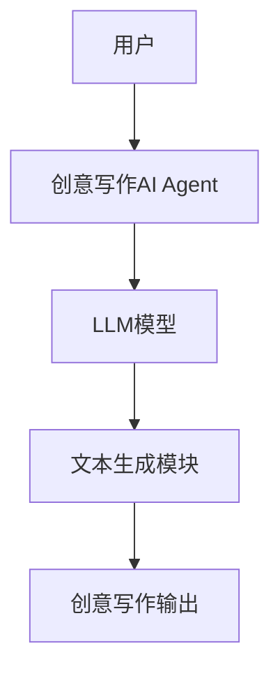
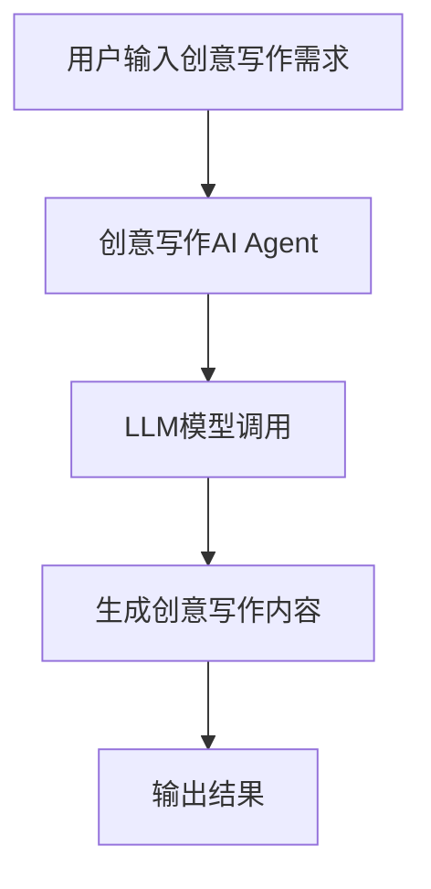
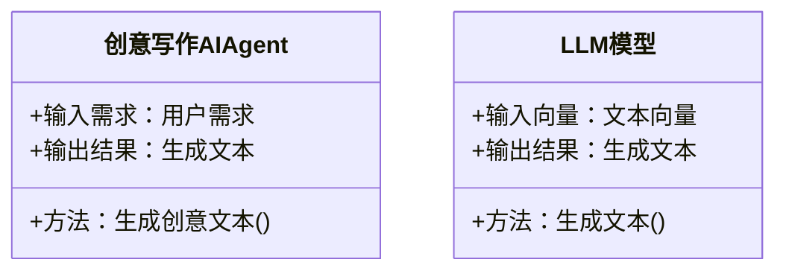
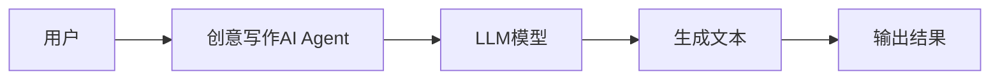
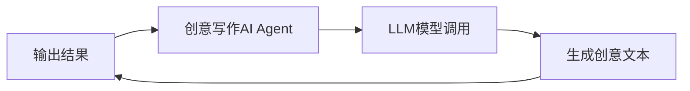

                 


# 创意写作AI Agent：LLM驱动的文学创作辅助系统

## 关键词：LLM，AI Agent，创意写作，文学创作，自然语言处理

## 摘要：本文深入探讨了LLM驱动的创意写作AI Agent系统，从背景、核心概念、算法原理到系统设计、项目实战和最佳实践，全面解析了该系统的实现与应用。文章结合理论与实践，通过详细的数学公式和代码示例，展现了如何利用大语言模型辅助文学创作，为创意写作提供了新的思路和工具。

---

# 第一部分: 创意写作与AI Agent的背景与基础

## 第1章: 创意写作与AI Agent的背景介绍

### 1.1 创意写作的定义与特点

#### 1.1.1 创意写作的定义
创意写作是指通过创新思维和想象力，创作文学作品的过程。它涵盖了小说、诗歌、剧本等多种文学形式，强调原创性和表达的多样性。

#### 1.1.2 创意写作的核心要素
创意写作的核心要素包括主题、情节、人物塑造、语言风格和结构安排。这些要素共同构成了文学作品的灵魂和骨架。

#### 1.1.3 创意写作的常见应用场景
创意写作广泛应用于小说创作、广告文案、影视剧本等领域。它不仅是文学创作的核心，也是多领域内容创作的重要工具。

### 1.2 AI Agent的基本概念

#### 1.2.1 AI Agent的定义
AI Agent是指具有智能决策和执行能力的计算机程序，能够感知环境并自主完成特定任务。它在多个领域，如自然语言处理、图像识别等，展现了强大的能力。

#### 1.2.2 AI Agent的核心特点
AI Agent的核心特点包括智能性、自主性、反应性和社会性。它能够通过学习和推理，适应复杂环境并完成任务。

#### 1.2.3 AI Agent与传统软件的区别
AI Agent与传统软件的区别在于其智能化和自主性。传统软件依赖明确的程序指令，而AI Agent能够通过数据学习，自主决策并解决问题。

### 1.3 LLM驱动的AI Agent在创意写作中的应用

#### 1.3.1 LLM的基本原理
LLM（Large Language Model）是一种基于深度学习的自然语言处理模型，通过大量数据训练，能够理解和生成人类语言。

#### 1.3.2 LLM在创意写作中的优势
LLM在创意写作中的优势包括高效生成文本、提供创意灵感和优化语言表达。它能够辅助作者快速完成初稿，并通过反馈不断改进作品。

#### 1.3.3 LLM驱动的AI Agent的创新点
LLM驱动的AI Agent的创新点在于其智能化和个性化。它能够根据用户需求生成定制化内容，并通过反馈不断优化创作过程。

### 1.4 本章小结
本章介绍了创意写作和AI Agent的基本概念，以及LLM在创意写作中的应用和优势。接下来将深入探讨LLM驱动的创意写作AI Agent的核心概念和原理。

---

# 第二部分: LLM驱动的创意写作AI Agent核心概念与联系

## 第2章: LLM驱动的创意写作AI Agent核心概念

### 2.1 LLM驱动的创意写作AI Agent的实体关系图



### 2.2 LLM驱动的创意写作AI Agent的算法流程图



### 2.3 核心概念属性对比表格

| 属性 | 创意写作 | LLM驱动的AI Agent |
|------|----------|-------------------|
| 输入 | 文本需求 | AI Agent指令     |
| 输出 | 文本内容 | AI生成的文本     |
| 核心技术 | 文本生成 | 大语言模型（LLM）|
| 应用场景 | 文学创作 | 辅助创作工具     |

### 2.4 本章小结
本章通过实体关系图和流程图，详细解释了LLM驱动的创意写作AI Agent的系统架构和核心概念。接下来将深入探讨其算法原理。

---

# 第三部分: LLM驱动的创意写作AI Agent算法原理讲解

## 第3章: LLM驱动的创意写作AI Agent算法原理

### 3.1 LLM的基本原理

#### 3.1.1 LLM的模型结构
LLM通常基于Transformer架构，包含编码器和解码器。编码器将输入文本转换为向量表示，解码器根据这些向量生成输出文本。

#### 3.1.2 LLM的训练方法
LLM的训练采用监督学习，通过最大化条件概率来优化模型参数。训练数据通常包括大量的书籍、网页和其他文本资源。

#### 3.1.3 LLM的文本生成机制
LLM通过解码器生成一个概率分布，选择概率最高的词汇生成文本。生成过程可以通过贪心算法或采样方法实现。

### 3.2 LLM驱动的创意写作AI Agent的算法实现

#### 3.2.1 算法流程图


#### 3.2.2 代码实现示例

```python
import transformers

# 加载预训练模型
model = transformers.AutoModelForCausalLM.from_pretrained("gpt2")
tokenizer = transformers.AutoTokenizer.from_pretrained("gpt2")

# 生成创意写作内容
input_text = "一个奇幻的故事开始于..."
inputs = tokenizer.encode(input_text, return_tensors="pt")
outputs = model.generate(inputs, max_length=500, do_sample=True)

# 解码输出
generated_text = tokenizer.decode(outputs[0], skip_special_tokens=True)
print(generated_text)
```

#### 3.2.3 数学公式
文本生成的损失函数通常采用交叉熵损失：

$$ L = -\sum_{i=1}^{n} \sum_{j=1}^{m} y_{ij} \log p(y_{ij}) $$

其中，$y_{ij}$是真实标签的概率，$p(y_{ij})$是模型预测的概率。

### 3.3 本章小结
本章详细讲解了LLM的基本原理和创意写作AI Agent的算法实现。通过代码示例和数学公式，展示了如何利用LLM生成创意文本。

---

## 第4章: 系统分析与架构设计方案

### 4.1 系统功能设计

#### 4.1.1 领域模型



### 4.2 系统架构设计



### 4.3 系统接口设计
系统接口主要包含用户输入接口和LLM调用接口。用户通过输入接口提交创意写作需求，系统调用LLM接口生成文本。

### 4.4 系统交互流程图



### 4.5 本章小结
本章通过系统架构图和交互流程图，详细展示了创意写作AI Agent的系统设计。接下来将通过项目实战进一步验证系统的可行性。

---

## 第5章: 项目实战

### 5.1 环境搭建

#### 5.1.1 安装依赖
需要安装以下依赖：
```bash
pip install transformers
```

#### 5.1.2 创建项目结构
```
创意写作AI Agent/
├── main.py
├── requirements.txt
└── config.json
```

### 5.2 核心实现

#### 5.2.1 文本生成模块

```python
def generate_creative_text(prompt, max_length=500):
    inputs = tokenizer.encode(prompt, return_tensors="pt")
    outputs = model.generate(inputs, max_length=max_length, do_sample=True)
    return tokenizer.decode(outputs[0], skip_special_tokens=True)
```

#### 5.2.2 系统交互模块

```python
def main():
    while True:
        prompt = input("请输入创意写作需求：")
        if not prompt:
            break
        result = generate_creative_text(prompt)
        print("生成结果：")
        print(result)
```

### 5.3 实际案例分析

#### 5.3.1 案例1：小说创作

用户输入：一个奇幻的故事开始于...
生成结果：在一个遥远的星球上，一位年轻的冒险家踏上了寻找失落的宝藏之旅...

#### 5.3.2 案例2：诗歌创作

用户输入：一首关于秋天的诗
生成结果：秋叶飘落，如金色的蝴蝶，舞动在深蓝色的天空...

### 5.4 本章小结
本章通过项目实战，展示了如何利用LLM驱动的创意写作AI Agent生成文本。通过实际案例，验证了系统的可行性和实用性。

---

## 第6章: 最佳实践与未来展望

### 6.1 小结
本文详细探讨了LLM驱动的创意写作AI Agent的实现与应用，从背景、核心概念到系统设计和项目实战，全面解析了该系统的各个方面。

### 6.2 注意事项
在使用创意写作AI Agent时，需要注意版权问题，避免生成的内容侵犯他人权益。同时，生成的内容需要结合人类的创意和判断，确保作品的质量和独特性。

### 6.3 未来展望
未来，随着LLM技术的不断发展，创意写作AI Agent将更加智能化和个性化。它不仅能够辅助创作，还能提供创意灵感和优化建议，成为作者的得力助手。

---

## 作者：AI天才研究院/AI Genius Institute & 禅与计算机程序设计艺术 /Zen And The Art of Computer Programming

---

以上是完整的技术博客文章大纲和内容，涵盖创意写作AI Agent的各个方面，从理论到实践，为读者提供了全面的指导和参考。

