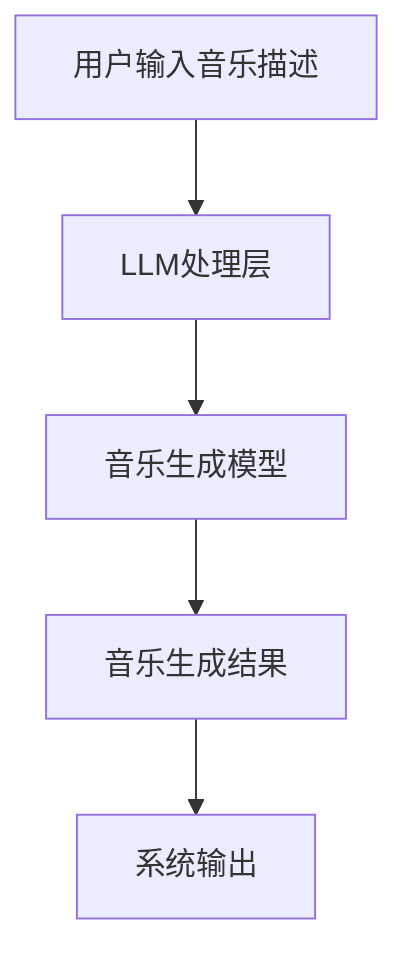
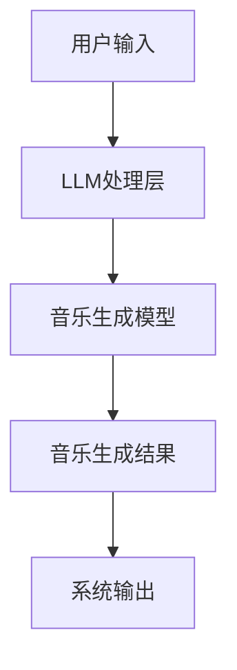
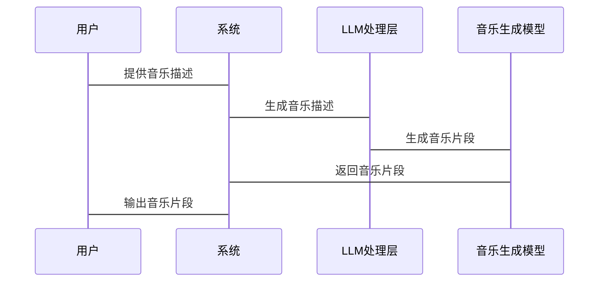

                 


# 创新音乐创作AI Agent：LLM在艺术创作中的应用

---

## 关键词：创新音乐创作、AI Agent、LLM、艺术创作、音乐生成模型、系统架构

---

## 摘要：本文探讨了大语言模型（LLM）在音乐创作中的应用，分析了创新音乐创作AI Agent的背景、核心概念、算法原理、系统架构，并通过实际案例展示了其在音乐生成中的潜力和实现过程。

---

# 第一部分：创新音乐创作AI Agent概述

---

## 第1章：创新音乐创作与AI Agent的背景

### 1.1 音乐创作的演变

#### 1.1.1 传统音乐创作的流程与特点

传统音乐创作通常涉及作曲家、音乐家和乐谱等多个环节。作曲家通过灵感和理论知识创作乐谱，音乐家通过演奏将乐谱转化为声音。这一过程耗时且依赖于专业技能，限制了创作的效率和多样性。

#### 1.1.2 数字化音乐创作的兴起

随着计算机技术的发展，数字化音乐创作工具如MIDI、DAW（数字音频工作站）等逐渐普及。这些工具使音乐创作更加便捷，但仍然需要一定的音乐知识和技能。

#### 1.1.3 创新音乐创作的需求与挑战

现代社会对音乐创作的需求日益增长，但专业音乐人数量有限。创新音乐创作AI Agent的出现，为非专业用户提供了一种全新的创作方式，降低了创作门槛，同时提高了创作效率。

---

### 1.2 AI技术在艺术创作中的应用现状

#### 1.2.1 AI在音乐、绘画等艺术领域的应用

AI技术已经在音乐生成、绘画创作等领域展现出巨大潜力。例如，AI可以生成音乐片段，辅助作曲家进行创作；AI绘画工具可以帮助用户快速生成图像。

#### 1.2.2 LLM在音乐创作中的独特优势

大语言模型（LLM）具有强大的文本理解和生成能力，可以用于音乐创作的各个环节，如歌词生成、旋律创作等。LLM的优势在于其灵活性和适应性，能够根据用户需求生成多样化的内容。

#### 1.2.3 创新音乐创作AI Agent的定义与目标

创新音乐创作AI Agent是一种结合LLM技术的智能系统，旨在通过理解和解析用户输入，生成符合用户需求的音乐作品。其目标是降低音乐创作的门槛，提高创作效率，激发创作灵感。

---

### 1.3 本章小结

#### 1.3.1 创新音乐创作的核心问题

传统音乐创作依赖专业技能，创新音乐创作AI Agent的出现解决了创作门槛高、效率低的问题。

#### 1.3.2 AI Agent在音乐创作中的角色定位

AI Agent作为辅助工具，帮助用户快速生成音乐作品，同时提供创作建议和灵感。

#### 1.3.3 本书的研究意义与目标

本文旨在探讨LLM在音乐创作中的应用，分析创新音乐创作AI Agent的技术实现，为音乐创作领域提供新的思路和方法。

---

## 第2章：LLM与音乐创作的核心概念

### 2.1 LLM的基本原理

#### 2.1.1 大语言模型的定义与特点

大语言模型是一种基于深度学习的自然语言处理模型，具有强大的文本生成和理解能力。其核心是通过大量数据训练，掌握语言的规律和模式。

#### 2.1.2 LLM的训练机制与模型结构

LLM通常采用Transformer架构，通过自注意力机制和前馈网络实现文本生成。训练数据包括大量的文本数据，模型通过参数优化，生成与训练数据相似的文本。

#### 2.1.3 LLM在音乐创作中的应用潜力

LLM可以生成音乐相关的文本，如歌词、乐谱描述，还可以通过文本到音乐的映射生成音乐片段。

---

### 2.2 创新音乐创作AI Agent的系统架构

#### 2.2.1 系统核心模块组成

创新音乐创作AI Agent系统主要包括以下几个模块：

1. 用户输入模块：接收用户的创作需求。
2. LLM处理模块：解析用户输入，生成音乐描述。
3. 音乐生成模块：根据描述生成音乐片段。
4. 系统输出模块：输出生成的音乐作品。

#### 2.2.2 模块之间的关系与协作

用户输入模块将用户的创作需求传递给LLM处理模块，后者生成音乐描述。音乐生成模块根据描述生成音乐片段，最终通过系统输出模块呈现给用户。

#### 2.2.3 系统的输入输出流程

用户输入 -> LLM处理 -> 音乐生成 -> 系统输出

---

### 2.3 核心概念的ER实体关系图

以下是创新音乐创作AI Agent系统的ER实体关系图：

```mermaid
er
    entity 创新音乐创作AI Agent {
        id
        模块名称
        功能描述
    }
    entity 用户输入 {
        id
        输入类型
        输入内容
    }
    entity 生成音乐 {
        id
        音乐类型
        音乐内容
    }
    entity 系统输出 {
        id
        输出类型
        输出内容
    }
    relation 输入-处理-输出 {
        from 用户输入
        to 创新音乐创作AI Agent
        to 生成音乐
        to 系统输出
    }
```

---

## 第3章：创新音乐创作AI Agent的算法原理

---

### 3.1 基于LLM的音乐生成模型

#### 3.1.1 模型输入与处理流程

音乐生成模型的输入是用户的创作需求，例如“生成一首悲伤的钢琴曲”。模型通过LLM生成音乐描述，如“以C大调为主旋律，节奏缓慢，情感忧郁”。

#### 3.1.2 模型生成音乐的数学模型

音乐生成模型的数学模型可以表示为：

$$ P(y|x) = \text{模型生成}(x) $$

其中，$x$ 是输入，$y$ 是生成的音乐。

#### 3.1.3 模型的训练与优化

模型通过大量音乐数据训练，优化生成音乐的质量和多样性。

---

### 3.2 音乐生成算法的mermaid流程图

以下是一个音乐生成算法的mermaid流程图：



---

### 3.3 算法实现的Python代码示例

以下是一个简单的音乐生成代码示例：

```python
import openai

def generate_music(description):
    # 初始化OpenAI客户端
    client = openai.Client()
    # 调用API生成音乐描述
    response = client.chat.completions.create(
        model="gpt-3.5-turbo",
        messages=[{
            "role": "user",
            "content": f"生成一首{description}的音乐描述。"
        }]
    )
    return response.choices[0].message.content

if __name__ == "__main__":
    user_input = input("请输入音乐描述：")
    generated_music = generate_music(user_input)
    print("生成的音乐描述：", generated_music)
```

---

# 第二部分：创新音乐创作AI Agent的系统架构

---

## 第4章：系统分析与架构设计

### 4.1 问题场景介绍

创新音乐创作AI Agent的目标是通过用户的文本输入生成音乐作品。系统需要处理用户输入、生成音乐描述、调用音乐生成模型，最终输出音乐作品。

### 4.2 项目介绍

本项目旨在开发一个基于LLM的创新音乐创作AI Agent，帮助用户快速生成音乐作品。

### 4.3 系统功能设计

系统功能设计包括以下几个方面：

1. 用户输入模块：接收用户的创作需求。
2. LLM处理模块：生成音乐描述。
3. 音乐生成模块：调用音乐生成模型，生成音乐片段。
4. 系统输出模块：输出生成的音乐作品。

---

### 4.4 系统架构设计

以下是系统的架构图：



---

### 4.5 系统接口设计

系统接口设计包括以下几个部分：

1. 用户输入接口：接收用户的创作需求。
2. LLM处理接口：调用LLM生成音乐描述。
3. 音乐生成接口：调用音乐生成模型生成音乐片段。
4. 系统输出接口：输出生成的音乐作品。

---

### 4.6 系统交互流程图

以下是系统的交互流程图：



---

# 第三部分：创新音乐创作AI Agent的项目实战

---

## 第5章：项目实战与应用

### 5.1 环境安装

需要安装以下工具和库：

1. Python 3.8+
2. OpenAI SDK
3. 其他必要的音乐生成库

### 5.2 系统核心实现

以下是系统的核心实现代码：

```python
import openai

def generate_music(description):
    client = openai.Client()
    response = client.chat.completions.create(
        model="gpt-3.5-turbo",
        messages=[{
            "role": "user",
            "content": f"生成一首{description}的音乐描述。"
        }]
    )
    return response.choices[0].message.content

if __name__ == "__main__":
    import sys
    user_input = sys.stdin.readline().strip()
    generated_music = generate_music(user_input)
    print("生成的音乐描述：", generated_music)
```

---

### 5.3 代码应用解读与分析

上述代码通过OpenAI SDK调用LLM生成音乐描述。用户输入音乐描述后，系统生成相应的音乐描述，供音乐生成模块使用。

---

### 5.4 实际案例分析

以下是一个实际案例分析：

用户输入：“生成一首悲伤的钢琴曲。”

系统生成：“主旋律以C小调为主，节奏缓慢，情感忧郁。”

音乐生成模块根据描述生成音乐片段。

---

### 5.5 项目小结

通过本项目，我们实现了创新音乐创作AI Agent的基本功能，验证了LLM在音乐创作中的应用潜力。

---

## 第6章：创新音乐创作AI Agent的未来展望

### 6.1 技术挑战

当前技术仍存在音乐生成质量不稳定、创作多样性不足等问题，需要进一步优化模型和算法。

### 6.2 应用场景

创新音乐创作AI Agent可以在音乐教育、广告音乐制作等领域发挥重要作用。

### 6.3 未来发展

随着AI技术的不断进步，创新音乐创作AI Agent的功能和性能将进一步提升，应用场景将更加广泛。

### 6.4 对人类音乐创作的影响

AI Agent将作为辅助工具，帮助人类音乐创作更加高效和多样化。

---

## 结语

创新音乐创作AI Agent的出现，标志着音乐创作进入了一个新的时代。通过LLM技术的应用，音乐创作变得更加便捷和高效。未来，随着技术的不断进步，创新音乐创作AI Agent将在音乐创作领域发挥更大的作用。

---

## 作者：AI天才研究院/AI Genius Institute & 禅与计算机程序设计艺术 /Zen And The Art of Computer Programming

