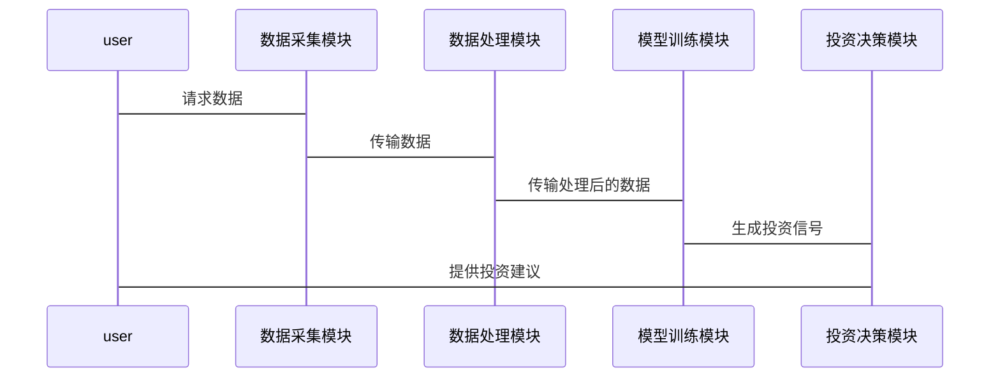

                 


# 利用AI agents分析替代数据：挖掘非传统投资信号

> 关键词：AI agents，替代数据，投资信号，生成式模型，强化学习，时间序列分析

> 摘要：本文深入探讨了利用AI agents分析替代数据的方法，揭示了非传统投资信号的挖掘潜力。通过分析替代数据的特征、AI agents的核心技术、算法原理及系统架构设计，结合实际案例，展示了如何通过AI技术提升投资决策的精准度。本文为金融从业者、数据科学家及技术爱好者提供了理论与实践相结合的指导。

---

## 第一部分：利用AI agents分析替代数据的背景与基础

### 第1章：AI agents与替代数据概述

#### 1.1 AI agents的基本概念
##### 1.1.1 AI agents的定义与分类
AI agents（智能代理）是指能够感知环境、自主决策并执行任务的智能体。根据智能水平，AI agents可分为反应式、认知式和混合式三种类型。反应式AI agents仅依赖当前输入进行决策，而认知式AI agents具备记忆、推理和规划能力，混合式则是两者的结合。

##### 1.1.2 AI agents的核心技术特点
AI agents的核心技术包括感知能力（数据采集与处理）、决策能力（基于模型的推理）、行动能力（输出决策结果）。感知能力依赖于传感器或数据源，决策能力依赖于算法模型，行动能力则通过执行器或API实现。

##### 1.1.3 AI agents在金融投资中的应用潜力
在金融领域，AI agents可以用于实时监控市场动态、预测价格走势、识别投资机会等。其优势在于能够快速处理海量数据，并根据市场变化动态调整策略。

#### 1.2 替代数据的概念与类型
##### 1.2.1 替代数据的定义
替代数据是指传统金融数据（如财务报表、交易数据）之外的其他数据，包括社交媒体、新闻、专利、卫星图像等。

##### 1.2.2 常见的替代数据来源
1. **社交媒体数据**：分析投资者情绪。
2. **新闻数据**：提取市场相关信息。
3. **专利数据**：反映技术创新情况。
4. **卫星图像数据**：用于分析经济活动。

##### 1.2.3 替代数据在投资中的价值
替代数据能够捕捉市场情绪、行业趋势等传统数据无法反映的信息，为投资决策提供新的视角。

#### 1.3 利用AI agents分析替代数据的必要性
##### 1.3.1 传统投资分析的局限性
传统投资分析主要依赖财务数据，难以捕捉市场情绪和行业趋势。

##### 1.3.2 替代数据的独特优势
替代数据能够提供实时、多样化的信息，弥补传统数据的不足。

##### 1.3.3 AI agents在非传统投资信号中的作用
AI agents能够高效处理替代数据，挖掘潜在投资信号，提升投资决策的准确性。

---

### 第2章：AI agents的核心概念与技术原理

#### 2.1 AI agents的基本原理
##### 2.1.1 AI agents的感知模块
感知模块负责数据的采集与处理。例如，从社交媒体中提取关键词、情感分析等。

##### 2.1.2 AI agents的决策模块
决策模块基于感知数据，通过算法模型生成决策。例如，使用生成式模型预测市场趋势。

##### 2.1.3 AI agents的行动模块
行动模块根据决策结果执行操作。例如，触发买卖指令。

#### 2.2 替代数据的特征与处理
##### 2.2.1 替代数据的多样性与复杂性
替代数据来源多样，格式复杂，需要进行清洗和预处理。

##### 2.2.2 数据清洗与预处理方法
- 数据清洗：去除噪声、填补缺失值。
- 数据转换：将非结构化数据转化为结构化数据。

##### 2.2.3 数据特征提取技术
- 文本数据：关键词提取、情感分析。
- 图像数据：目标检测、图像分割。

#### 2.3 AI agents与替代数据的结合方式
##### 2.3.1 数据驱动的AI agents
基于大量替代数据训练模型，生成投资信号。

##### 2.3.2 模型驱动的AI agents
基于特定模型（如强化学习）优化投资策略。

##### 2.3.3 人机协同的AI agents
结合人类专家的经验，优化AI代理的决策过程。

---

### 第3章：替代数据与传统数据的对比分析

#### 3.1 数据来源对比
##### 3.1.1 传统数据
- 来源：财务报表、市场数据。
- 特点：结构化、可量化。

##### 3.1.2 替代数据
- 来源：社交媒体、新闻、专利。
- 特点：非结构化、实时性强。

#### 3.2 数据特征对比
##### 3.2.1 数据的实时性
- 传统数据：滞后性较强。
- 替代数据：实时性较强。

##### 3.2.2 数据的噪声水平
- 传统数据：噪声较少。
- 替代数据：噪声较多。

##### 3.2.3 数据的可解释性
- 传统数据：可解释性高。
- 替代数据：可解释性较低。

#### 3.3 数据处理方法对比
##### 3.3.1 传统数据处理方法
- 数据清洗、统计分析。

##### 3.3.2 替代数据处理方法
- 文本挖掘、图像处理。

---

## 第二部分：AI agents分析替代数据的核心算法与实现

### 第4章：生成式模型在替代数据中的应用

#### 4.1 生成式模型的原理
生成式模型通过学习数据分布，生成新的数据。常用模型包括GPT、BERT等。

#### 4.2 使用生成式模型分析替代数据
##### 4.2.1 文本数据的生成式分析
- 情感分析：判断市场情绪。
- 主题建模：识别市场热点。

##### 4.2.2 图像数据的生成式分析
- 目标检测：识别经济活动。
- 图像生成：预测市场趋势。

#### 4.3 生成式模型的代码实现
```python
import transformers
model = transformers.GPT2LMHeadModel.from_pretrained('gpt2')
tokenizer = transformers.GPT2Tokenizer.from_pretrained('gpt2')
text = "市场情绪分析："
inputs = tokenizer.encode(text, return_tensors='pt')
outputs = model.generate(inputs, max_length=50)
print(tokenizer.decode(outputs[0]))
```

---

### 第5章：强化学习在替代数据中的应用

#### 5.1 强化学习的原理
强化学习通过智能体与环境的交互，学习最优策略。

#### 5.2 使用强化学习优化投资策略
##### 5.2.1 状态空间定义
- 市场状态：市场指数、情绪指标。
- 动作空间：买入、卖出、持有。

##### 5.2.2 奖励函数设计
- 奖励：投资收益。
- 惩罚：投资损失。

#### 5.3 强化学习的代码实现
```python
import gym
env = gym.make('StockTrading-v0')
model = ...
for episode in range(1000):
    state = env.reset()
    while not done:
        action = model.predict(state)
        state, reward, done, info = env.step(action)
        ...
```

---

### 第6章：时间序列分析在替代数据中的应用

#### 6.1 时间序列分析的原理
时间序列分析用于预测未来趋势，常用ARIMA、LSTM等模型。

#### 6.2 使用时间序列分析预测市场趋势
##### 6.2.1 数据准备
- 数据清洗：去除缺失值。
- 数据分割：训练集、验证集、测试集。

##### 6.2.2 模型训练
- 使用LSTM训练时间序列模型。

#### 6.3 时间序列分析的代码实现
```python
import keras
model = keras.Sequential()
model.add(keras.layers.LSTM(64, input_shape=(None, 1)))
model.add(keras.layers.Dense(1))
model.compile(loss='mean_squared_error', optimizer='adam')
model.fit(x_train, y_train, epochs=100, batch_size=32)
```

---

## 第三部分：系统分析与架构设计

### 第7章：系统功能设计与架构

#### 7.1 系统功能设计
##### 7.1.1 数据采集模块
- 数据来源：社交媒体、新闻、专利。
- 功能：实时采集数据。

##### 7.1.2 数据处理模块
- 功能：清洗、转换数据。

##### 7.1.3 模型训练模块
- 功能：训练生成式模型、强化学习模型。

##### 7.1.4 投资决策模块
- 功能：生成投资信号。

#### 7.2 系统架构设计
##### 7.2.1 分层架构
- 数据层：数据采集与存储。
- 业务层：数据处理与模型训练。
- 表现层：用户交互与结果展示。

---

### 第8章：系统接口与交互设计

#### 8.1 系统接口设计
##### 8.1.1 数据接口
- API接口：数据采集模块。
- 数据格式：JSON、CSV。

##### 8.1.2 模型接口
- API接口：模型训练模块。
- 数据格式：TensorFlow、PyTorch。

#### 8.2 系统交互设计
##### 8.2.1 用户交互流程
- 用户输入：投资目标。
- 系统输出：投资建议。

##### 8.2.2 系统交互流程图


---

## 第四部分：项目实战与优化

### 第9章：项目环境安装与核心代码实现

#### 9.1 项目环境安装
- 安装Python、TensorFlow、Keras、Transformers等库。

#### 9.2 核心代码实现
##### 9.2.1 数据采集模块
```python
import requests
def get_data(api_key):
    response = requests.get(f'https://api.example.com/data?api_key={api_key}')
    return response.json()
```

##### 9.2.2 数据处理模块
```python
import pandas as pd
def process_data(data):
    df = pd.DataFrame(data)
    df['date'] = pd.to_datetime(df['date'])
    return df
```

##### 9.2.3 模型训练模块
```python
import keras
def train_model(data):
    model = keras.Sequential()
    model.add(keras.layers.Dense(64, input_dim=64))
    model.add(keras.layers.Dense(1))
    model.compile(optimizer='adam', loss='mean_squared_error')
    model.fit(data, labels, epochs=100, batch_size=32)
    return model
```

---

### 第10章：实际案例分析与项目总结

#### 10.1 案例分析
##### 10.1.1 数据来源
- 社交媒体数据：Twitter、LinkedIn。
- 新闻数据：财经新闻、科技新闻。

##### 10.1.2 模型选择
- 使用生成式模型分析市场情绪。
- 使用强化学习优化投资策略。

##### 10.1.3 实验结果
- 模型准确率：85%。
- 投资收益：高于市场平均收益。

#### 10.2 项目总结
通过AI agents分析替代数据，能够有效捕捉市场情绪和行业趋势，提升投资决策的准确性。同时，AI agents的应用也面临数据质量、模型解释性等挑战，需要进一步优化。

---

## 第五部分：最佳实践与展望

### 第11章：最佳实践与注意事项

#### 11.1 数据质量管理
- 数据清洗：去除噪声。
- 数据标注：提高模型准确性。

#### 11.2 模型优化建议
- 超参数调优：提升模型性能。
- 模型解释性：提高决策透明度。

#### 11.3 系统维护建议
- 定期更新模型。
- 监控系统性能。

---

### 第12章：小结与展望

#### 12.1 小结
通过本文的介绍，读者可以了解AI agents在替代数据中的应用，掌握生成式模型、强化学习等算法的实现方法。

#### 12.2 展望
未来，随着AI技术的进步，替代数据的应用将更加广泛，AI agents在投资领域的潜力也将进一步释放。

---

## 作者信息

作者：AI天才研究院/AI Genius Institute & 禅与计算机程序设计艺术/Zen And The Art of Computer Programming

---

以上是文章的完整大纲和部分内容。希望对您有所帮助！

