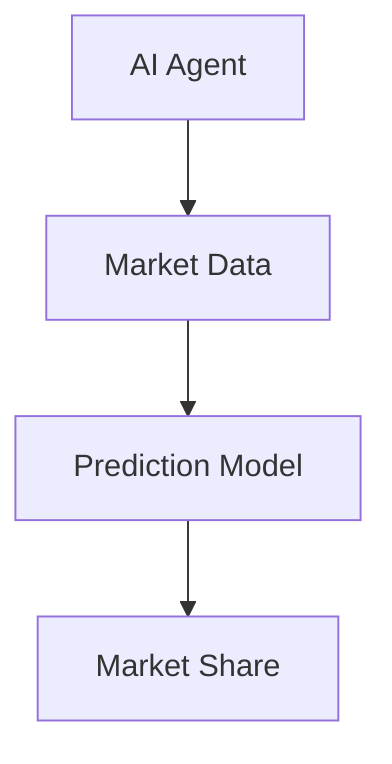

                 


# 利用AI agents构建动态市场份额预测模型：把握竞争态势

## 关键词：AI代理，市场份额预测，动态模型，强化学习，协同过滤，时间序列分析

## 摘要：  
本文详细探讨了利用AI代理构建动态市场份额预测模型的方法，分析了动态市场环境下的竞争态势，并通过算法原理、系统架构设计和项目实战展示了如何利用AI技术实现高效预测。文章从背景介绍、核心概念、算法原理、系统设计到实际案例，层层递进，为读者提供了一套完整的解决方案。

---

# 第1章：AI代理与动态市场份额预测概述

## 1.1 问题背景与定义

### 1.1.1 传统市场份额预测的局限性  
传统市场份额预测方法（如回归分析、时间序列分析）在静态环境下表现良好，但在动态竞争环境中难以捕捉实时变化。例如，市场环境的变化、竞争对手的策略调整等因素会导致预测结果偏差。

### 1.1.2 动态市场份额预测的定义  
动态市场份额预测是指在实时变化的市场环境中，基于最新的数据和竞争态势，持续更新市场份额预测结果的过程。这种预测方法需要考虑市场环境的动态变化，如消费者偏好、竞争策略调整、市场趋势等。

### 1.1.3 AI代理在动态预测中的作用  
AI代理（AI Agents）是一种能够感知环境、自主决策并采取行动的智能体。在动态市场份额预测中，AI代理可以通过实时数据采集、分析和决策，帮助企业在竞争激烈的市场中快速调整策略，优化市场份额。

## 1.2 问题解决与目标

### 1.2.1 动态市场环境的挑战  
动态市场环境具有高度不确定性，市场参与者的行为变化快，竞争态势瞬息万变。传统的静态预测方法难以满足实时预测的需求。

### 1.2.2 AI代理的核心目标  
AI代理的目标是通过实时数据采集、分析和决策，提供准确的动态市场份额预测，帮助企业制定灵活的竞争策略。

### 1.2.3 预测模型的边界与外延  
动态市场份额预测模型的边界包括实时数据采集、预测算法、结果优化模块等。其外延则包括市场趋势分析、竞争对手行为预测等。

## 1.3 核心概念与联系

### 1.3.1 AI代理的基本原理  
AI代理通过感知环境、分析数据、制定策略并采取行动，实现对市场环境的实时响应。

### 1.3.2 动态市场份额预测模型的组成部分  
动态市场份额预测模型由数据采集模块、预测算法模块、优化模块组成。

### 1.3.3 核心概念的ER实体关系图  


---

# 第2章：AI代理的核心原理

## 2.1 AI代理的基本原理

### 2.1.1 代理的定义与分类  
AI代理可以分为基于规则的代理和基于学习的代理。基于规则的代理通过预定义规则进行决策，基于学习的代理通过机器学习算法进行自适应决策。

### 2.1.2 基于强化学习的代理行为  
强化学习是一种通过试错机制优化代理行为的方法。代理通过与环境交互，不断调整策略以最大化奖励。

### 2.1.3 代理与环境的交互机制  
代理通过感知环境状态，采取行动，并根据反馈调整策略。这种交互机制使得代理能够在动态环境中保持竞争力。

## 2.2 动态市场份额预测模型的数学基础

### 2.2.1 时间序列分析的数学模型  
时间序列分析是一种基于历史数据预测未来趋势的方法。常用的模型包括ARIMA和LSTM。

### 2.2.2 协同过滤算法的公式推导  
协同过滤算法通过计算用户或物品的相似性来预测市场份额。常用的公式包括余弦相似性和皮尔逊相关性。

### 2.2.3 强化学习的Q-learning算法  
Q-learning算法通过状态-动作-奖励机制优化代理的决策。数学公式如下：

$$ Q(s,a) = r + \gamma \max Q(s',a') $$

---

# 第3章：算法原理

## 3.1 时间序列分析

### 3.1.1 ARIMA模型  
ARIMA模型通过自回归和移动平均成分预测未来趋势。模型公式如下：

$$ y_t = \phi y_{t-1} + \theta y_{t-2} + \epsilon_t $$

### 3.1.2 LSTM网络  
LSTM网络通过长短期记忆单元捕捉时间序列中的长期依赖关系。模型结构包括输入门、遗忘门和输出门。

### 3.1.3 算法实现与优化  
通过Python代码实现ARIMA和LSTM模型，并通过交叉验证优化模型参数。

## 3.2 协同过滤算法

### 3.2.1 基于用户的协同过滤  
基于用户的协同过滤通过计算用户相似性推荐商品或服务。相似性计算公式如下：

$$ \text{similarity}(u, v) = \frac{\sum_{i} (r_{u,i} - \bar{r}_u)(r_{v,i} - \bar{r}_v)}{\sqrt{\sum_{i} (r_{u,i} - \bar{r}_u)^2} \sqrt{\sum_{i} (r_{v,i} - \bar{r}_v)^2}}} $$

### 3.2.2 基于物品的协同过滤  
基于物品的协同过滤通过计算物品相似性推荐相关商品或服务。相似性计算公式与基于用户的相似。

### 3.2.3 深度学习协同过滤  
深度学习协同过滤通过神经网络模型捕捉高阶特征，提高推荐准确性。

## 3.3 强化学习算法

### 3.3.1 Q-learning算法  
Q-learning算法通过状态-动作-奖励机制优化决策。数学公式如下：

$$ Q(s,a) = r + \gamma \max Q(s',a') $$

### 3.3.2 Deep Q-Networks (DQN)  
DQN算法通过深度神经网络近似Q值函数，解决高维状态空间的问题。

### 3.3.3 算法实现与优化  
通过OpenAI Gym库实现DQN算法，并通过经验回放和目标网络优化模型。

---

# 第4章：系统分析与架构设计

## 4.1 问题场景介绍

### 4.1.1 市场竞争环境  
市场竞争环境包括消费者需求、竞争对手策略、市场趋势等。

### 4.1.2 项目介绍  
项目目标是利用AI代理构建动态市场份额预测模型，帮助企业制定灵活的竞争策略。

## 4.2 系统功能设计

### 4.2.1 领域模型  
领域模型包括市场数据采集模块、预测算法模块、优化模块等。

### 4.2.2 系统架构设计  
系统架构包括数据采集层、预测引擎层、优化层和用户接口层。

### 4.2.3 系统交互设计  
系统交互包括数据采集、预测计算、结果优化和用户反馈等步骤。

## 4.3 系统架构设计

### 4.3.1 领域模型  
领域模型展示了系统各模块之间的关系。

### 4.3.2 系统架构图  
系统架构图展示了系统的层次结构和模块之间的依赖关系。

### 4.3.3 系统接口设计  
系统接口包括数据接口、预测接口和优化接口。

## 4.4 系统交互设计

### 4.4.1 交互流程图  
交互流程图展示了系统的交互过程。

### 4.4.2 序列图  
序列图展示了系统的时序交互过程。

---

# 第5章：项目实战

## 5.1 环境安装

### 5.1.1 安装Python环境  
安装Python 3.x及以上版本，并安装必要的库。

### 5.1.2 安装依赖库  
安装numpy、pandas、scikit-learn、keras等库。

## 5.2 系统核心实现

### 5.2.1 数据采集模块  
数据采集模块通过API接口获取市场数据。

### 5.2.2 预测算法模块  
预测算法模块实现ARIMA、LSTM和协同过滤算法。

### 5.2.3 优化模块  
优化模块通过强化学习算法优化预测结果。

## 5.3 代码实现与解读

### 5.3.1 ARIMA模型实现  
```python
from statsmodels.tsa.arima_model import ARIMA
import numpy as np

# 示例数据
data = np.random.rand(100)

# 模型训练
model = ARIMA(data, order=(1, 1, 1))
model_fit = model.fit()
```

### 5.3.2 LSTM模型实现  
```python
import keras
from keras.models import Sequential
from keras.layers import LSTM, Dense

# 示例数据
X = np.random.rand(100, 1, 1)
y = np.random.rand(100, 1)

# 模型训练
model = Sequential()
model.add(LSTM(50, input_shape=(1, 1)))
model.add(Dense(1))
model.compile(loss='mean_squared_error', optimizer='adam')
model.fit(X, y, epochs=10)
```

### 5.3.3 强化学习算法实现  
```python
import gym
from gym import spaces
from gym.utils import seeding

class MarketEnv(gym.Env):
    def __init__(self):
        super(MarketEnv, self).__init__()
        self.observation_space = spaces.Discrete(10)
        self.action_space = spaces.Discrete(5)
        self.current_state = 0

    def step(self, action):
        # 实际环境中，action将影响下一状态和奖励
        pass

    def reset(self):
        return 0

    def render(self):
        pass
```

## 5.4 案例分析与详细解读

### 5.4.1 数据预处理  
数据预处理包括数据清洗、特征提取和数据标准化。

### 5.4.2 模型训练  
模型训练包括训练集和测试集的划分，以及模型参数的调优。

### 5.4.3 结果分析  
结果分析包括预测结果的可视化和误差分析。

## 5.5 项目小结

### 5.5.1 成果总结  
通过项目实战，我们成功构建了一个基于AI代理的动态市场份额预测模型。

### 5.5.2 经验总结  
在项目实施过程中，我们积累了宝贵的经验，包括数据预处理的重要性、模型调优的技巧等。

---

# 第6章：最佳实践与小结

## 6.1 最佳实践

### 6.1.1 数据预处理的重要性  
数据预处理是模型训练的关键步骤，直接影响预测结果的准确性。

### 6.1.2 模型调优的技巧  
模型调优需要结合实际业务需求，选择合适的评估指标和优化方法。

### 6.1.3 系统架构设计的注意事项  
系统架构设计需要考虑系统的可扩展性、可维护性和可扩展性。

## 6.2 小结

### 6.2.1 全文总结  
本文详细探讨了利用AI代理构建动态市场份额预测模型的方法，分析了动态市场环境下的竞争态势，并通过算法原理、系统架构设计和项目实战展示了如何利用AI技术实现高效预测。

### 6.2.2 注意事项  
在实际应用中，需要注意模型的实时性、准确性和可解释性。

### 6.2.3 未来展望  
未来，随着AI技术的不断发展，动态市场份额预测模型将更加智能化和个性化。

---

作者：AI天才研究院/AI Genius Institute & 禅与计算机程序设计艺术 /Zen And The Art of Computer Programming

