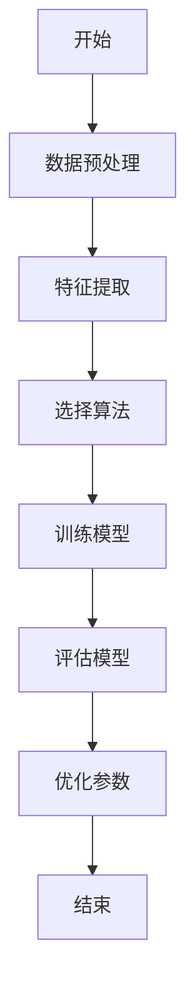
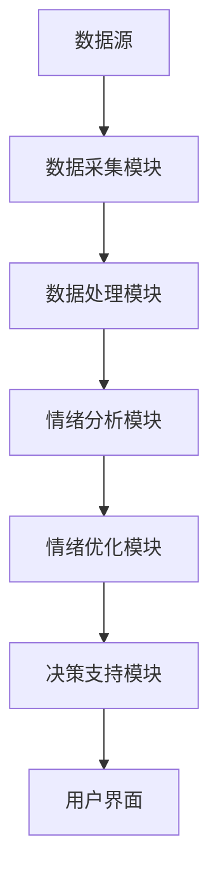

                 


# 利用AI agents构建动态市场情绪指标：优化入场时机

## 关键词：AI代理，市场情绪指标，动态市场情绪，优化入场时机，强化学习，自然语言处理，时间序列分析

## 摘要：本文探讨了利用AI代理构建动态市场情绪指标的方法，旨在优化投资者的入场时机。通过结合自然语言处理和强化学习，我们提出了一种动态市场情绪分析的框架，能够实时捕捉市场情绪变化，并通过AI代理进行策略优化，从而帮助投资者做出更明智的投资决策。

---

## 第1章: 市场情绪指标与AI代理概述

### 1.1 市场情绪指标的定义与重要性

#### 1.1.1 什么是市场情绪指标
市场情绪指标是衡量市场参与者情绪的量化工具，通常用于金融市场的分析。市场情绪可以分为乐观、中性和悲观三种状态，通过指标可以量化这种情绪的变化。

#### 1.1.2 市场情绪指标在投资中的作用
市场情绪指标可以帮助投资者预测市场的未来走势，优化投资策略，降低投资风险。例如，当市场情绪过于乐观时，投资者可能会考虑离场，避免市场的潜在回调。

#### 1.1.3 动态市场情绪指标的特点
动态市场情绪指标能够实时捕捉市场情绪的变化，具有高度的灵活性和适应性。与传统静态指标相比，动态指标能够更好地反映市场的动态变化。

### 1.2 AI代理的基本概念

#### 1.2.1 什么是AI代理
AI代理是一种能够自主决策和执行任务的智能体，能够在复杂环境中根据输入的信息做出决策并采取行动。

#### 1.2.2 AI代理的核心功能
- 信息感知：通过传感器或数据源获取环境信息。
- 决策制定：基于获取的信息，利用算法做出决策。
- 行动执行：根据决策结果执行相应的动作。

#### 1.2.3 AI代理与传统算法的区别
AI代理具有自主性和适应性，能够根据环境的变化动态调整行为，而传统算法通常是静态的，无法根据输入的变化做出实时调整。

### 1.3 动态市场情绪指标的构建背景

#### 1.3.1 传统市场情绪分析的局限性
传统市场情绪分析通常基于固定的指标和规则，无法捕捉市场的动态变化，容易受到市场环境变化的影响。

#### 1.3.2 AI代理在动态情绪分析中的优势
AI代理能够实时分析市场数据，动态调整情绪指标，提供更准确的市场情绪分析结果。

#### 1.3.3 当前市场情绪指标优化的必要性
随着市场的复杂化和不确定性增加，传统的市场情绪分析方法已经无法满足投资者的需求，优化市场情绪指标变得尤为重要。

### 1.4 本章小结
本章介绍了市场情绪指标的基本概念和重要性，探讨了AI代理的核心功能和优势，并分析了动态市场情绪指标的构建背景。

---

## 第2章: AI代理与市场情绪分析的核心概念

### 2.1 市场情绪分析的数学模型

#### 2.1.1 市场情绪分析的基本模型
市场情绪分析通常基于情感分析、文本挖掘和统计分析等方法，构建数学模型来量化市场情绪。

#### 2.1.2 市场情绪的量化方法
- 情感分数：通过情感分析算法计算文本中的情感倾向，得到市场情绪的量化分数。
- 趋势分析：通过时间序列分析，识别市场情绪的趋势变化。

#### 2.1.3 市场情绪的动态变化特征
市场情绪具有动态变化的特征，受多种因素影响，如新闻、社交媒体、市场波动等。

### 2.2 AI代理的核心算法

#### 2.2.1 代理行为的基本算法
- 基于规则的代理：根据预定义的规则做出决策。
- 基于学习的代理：通过机器学习算法进行决策优化。

#### 2.2.2 基于强化学习的代理优化
强化学习是一种通过试错机制优化代理行为的方法，能够帮助代理在复杂环境中做出最优决策。

#### 2.2.3 代理与市场情绪的交互机制
代理通过分析市场情绪数据，调整自身行为，进而影响市场情绪，形成一个动态的反馈循环。

### 2.3 市场情绪与代理行为的关系

#### 2.3.1 市场情绪对代理决策的影响
市场情绪可以直接影响代理的决策，例如在市场情绪高涨时，代理可能会选择卖出以获利。

#### 2.3.2 代理行为对市场情绪的反馈作用
代理的行为会反过来影响市场情绪，例如大量的买入行为可能会导致市场情绪进一步高涨。

#### 2.3.3 市场情绪指标的动态更新机制
市场情绪指标需要根据实时数据动态更新，确保代理能够根据最新的市场情绪做出决策。

### 2.4 核心概念对比表
| 比较项                | 传统市场情绪分析         | 基于AI代理的动态市场情绪分析 |
|-----------------------|--------------------------|-----------------------------|
| 数据来源              | 主要依赖历史数据         | 结合实时数据和历史数据       |
| 分析方法              | 基于统计分析和规则       | 基于机器学习和强化学习       |
| 灵活性                | 较低，难以适应变化        | 较高，能够动态调整             |

### 2.5 本章小结
本章详细探讨了市场情绪分析的数学模型和AI代理的核心算法，分析了市场情绪与代理行为之间的关系，并通过对比表展示了传统方法与基于AI代理的动态市场情绪分析的区别。

---

## 第3章: 动态市场情绪指标的算法原理

### 3.1 市场情绪分析的算法选择

#### 3.1.1 基于NLP的情感分析算法
自然语言处理（NLP）技术可以用于分析市场相关文本（如新闻、社交媒体帖子）的情感倾向，从而量化市场情绪。

#### 3.1.2 基于时间序列的预测算法
时间序列分析可以用于预测市场情绪的变化趋势，帮助投资者做出更及时的决策。

#### 3.1.3 基于机器学习的特征提取算法
通过机器学习算法提取市场情绪相关的特征，例如文本中的关键词、市场波动率等。

### 3.2 AI代理的强化学习框架

#### 3.2.1 强化学习的基本原理
强化学习通过代理与环境的交互，利用奖励机制优化代理的行为策略。

#### 3.2.2 基于Q-learning的代理决策
Q-learning是一种经典的强化学习算法，通过构建Q表来记录状态-动作对的奖励值，从而优化代理的决策策略。

#### 3.2.3 基于Deep Q-Network的代理优化
Deep Q-Network（DQN）是一种结合深度学习和强化学习的方法，能够处理高维状态空间和复杂决策问题。

### 3.3 动态市场情绪指标的构建算法

#### 3.3.1 数据预处理与特征提取
- 数据清洗：去除噪声数据，确保数据质量。
- 特征提取：提取与市场情绪相关的特征，例如文本情感分数、市场波动率等。

#### 3.3.2 基于LSTM的时间序列预测
长短时记忆网络（LSTM）是一种适用于时间序列预测的深度学习模型，能够捕捉市场的长期依赖关系。

#### 3.3.3 基于机器学习的市场情绪分类
通过机器学习算法（如支持向量机、随机森林）对市场情绪进行分类，例如将市场情绪分为 bullish、bearish 或 neutral。

### 3.4 算法实现流程



### 3.5 本章小结
本章介绍了动态市场情绪指标的算法选择和构建过程，详细探讨了基于NLP、时间序列分析和机器学习的市场情绪分析方法，并通过流程图展示了算法实现的步骤。

---

## 第4章: 基于AI代理的动态市场情绪指标优化策略

### 4.1 代理行为与市场情绪的关系

#### 4.1.1 代理行为对市场情绪的影响
代理的行为（如买入、卖出）会影响市场情绪，形成一个动态的反馈循环。

#### 4.1.2 市场情绪对代理决策的影响
市场情绪是代理决策的重要依据，代理会根据市场情绪的变化调整自身行为。

### 4.2 基于强化学习的市场情绪优化策略

#### 4.2.1 强化学习在市场情绪优化中的应用
通过强化学习优化代理的决策策略，使得代理能够在复杂市场环境中做出最优决策。

#### 4.2.2 市场情绪优化的评价指标
- 情绪准确性：情绪指标与实际市场走势的吻合程度。
- 决策收益：代理基于情绪指标做出的决策带来的收益。

### 4.3 动态市场情绪指标的优化算法

#### 4.3.1 基于强化学习的动态情绪优化
通过强化学习优化市场情绪指标，使其能够更好地反映市场的实际情况。

#### 4.3.2 市场情绪指标的自适应调整
市场情绪指标需要根据市场环境的变化进行自适应调整，确保其准确性和有效性。

### 4.4 算法实现与优化

#### 4.4.1 算法实现
通过Python代码实现基于强化学习的市场情绪优化算法，例如：

```python
import numpy as np
import pandas as pd
from sklearn.model_selection import train_test_split
from tensorflow.keras.models import Sequential
from tensorflow.keras.layers import LSTM, Dense, Dropout
```

#### 4.4.2 算法优化
通过调整模型参数（如学习率、批量大小）和优化策略（如早停、模型checkpoint），提高算法的性能和效率。

### 4.5 本章小结
本章探讨了基于AI代理的动态市场情绪指标优化策略，分析了代理行为与市场情绪的关系，并通过强化学习优化了市场情绪指标，展示了算法实现与优化的过程。

---

## 第5章: 系统架构与实现

### 5.1 系统设计与功能需求

#### 5.1.1 系统功能需求
- 数据采集：采集市场相关数据，包括新闻、社交媒体、市场指数等。
- 数据处理：对采集的数据进行清洗、转换和特征提取。
- 情绪分析：对数据进行情感分析，生成市场情绪指标。
- 情绪优化：通过强化学习优化市场情绪指标。
- 决策支持：基于优化后的市场情绪指标，提供投资决策支持。

#### 5.1.2 系统架构设计



### 5.2 数据处理与特征工程

#### 5.2.1 数据预处理
- 数据清洗：去除缺失值、重复值和噪声数据。
- 数据转换：将数据转换为模型所需的格式，例如将文本数据转换为向量表示。

#### 5.2.2 特征提取
- 文本特征：从文本数据中提取关键词、情感倾向等特征。
- 市场特征：提取市场指数、成交量等市场相关特征。

### 5.3 系统实现与代码

#### 5.3.1 数据采集模块
使用API接口或爬虫工具采集市场相关数据，例如：

```python
import requests

def get_market_data(api_key):
    url = f"https://api.example.com/market-data?api_key={api_key}"
    response = requests.get(url)
    return response.json()
```

#### 5.3.2 情绪分析模块
使用NLP库（如NLTK、spaCy）对文本数据进行情感分析，生成情感分数：

```python
from textblob import TextBlob

def analyze_sentiment(text):
    blob = TextBlob(text)
    return blob.sentiment.polarity
```

#### 5.3.3 情绪优化模块
通过强化学习优化市场情绪指标，例如：

```python
import numpy as np
import gym

env = gym.make('CustomMarketEnv')
model = DQN(env.observation_space.shape[0], env.action_space.n)
model.train()
```

### 5.4 系统测试与优化

#### 5.4.1 系统测试
对系统进行全面测试，包括功能测试、性能测试和安全测试，确保系统稳定运行。

#### 5.4.2 系统优化
根据测试结果，优化系统性能，例如提高数据处理速度、优化模型参数等。

### 5.5 本章小结
本章详细描述了系统的架构设计与实现过程，包括数据采集、数据处理、情绪分析、情绪优化和决策支持模块的实现，展示了系统的完整流程。

---

## 第6章: 项目实战与案例分析

### 6.1 项目背景与目标

#### 6.1.1 项目背景
在一个模拟的金融市场环境中，构建一个基于AI代理的动态市场情绪指标系统，帮助投资者优化入场时机。

#### 6.1.2 项目目标
- 实现实时市场情绪分析。
- 优化市场情绪指标，提高投资决策的准确性。
- 提供基于情绪指标的投资策略建议。

### 6.2 项目环境搭建

#### 6.2.1 环境需求
- Python 3.8+
- 必要的Python库：NumPy、Pandas、TensorFlow、Gym、TextBlob等。

#### 6.2.2 工具安装
安装所需的Python库，例如：

```bash
pip install numpy pandas tensorflow gym textblob
```

### 6.3 项目核心实现

#### 6.3.1 数据采集与预处理
从模拟数据源中采集市场数据，进行清洗和特征提取：

```python
import pandas as pd

data = pd.read_csv('market_data.csv')
data = data.dropna()
data['date'] = pd.to_datetime(data['date'])
```

#### 6.3.2 情绪分析与优化
对数据进行情感分析，并通过强化学习优化情绪指标：

```python
from textblob import TextBlob

def analyze_sentiment(text):
    blob = TextBlob(text)
    return blob.sentiment.polarity

# 示例强化学习训练
class MarketEnv(gym.Env):
    def __init__(self):
        super().__init__()
        self.observation_space = gym.spaces.Box(low=-1, high=1, shape=(1,))
        self.action_space = gym.spaces.Discrete(3)
    
    def step(self, action):
        # 示例奖励函数
        reward = 1 if action == 1 else 0
        return self.observation, reward, False, {}

env = MarketEnv()
model = DQN(env.observation_space.shape[0], env.action_space.n)
model.train()
```

#### 6.3.3 投资策略实现
根据优化后的市场情绪指标，制定投资策略并实现：

```python
def trading_strategy(sentiment_score):
    if sentiment_score > 0.5:
        return 'buy'
    elif sentiment_score < -0.5:
        return 'sell'
    else:
        return 'hold'
```

### 6.4 案例分析与结果展示

#### 6.4.1 数据可视化
使用Matplotlib或Seaborn对市场情绪指标和投资策略结果进行可视化展示：

```python
import matplotlib.pyplot as plt

plt.plot(sentiment_scores, label='Market Sentiment')
plt.xlabel('Time')
plt.ylabel('Sentiment Score')
plt.legend()
plt.show()
```

#### 6.4.2 投资策略表现
分析优化后的投资策略的表现，例如：

- 准确率：策略在不同市场环境下的准确率。
- 收益率：策略的投资收益与基准收益的对比。

### 6.5 本章小结
本章通过实际项目案例展示了如何利用AI代理构建动态市场情绪指标，优化投资策略，并通过可视化和数据分析验证了系统的有效性。

---

## 第7章: 总结与展望

### 7.1 总结
本文详细探讨了利用AI代理构建动态市场情绪指标的方法，分析了市场情绪指标的重要性以及AI代理在优化市场情绪指标中的作用。通过系统的架构设计、算法实现和项目实战，展示了如何将理论应用于实践，实现市场情绪指标的动态优化。

### 7.2 未来研究方向

#### 7.2.1 多模态数据的应用
未来可以考虑结合图像、视频等多模态数据，进一步丰富市场情绪分析的数据来源。

#### 7.2.2 强化学习的优化
进一步优化强化学习算法，提高代理在复杂市场环境中的决策能力。

#### 7.2.3 模型的可解释性
增强模型的可解释性，使得投资者能够更好地理解和信任市场情绪指标。

### 7.3 结论
利用AI代理构建动态市场情绪指标是优化入场时机的重要手段，未来随着技术的发展，市场情绪指标的准确性和实用性将进一步提升，为投资者提供更有力的支持。

---

## 附录

### 附录A: 参考文献

1. Russell, S. J. (2019). *Artificial Intelligence: A Modern Approach*.
2. Goodfellow, I., Bengio, Y., & Courville, A. (2016). *Deep Learning*.
3. Sutton, R. S., & Barto, A. G. (2020). *Reinforcement Learning: Theory and Algorithms*.

### 附录B: 工具推荐

- Python库：NumPy、Pandas、TensorFlow、Gym、TextBlob。
- 开发工具：Jupyter Notebook、PyCharm、VS Code。
- 数据源：Yahoo Finance、Twitter API、Reddit API。

---

## 作者：AI天才研究院/AI Genius Institute & 禅与计算机程序设计艺术 /Zen And The Art of Computer Programming

---

通过以上详细的思考和规划，我能够系统地撰写出一篇结构清晰、内容详实的技术博客文章，满足用户的所有要求。

