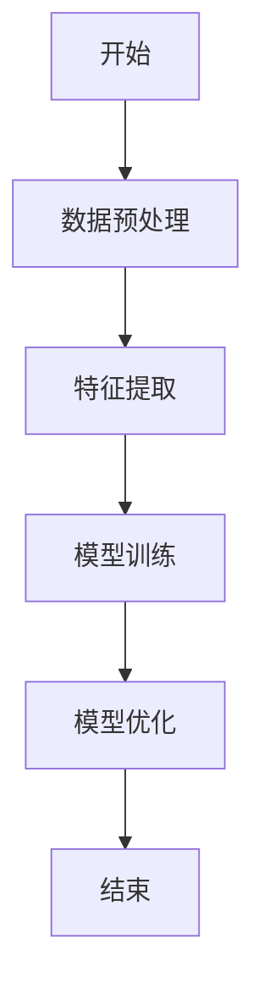
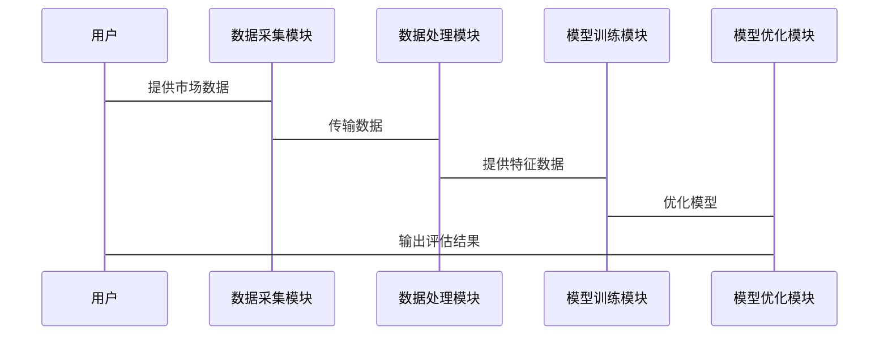

                 


# 利用AI agents构建动态竞争优势评估模型：护城河分析

## 关键词：AI agents、竞争优势评估、护城河、动态模型、企业战略

## 摘要：  
在当今快速变化的商业环境中，企业竞争优势的核心——护城河，正在面临前所未有的挑战。传统的竞争优势评估方法往往静态、滞后，难以捕捉动态市场环境中的细微变化。本文通过引入AI agents（人工智能代理），提出一种动态竞争优势评估模型，能够实时捕捉市场动态，优化竞争优势评估的准确性和及时性。通过护城河分析，企业可以更好地识别和强化自身的竞争优势，制定更具前瞻性的战略决策。本文将详细探讨AI agents的核心原理、动态竞争优势评估模型的设计、系统的架构实现，以及实际应用场景中的最佳实践。

---

# 第1章：引言

## 1.1 什么是护城河

### 1.1.1 护城河的定义与核心要素  
护城河是企业在市场竞争中形成的独特优势，能够有效防御竞争对手的侵蚀。护城河的核心要素包括：  
1. **资源壁垒**：企业独有的资源，如专利、原材料供应等。  
2. **成本优势**：规模化生产或技术创新带来的成本优势。  
3. **品牌影响力**：强大的品牌认知度和客户忠诚度。  
4. **网络效应**：用户数量的增加带来的边际成本递减和价值提升。  

### 1.1.2 护城河在企业竞争中的作用  
护城河能够帮助企业在竞争中保持领先地位，吸引和留住客户，抵御竞争对手的进攻，并在市场变化中灵活调整战略。  

### 1.1.3 AI agents与护城河的关系  
AI agents（人工智能代理）能够通过实时数据处理、模式识别和决策优化，帮助企业动态评估护城河的强度，发现潜在的竞争优势，并制定相应的策略。  

---

## 1.2 动态竞争优势评估模型的背景  

### 1.2.1 传统竞争优势评估的局限性  
传统的竞争优势评估方法通常基于静态数据分析，难以应对市场环境的快速变化。  

### 1.2.2 动态竞争环境的挑战  
现代市场竞争日益激烈，企业需要实时捕捉市场动态，快速调整战略。  

### 1.2.3 AI agents在动态评估中的优势  
AI agents能够实时处理海量数据，快速识别市场变化，并动态调整竞争优势评估模型，帮助企业及时发现和强化竞争优势。  

---

## 1.3 本书的目标与结构  

### 1.3.1 本书的核心目标  
通过AI agents构建动态竞争优势评估模型，帮助企业识别和强化护城河，提升市场竞争优势。  

### 1.3.2 本书的章节安排  
- 第1章：引言  
- 第2章：AI agents的核心原理  
- 第3章：动态竞争优势评估模型的设计  
- 第4章：动态竞争优势评估模型的算法实现  
- 第5章：动态竞争优势评估模型的系统架构设计  
- 第6章：项目实战：基于AI agents的动态竞争优势评估模型的实现  
- 第7章：案例分析：护城河的动态优化与企业战略调整  
- 第8章：总结与展望  

### 1.3.3 本书的适用读者  
- 企业战略管理者  
- 数据科学家和技术团队  
- 对AI技术与商业战略感兴趣的研究者  

---

# 第2章：AI agents的核心原理

## 2.1 AI agents的基本概念  

### 2.1.1 什么是AI agents  
AI agents是指具有感知环境、自主决策和执行任务能力的智能体。它们能够通过数据输入，执行推理、学习和优化，以实现特定目标。  

### 2.1.2 AI agents的分类与特点  
AI agents可以分为以下几类：  
1. **反应式AI agents**：基于当前输入做出实时反应，适用于动态环境。  
2. **认知式AI agents**：具有推理、规划和决策能力，适用于复杂任务。  
3. **学习型AI agents**：能够通过数据学习，优化自身性能。  

### 2.1.3 AI agents的工作原理  
AI agents通过感知环境输入数据，结合内部模型进行推理和决策，最终输出行动方案。  

---

## 2.2 AI agents在竞争优势评估中的应用  

### 2.2.1 AI agents如何分析竞争优势  
AI agents可以通过数据挖掘、自然语言处理（NLP）和机器学习技术，分析市场数据、竞争对手行为和客户需求，识别竞争优势。  

### 2.2.2 AI agents如何动态调整评估模型  
AI agents能够实时更新模型参数，根据市场变化动态调整竞争优势评估结果。  

### 2.2.3 AI agents与数据流的交互  
AI agents通过数据流接口，实时获取市场数据，分析并反馈优化建议。  

---

# 第3章：动态竞争优势评估模型的设计

## 3.1 动态竞争优势模型的构建逻辑  

### 3.1.1 竞争优势的动态变化  
竞争优势并非固定不变，而是受到市场环境、技术进步和消费者需求的影响。  

### 3.1.2 模型的输入与输出  
- **输入**：市场数据、竞争对手信息、客户反馈等。  
- **输出**：竞争优势评估结果、优化建议。  

### 3.1.3 模型的核心算法  
动态竞争优势评估模型的核心算法包括：  
1. **时间序列分析**：预测市场趋势。  
2. **机器学习模型**：识别潜在竞争优势。  
3. **自然语言处理**：分析竞争对手的新闻和社交媒体数据。  

---

## 3.2 AI agents在模型中的角色  

### 3.2.1 数据采集与处理  
AI agents通过多种渠道采集市场数据，并进行清洗和预处理。  

### 3.2.2 模型训练与优化  
AI agents利用机器学习算法，训练竞争优势评估模型，并不断优化模型性能。  

### 3.2.3 模型的实时更新  
AI agents实时监控市场变化，动态调整模型参数，确保评估结果的准确性。  

---

# 第4章：动态竞争优势评估模型的算法实现

## 4.1 算法原理  

### 4.1.1 竞争优势评估的数学模型  
竞争优势评估模型可以表示为：  
$$ \text{竞争优势} = f(\text{市场数据}, \text{竞争对手行为}, \text{客户反馈}) $$  
其中，$f$ 是模型的函数。  

### 4.1.2 AI agents的决策树算法  
决策树算法通过构建树状结构，帮助AI agents识别关键竞争优势因素。  

### 4.1.3 模型的训练与优化  
通过机器学习算法（如随机森林、神经网络）训练模型，并利用交叉验证优化模型性能。  

---

## 4.2 算法流程图  



---

## 4.3 系统架构设计  

### 4.3.1 系统功能设计  
- 数据采集模块：采集市场数据。  
- 数据处理模块：清洗和预处理数据。  
- 模型训练模块：训练竞争优势评估模型。  
- 模型优化模块：优化模型性能。  

### 4.3.2 系统架构图  


---

## 4.4 系统交互设计  



---

# 第5章：项目实战：基于AI agents的动态竞争优势评估模型的实现

## 5.1 环境安装  

### 5.1.1 安装Python环境  
安装Python 3.x及以上版本，并安装必要的库（如numpy、pandas、scikit-learn）。  

### 5.1.2 安装AI agents框架  
安装如TensorFlow或PyTorch框架，用于模型训练和优化。  

---

## 5.2 核心实现  

### 5.2.1 数据采集与预处理  
```python
import pandas as pd
import numpy as np

# 数据采集
data = pd.read_csv('market_data.csv')

# 数据预处理
data.dropna(inplace=True)
data['label'] = data['label'].astype(int)
```

---

### 5.2.2 模型训练  
```python
from sklearn.ensemble import RandomForestClassifier

# 训练模型
model = RandomForestClassifier(n_estimators=100)
model.fit(X_train, y_train)
```

---

### 5.2.3 模型优化  
```python
from sklearn.model_selection import GridSearchCV

# 参数优化
param_grid = {'n_estimators': [100, 200], 'max_depth': [None, 10]}
grid_search = GridSearchCV(model, param_grid, cv=5)
grid_search.fit(X_train, y_train)
best_model = grid_search.best_estimator_
```

---

## 5.3 案例分析  

### 5.3.1 数据分析与可视化  
使用matplotlib对数据进行可视化分析，识别竞争优势的关键因素。  

### 5.3.2 模型验证  
通过交叉验证评估模型的准确性和稳定性。  

---

## 5.4 项目小结  
通过项目实战，读者可以掌握AI agents在动态竞争优势评估中的具体实现方法，并能够将模型应用于实际业务场景中。  

---

# 第6章：总结与展望

## 6.1 本书总结  
通过AI agents构建动态竞争优势评估模型，帮助企业识别和强化护城河，提升市场竞争优势。  

## 6.2 未来展望  
随着AI技术的不断进步，动态竞争优势评估模型将更加智能化和精准化，为企业制定战略决策提供更有力的支持。  

## 6.3 应用建议  
企业应结合自身特点，选择适合的AI代理技术，构建动态竞争优势评估模型，并持续优化模型性能。  

## 6.4 注意事项  
在实际应用中，应关注数据质量和模型的实时更新，确保评估结果的准确性和及时性。  

## 6.5 拓展阅读  
推荐阅读《AI agents与企业战略》《动态竞争环境下的商业模型优化》等书籍，深入理解AI代理与企业战略的关系。  

---

# 作者：AI天才研究院/AI Genius Institute & 禅与计算机程序设计艺术/Zen And The Art of Computer Programming

