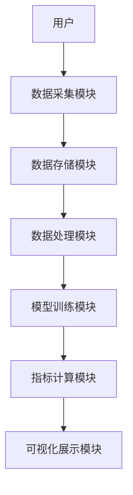
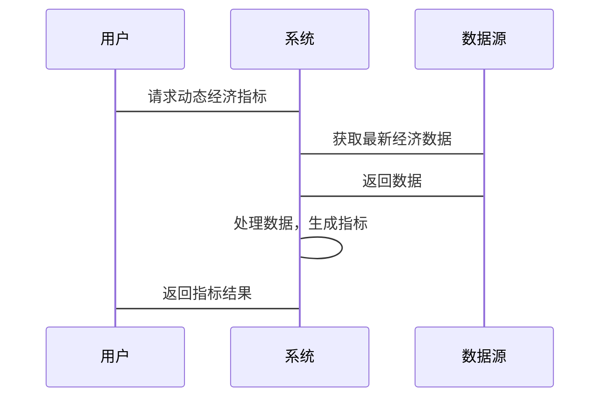

                 


# 利用AI agents构建动态经济周期指标：把握宏观投资时机

## 关键词：AI agents、动态经济指标、宏观经济预测、投资时机、智能体技术

## 摘要：本文详细探讨了如何利用AI agents构建动态经济周期指标，帮助投资者准确把握宏观投资时机。文章从经济周期的基本概念、AI agents的技术基础入手，逐步分析了动态经济指标的核心要素、构建方法及应用场景。通过实际案例和系统设计，展示了AI agents在宏观经济预测中的巨大潜力，为投资者提供了科学的决策工具。

---

# 第一部分: 利用AI agents构建动态经济周期指标的背景与意义

## 第1章: 经济周期的基本概念与投资时机把握

### 1.1 经济周期的定义与特征

#### 1.1.1 经济周期的定义
经济周期是指经济活动在时间上的波动，通常分为繁荣、衰退、萧条和复苏四个阶段。经济周期的变化直接影响着市场走势和投资决策。

#### 1.1.2 经济周期的主要阶段划分
- **繁荣阶段**：经济增长迅速，就业率高，企业利润增加。
- **衰退阶段**：经济增长放缓，企业利润下降，失业率上升。
- **萧条阶段**：经济活动大幅下降，失业率高，企业倒闭增多。
- **复苏阶段**：经济开始恢复，就业率逐步回升。

#### 1.1.3 经济周期对投资决策的影响
投资者需要根据经济周期的变化调整投资策略。例如，在经济繁荣期，适合投资股票等高风险资产；而在经济衰退期，适合投资债券等低风险资产。

### 1.2 宏观经济指标与投资时机

#### 1.2.1 主要宏观经济指标介绍
- **GDP（国内生产总值）**：衡量一个国家或地区的经济规模。
- **失业率**：反映劳动力市场的情况。
- **通货膨胀率**：衡量物价水平的变化。
- **利率**：影响企业和个人的借贷成本。

#### 1.2.2 经济指标与投资时机的关系
宏观经济指标的变化往往预示着经济周期的转变，投资者可以通过分析这些指标来判断市场趋势，从而做出更明智的投资决策。

#### 1.2.3 宏观经济预测在投资中的应用
准确的宏观经济预测可以帮助投资者提前布局，抓住投资机会，规避市场风险。

## 第2章: AI agents的基本概念与技术基础

### 2.1 AI agents的定义与分类

#### 2.1.1 AI agents的定义
AI agents（智能体）是指能够感知环境并采取行动以实现目标的实体。它们可以通过传感器获取信息，通过执行器与环境交互。

#### 2.1.2 基于AI的智能体分类
- **简单反射型智能体**：基于当前感知直接行动，不涉及复杂决策。
- **基于模型的智能体**：利用内部模型进行决策，考虑当前状态和未来可能的状态。
- **实用主义智能体**：通过优化目标函数来选择最优行动。

#### 2.1.3 AI agents的核心技术特点
- **自主性**：能够在没有外部干预的情况下运行。
- **反应性**：能够实时感知环境并做出反应。
- **目标导向**：通过设定目标来指导行动。

### 2.2 AI agents在经济分析中的应用潜力

#### 2.2.1 AI agents在经济数据处理中的优势
- **高效性**：能够快速处理大量数据，提取有用信息。
- **准确性**：通过机器学习算法，提高数据处理的准确性。

#### 2.2.2 AI agents在动态指标构建中的作用
- **实时监测**：能够实时跟踪经济指标的变化。
- **动态调整**：根据最新数据自动调整指标权重。

#### 2.2.3 AI agents与宏观经济预测的结合
- **数据驱动**：利用大数据分析，提高经济预测的准确性。
- **动态适应**：根据市场变化，实时更新预测模型。

## 第3章: 利用AI agents构建动态经济指标的意义

### 3.1 动态经济周期指标的定义与目标

#### 3.1.1 动态经济指标的定义
动态经济指标是指能够实时反映经济状况，并根据市场变化自动调整的经济指标。

#### 3.1.2 动态经济指标的核心目标
- **实时性**：能够及时反映经济变化。
- **准确性**：能够准确预测经济趋势。
- **可解释性**：指标的变化原因能够被投资者理解。

#### 3.1.3 动态经济指标与传统经济指标的区别
动态经济指标具有更强的实时性和动态调整能力，能够更好地适应市场变化。

### 3.2 AI agents在动态经济指标构建中的优势

#### 3.2.1 数据处理能力的提升
AI agents能够高效处理大量数据，提取有用的经济信息。

#### 3.2.2 实时分析与动态调整的优势
AI agents能够实时分析经济数据，根据最新信息动态调整指标。

#### 3.2.3 复杂经济关系的自动建模能力
通过机器学习算法，AI agents可以自动建立复杂的经济模型，捕捉经济变化的规律。

### 3.3 动态经济指标在宏观投资中的应用前景

#### 3.3.1 投资决策的实时性需求
投资者需要实时了解经济变化，以便及时调整投资策略。

#### 3.3.2 动态经济指标对投资时机的指导作用
动态经济指标能够帮助投资者准确把握投资时机，避免市场风险。

#### 3.3.3 未来发展趋势与潜在挑战
随着AI技术的不断进步，动态经济指标的应用前景广阔，但也面临数据隐私、模型解释性等挑战。

---

# 第二部分: AI agents构建动态经济周期指标的核心概念与原理

## 第4章: AI agents构建动态经济指标的核心概念

### 4.1 动态经济指标的核心要素

#### 4.1.1 数据源的多样性与实时性
动态经济指标需要结合多种数据源，包括股票价格、经济报告、社交媒体等。

#### 4.1.2 指标构建的动态调整机制
动态经济指标需要根据最新数据不断调整权重和模型参数。

#### 4.1.3 指标输出的可解释性要求
动态经济指标的输出需要具有可解释性，便于投资者理解和应用。

### 4.2 AI agents在动态指标构建中的角色

#### 4.2.1 数据采集与处理
AI agents负责采集经济数据，并进行预处理，提取有用信息。

#### 4.2.2 模型训练与优化
通过机器学习算法，AI agents训练模型，优化指标的预测能力。

#### 4.2.3 实时监控与反馈
AI agents实时监控经济指标的变化，根据反馈调整模型参数。

---

# 第三部分: AI agents构建动态经济周期指标的算法原理与系统架构

## 第5章: 基于AI agents的动态经济指标构建算法原理

### 5.1 算法原理

#### 5.1.1 数据预处理
- **数据清洗**：去除噪声数据，确保数据质量。
- **特征提取**：提取影响经济指标的关键特征。

#### 5.1.2 模型选择
- **时间序列分析**：使用ARIMA、LSTM等模型预测经济指标。
- **机器学习模型**：使用随机森林、支持向量机等模型进行分类或回归。

#### 5.1.3 动态调整机制
- **在线学习**：根据新数据实时更新模型。
- **自适应权重分配**：根据不同数据源的重要性动态调整权重。

#### 5.1.4 结果输出
- **指标计算**：根据模型输出生成动态经济指标。
- **可视化展示**：以图表形式展示指标变化趋势。

### 5.2 算法实现

#### 5.2.1 环境安装
- Python版本：3.8及以上
- 需要的库：numpy、pandas、scikit-learn、keras、tensorflow

#### 5.2.2 核心代码实现

```python
import numpy as np
import pandas as pd
from sklearn.ensemble import RandomForestRegressor
from sklearn.metrics import mean_squared_error
from sklearn.model_selection import train_test_split

# 加载数据
data = pd.read_csv('economic_data.csv')

# 数据预处理
X = data.drop(columns=['target'])
y = data['target']

# 划分训练集和测试集
X_train, X_test, y_train, y_test = train_test_split(X, y, test_size=0.2, random_state=42)

# 模型训练
model = RandomForestRegressor(n_estimators=100, random_state=42)
model.fit(X_train, y_train)

# 模型预测
y_pred = model.predict(X_test)

# 评估模型
mse = mean_squared_error(y_test, y_pred)
print(f'Mean Squared Error: {mse}')
```

#### 5.2.3 案例分析
以股票价格预测为例，利用LSTM模型进行时间序列预测，生成动态经济指标。

---

## 第6章: 系统架构设计与实现

### 6.1 系统架构设计

#### 6.1.1 系统功能模块设计
- 数据采集模块：实时采集经济数据。
- 数据处理模块：清洗和特征提取。
- 模型训练模块：训练机器学习模型。
- 指标计算模块：生成动态经济指标。
- 可视化展示模块：以图表形式展示指标变化。

#### 6.1.2 系统架构图



#### 6.1.3 系统接口设计
- 数据接口：提供API接口，供其他系统调用经济指标数据。
- 用户接口：提供网页或移动应用，供用户查看动态经济指标。

#### 6.1.4 系统交互流程



### 6.2 项目实战

#### 6.2.1 环境安装
- 安装Python和相关库（numpy、pandas、scikit-learn等）。

#### 6.2.2 核心代码实现

```python
import numpy as np
import pandas as pd
from sklearn.ensemble import RandomForestRegressor
from sklearn.metrics import mean_squared_error
from sklearn.model_selection import train_test_split

# 加载数据
data = pd.read_csv('economic_data.csv')

# 数据预处理
X = data.drop(columns=['target'])
y = data['target']

# 划分训练集和测试集
X_train, X_test, y_train, y_test = train_test_split(X, y, test_size=0.2, random_state=42)

# 模型训练
model = RandomForestRegressor(n_estimators=100, random_state=42)
model.fit(X_train, y_train)

# 模型预测
y_pred = model.predict(X_test)

# 评估模型
mse = mean_squared_error(y_test, y_pred)
print(f'Mean Squared Error: {mse}')
```

#### 6.2.3 案例分析
通过实际案例分析，展示如何利用AI agents构建动态经济指标，并评估其准确性。

---

## 第7章: 最佳实践、小结与展望

### 7.1 最佳实践

#### 7.1.1 数据质量管理
确保数据的准确性和完整性，避免噪声数据干扰模型训练。

#### 7.1.2 模型选择与调优
根据具体问题选择合适的模型，并通过调参优化模型性能。

#### 7.1.3 系统安全性
保护系统免受网络攻击和数据泄露，确保数据安全。

### 7.2 小结

通过本文的详细讲解，读者可以了解到如何利用AI agents构建动态经济周期指标，帮助投资者准确把握宏观投资时机。动态经济指标的构建需要结合先进的AI技术，合理设计系统架构，并通过实际案例验证模型的准确性。

### 7.3 展望

未来，随着AI技术的不断进步，动态经济指标的应用前景将更加广阔。通过引入更复杂的时间序列模型和强化学习算法，动态经济指标的预测精度将进一步提高，为投资者提供更有力的决策支持。

---

作者：AI天才研究院/AI Genius Institute & 禅与计算机程序设计艺术 /Zen And The Art of Computer Programming

