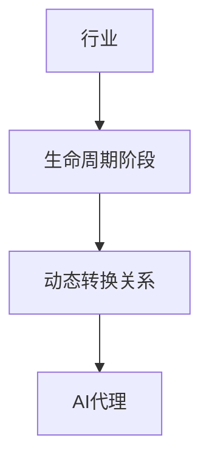
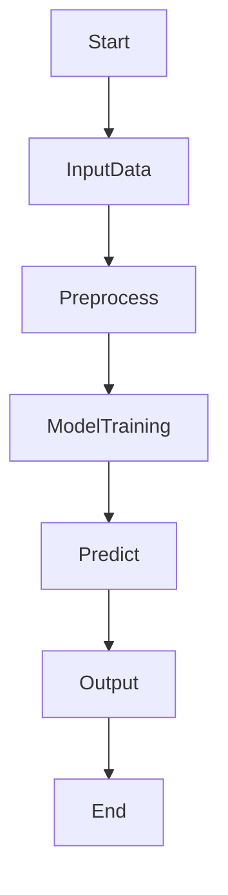
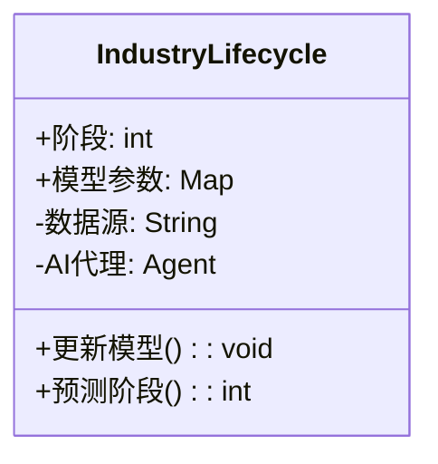

                 


# 利用AI agents构建动态行业生命周期模型：把握产业演变

## 关键词：AI代理，行业生命周期，动态模型，产业演变，系统架构，项目实战

## 摘要：本文深入探讨了如何利用AI代理构建动态的行业生命周期模型，分析了产业演变的规律，并提供了基于AI代理的系统架构设计和实际案例。通过详细讲解算法原理、数学模型、系统架构和项目实战，帮助读者掌握利用AI代理动态把握产业演变的核心方法。

---

# 第一部分：背景介绍与核心概念

## 第1章：问题背景与行业演变

### 1.1 问题背景
#### 1.1.1 传统行业分析的局限性
传统的行业分析方法通常基于静态模型，难以捕捉产业演变的动态变化。随着市场环境的快速变化，企业需要更灵活的工具来应对不确定性。

#### 1.1.2 产业生命周期的动态变化
行业生命周期包括形成期、成长期、成熟期和衰退期，每个阶段的特征不同，企业需要动态调整策略。

#### 1.1.3 AI代理在产业分析中的潜力
AI代理能够实时分析市场数据，提供动态反馈，帮助企业在产业演变中抓住机遇。

### 1.2 问题描述
#### 1.2.1 产业生命周期模型的定义
产业生命周期模型描述了行业从诞生到衰退的全过程，AI代理可以实时更新模型参数。

#### 1.2.2 动态模型的核心需求
动态模型需要实时数据输入，快速计算和调整模型参数，以反映产业变化。

#### 1.2.3 AI代理在动态模型中的角色
AI代理负责数据收集、分析和决策，确保模型能够实时反映产业动态。

### 1.3 问题解决与边界定义
#### 1.3.1 AI代理如何构建动态模型
通过实时数据输入和反馈机制，AI代理不断优化模型参数，反映产业动态。

#### 1.3.2 模型的边界与外延
模型的边界包括行业范围、数据来源和模型更新频率；外延则涉及跨行业应用和长期预测。

#### 1.3.3 核心要素与组成结构
动态模型的核心要素包括行业数据、AI代理、模型算法和反馈机制。

## 第2章：核心概念与联系

### 2.1 AI代理的核心原理
#### 2.1.1 AI代理的基本概念
AI代理是一种能够感知环境并采取行动的智能实体，能够自主决策。

#### 2.1.2 代理的智能性与自主性
AI代理具备学习能力和自主决策能力，能够适应复杂环境的变化。

#### 2.1.3 代理与环境的交互机制
AI代理通过传感器获取环境数据，通过执行器采取行动，与环境互动。

### 2.2 行业生命周期模型的构建
#### 2.2.1 生命周期阶段的划分
行业生命周期分为形成期、成长期、成熟期和衰退期，每个阶段有不同特征。

#### 2.2.2 阶段间的动态转换
阶段转换基于行业数据和市场反馈，AI代理能够实时调整模型参数。

#### 2.2.3 模型的输入与输出
输入包括市场数据、行业趋势，输出是行业阶段预测和战略建议。

### 2.3 核心概念对比分析
#### 2.3.1 AI代理与传统算法的对比
AI代理具备自主学习和实时反馈能力，而传统算法依赖预设规则。

#### 2.3.2 动态模型与静态模型的对比
动态模型能够实时更新，适应变化，而静态模型固定不变。

#### 2.3.3 行业生命周期的特征分析
不同阶段的特征包括增长速度、竞争程度和创新活跃度。

### 2.4 ER实体关系图


---

# 第三部分：算法原理与数学模型

## 第3章：算法原理与数学模型

### 3.1 算法原理
#### 3.1.1 数据流与决策逻辑
AI代理通过数据流获取行业数据，经过处理后，利用算法生成决策。

#### 3.1.2 基于代理的模拟过程
模拟过程包括数据收集、模型计算和结果反馈三个步骤。

#### 3.1.3 动态模型的训练方法
使用机器学习算法训练模型，通过反馈不断优化模型参数。

### 3.2 算法流程图


### 3.3 数学模型
#### 3.3.1 行业阶段的数学表达
行业阶段可以用一个变量S表示，S ∈ {1, 2, 3, 4}，分别对应形成期、成长期、成熟期和衰退期。

#### 3.3.2 阶段转换概率
阶段转换可以用转移矩阵T表示，其中T_ij表示从阶段i到阶段j的概率。

$$ T = \begin{pmatrix}
0 & 0.8 & 0.2 & 0 \\
0.3 & 0 & 0.5 & 0.2 \\
0 & 0.3 & 0 & 0.7 \\
0 & 0 & 0.1 & 0 \\
\end{pmatrix} $$

#### 3.3.3 动态模型的优化
通过最大化似然函数，优化模型参数，提高预测准确性。

---

# 第四部分：系统分析与架构设计

## 第4章：系统分析与架构设计

### 4.1 系统功能设计
#### 4.1.1 领域模型


#### 4.1.2 功能模块
系统包括数据采集、模型训练、预测分析和结果展示四个模块。

### 4.2 系统架构设计
#### 4.2.1 系统架构图
```mermaid
graph TD
    User --> API Gateway
    API Gateway --> Service1
    Service1 --> Database
    Service1 --> Service2
    Service2 --> Cache
```

#### 4.2.2 接口设计
系统提供REST API接口，支持数据输入和结果查询。

#### 4.2.3 交互流程
用户通过API输入数据，系统处理后返回预测结果。

---

# 第五部分：项目实战

## 第5章：项目实战

### 5.1 环境配置
安装Python、TensorFlow和Keras，配置开发环境。

### 5.2 核心实现
#### 5.2.1 数据处理代码
```python
import pandas as pd

def preprocess(data):
    # 数据预处理函数
    pass
```

#### 5.2.2 模型训练代码
```python
import tensorflow as tf

model = tf.keras.Sequential([
    tf.keras.layers.Dense(64, activation='relu'),
    tf.keras.layers.Dense(4, activation='softmax')
])
model.compile(optimizer='adam', loss='sparse_categorical_crossentropy', metrics=['accuracy'])
model.fit(X_train, y_train, epochs=10)
```

### 5.3 案例分析
通过具体案例分析模型的预测结果，验证其准确性。

### 5.4 项目小结
总结项目经验，提出改进建议。

---

# 第六部分：最佳实践

## 第6章：最佳实践

### 6.1 小结
AI代理在动态行业生命周期模型中的应用前景广阔。

### 6.2 注意事项
确保数据质量，定期更新模型，注意模型的可解释性。

### 6.3 扩展阅读
推荐相关书籍和论文，深入学习AI代理和动态模型的知识。

---

# 作者：AI天才研究院/AI Genius Institute & 禅与计算机程序设计艺术 /Zen And The Art of Computer Programming

