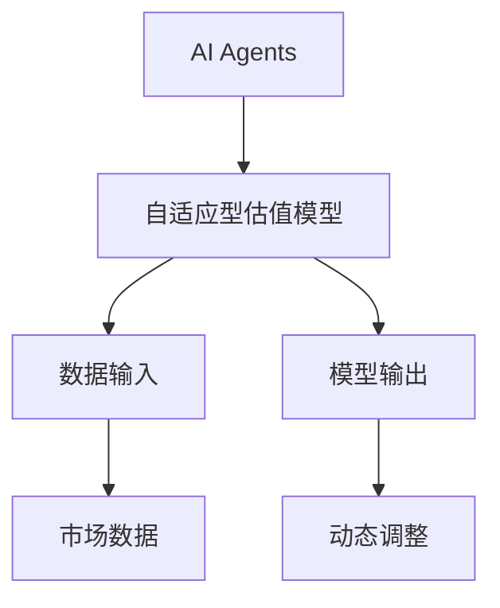
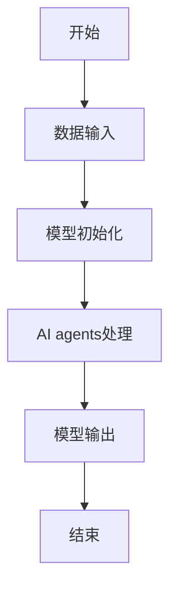
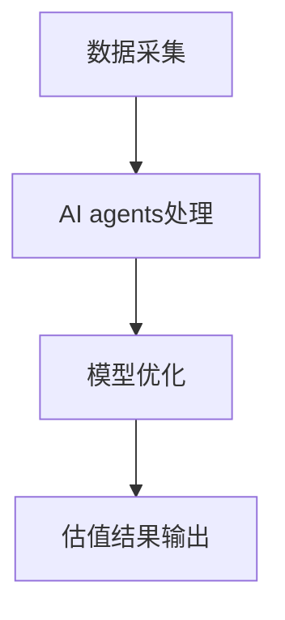
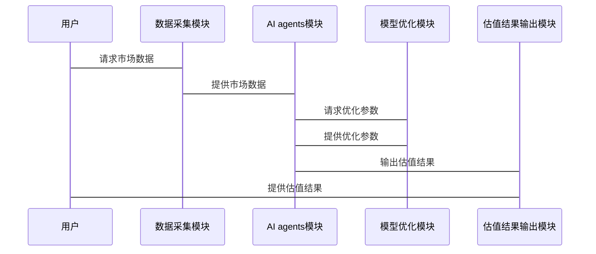

                 


# 利用AI agents构建自适应型估值模型：应对市场变化

## 关键词：
- AI agents
- 自适应型估值模型
- 市场变化
- 动态调整
- 人工智能
- 估值模型

## 摘要：
在金融市场中，传统的估值模型由于其固定性和缺乏动态调整能力，难以应对市场的快速变化和不确定性。本文提出利用AI agents构建自适应型估值模型的方法，通过实时数据分析和动态调整，提高模型的灵活性和准确性。文章详细阐述了AI agents的核心原理、自适应型估值模型的构建过程，以及在实际应用中的优势和挑战。

---

# 第一部分：背景与基础

## 第1章：问题背景与需求分析

### 1.1 问题背景
#### 1.1.1 传统估值模型的局限性
传统的估值模型（如DCF模型、市盈率模型等）基于固定的假设和历史数据，无法应对市场环境的快速变化。例如，在经济危机或突发事件中，市场数据的剧烈波动会导致传统模型的估值结果严重偏离实际。

#### 1.1.2 市场变化对估值模型的挑战
金融市场具有高度的不确定性和波动性，市场环境的变化（如政策调整、经济周期、突发事件等）会直接影响资产的价值。传统估值模型由于其静态性和固定性，难以适应这些变化。

#### 1.1.3 AI agents在动态市场中的优势
AI agents（智能体）具有自主学习和实时响应的能力，能够根据市场变化动态调整估值模型的参数和假设，从而提高估值的准确性和及时性。

### 1.2 问题描述
#### 1.2.1 传统估值模型的固定性与局限性
传统估值模型依赖于固定的假设和历史数据，无法适应市场环境的变化。例如，当市场利率发生变化时，DCF模型需要手动调整折现率，这会导致估值结果的滞后性和不准确性。

#### 1.2.2 动态市场环境下的估值需求
在动态市场环境中，企业需要实时更新估值模型，以应对市场的波动和变化。这要求估值模型具有高度的灵活性和自适应性。

#### 1.2.3 自适应型估值模型的必要性
为了应对市场的动态变化，自适应型估值模型能够根据实时数据和市场环境自动调整参数和假设，从而提供更准确的估值结果。

### 1.3 问题解决思路
#### 1.3.1 引入AI agents的思路
通过引入AI agents，可以实现对市场数据的实时监控和分析，动态调整估值模型的参数和假设，从而提高估值的准确性和及时性。

#### 1.3.2 自适应型估值模型的核心目标
自适应型估值模型的目标是通过AI agents实现对市场环境的实时感知和动态调整，提供准确的估值结果。

#### 1.3.3 AI agents与估值模型的结合方式
AI agents通过实时分析市场数据，自动调整估值模型的参数和假设，实现模型的动态更新和优化。

### 1.4 问题边界与外延
#### 1.4.1 自适应型估值模型的适用范围
自适应型估值模型适用于需要实时动态调整的金融估值场景，如股票估值、资产定价等。

#### 1.4.2 AI agents的功能边界
AI agents的主要功能包括实时数据采集、市场分析、参数调整和模型优化。

#### 1.4.3 与传统估值模型的区别与联系
自适应型估值模型与传统估值模型的区别在于其动态调整能力和实时性。自适应型估值模型通过AI agents实现对市场的实时感知和动态调整，而传统估值模型基于固定假设和历史数据。

### 1.5 核心概念结构与组成
#### 1.5.1 自适应型估值模型的组成要素
自适应型估值模型主要包括市场数据输入、AI agents处理、模型输出和动态调整四个部分。

#### 1.5.2 AI agents在模型中的角色与功能
AI agents在自适应型估值模型中起到实时数据采集、市场分析和动态调整的作用。

#### 1.5.3 系统整体架构的初步框架
自适应型估值模型的系统架构包括数据采集层、AI agents处理层和模型输出层。

### 1.6 本章小结
本章介绍了传统估值模型的局限性，提出了自适应型估值模型的必要性，并详细阐述了AI agents在其中的作用和功能。

---

## 第2章：AI agents与自适应型估值模型的核心概念

### 2.1 AI agents的基本原理
#### 2.1.1 什么是AI agents
AI agents是指具有自主决策和行动能力的智能体，能够根据环境反馈实时调整行为。

#### 2.1.2 AI agents的分类与特点
AI agents可以分为简单反应式智能体和基于模型的智能体。简单反应式智能体基于当前感知做出决策，而基于模型的智能体则基于内部模型和预测进行决策。

#### 2.1.3 AI agents的核心算法与技术
AI agents的核心算法包括强化学习、监督学习和无监督学习。这些算法通过数据训练，使智能体能够自主学习和优化行为。

### 2.2 自适应型估值模型的定义与特点
#### 2.2.1 自适应型估值模型的定义
自适应型估值模型是一种能够根据市场环境的变化动态调整参数和假设的估值模型。

#### 2.2.2 自适应型估值模型的核心特征
自适应型估值模型具有实时性、动态性和灵活性的特点，能够根据市场变化快速调整估值结果。

#### 2.2.3 自适应型估值模型与传统估值模型的对比
自适应型估值模型通过AI agents实现对市场的实时感知和动态调整，而传统估值模型基于固定假设和历史数据。

### 2.3 AI agents与自适应型估值模型的关系
#### 2.3.1 AI agents在自适应型估值模型中的作用
AI agents通过实时分析市场数据，动态调整估值模型的参数和假设，实现模型的动态更新和优化。

#### 2.3.2 两者结合的逻辑与机制
AI agents通过实时数据采集和市场分析，为自适应型估值模型提供动态调整的依据，从而实现模型的实时更新和优化。

#### 2.3.3 两者结合的优势与挑战
结合AI agents的优势在于能够实现模型的动态调整和实时更新，但同时也面临数据处理的复杂性和计算资源的需求。

### 2.4 核心概念对比分析
#### 2.4.1 AI agents与传统算法的对比
AI agents具有自主学习和决策能力，而传统算法基于固定的规则和逻辑。

#### 2.4.2 自适应型估值模型与传统估值模型的对比
自适应型估值模型能够根据市场变化动态调整，而传统估值模型基于固定假设。

#### 2.4.3 AI agents在不同模型中的表现
在自适应型估值模型中，AI agents表现出更强的动态调整能力和实时性。

### 2.5 ER实体关系图


### 2.6 本章小结
本章详细阐述了AI agents的基本原理和自适应型估值模型的核心概念，分析了两者之间的关系和优势。

---

## 第3章：自适应型估值模型的算法原理

### 3.1 算法原理概述
#### 3.1.1 自适应型估值模型的基本算法
自适应型估值模型基于强化学习算法，通过实时数据反馈优化模型参数。

#### 3.1.2 AI agents在算法中的应用
AI agents通过强化学习算法，根据市场反馈不断优化估值模型的参数和策略。

#### 3.1.3 算法的优化与改进
通过引入实时数据和反馈机制，优化算法的收敛速度和精度。

### 3.2 算法流程图


### 3.3 算法实现代码
```python
def adaptive_valuation_model(data):
    # 初始化模型
    model = initialize_model()
    # AI agents处理
    model = ai_agent_process(model, data)
    # 输出结果
    return model.predict(data)
```

### 3.4 数学公式与模型解释
#### 3.4.1 强化学习算法的数学模型
强化学习算法通过状态、动作和奖励的循环，优化模型的参数：
$$ R = r(s, a) $$
其中，$s$ 是状态，$a$ 是动作，$R$ 是奖励。

#### 3.4.2 自适应型估值模型的优化公式
模型的优化目标是最小化预测误差：
$$ \min \sum_{i=1}^{n} (y_i - \hat{y}_i)^2 $$
其中，$y_i$ 是实际值，$\hat{y}_i$ 是预测值。

### 3.5 本章小结
本章详细讲解了自适应型估值模型的算法原理，包括基本算法、AI agents的应用和数学模型的优化。

---

## 第4章：系统分析与架构设计

### 4.1 问题场景介绍
自适应型估值模型的应用场景包括股票估值、资产定价和风险管理等。

### 4.2 系统功能设计
#### 4.2.1 数据采集模块
数据采集模块负责实时采集市场数据，包括股票价格、市场指数等。

#### 4.2.2 AI agents处理模块
AI agents处理模块对市场数据进行分析和处理，动态调整模型参数。

#### 4.2.3 模型输出模块
模型输出模块生成最终的估值结果，并提供实时反馈。

### 4.3 系统架构设计


### 4.4 系统接口设计
系统接口包括数据输入接口、AI agents接口和模型输出接口。

### 4.5 系统交互序列图


### 4.6 本章小结
本章详细分析了系统的功能设计和架构设计，为自适应型估值模型的实现提供了框架支持。

---

## 第5章：项目实战

### 5.1 环境安装
安装必要的开发环境，包括Python、机器学习库（如TensorFlow、Keras）和数据分析库（如Pandas、NumPy）。

### 5.2 核心代码实现
#### 5.2.1 数据采集模块
```python
import pandas as pd
def get_market_data():
    # 数据采集代码
    pass
```

#### 5.2.2 AI agents处理模块
```python
def ai_agent_process(data):
    # AI agents处理代码
    pass
```

#### 5.2.3 模型优化模块
```python
def model_optimization(data):
    # 模型优化代码
    pass
```

### 5.3 代码应用解读与分析
详细解读代码的功能和实现逻辑，分析其在自适应型估值模型中的作用。

### 5.4 实际案例分析
通过具体案例分析，展示自适应型估值模型在实际应用中的效果和优势。

### 5.5 本章小结
本章通过项目实战，详细讲解了自适应型估值模型的实现过程和代码应用。

---

## 第6章：最佳实践与总结

### 6.1 最佳实践
#### 6.1.1 数据质量管理
确保市场数据的准确性和实时性。

#### 6.1.2 模型优化技巧
定期更新模型参数，优化算法性能。

#### 6.1.3 系统维护与监控
实时监控系统运行状态，及时处理异常情况。

### 6.2 小结
自适应型估值模型通过AI agents实现动态调整和实时更新，提高了估值的准确性和及时性。

### 6.3 注意事项
在实际应用中，需要注意数据质量、模型优化和系统维护等问题。

### 6.4 拓展阅读
建议读者进一步学习强化学习和自适应算法的相关知识。

---

## 作者：AI天才研究院/AI Genius Institute & 禅与计算机程序设计艺术 /Zen And The Art of Computer Programming

