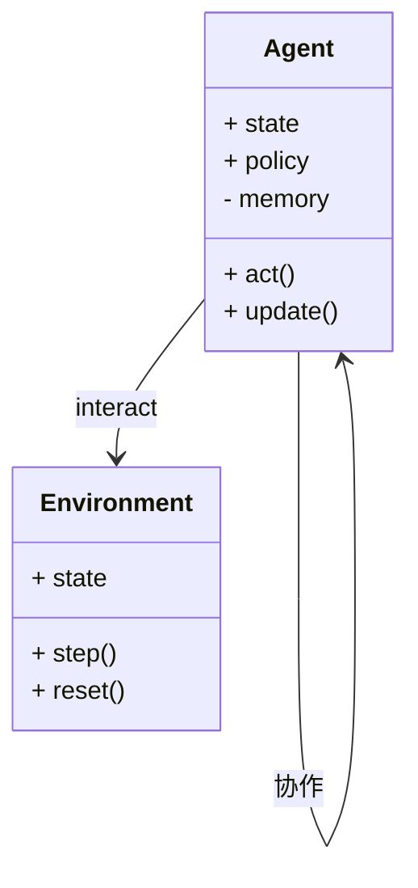
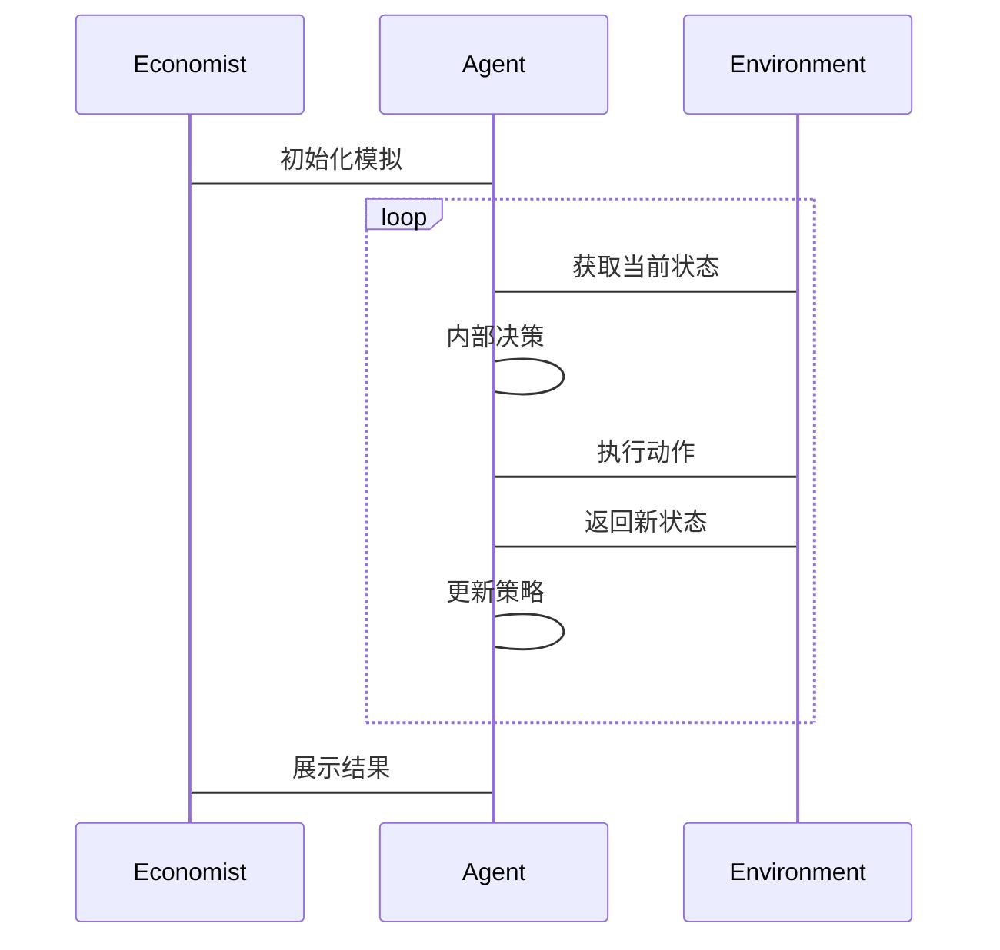

                 


# 利用AI agents进行全球宏观经济情景模拟：增强风险管理

> 关键词：AI agents, 宏观经济模拟, 风险管理, 多智能体协作, 经济预测, 生成模型, 强化学习

> 摘要：本文探讨了利用AI agents进行全球宏观经济情景模拟的方法，分析了其在风险管理中的应用，详细讲解了AI agents的核心原理、算法实现及系统架构设计，并通过实际案例展示了如何通过AI技术增强经济风险管理能力。

---

## 第一部分: 背景介绍

### 第1章: 全球宏观经济情景模拟的背景与挑战

#### 1.1 宏观经济模拟的核心概念
##### 1.1.1 宏观经济模拟的定义与范围
宏观经济模拟是一种通过数学模型和计算机技术，对经济系统中各种变量及其相互关系进行模拟和预测的方法。其范围涵盖GDP、失业率、通货膨胀率、国际贸易等宏观指标。

##### 1.1.2 宏观经济模拟的复杂性与挑战
- 宏观经济系统的非线性特征：经济变量之间的关系复杂，难以用简单的线性模型描述。
- 数据的高维性：涉及大量经济指标和变量，数据处理难度大。
- 不确定性：经济预测受多种随机因素影响，如政策变化、自然灾害等。

##### 1.1.3 宏观经济模拟的边界与外延
- 边界：明确模拟的范围和变量，避免过于复杂。
- 外延：宏观经济模拟的应用范围，包括政策制定、企业决策等。

#### 1.2 AI agents在宏观经济模拟中的作用
##### 1.2.1 AI agents的基本定义
AI agents是具有感知环境和自主决策能力的智能体，能够通过数据驱动的方式进行学习和优化。

##### 1.2.2 AI agents在宏观经济分析中的优势
- 自适应性：能够根据环境变化调整策略。
- 多智能体协作：通过协作提高模拟的准确性和鲁棒性。
- 高维数据处理能力：能够处理海量数据，发现复杂模式。

##### 1.2.3 AI agents与传统宏观经济模型的对比
- 传统模型：基于假设和简化，可能无法捕捉复杂现实。
- AI agents：基于数据驱动，能够发现复杂非线性关系。

---

### 第2章: 全球宏观经济情景模拟的必要性

#### 2.1 当前全球经济环境的不确定性
##### 2.1.1 经济全球化与逆全球化的双重影响
全球化促进了经济一体化，但也带来了新的风险，如供应链中断。

##### 2.1.2 数字经济与绿色经济的转型趋势
数字经济和绿色经济的兴起，改变了传统的经济模式，带来了新的挑战和机会。

##### 2.1.3 地缘政治风险与经济波动的关联
地缘政治冲突可能引发经济波动，如能源危机、贸易限制等。

#### 2.2 增强风险管理的迫切需求
##### 2.2.1 传统风险管理的局限性
- 传统模型可能无法捕捉复杂的风险因素。
- 风险预测的准确性有限，难以应对突发性事件。

##### 2.2.2 全球化背景下风险管理的新挑战
- 全球化导致风险的跨国传播，增加了风险管理的难度。
- 数字化和绿色化转型带来了新的风险因素。

##### 2.2.3 增强风险管理的必要性与目标
- 提高风险预测的准确性。
- 增强应对突发性事件的能力。
- 优化资源配置，降低风险敞口。

---

## 第二部分: 核心概念与联系

### 第3章: AI agents的核心原理

#### 3.1 AI agents的定义与分类
##### 3.1.1 AI agents的基本定义
AI agents是具有感知、决策和行动能力的智能体，能够与环境进行交互。

##### 3.1.2 基于AI agents的分类体系
- 按智能性分类：反应式、认知式。
- 按应用场景分类：服务型、监控型。

##### 3.1.3 AI agents与传统算法的区别
- 传统算法：基于规则和假设，难以应对复杂场景。
- AI agents：基于数据驱动，具有自主学习和决策能力。

#### 3.2 宏观经济模拟中的AI agents特性
##### 3.2.1 自适应性与学习能力
AI agents能够根据环境变化调整策略，适应新的经济形势。

##### 3.2.2 多智能体协作机制
通过多智能体协作，模拟复杂的经济系统，提高模拟的准确性和鲁棒性。

##### 3.2.3 高维数据处理能力
AI agents能够处理海量数据，发现复杂模式，为宏观经济模拟提供支持。

---

### 第4章: 宏观经济情景模拟的核心要素

#### 4.1 宏观经济模型的构建
##### 4.1.1 宏观经济模型的层次结构
- 微观层面：个体行为。
- 中观层面：行业和市场。
- 宏观层面：整体经济指标。

##### 4.1.2 模型参数的选择与优化
通过数据驱动的方式，选择最优参数，提高模型的准确性。

##### 4.1.3 模型的验证与校准
通过历史数据验证模型，调整参数，确保模型的准确性和可靠性。

#### 4.2 AI agents在宏观经济模拟中的角色
##### 4.2.1 数据采集与处理
AI agents能够实时采集和处理经济数据，为模型提供支持。

##### 4.2.2 模型构建与优化
通过AI agents的学习能力，优化宏观经济模型，提高预测准确性。

##### 4.2.3 情景生成与分析
AI agents能够生成多种经济情景，分析其影响，为决策提供支持。

---

## 第三部分: 算法原理讲解

### 第5章: 宏观经济情景模拟的算法框架

#### 5.1 基于生成模型的宏观经济模拟
##### 5.1.1 生成模型的基本原理
生成模型（Generative Models）通过学习数据分布，生成新的数据样本。

##### 5.1.2 生成模型在宏观经济模拟中的应用
- 经济数据生成：生成新的经济数据，用于模型验证和情景分析。
- 情景模拟：生成多种经济情景，分析其影响。

##### 5.1.3 生成模型的优缺点分析
- 优点：能够捕捉复杂数据分布，生成多样化的经济情景。
- 缺点：生成的数据可能缺乏物理意义，需要结合领域知识进行调整。

#### 5.2 基于强化学习的AI agents设计
##### 5.2.1 强化学习的基本原理
强化学习（Reinforcement Learning）通过智能体与环境的交互，学习最优策略。

##### 5.2.2 强化学习在宏观经济模拟中的应用
- 智能体决策：模拟经济主体的决策过程，如企业投资、消费者行为。
- 策略优化：通过强化学习优化经济政策，提高经济系统的稳定性。

##### 5.2.3 强化学习的数学模型和公式
- 状态空间：S
- 行动空间：A
- 奖励函数：R(s, a)
- 动态模型：P(s'|s, a)

##### 5.2.4 强化学习的代码实现
```python
class Agent:
    def __init__(self, state_space, action_space):
        self.state_space = state_space
        self.action_space = action_space
        # 初始化策略网络
        self.policy = PolicyNetwork(state_space, action_space)
    
    def act(self, state):
        # 根据策略网络选择动作
        action = self.policy.act(state)
        return action
    
    def update(self, transition):
        # 更新策略网络
        self.policy.update(transition)
```

---

### 第6章: AI agents在宏观经济模拟中的系统设计

#### 6.1 系统功能设计
##### 6.1.1 领域模型设计
- 使用Mermaid类图展示系统中的各个角色及其关系。


##### 6.1.2 系统架构设计
- 使用Mermaid架构图展示系统的整体架构。
```mermaid
architectural
    participant Agent as AI Agent
    participant Environment as Economic System
    participant Database as Economic Database
    participant User as Economist
    Agent --> Database: 数据采集
    Agent --> Environment: 模拟运行
    Agent --> User: 结果展示
```

##### 6.1.3 接口和交互设计
- 使用Mermaid序列图展示系统交互过程。


---

### 第7章: 项目实战

#### 7.1 环境安装
- 安装必要的库：TensorFlow、Keras、OpenAI Gym等。

#### 7.2 系统核心实现
##### 7.2.1 数据处理模块
```python
import pandas as pd

class DataProcessor:
    def __init__(self, data_path):
        self.data = pd.read_csv(data_path)
    
    def preprocess(self):
        # 数据清洗和预处理
        self.data = self.data.dropna()
        self.data = self.data[self.data['year'] >= 2000]
        return self.data
```

##### 7.2.2 模型构建模块
```python
import tensorflow as tf
from tensorflow.keras import layers

def build_model(input_dim):
    model = tf.keras.Sequential()
    model.add(layers.Dense(64, activation='relu', input_dim=input_dim))
    model.add(layers.Dense(32, activation='relu'))
    model.add(layers.Dense(1, activation='linear'))
    model.compile(optimizer='adam', loss='mse')
    return model
```

##### 7.2.3 模拟运行模块
```python
class EconomicSimulator:
    def __init__(self, model, environment):
        self.model = model
        self.environment = environment
    
    def run_simulation(self, steps=100):
        for _ in range(steps):
            state = self.environment.get_state()
            action = self.model.act(state)
            next_state, reward = self.environment.step(action)
            self.model.update(transition=(state, action, reward, next_state))
            self.environment.render(state)
```

#### 7.3 案例分析
##### 7.3.1 数据准备
- 数据来源：历史经济数据，包括GDP、失业率、通胀率等。

##### 7.3.2 模型训练
- 使用历史数据训练生成模型和强化学习模型。

##### 7.3.3 模拟运行
- 设置不同的经济情景，运行模拟，观察结果。

##### 7.3.4 结果分析
- 对比不同模型的预测结果，评估模型的准确性。

#### 7.4 项目小结
- 项目实现的关键点：数据处理、模型构建、模拟运行。
- 项目的意义：展示了AI agents在宏观经济模拟中的应用潜力。

---

## 第四部分: 总结与展望

### 第8章: 总结与展望

#### 8.1 内容回顾
- 宏观经济模拟的重要性。
- AI agents的核心原理和优势。
- 算法实现和系统设计的关键点。

#### 8.2 最佳实践 tips
- 数据质量：确保数据的准确性和完整性。
- 模型选择：根据具体问题选择合适的模型和算法。
- 模拟场景：设计合理的经济情景，确保模拟的有意义。

#### 8.3 注意事项
- 模型的局限性：生成的数据可能缺乏物理意义。
- 数据隐私：处理敏感经济数据时，需要注意隐私保护。

#### 8.4 拓展阅读
- 推荐相关书籍和论文，深入学习AI agents和宏观经济模拟的知识。

---

## 作者

作者：AI天才研究院/AI Genius Institute & 禅与计算机程序设计艺术 /Zen And The Art of Computer Programming

---

通过本文，我们详细探讨了利用AI agents进行全球宏观经济情景模拟的方法，分析了其在风险管理中的应用，并通过实际案例展示了如何通过AI技术增强经济风险管理能力。希望本文能为相关领域的研究者和实践者提供有价值的参考和启发。

