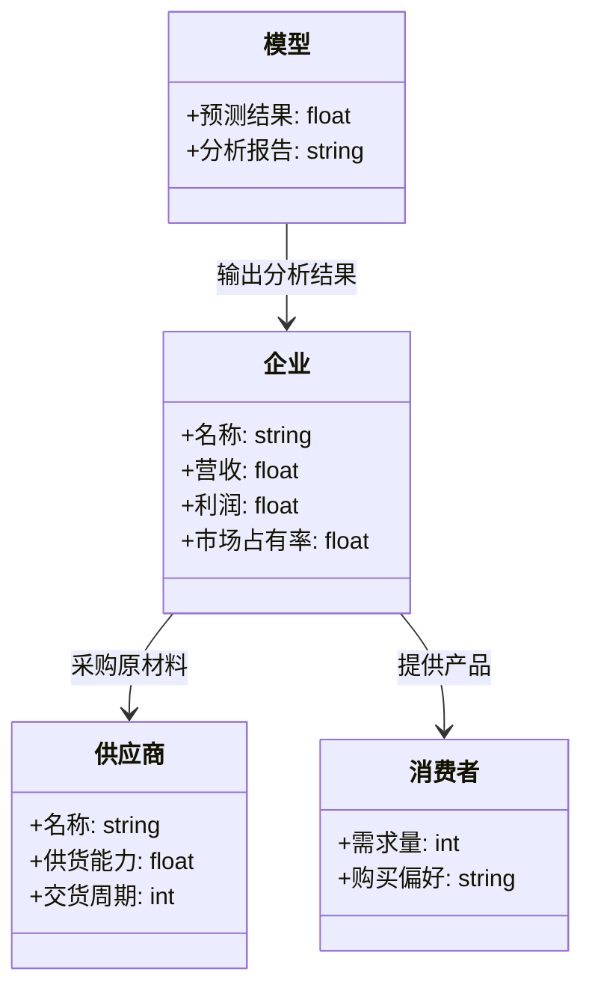
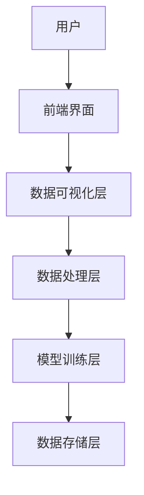
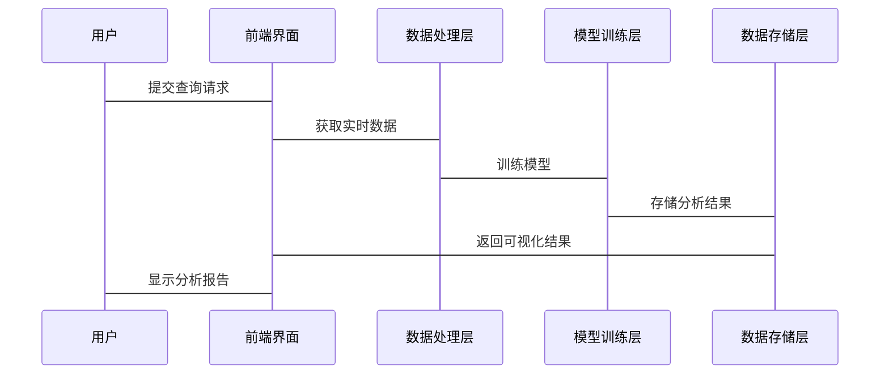

                 


# 利用AI构建自适应型产业链分析模型：全面把握公司地位

**关键词**：产业链分析，人工智能，自适应模型，企业定位，数据分析

**摘要**：  
随着全球化的深入和产业的不断变革，企业需要更高效、更精准的工具来分析其在产业链中的地位和竞争优势。本文将介绍如何利用人工智能构建自适应型产业链分析模型，通过实时数据处理和动态调整，帮助企业全面把握市场动态和自身定位。文章从背景介绍、核心概念、算法原理、系统架构到项目实战，逐步分析构建这一模型的全过程。

---

# 第一部分: 产业链分析与AI的结合

## # 第1章: 产业链分析模型的背景与意义

### ## 1.1 产业链分析的背景

#### ### 1.1.1 产业链的基本概念  
产业链是指从原材料供应到产品最终交付给消费者的整个过程中的各个产业环节的集合。它包括上游供应商、制造企业、分销渠道和终端消费者等多方参与者。

#### ### 1.1.2 产业链分析的重要性  
企业需要了解自身在产业链中的位置，分析上下游合作伙伴的能力与风险，优化资源配置，提升竞争力。传统产业链分析依赖人工数据整理和经验判断，效率低且难以实时更新。

#### ### 1.1.3 AI在产业链分析中的应用前景  
人工智能技术的快速发展为产业链分析提供了新的工具。通过机器学习、自然语言处理和知识图谱等技术，企业可以更高效地处理海量数据，发现潜在的市场机会和风险。

### ## 1.2 自适应型产业链分析模型的提出

#### ### 1.2.1 传统产业链分析的局限性  
传统产业链分析方法存在以下问题：  
1. 数据分散且更新不及时。  
2. 分析结果静态，无法适应市场变化。  
3. 需要大量人工参与，效率低下。  

#### ### 1.2.2 自适应型模型的核心优势  
自适应型产业链分析模型通过实时数据处理和动态调整，能够：  
1. 自动采集和整合多源数据。  
2. 实时更新分析结果，适应市场变化。  
3. 提供动态的可视化报告，帮助企业快速决策。  

#### ### 1.2.3 模型的目标与应用场景  
模型目标：  
- 实时监测产业链各环节的动态变化。  
- 分析企业与竞争对手的优劣势。  
- 提供数据驱动的决策支持。  

应用场景：  
- 企业战略规划与投资决策。  
- 供应链优化与风险管理。  
- 行业趋势分析与市场进入策略。  

### ## 1.3 本章小结  
本章介绍了产业链分析的背景与意义，指出了传统分析方法的局限性，并提出了自适应型产业链分析模型的核心优势和应用场景。

---

## # 第2章: 自适应型产业链分析模型的核心概念

### ## 2.1 产业链分析模型的基本原理

#### ### 2.1.1 数据流与信息处理流程  
自适应型产业链分析模型的数据流包括以下步骤：  
1. **数据采集**：从公开数据源、企业内部系统和第三方API获取数据。  
2. **数据清洗**：去除噪声数据，确保数据质量。  
3. **特征提取**：提取关键指标，如成本、利润率、市场占有率等。  
4. **模型训练**：基于机器学习算法，训练模型预测产业链变化。  
5. **动态调整**：根据实时数据更新模型，持续优化分析结果。  

#### ### 2.1.2 模型的自适应机制  
模型通过以下方式实现自适应：  
1. **在线学习**：实时更新模型参数，适应数据变化。  
2. **反馈机制**：根据用户反馈调整分析结果的展示方式。  
3. **异常检测**：识别数据中的异常值，减少错误分析。  

#### ### 2.1.3 多维度数据融合方法  
模型整合以下多维度数据：  
1. **文本数据**：行业报告、新闻资讯。  
2. **结构化数据**：企业财务数据、供应链信息。  
3. **非结构化数据**：社交媒体评论、图像数据。  

### ## 2.2 产业链实体关系分析

#### ### 2.2.1 产业链中的主要实体  
- 上游供应商：提供原材料或零部件的企业。  
- 中游制造商：负责产品生产的企业。  
- 下游分销商：负责产品销售的渠道。  
- 终端消费者：最终产品用户。  

#### ### 2.2.2 实体间的关系与依赖  
- 供应商与制造商的关系：供应商提供原材料，制造商支付货款。  
- 制造商与分销商的关系：制造商提供产品，分销商负责销售。  
- 消费者与分销商的关系：消费者购买产品，分销商获得收入。  

#### ### 2.2.3 ER实体关系图  
以下是一个简化的ER实体关系图：

```mermaid
er
actor: Actor [总经理]
participant: Participant [部门]
goal: Goal [目标]
relation: 关系
```

### ## 2.3 模型的核心算法与流程

#### ### 2.3.1 数据预处理与特征提取  
- 数据清洗：去除缺失值和重复值。  
- 特征提取：提取企业的营收、利润、市场占有率等关键指标。  

#### ### 2.3.2 自适应算法的实现  
- 使用基于时间序列的机器学习算法（如LSTM）进行预测。  
- 根据实时数据动态调整模型参数。  

#### ### 2.3.3 模型的优化与调参  
- 通过交叉验证选择最优模型参数。  
- 使用网格搜索优化模型性能。  

### ## 2.4 本章小结  
本章详细介绍了自适应型产业链分析模型的核心概念，包括数据流、自适应机制和多维度数据融合方法，并通过ER实体关系图展示了产业链中的主要实体及其关系。

---

## # 第3章: 自适应型产业链分析模型的算法原理

### ## 3.1 数据预处理与特征提取

#### ### 3.1.1 数据清洗与标准化  
- 数据清洗：去除无效数据，填充缺失值。  
- 数据标准化：将数据归一化处理，便于模型训练。  

#### ### 3.1.2 特征选择与降维  
- 特征选择：使用相关性分析选择重要特征。  
- 降维：使用主成分分析（PCA）降低数据维度。  

#### ### 3.1.3 时间序列数据的处理  
- 使用LSTM网络处理时间序列数据。  
- 通过滑动窗口方法提取时间特征。  

### ## 3.2 自适应算法的实现

#### ### 3.2.1 基于机器学习的自适应方法  
- 使用随机森林算法进行分类和回归分析。  
- 通过在线学习算法（如SGD）实现模型实时更新。  

#### ### 3.2.2 基于深度学习的自适应模型  
- 使用LSTM网络预测未来市场趋势。  
- 通过注意力机制捕捉关键市场信号。  

#### ### 3.2.3 混合模型的构建与优化  
- 结合机器学习和深度学习模型，构建混合模型。  
- 通过超参数优化提升模型性能。  

### ## 3.3 数学模型与公式

#### ### 3.3.1 优化目标函数  
目标是最小化预测误差，优化函数如下：  
$$ \text{目标函数} = \min_{\theta} \sum_{i=1}^{n} (y_i - f(x_i, \theta))^2 $$  

#### ### 3.3.2 损失函数  
使用均方误差作为损失函数：  
$$ \text{损失函数} = \frac{1}{2n} \sum_{i=1}^{n} (y_i - f(x_i))^2 $$  

### ## 3.4 本章小结  
本章详细介绍了自适应型产业链分析模型的算法原理，包括数据预处理、自适应算法和数学模型的实现。

---

## # 第4章: 系统分析与架构设计方案

### ## 4.1 问题场景介绍  
企业需要实时监控产业链动态，快速响应市场变化。  

### ## 4.2 系统功能设计  

#### ### 4.2.1 领域模型设计  
以下是领域模型的类图：  



#### ### 4.2.2 系统架构设计  
以下是系统架构图：  



#### ### 4.2.3 接口设计  
系统接口包括：  
1. 数据接口：从第三方API获取数据。  
2. 用户接口：提供数据分析结果的可视化界面。  
3. 模型接口：支持模型的训练和更新。  

#### ### 4.2.4 交互流程  
以下是交互流程图：  



### ## 4.3 本章小结  
本章详细介绍了系统分析与架构设计方案，包括领域模型设计、系统架构图、接口设计和交互流程。

---

## # 第5章: 项目实战

### ## 5.1 环境安装与数据收集

#### ### 5.1.1 环境安装  
安装Python、Pandas、Scikit-learn、TensorFlow等工具包。  

#### ### 5.1.2 数据收集  
从公开数据源（如公司财报、新闻网站）获取产业链相关数据。  

### ## 5.2 系统核心实现

#### ### 5.2.1 数据预处理  
```python
import pandas as pd

# 读取数据
data = pd.read_csv('data.csv')

# 数据清洗
data.dropna()
data = data[~data.duplicated()]
```

#### ### 5.2.2 模型实现  
```python
import tensorflow as tf
from tensorflow.keras import layers

# 构建LSTM模型
model = tf.keras.Sequential()
model.add(layers.LSTM(64, input_shape=(timesteps, features)))
model.add(layers.Dense(1))
model.compile(optimizer='adam', loss='mean_squared_error')
```

### ## 5.3 实际案例分析

#### ### 5.3.1 案例背景  
假设我们分析一家制造企业的产业链地位。  

#### ### 5.3.2 数据分析与结果展示  
- 数据可视化：使用Matplotlib绘制市场趋势图。  
- 模型预测：预测未来季度的市场趋势。  

### ## 5.4 项目小结  
本章通过一个实际案例展示了自适应型产业链分析模型的实现过程，包括环境安装、数据收集、模型实现和案例分析。

---

## # 第6章: 最佳实践与总结

### ## 6.1 小结  
本文详细介绍了自适应型产业链分析模型的构建过程，包括背景、核心概念、算法原理、系统架构和项目实战。

### ## 6.2 注意事项  
- 数据来源的可靠性需要严格控制。  
- 模型的实时更新需要高效的计算资源支持。  

### ## 6.3 拓展阅读  
- 《机器学习实战》  
- 《深度学习入门：基于Python和TensorFlow》  

### ## 6.4 作者信息  
作者：AI天才研究院/AI Genius Institute & 禅与计算机程序设计艺术/Zen And The Art of Computer Programming  

---

# 结语  
通过构建自适应型产业链分析模型，企业可以实时掌握市场动态，优化资源配置，提升竞争力。希望本文的内容能够为读者提供有价值的参考和启发。

