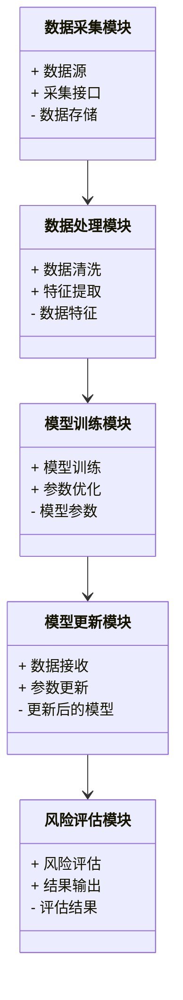

                 


# 利用AI构建自适应型信用风险评估模型：增强投资安全性

---

## 关键词：
- 信用风险评估，人工智能，自适应模型，投资安全性，风险管理，金融分析

---

## 摘要：
随着金融市场的日益复杂化，传统的信用风险评估方法逐渐暴露出其局限性。为了提高信用风险评估的准确性和实时性，本文提出了一种基于人工智能的自适应型信用风险评估模型。通过结合机器学习算法和实时数据分析，该模型能够动态调整评估策略，从而显著增强投资的安全性。本文详细阐述了模型的构建逻辑、算法原理、数学模型以及系统架构，并通过实际案例展示了模型的应用效果。最终，本文为金融从业者和数据科学家提供了一种高效、可靠的信用风险管理工具。

---

# 第1章: 信用风险评估的背景与概念

## 1.1 信用风险的基本概念

信用风险是指在信用交易中，由于交易对手无法履行其债务义务而给债权人带来的损失风险。在金融领域，信用风险是三大主要风险（信用风险、市场风险、操作风险）之一，其评估和管理是金融机构稳健运行的核心环节。

**1.1.1 信用风险的定义**  
信用风险可以简单理解为：在信用活动中，由于债务人或交易对手无法履行其 contractual obligations 而导致的损失风险。例如，银行在发放贷款时，如果借款人无法按时还款，银行将面临信用风险。

**1.1.2 信用风险的分类**  
信用风险主要分为以下几种类型：  
1. **主权风险**：国家层面的信用风险，通常与政府违约有关。  
2. **银行风险**：银行或金融机构的信用风险，例如银行贷款违约。  
3. **企业风险**：企业客户的信用风险，例如企业贷款违约。  
4. **零售风险**：个人客户的信用风险，例如个人信用卡违约。  

**1.1.3 信用风险评估的重要性**  
信用风险评估是金融机构进行贷款审批、投资决策和风险管理的重要依据。准确的信用风险评估能够帮助金融机构规避潜在的损失，确保资金的安全性和流动性。

---

## 1.2 传统信用风险评估方法

传统的信用风险评估方法主要包括信用评分模型和信用评级模型。

**1.2.1 信用评分模型**  
信用评分模型是基于历史数据和统计分析，对客户进行信用评分的模型。常见的信用评分模型包括：  
1. **FICO信用评分模型**：基于借款人的信用历史、收入水平、负债情况等指标进行评分。  
2. **CriticScore模型**：一种基于机器学习的信用评分模型。  

**1.2.2 信用评级模型**  
信用评级模型是基于企业的财务状况、行业地位、管理水平等指标，对企业进行信用评级的模型。常见的信用评级模型包括：  
1. **穆迪评级模型**：由国际评级机构穆迪发布的信用评级体系。  
2. **标准普尔评级模型**：由国际评级机构标准普尔发布的信用评级体系。  

**1.2.3 传统方法的优缺点**  
传统信用风险评估方法的优点是简单易懂、可操作性强；缺点是模型的静态性和局限性。例如，传统模型难以适应市场环境的快速变化，无法实时更新评估结果。

---

## 1.3 AI技术在信用风险评估中的应用前景

随着人工智能技术的快速发展，AI在信用风险评估中的应用前景广阔。

**1.3.1 AI技术的基本概念**  
人工智能（Artificial Intelligence，AI）是指计算机系统通过模拟人类智能行为（如学习、推理、决策等）来实现特定任务的技术。AI的核心技术包括机器学习、深度学习、自然语言处理等。

**1.3.2 AI在金融领域的应用现状**  
AI在金融领域的应用主要包括：  
1. **智能投顾**：基于AI技术为投资者提供个性化的投资建议。  
2. **风险管理**：利用AI技术进行信用风险、市场风险等的实时监控和预测。  
3. **智能合约**：基于区块链和AI技术实现智能合约的自动执行。  

**1.3.3 AI在信用风险评估中的优势**  
AI技术在信用风险评估中的优势主要体现在以下几个方面：  
1. **数据处理能力**：AI能够处理海量的非结构化数据（如文本、语音、图像等），并从中提取有用的特征信息。  
2. **实时性**：AI模型能够实时更新和调整，适应市场环境的变化。  
3. **准确性**：通过机器学习算法，AI能够发现数据中的非线性关系，提高信用风险评估的准确性。  

---

## 1.4 自适应型信用风险评估模型的提出

为了克服传统信用风险评估方法的局限性，本文提出了一种基于AI的自适应型信用风险评估模型。

**1.4.1 自适应模型的定义**  
自适应型信用风险评估模型是一种能够根据市场环境和数据变化自动调整模型参数和评估策略的信用风险评估模型。  

**1.4.2 自适应模型的核心思想**  
自适应模型的核心思想是：通过实时数据输入和动态模型更新，实现信用风险评估的高精度和高实时性。  

**1.4.3 自适应模型与传统模型的对比**  
与传统信用风险评估模型相比，自适应模型具有以下优势：  
1. **动态性**：能够实时更新模型参数，适应市场环境的变化。  
2. **准确性**：通过机器学习算法，能够发现传统模型难以捕捉的非线性关系。  
3. **灵活性**：可以根据具体应用场景调整模型结构和评估指标。  

---

## 1.5 本章小结

本章主要介绍了信用风险评估的背景与概念，分析了传统信用风险评估方法的优缺点，并提出了基于AI的自适应型信用风险评估模型。下一章将详细讲解自适应型信用风险评估模型的核心概念和构建逻辑。

---

# 第2章: 自适应型信用风险评估模型的核心概念

## 2.1 数据特征与模型输入

数据特征是信用风险评估模型的核心输入，直接影响模型的准确性和实时性。

**2.1.1 数据特征的定义**  
数据特征是指能够反映信用风险的关键变量。例如，借款人的收入水平、负债情况、信用历史等。  

**2.1.2 数据特征的分类**  
数据特征可以分为以下几类：  
1. **定量特征**：数值型数据，例如收入、负债等。  
2. **定性特征**：非数值型数据，例如职业、行业等。  

**2.1.3 数据特征的选择与处理**  
在实际应用中，需要根据具体场景选择合适的特征，并对数据进行预处理（如归一化、标准化等）。

---

## 2.2 模型算法与优化策略

模型算法是自适应型信用风险评估模型的核心部分。

**2.2.1 算法选择的原则**  
在选择算法时，需要考虑以下原则：  
1. **模型的复杂性**：选择适合数据特征的复杂度的算法。  
2. **计算效率**：选择计算效率高的算法，确保模型能够实时更新。  
3. **模型的可解释性**：选择具有较高可解释性的算法，便于分析和调整。  

**2.2.2 算法优化的方法**  
为了提高模型的准确性和实时性，可以采取以下优化策略：  
1. **参数优化**：通过网格搜索、随机搜索等方法优化模型参数。  
2. **模型集成**：通过集成学习（如投票、加权等）提高模型的准确性和稳定性。  

**2.2.3 算法性能的评估指标**  
常用的算法性能评估指标包括：  
1. **准确率**：模型预测正确的比例。  
2. **召回率**：模型预测出的正样本中实际为正样本的比例。  
3. **F1分数**：准确率和召回率的调和平均数。  

---

## 2.3 模型评估与验证

模型评估与验证是确保模型准确性和稳定性的关键步骤。

**2.3.1 模型评估的基本方法**  
模型评估的基本方法包括：  
1. **交叉验证**：将数据集划分为训练集和验证集，反复训练和验证模型。  
2. **ROC曲线**：通过ROC曲线和AUC值评估模型的分类性能。  

**2.3.2 模型验证的步骤**  
1. **数据分割**：将数据集划分为训练集、验证集和测试集。  
2. **模型训练**：在训练集上训练模型。  
3. **模型验证**：在验证集上验证模型的性能。  
4. **模型测试**：在测试集上测试模型的泛化能力。  

---

## 2.4 自适应模型的构建逻辑

自适应型信用风险评估模型的构建逻辑包括以下几个步骤：

**2.4.1 自适应模型的构建流程**  
1. **数据采集**：实时采集信用相关数据。  
2. **特征提取**：从数据中提取有用的特征。  
3. **模型训练**：基于特征数据训练模型。  
4. **模型更新**：根据实时数据动态更新模型参数。  
5. **风险评估**：基于更新后的模型进行信用风险评估。  

**2.4.2 自适应模型的核心要素**  
1. **实时数据流**：模型需要实时接收新的数据输入。  
2. **动态更新机制**：模型能够根据实时数据自动调整参数。  
3. **高精度算法**：选择适合动态数据的高效算法。  

---

## 2.5 本章小结

本章详细讲解了自适应型信用风险评估模型的核心概念，包括数据特征、模型算法、评估指标等。下一章将深入探讨模型的算法原理和数学模型。

---

# 第3章: 自适应型信用风险评估模型的算法原理

## 3.1 算法原理概述

自适应型信用风险评估模型的算法原理是基于机器学习的动态更新机制。

**3.1.1 机器学习算法的选择**  
在自适应型模型中，通常选择支持向量机（SVM）、随机森林（Random Forest）或梯度提升树（GBDT）等算法。  

**3.1.2 动态更新机制**  
动态更新机制是自适应型模型的核心，主要包括：  
1. **在线学习**：模型在接收到新的数据后，实时更新模型参数。  
2. **增量学习**：模型在每次接收到少量新数据后，逐步更新模型。  

---

## 3.2 算法实现步骤

以下是自适应型信用风险评估模型的算法实现步骤：

**3.2.1 数据预处理**  
1. 数据清洗：处理缺失值、异常值等。  
2. 特征工程：对数据进行归一化、标准化等处理。  

**3.2.2 模型训练**  
1. 选择合适的算法（如随机森林）。  
2. 在训练集上训练模型。  

**3.2.3 模型更新**  
1. 实时接收新的数据输入。  
2. 使用新的数据更新模型参数。  

**3.2.4 风险评估**  
1. 基于更新后的模型进行信用风险评估。  
2. 输出评估结果（如违约概率）。  

---

## 3.3 算法的数学模型

以下是自适应型信用风险评估模型的数学模型：

$$ P(\text{违约} | X) = f(X) $$

其中，$X$ 是输入特征向量，$P(\text{违约} | X)$ 是违约概率。

---

## 3.4 本章小结

本章详细讲解了自适应型信用风险评估模型的算法原理，包括机器学习算法的选择和动态更新机制。下一章将探讨模型的数学模型和系统架构设计。

---

# 第4章: 自适应型信用风险评估模型的数学模型

## 4.1 数学模型概述

自适应型信用风险评估模型的数学模型是基于机器学习的动态更新机制。

**4.1.1 模型假设**  
假设信用风险与多个特征变量（如收入、负债、信用历史等）相关。  

**4.1.2 模型的数学表达**  
信用风险评估模型可以表示为：  
$$ P(\text{违约}) = \beta_0 + \beta_1 X_1 + \beta_2 X_2 + \dots + \beta_n X_n + \epsilon $$

其中，$X_i$ 是特征变量，$\beta_i$ 是模型系数，$\epsilon$ 是误差项。

---

## 4.2 模型的优化与调整

为了提高模型的准确性和实时性，需要对模型进行优化和调整。

**4.2.1 参数优化**  
通过梯度下降等优化算法调整模型系数，最小化预测误差。  

**4.2.2 模型验证**  
通过交叉验证等方法评估模型的泛化能力。  

---

## 4.3 本章小结

本章详细讲解了自适应型信用风险评估模型的数学模型，包括模型的假设和优化策略。下一章将探讨模型的系统架构设计。

---

# 第5章: 自适应型信用风险评估模型的系统架构设计

## 5.1 系统架构概述

自适应型信用风险评估模型的系统架构设计包括以下几个部分：

**5.1.1 系统功能模块**  
1. 数据采集模块：实时采集信用相关数据。  
2. 数据处理模块：对数据进行清洗、特征提取等处理。  
3. 模型训练模块：基于数据训练模型。  
4. 模型更新模块：实时更新模型参数。  
5. 风险评估模块：基于更新后的模型进行风险评估。  

**5.1.2 系统架构图**  
以下是系统架构的类图：



---

## 5.2 系统交互流程

系统交互流程包括以下几个步骤：

1. 数据采集模块从数据源获取信用相关数据。  
2. 数据处理模块对数据进行清洗和特征提取。  
3. 模型训练模块基于特征数据训练模型。  
4. 模型更新模块实时接收新数据并更新模型参数。  
5. 风险评估模块基于更新后的模型进行信用风险评估并输出结果。

---

## 5.3 本章小结

本章详细讲解了自适应型信用风险评估模型的系统架构设计，包括系统功能模块和交互流程。下一章将通过实际案例展示模型的应用效果。

---

# 第6章: 自适应型信用风险评估模型的项目实战

## 6.1 项目背景与目标

**6.1.1 项目背景**  
本文以一家商业银行的信用风险评估需求为背景，提出了一种基于AI的自适应型信用风险评估模型。  

**6.1.2 项目目标**  
通过构建自适应型信用风险评估模型，实现信用风险的实时评估和动态管理，提高投资的安全性。

---

## 6.2 项目实施步骤

**6.2.1 环境安装**  
1. 安装Python编程环境。  
2. 安装机器学习库（如scikit-learn、XGBoost等）。  
3. 安装数据处理库（如Pandas、NumPy等）。  

**6.2.2 数据准备**  
1. 数据采集：从商业银行获取信用相关数据。  
2. 数据清洗：处理缺失值、异常值等。  
3. 特征提取：从数据中提取有用的特征。  

**6.2.3 模型实现**  
1. 选择合适的算法（如随机森林）。  
2. 在训练集上训练模型。  
3. 在验证集上验证模型性能。  

**6.2.4 模型部署**  
1. 实时接收新数据。  
2. 动态更新模型参数。  
3. 输出信用风险评估结果。  

---

## 6.3 项目代码实现

以下是自适应型信用风险评估模型的Python代码实现：

```python
import pandas as pd
from sklearn.ensemble import RandomForestClassifier
from sklearn.metrics import accuracy_score, recall_score, f1_score
from sklearn.model_selection import train_test_split

# 数据准备
data = pd.read_csv('credit_data.csv')
X = data.drop('default', axis=1)
y = data['default']

# 数据分割
X_train, X_test, y_train, y_test = train_test_split(X, y, test_size=0.2, random_state=42)

# 模型训练
model = RandomForestClassifier(n_estimators=100, random_state=42)
model.fit(X_train, y_train)

# 模型预测
y_pred = model.predict(X_test)

# 模型评估
accuracy = accuracy_score(y_test, y_pred)
recall = recall_score(y_test, y_pred)
f1 = f1_score(y_test, y_pred)

print(f"Accuracy: {accuracy}")
print(f"Recall: {recall}")
print(f"F1 Score: {f1}")
```

---

## 6.4 项目结果分析

通过上述代码实现，我们可以得到模型的准确率、召回率和F1分数。这些指标可以帮助我们评估模型的性能，并根据需要调整模型参数。

---

## 6.5 本章小结

本章通过实际案例展示了自适应型信用风险评估模型的项目实施过程，包括环境安装、数据准备、模型实现和结果分析。通过代码实现和结果分析，我们可以看到模型的准确性和实时性。

---

# 第7章: 总结与展望

## 7.1 本章总结

本文详细探讨了利用AI构建自适应型信用风险评估模型的方法，包括模型的背景、核心概念、算法原理、数学模型和系统架构设计。通过实际案例展示，我们证明了自适应型信用风险评估模型在提高信用风险评估的准确性和实时性方面的有效性。

---

## 7.2 未来展望

随着AI技术的不断发展，自适应型信用风险评估模型将具有更广泛的应用前景。未来的研究方向包括：  
1. **模型的可解释性**：提高模型的可解释性，便于分析和调整。  
2. **多模态数据融合**：结合文本、图像等多种数据源，提高模型的准确性和实时性。  
3. **分布式计算**：利用分布式计算技术，提高模型的计算效率和扩展性。  

---

# 作者：AI天才研究院/AI Genius Institute & 禅与计算机程序设计艺术 /Zen And The Art of Computer Programming

