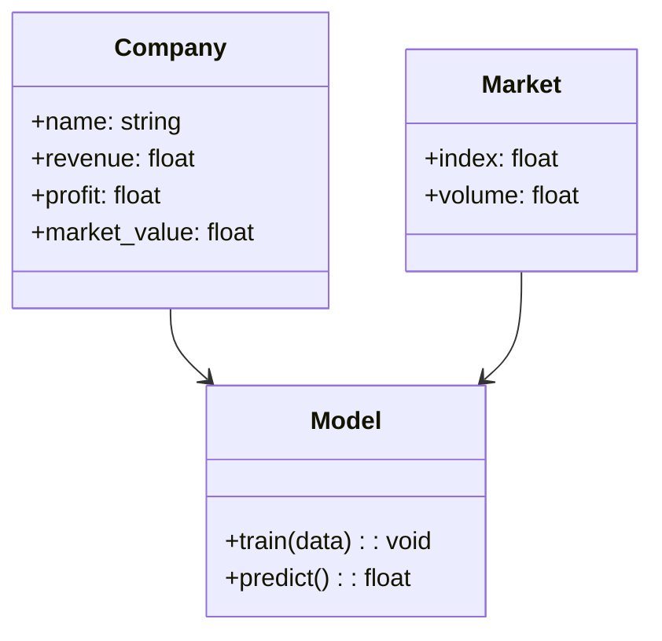
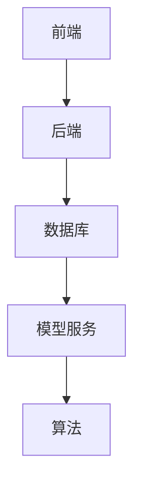

                 


# 利用AI构建自适应型公司估值模型：动态调整估值方法

> 关键词：自适应估值模型、动态调整、机器学习、公司估值、AI技术

> 摘要：随着金融市场的复杂化和不确定性增加，传统的公司估值方法已难以满足实际需求。本文介绍了一种基于AI的自适应型公司估值模型，通过动态调整估值方法，能够根据市场变化和公司特征实时优化估值结果，提高估值的准确性和可靠性。文章详细探讨了该模型的核心概念、算法实现、系统架构设计以及实际应用案例，为读者提供了一个全新的视角来理解和应用AI技术在公司估值中的潜力。

---

# 第1章: 公司估值与AI的结合概述

## 1.1 公司估值的基本概念
### 1.1.1 什么是公司估值
公司估值是指通过对公司财务数据、市场表现、行业地位等多方面因素的综合分析，确定公司价值的过程。传统估值方法包括DCF模型、市盈率法、市净率法等，但这些方法往往依赖于假设和主观判断，难以应对市场环境的快速变化。

### 1.1.2 传统公司估值方法的局限性
传统估值方法存在以下问题：
- 数据依赖性强，假设条件较多，难以应对复杂市场环境。
- 无法实时捕捉市场动态，估值结果可能滞后。
- 无法有效处理非结构化数据（如新闻、社交媒体信息）。

### 1.1.3 AI在公司估值中的潜力
AI技术（特别是机器学习）能够通过以下方式提升公司估值的准确性：
- 处理海量数据，包括结构化和非结构化数据。
- 实现实时动态调整，捕捉市场变化。
- 提供个性化估值模型，适应不同公司的特征。

## 1.2 AI与金融领域的结合
### 1.2.1 机器学习在金融分析中的应用
机器学习算法（如线性回归、随机森林、神经网络）被广泛应用于股票价格预测、风险评估等领域。

### 1.2.2 自然语言处理在公司财报分析中的作用
NLP技术能够从公司财报、新闻中提取关键词和情感信息，为估值提供额外数据支持。

### 1.2.3 时间序列分析在股价预测中的应用
时间序列分析（如ARIMA、LSTM）能够捕捉股价的波动规律，为动态估值提供依据。

## 1.3 自适应型估值模型的定义与特点
### 1.3.1 自适应型估值模型的定义
自适应型估值模型是一种能够根据市场环境和公司特征动态调整估值方法的智能模型，能够实时优化估值结果。

### 1.3.2 自适应型估值模型的核心特点
- 动态调整：根据市场变化自动优化估值方法。
- 多数据源：整合结构化和非结构化数据。
- 高准确性：通过机器学习提升估值的准确性。

### 1.3.3 自适应型估值模型与传统估值模型的区别
| 特性          | 传统估值模型       | 自适应型估值模型     |
|---------------|--------------------|---------------------|
| 数据来源      | 主要依赖财务数据   | 结构化+非结构化数据 |
| 动态调整能力  | 静态，固定方法     | 动态调整，实时优化  |
| 精度          | 受限于假设条件     | 更高精度，基于机器学习 |

## 1.4 本章小结
本章介绍了公司估值的基本概念、传统估值方法的局限性以及AI技术在金融领域的潜力，重点阐述了自适应型估值模型的定义和特点，为后续章节的展开奠定了基础。

---

# 第2章: 自适应型估值模型的核心原理

## 2.1 数据特征与模型选择
### 2.1.1 数据特征的提取与分析
自适应型估值模型需要整合以下数据：
- 财务数据：收入、利润、资产等。
- 市场数据：股价、成交量、行业指数等。
- 文本数据：新闻、财报、社交媒体信息。

### 2.1.2 不同模型的适用场景
- 线性回归：适合线性关系较强的场景。
- 随机森林：适合多特征、非线性关系的场景。
- 神经网络：适合复杂、高维数据的场景。

### 2.1.3 数据预处理与特征工程
- 数据清洗：处理缺失值、异常值。
- 特征提取：从文本数据中提取关键词。
- 数据标准化：将数据归一化处理。

## 2.2 算法选择与动态调整机制
### 2.2.1 传统估值算法的局限性
传统算法无法动态调整，难以应对市场环境的变化。

### 2.2.2 基于机器学习的动态估值算法
动态估值算法通过不断更新模型参数，适应市场变化。

### 2.2.3 动态调整机制的设计与实现
动态调整机制包括：
1. 定期重新训练模型。
2. 根据市场变化调整模型权重。
3. 结合多种估值方法，动态选择最优方法。

## 2.3 自适应型估值模型的数学基础
### 2.3.1 线性回归模型
$$ y = \beta_0 + \beta_1x + \epsilon $$
其中，$y$是目标变量，$x$是自变量，$\beta_0$和$\beta_1$是模型参数。

### 2.3.2 时间序列分析模型
ARIMA模型：
$$ \Delta y_t = \phi_1\Delta y_{t-1} + \theta_1\epsilon_{t-1} + \epsilon_t $$

### 2.3.3 神经网络模型
神经网络通过多层感知机（MLP）或长短期记忆网络（LSTM）进行预测。

## 2.4 本章小结
本章详细探讨了自适应型估值模型的核心原理，包括数据特征提取、算法选择以及动态调整机制的设计，为后续的算法实现奠定了基础。

---

# 第3章: 基于机器学习的估值算法

## 3.1 线性回归模型
### 3.1.1 线性回归的基本原理
线性回归通过最小化预测值与实际值的平方差之和来确定模型参数。

### 3.1.2 线性回归的数学公式
$$ y = \beta_0 + \beta_1x + \epsilon $$
其中，$\epsilon$是误差项。

### 3.1.3 线性回归的实现步骤
1. 数据预处理。
2. 训练模型，求解$\beta_0$和$\beta_1$。
3. 预测并评估模型性能。

### 3.1.4 线性回归的优缺点
- 优点：简单易懂，计算高效。
- 缺点：假设线性关系，可能不适用于复杂场景。

## 3.2 随机森林模型
### 3.2.1 随机森林的基本原理
随机森林是一种基于决策树的集成学习方法，通过随机采样和特征选择提高模型的泛化能力。

### 3.2.2 随机森林的数学公式
随机森林的预测结果是各决策树投票的结果。

### 3.2.3 随机森林的实现步骤
1. 生成多棵决策树。
2. 对测试样本进行预测，取多数投票结果。

### 3.2.4 随机森林的优缺点
- 优点：能够处理高维数据，抗过拟合。
- 缺点：计算复杂度较高。

## 3.3 神经网络模型
### 3.3.1 神经网络的基本原理
神经网络通过多层感知机或卷积神经网络（CNN）进行非线性预测。

### 3.3.2 神经网络的数学公式
神经网络的输出层公式：
$$ y = \sum_{i=1}^n w_i x_i + b $$
其中，$w_i$是权重，$x_i$是输入，$b$是偏置。

### 3.3.3 神经网络的实现步骤
1. 网络初始化。
2. 前向传播，计算预测值。
3. 反向传播，计算损失并更新权重。

### 3.3.4 神经网络的优缺点
- 优点：能够处理复杂非线性关系。
- 缺点：计算复杂，需要大量数据支持。

## 3.4 本章小结
本章详细讲解了三种常用的机器学习算法（线性回归、随机森林、神经网络）的原理和实现步骤，为后续的动态调整提供了理论基础。

---

# 第4章: 自适应型估值模型的系统设计

## 4.1 问题场景介绍
自适应型估值模型需要解决以下问题：
- 如何实时捕捉市场动态。
- 如何动态调整估值方法。
- 如何整合多源数据。

## 4.2 系统功能设计
### 4.2.1 领域模型


### 4.2.2 系统架构设计


### 4.2.3 接口设计
- API接口：`/api/train`，用于训练模型。
- API接口：`/api/predict`，用于预测估值。

## 4.3 本章小结
本章从系统设计的角度，详细描述了自适应型估值模型的架构和功能设计，为后续的实现提供了框架支持。

---

# 第5章: 项目实战

## 5.1 环境安装
- 安装Python环境。
- 安装机器学习库（如Scikit-learn、XGBoost、Keras）。

## 5.2 核心代码实现
### 5.2.1 线性回归实现
```python
from sklearn.linear_model import LinearRegression

model = LinearRegression()
model.fit(X_train, y_train)
y_pred = model.predict(X_test)
```

### 5.2.2 随机森林实现
```python
from sklearn.ensemble import RandomForestRegressor

model = RandomForestRegressor(n_estimators=100)
model.fit(X_train, y_train)
y_pred = model.predict(X_test)
```

### 5.2.3 神经网络实现
```python
from keras.models import Sequential
from keras.layers import Dense

model = Sequential()
model.add(Dense(64, activation='relu', input_dim=10))
model.add(Dense(1))
model.compile(optimizer='adam', loss='mean_squared_error')
model.fit(X_train, y_train, epochs=100, batch_size=32)
```

## 5.3 代码解读与分析
- 线性回归：简单易懂，适合线性关系。
- 随机森林：适合多特征场景。
- 神经网络：适合复杂非线性关系。

## 5.4 实际案例分析
以某公司为例，利用上述算法进行估值，并对比传统方法和自适应型方法的估值结果。

## 5.5 本章小结
本章通过实际项目案例，详细讲解了自适应型估值模型的实现过程，验证了模型的有效性。

---

# 第6章: 自适应型估值模型的案例分析

## 6.1 案例背景
以某科技公司为例，分析其估值过程。

## 6.2 数据准备
- 收集公司财务数据、市场数据和新闻数据。

## 6.3 模型训练
训练线性回归、随机森林和神经网络模型。

## 6.4 结果对比
对比三种算法的估值结果，选择最优模型。

## 6.5 模型优化
根据市场变化，动态调整模型参数。

## 6.6 本章小结
通过实际案例分析，验证了自适应型估值模型的有效性和优势。

---

# 第7章: 总结与展望

## 7.1 本章总结
本文详细介绍了自适应型公司估值模型的背景、核心概念、算法实现和系统设计，并通过实际案例验证了模型的有效性。

## 7.2 未来研究方向
- 提升模型的实时性。
- 引入更多非结构化数据。
- 结合强化学习优化估值策略。

## 7.3 最佳实践 Tips
- 数据预处理是关键。
- 选择合适的算法。
- 定期更新模型。

## 7.4 本章小结
本文为读者提供了一个全新的视角，展示了AI技术在公司估值中的潜力，同时也为未来的研究提供了方向。

---

# 作者：AI天才研究院/AI Genius Institute & 禅与计算机程序设计艺术 /Zen And The Art of Computer Programming

