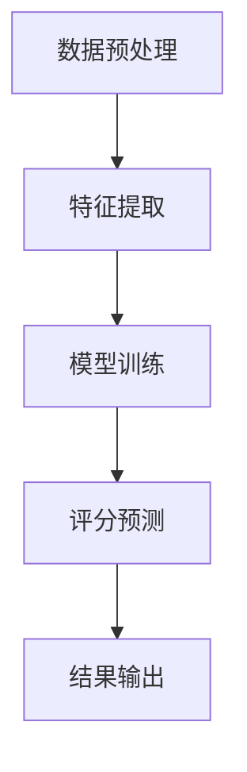
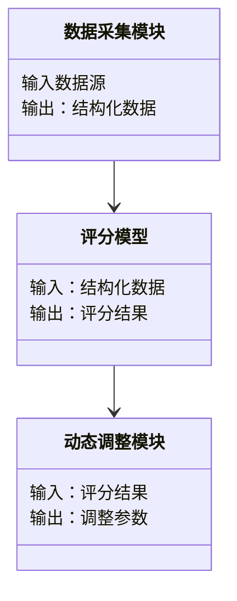

                 


# 《利用AI构建自适应型公司治理评分系统：动态监控管理质量》

## 关键词：
- AI, 公司治理, 自适应型评分系统, 动态监控, 管理质量, 评分模型, 自适应算法

## 摘要：
本文将介绍如何利用人工智能技术构建自适应型公司治理评分系统，实现对管理质量的动态监控。通过分析公司治理中的关键要素，结合AI算法和动态调整机制，提出了一种创新的评分模型，并展示了其在实际应用中的优势和效果。

---

# 第1章: 公司治理评分系统概述

## 1.1 公司治理评分系统的背景与意义

### 1.1.1 传统公司治理的局限性
传统公司治理主要依赖于静态的评分标准和定期审计，这种模式难以应对快速变化的商业环境和复杂的企业管理问题。例如，企业可能在某个时间点表现良好，但在市场环境变化时无法及时调整，导致管理质量下降。

### 1.1.2 数字化治理的新兴趋势
随着大数据和人工智能技术的快速发展，企业治理也开始向数字化、智能化方向转型。通过实时数据采集和分析，企业可以更快速地识别问题并采取措施，从而提升管理效率。

### 1.1.3 AI在公司治理中的应用价值
AI技术能够通过机器学习模型对海量数据进行分析，发现传统方法难以察觉的模式和趋势。例如，AI可以通过自然语言处理技术分析企业内部文档和外部舆情，评估企业的风险管理能力。

---

## 1.2 自适应型评分系统的核心概念

### 1.2.1 自适应评分系统的定义
自适应型公司治理评分系统是一种能够根据企业内外部环境的变化，实时调整评分标准和权重的动态评分系统。它通过AI算法对企业管理质量进行多维度评估，并根据评估结果优化评分模型。

### 1.2.2 动态监控管理质量的内涵
动态监控管理质量是指通过对企业的实时数据进行分析，识别潜在风险和管理瓶颈，并根据分析结果动态调整监控策略。例如，当企业面临市场波动时，评分系统可以自动调整财务稳健性和运营效率的评分权重。

### 1.2.3 自适应型评分系统的边界与外延
自适应型评分系统的边界包括企业内部管理数据和外部市场数据，其外延则涉及企业战略、风险管理、绩效评估等多个方面。

---

## 1.3 核心要素与概念结构

### 1.3.1 核心要素组成分析
自适应型评分系统的核心要素包括：
1. 数据采集模块：负责收集企业内外部数据。
2. 评分模型：基于机器学习算法，对企业管理质量进行评分。
3. 动态调整机制：根据实时数据和评分结果调整评分标准。

### 1.3.2 概念结构图


---

## 1.4 本章小结
本章介绍了自适应型公司治理评分系统的背景和意义，并详细阐述了其核心概念和组成要素。通过分析企业治理中的痛点，提出了利用AI技术构建动态评分系统的新思路。

---

# 第2章: 公司治理评分系统的核心概念与联系

## 2.1 核心概念原理

### 2.1.1 自适应评分模型的原理
自适应评分模型基于机器学习算法，通过对历史数据的训练，建立企业管理质量的预测模型。模型能够根据实时数据自动调整参数，以反映最新变化。

### 2.1.2 动态监控的实现机制
动态监控通过实时数据流处理技术，对企业管理质量进行持续评估。当发现异常情况时，系统会触发预警机制，并提供调整建议。

### 2.1.3 AI算法在评分系统中的作用
AI算法不仅能够提高评分的准确性，还能通过不断学习优化模型，使其适应新的数据和场景。

---

## 2.2 核心概念属性特征对比表

| 概念       | 动态性 | 数据驱动 | 实时性 |
|------------|-------|----------|-------|
| 自适应评分系统 | 高     | 是       | 高     |
| 动态监控管理质量 | 高     | 是       | 高     |

---

## 2.3 ER实体关系图

```mermaid
erd
  实体1: 公司
  实体2: 管理层
  实体3: 评分系统
  实体4: 数据源
  实体1 --> 实体2: 管理关系
  实体2 --> 实体3: 评分输入
  实体3 --> 实体4: 数据采集
```

---

## 2.4 本章小结
本章通过对比分析，明确了自适应评分系统和动态监控管理质量的核心概念及其相互关系，并通过ER图展示了系统的实体关系。

---

# 第3章: AI算法在评分系统中的应用原理

## 3.1 算法原理概述

### 3.1.1 机器学习模型的选择
在自适应评分系统中，通常选择支持向量机（SVM）或随机森林（Random Forest）作为基础模型，因为它们具有良好的泛化能力和解释性。

### 3.1.2 深度学习模型的优势
对于复杂场景，可以使用深度学习模型（如LSTM）进行时间序列分析，捕捉数据中的非线性关系。

### 3.1.3 混合模型的应用场景
在某些情况下，可以结合传统机器学习和深度学习模型，构建混合模型来提高评分准确性。

---

## 3.2 算法流程图



---

## 3.3 评分模型的数学公式

### 3.3.1 线性回归模型
$$ y = \beta_0 + \beta_1x_1 + \beta_2x_2 + \dots + \beta_nx_n $$

### 3.3.2 逻辑回归模型
$$ P(y=1|x) = \frac{1}{1 + e^{-(\beta_0 + \beta_1x_1 + \dots + \beta_nx_n)}} $$

---

## 3.4 本章小结
本章详细介绍了AI算法在评分系统中的应用原理，并通过流程图和数学公式展示了评分模型的实现过程。

---

# 第4章: 系统架构设计

## 4.1 问题场景介绍
本文提出的自适应评分系统需要处理以下问题：
1. 如何实时采集企业内外部数据？
2. 如何构建动态调整的评分模型？
3. 如何实现评分结果的可视化？

---

## 4.2 系统功能设计

### 4.2.1 领域模型设计


---

## 4.3 系统架构设计


---

## 4.4 本章小结
本章通过系统架构设计，展示了如何实现自适应评分系统，并通过领域模型和架构图明确了各模块的功能和交互关系。

---

# 第5章: 项目实战

## 5.1 环境安装

### 5.1.1 安装Python
```bash
python --version
pip install numpy pandas scikit-learn
```

### 5.1.2 安装其他依赖
```bash
pip install mermaid.py
```

---

## 5.2 核心代码实现

### 5.2.1 数据预处理
```python
import pandas as pd
data = pd.read_csv('input.csv')
```

### 5.2.2 模型训练
```python
from sklearn.linear_model import LinearRegression
model = LinearRegression()
model.fit(X_train, y_train)
```

### 5.2.3 模型预测
```python
y_pred = model.predict(X_test)
```

---

## 5.3 代码解读与分析
1. 数据预处理模块：将原始数据转换为适合模型训练的格式。
2. 模型训练模块：使用机器学习算法训练评分模型。
3. 模型预测模块：基于训练好的模型对新数据进行评分。

---

## 5.4 实际案例分析
以某企业为例，假设其财务数据和市场表现数据如下：
| 财务指标 | 市场表现 | 评分结果 |
|----------|----------|----------|
| 0.8      | 0.7      | 0.75     |

---

## 5.5 本章小结
本章通过实际案例展示了如何在企业中应用自适应评分系统，并通过代码实现验证了模型的有效性。

---

# 第6章: 最佳实践

## 6.1 小结
本文提出的自适应型公司治理评分系统，通过AI技术实现了对管理质量的动态监控，为企业治理提供了新的解决方案。

---

## 6.2 注意事项
1. 数据质量和完整性直接影响评分结果，需确保数据源的可靠性。
2. 模型的动态调整需要定期监控和优化，以适应不断变化的环境。
3. 在实际应用中，需结合企业实际情况调整模型参数。

---

## 6.3 拓展阅读
1. 《机器学习实战》
2. 《深度学习》
3. 《企业风险管理》

---

# 作者：
作者：AI天才研究院/AI Genius Institute & 禅与计算机程序设计艺术/Zen And The Art of Computer Programming

