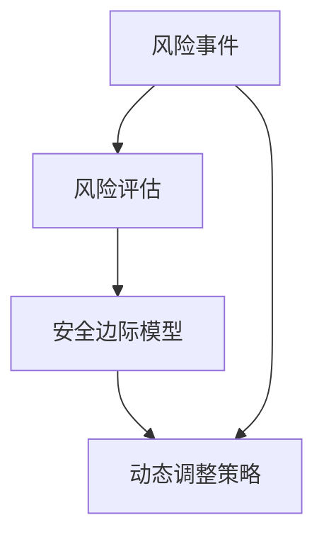
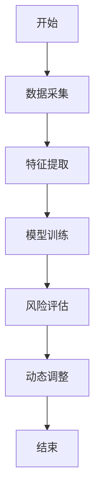
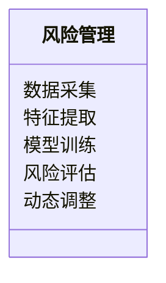
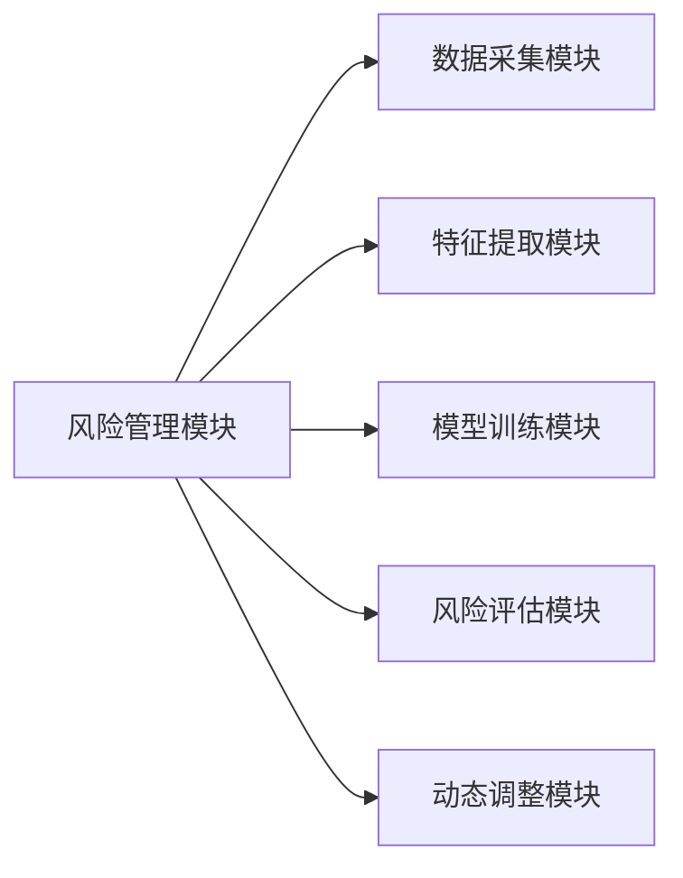
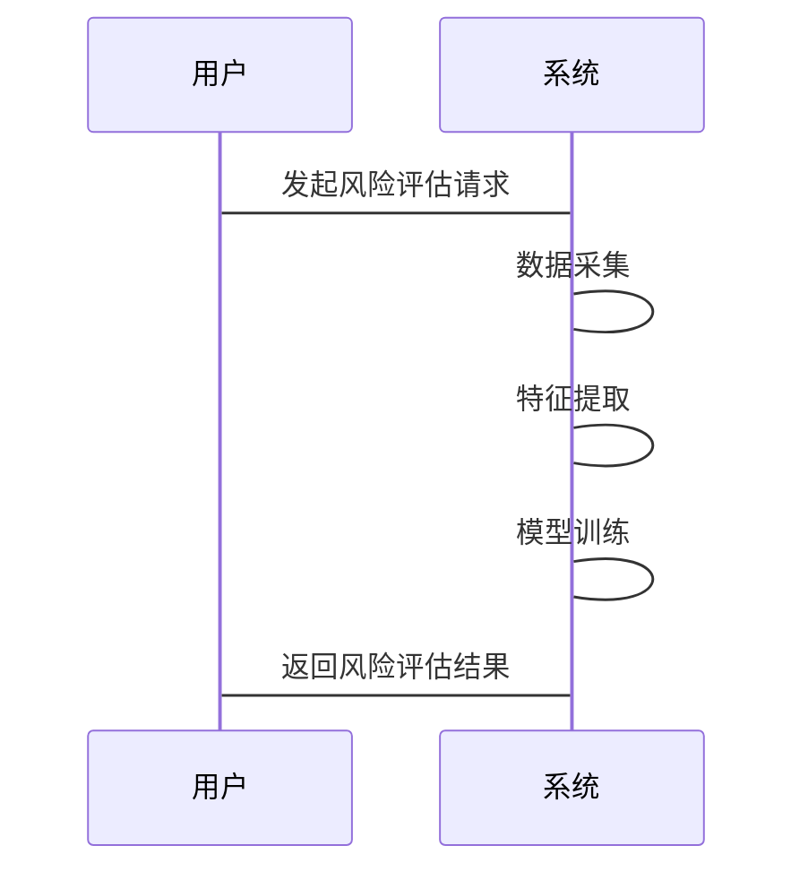

                 


# 利用AI构建自适应型安全边际模型：动态风险管理

> 关键词：自适应安全边际模型、AI驱动、动态风险管理、风险管理模型、风险管理框架

> 摘要：本文探讨了利用人工智能技术构建自适应型安全边际模型在动态风险管理中的应用。通过分析传统风险管理的局限性，提出基于AI的解决方案，涵盖数据处理、模型训练、动态调整等关键步骤，最终实现对风险的实时监测和有效控制。

---

## 第一部分: 背景介绍

### 第1章: 自适应型安全边际模型与动态风险管理概述

#### 1.1 问题背景

##### 1.1.1 风险管理的传统方法与局限性
传统的风险管理方法依赖于静态模型和规则，难以应对复杂多变的市场环境。例如，金融市场的波动性、经济指标的变化以及突发事件的影响，传统模型难以实时捕捉这些变化，导致风险评估的滞后性和准确性不足。

##### 1.1.2 安全边际模型的定义与目标
安全边际模型旨在通过设定一个动态的安全边界，将风险控制在可接受范围内。其目标是通过实时数据和模型调整，优化风险敞口，减少潜在损失。

##### 1.1.3 动态风险管理的必要性
动态风险管理能够实时响应市场变化，帮助机构及时调整策略，避免重大损失。特别是在金融、能源等领域，动态风险管理能够显著提高系统的稳定性和抗风险能力。

#### 1.2 问题描述

##### 1.2.1 风险评估的复杂性
风险评估涉及大量不确定性因素，传统方法难以有效处理非线性关系和复杂交互。

##### 1.2.2 安全边际模型的核心问题
如何在动态变化的环境中，实时调整安全边界，确保风险控制的有效性。

##### 1.2.3 动态风险管理的挑战
数据实时性、模型可解释性、计算效率等问题，增加了动态风险管理的难度。

#### 1.3 问题解决方法

##### 1.3.1 利用AI技术构建自适应模型
通过机器学习算法，模型能够自动调整参数，适应环境变化。

##### 1.3.2 动态调整安全边际的策略
基于实时数据和模型预测，动态调整安全边界，优化风险管理效果。

##### 1.3.3 AI在风险管理中的优势
AI能够处理海量数据，发现非线性关系，提供实时反馈，显著提升风险管理的效率和准确性。

#### 1.4 边界与外延

##### 1.4.1 安全边际模型的适用范围
适用于金融市场、供应链管理、网络安全等领域。

##### 1.4.2 动态风险管理的边界条件
数据质量、模型精度、计算能力等限制了模型的应用范围。

##### 1.4.3 模型的可扩展性与限制
模型需要定期更新，以适应新数据和环境变化，同时存在计算资源限制。

#### 1.5 核心概念结构与组成

##### 1.5.1 安全边际模型的组成要素
包括数据源、特征提取、模型训练、风险评估、动态调整等。

##### 1.5.2 动态风险管理的系统架构
数据采集、处理、建模、评估、反馈优化等模块构成系统。

##### 1.5.3 AI在模型中的角色与作用
AI负责数据处理、模型训练和预测，提升系统的自适应能力。

---

## 第二部分: 核心概念与联系

### 第2章: 自适应型安全边际模型的核心原理

#### 2.1 核心概念原理

##### 2.1.1 安全边际模型的基本原理
通过设定动态边界，将风险控制在可接受范围内，避免超出承受能力。

##### 2.1.2 动态风险管理的算法基础
基于机器学习，利用实时数据和模型预测，动态调整安全边界。

##### 2.1.3 AI在模型中的具体应用
用于数据处理、特征提取、模型训练和预测，提升风险管理的实时性和准确性。

#### 2.2 核心概念对比表

| 模型类型          | 静态模型       | 动态模型       |
|-------------------|---------------|---------------|
| 数据依赖          | 静态数据       | 实时数据       |
| 边界调整          | 定期调整       | 实时调整       |
| 适应性            | 较低           | 较高           |
| 优点              | 简单易实现     | 精准高效       |
| 缺点              | 响应慢，不灵活 | 计算资源需求高 |

#### 2.3 ER实体关系图


---

## 第三部分: 算法原理讲解

### 第3章: 自适应型安全边际模型的算法流程

#### 3.1 算法流程图


#### 3.2 算法实现代码
```python
import numpy as np
from sklearn import linear_model

# 示例数据
X = np.array([[1, 2],
              [3, 4],
              [5, 6],
              [7, 8]])

y = np.array([2, 3, 4, 5])

# 训练模型
model = linear_model.LinearRegression()
model.fit(X, y)

# 预测
new_X = np.array([[9, 10]])
predicted_y = model.predict(new_X)

print(predicted_y)
```

#### 3.3 数学模型与公式

##### 风险评估公式
$$ \text{风险值} = \alpha \times \text{资产价值} + \beta \times \text{波动率} $$

##### 动态调整公式
$$ \text{新边界} = \text{旧边界} + \gamma \times (\text{预测值} - \text{实际值}) $$

---

## 第四部分: 系统分析与架构设计

### 第4章: 系统架构设计

#### 4.1 项目背景
动态风险管理系统的开发旨在实时监测和控制风险，提升机构的抗风险能力。

#### 4.2 系统功能设计

##### 4.2.1 领域模型


##### 4.2.2 系统架构


##### 4.2.3 接口设计
- 数据采集接口：从数据库获取实时数据。
- 风险评估接口：返回风险等级。
- 动态调整接口：更新安全边界参数。

##### 4.2.4 交互流程图


---

## 第五部分: 项目实战

### 第5章: 项目实战

#### 5.1 环境安装
安装Python、numpy、scikit-learn等依赖库。

#### 5.2 核心实现代码
```python
import numpy as np
from sklearn import linear_model

def collect_data():
    # 数据采集逻辑
    pass

def extract_features(data):
    # 特征提取逻辑
    return features

def train_model(features, labels):
    model = linear_model.LinearRegression()
    model.fit(features, labels)
    return model

def evaluate_risk(model, new_data):
    return model.predict(new_data)

def adjust_boundary(old_boundary, predicted, actual):
    gamma = 0.1
    new_boundary = old_boundary + gamma * (predicted - actual)
    return new_boundary

# 主函数
def main():
    data = collect_data()
    features = extract_features(data)
    labels = extract_labels(data)
    model = train_model(features, labels)
    new_data = collect_new_data()
    predicted = evaluate_risk(model, new_data)
    adjusted_boundary = adjust_boundary(current_boundary, predicted, actual_risk)
    print(adjusted_boundary)

if __name__ == "__main__":
    main()
```

#### 5.3 代码解读与分析
- `collect_data`：从数据库或API获取实时数据。
- `extract_features`：提取有用的特征，如波动率、相关系数等。
- `train_model`：使用机器学习算法训练模型。
- `evaluate_risk`：基于模型预测风险值。
- `adjust_boundary`：根据预测与实际差异调整安全边界。

#### 5.4 实际案例分析
案例：某金融机构使用该模型实时监控市场风险，成功预测并应对一次市场波动。

---

## 第六部分: 最佳实践

### 第6章: 最佳实践

#### 6.1 小结
通过AI构建自适应型安全边际模型，能够显著提升动态风险管理的效率和准确性。

#### 6.2 注意事项
- 数据质量至关重要，需确保实时性和准确性。
- 模型需定期更新，以适应新数据和环境变化。
- 计算资源需求较高，需优化算法和架构。

#### 6.3 拓展阅读
推荐学习强化学习、时间序列分析等技术，进一步提升模型性能。

---

## 作者信息

作者：AI天才研究院/AI Genius Institute & 禅与计算机程序设计艺术 /Zen And The Art of Computer Programming

---

通过以上结构，文章详细讲解了利用AI构建自适应型安全边际模型的各个方面，从理论到实践，为读者提供了全面的知识和指导。

