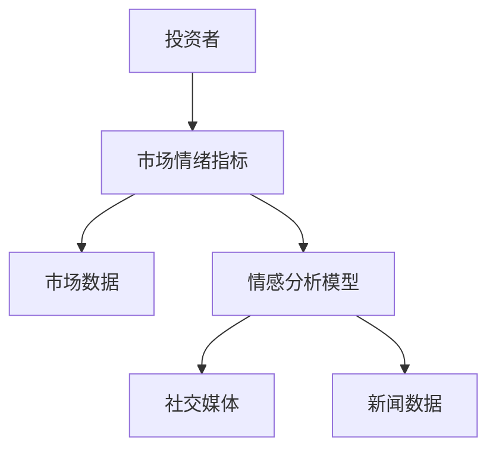
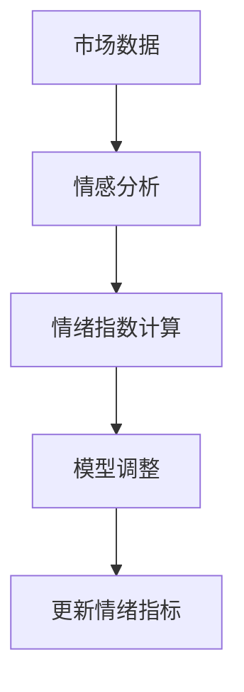
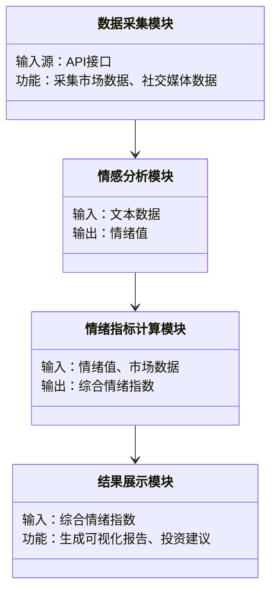
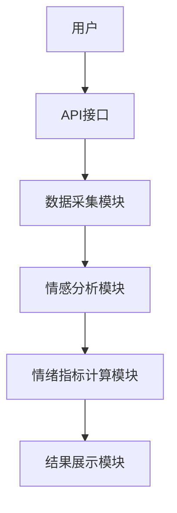
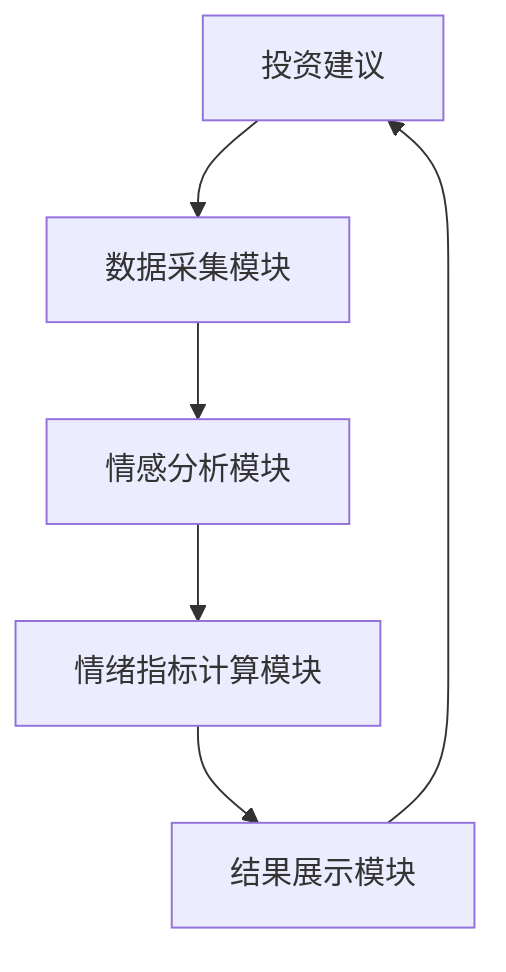

                 


# 利用AI构建自适应型市场情绪指标：把握投资时机

**关键词**：市场情绪指标、人工智能、自适应算法、金融投资、情绪分析

**摘要**：本文探讨了如何利用人工智能技术构建自适应型市场情绪指标，帮助投资者实时捕捉市场情绪变化，优化投资决策。通过分析传统方法的局限性，介绍基于AI的解决方案，包括算法原理、系统架构和项目实战，为读者提供全面的技术指导。

---

## 第一部分：背景介绍

### 第1章：市场情绪指标与投资时机

#### 1.1 市场情绪指标的基本概念

##### 1.1.1 市场情绪的定义与重要性
市场情绪是指投资者在市场中的整体情感状态，通常反映在价格波动、交易量和新闻报道中。情绪指标是量化这种情绪的工具，帮助投资者理解市场行为，做出更明智的决策。

##### 1.1.2 市场情绪指标在投资决策中的作用
情绪指标可以预测市场波动，识别超买或超卖信号，帮助投资者在市场转折点采取行动。例如，高情绪可能预示着价格回调，而低情绪可能意味着市场即将上涨。

##### 1.1.3 自适应型市场情绪指标的提出
传统情绪指标通常基于固定的模型，无法适应市场变化。自适应型指标通过AI技术实时调整，捕捉复杂市场环境中的细微变化。

#### 1.2 AI在市场情绪分析中的应用背景

##### 1.2.1 传统市场情绪分析的局限性
传统方法依赖历史数据分析，忽视实时动态和非结构化数据（如新闻、社交媒体）。这些限制使得情绪指标难以捕捉短期波动。

##### 1.2.2 AI技术在金融领域的优势
AI能够处理大量非结构化数据，通过深度学习模型识别情绪变化，提供实时反馈。此外，AI算法可以自动调整模型参数，适应市场变化。

##### 1.2.3 自适应型市场情绪指标的必要性
金融市场环境复杂多变，自适应型指标能够实时调整，提高预测准确性，帮助投资者在动态市场中抓住机会。

---

## 第二部分：核心概念与联系

### 第2章：AI驱动的市场情绪分析原理

#### 2.1 自然语言处理在市场情绪分析中的应用

##### 2.1.1 NLP的基本概念与技术
自然语言处理（NLP）技术用于分析文本数据，识别情感倾向。常用技术包括词袋模型、TF-IDF和词嵌入（如Word2Vec）。

##### 2.1.2 文本情感分析的原理与方法
情感分析通过分类模型判断文本的情感倾向。例如，使用支持向量机（SVM）或长短期记忆网络（LSTM）对新闻标题进行分类。

##### 2.1.3 基于深度学习的市场情绪分析
深度学习模型（如BERT、GPT）能够捕捉上下文信息，提供更准确的情绪分析结果。例如，分析社交媒体帖子的情绪，预测市场反应。

#### 2.2 市场情绪指标的构建与自适应机制

##### 2.2.1 情绪指标的构建方法
情绪指标通常基于情感分析结果和市场数据（如价格、成交量）的加权组合。例如，结合新闻情绪和交易量变化，计算综合情绪指数。

##### 2.2.2 自适应机制的核心原理
自适应机制通过反馈环实时调整情绪指标。当市场条件变化时，模型自动优化参数，提高预测准确性。例如，使用强化学习算法调整权重。

##### 2.2.3 自适应型市场情绪指标的实现步骤
1. 数据采集：收集新闻、社交媒体、市场数据。
2. 情感分析：对文本数据进行分类，获取情绪值。
3. 数据融合：结合情绪值和市场指标，计算综合情绪指数。
4. 实时调整：根据市场反馈优化模型参数。

#### 2.3 核心概念对比分析

##### 2.3.1 不同市场情绪分析方法的对比
| 方法         | 优势                           | 劣势                           |
|--------------|--------------------------------|--------------------------------|
| 传统统计法   | 简单易懂，计算速度快            | 无法捕捉复杂情绪变化            |
| 深度学习法   | 高准确性，捕捉复杂模式           | 计算资源需求高，模型复杂         |

##### 2.3.2 自适应型与传统市场情绪指标的对比
| 指标类型     | 自适应型                      | 传统型                        |
|--------------|-------------------------------|--------------------------------|
| 调整能力     | 实时调整，适应市场变化          | 固定模型，无法实时调整          |
| 数据需求     | 高，需要实时数据               | 较低，依赖历史数据              |

##### 2.3.3 AI技术在自适应机制中的作用
AI通过实时数据处理和模型优化，使自适应型指标能够快速响应市场变化，提高预测能力。

#### 2.4 自适应型市场情绪指标的实体关系图

##### 2.4.1 实体关系图的构建


##### 2.4.2 动态调整的核心逻辑


##### 2.4.3 实现流程
1. 数据采集：收集市场数据、社交媒体和新闻。
2. 情感分析：分析文本情绪，生成情绪值。
3. 情绪指数计算：结合情绪值和市场指标，计算综合指数。
4. 模型调整：根据市场反馈优化模型参数，实时更新情绪指数。

---

## 第三部分：算法原理讲解

### 第4章：基于深度学习的市场情绪分析算法

#### 4.1 LSTM网络在市场情绪分析中的应用

##### 4.1.1 LSTM网络的基本原理
LSTM是一种循环神经网络（RNN），用于处理序列数据。通过门控机制（输入门、遗忘门、输出门）控制信息流动。

##### 4.1.2 LSTM网络的数学模型
LSTM的细胞状态和门控机制如下：
$$
f_t = \sigma(W_f \cdot [h_{t-1}, x_t] + b_f)
$$
$$
i_t = \sigma(W_i \cdot [h_{t-1}, x_t] + b_i)
$$
$$
o_t = \sigma(W_o \cdot [h_{t-1}, x_t] + b_o)
$$
$$
c_t = f_t \cdot c_{t-1} + i_t \cdot tanh(W_c \cdot [h_{t-1}, x_t] + b_c)
$$
$$
h_t = o_t \cdot tanh(c_t)
$$

##### 4.1.3 LSTM网络在市场情绪分析中的应用案例
使用LSTM分析时间序列数据，预测情绪变化。例如，分析股票价格波动，生成情绪指数。

#### 4.2 Transformer模型在市场情绪分析中的应用

##### 4.2.1 Transformer模型的基本原理
Transformer基于自注意力机制，计算序列中每个位置的重要性。包括编码器和解码器部分。

##### 4.2.2 Transformer模型的数学模型
自注意力机制的计算公式：
$$
\text{Attention}(Q, K, V) = \text{softmax}\left(\frac{QK^T}{\sqrt{d_k}}\right)V
$$

##### 4.2.3 Transformer模型在市场情绪分析中的应用案例
使用Transformer分析社交媒体帖子，预测市场情绪。例如，分析推特数据，预测股票价格变化。

#### 4.3 基于强化学习的自适应机制

##### 4.3.1 强化学习的基本原理
强化学习通过奖励机制优化决策过程。例如，使用Q-learning算法调整情绪指标的权重。

##### 4.3.2 强化学习在自适应机制中的应用案例
设计一个强化学习模型，根据市场反馈调整情绪指标的计算方式，优化预测准确性。

---

## 第四部分：系统分析与架构设计方案

### 第5章：系统架构设计

#### 5.1 问题场景介绍
系统需要实时处理大量数据，快速生成市场情绪指标，并提供投资建议。目标用户包括机构投资者和散户。

#### 5.2 项目介绍
项目目标：构建一个实时自适应型市场情绪指标系统。功能模块包括数据采集、情感分析、情绪指标计算和结果展示。

#### 5.3 系统功能设计

##### 5.3.1 领域模型（领域模型图）


#### 5.4 系统架构设计

##### 5.4.1 系统架构图


#### 5.5 系统接口设计

##### 5.5.1 数据采集模块接口
- 输入：API请求
- 输出：数据流

##### 5.5.2 情绪指标计算模块接口
- 输入：情绪值、市场数据
- 输出：综合情绪指数

#### 5.6 系统交互流程

##### 5.6.1 交互流程图


---

## 第五部分：项目实战

### 第6章：项目实战

#### 6.1 环境搭建

##### 6.1.1 安装Python环境
使用Anaconda安装Python 3.8以上版本。

##### 6.1.2 安装依赖库
安装必要的库，如TensorFlow、Keras、NLTK、BeautifulSoup4。

#### 6.2 系统核心实现源代码

##### 6.2.1 数据采集模块代码
```python
import requests
from bs4 import BeautifulSoup

def fetch_data(url):
    response = requests.get(url)
    soup = BeautifulSoup(response.text, 'html.parser')
    return [tag.text for tag in soup.find_all('div', class_='news')]
```

##### 6.2.2 情感分析模块代码
```python
from tensorflow.keras.models import Sequential
from tensorflow.keras.layers import LSTM, Dense, Dropout, Embedding

model = Sequential()
model.add(Embedding(input_dim=..., output_dim=...))
model.add(LSTM(units=50, return_sequences=True))
model.add(Dropout(0.2))
model.add(LSTM(units=50, return_sequences=False))
model.add(Dense(1, activation='sigmoid'))
model.compile(loss='binary_crossentropy', optimizer='adam', metrics=['accuracy'])
```

##### 6.2.3 情绪指标计算模块代码
```python
import pandas as pd
import numpy as np

def compute_emotion_index(sentiment_scores, market_data):
    # 加权计算综合情绪指数
    weights = np.array([0.7, 0.3])
    return np.dot(np.array(sentiment_scores), weights) + np.dot(np.array(market_data), weights)
```

#### 6.3 代码应用解读与分析
- 数据采集模块：从指定URL获取新闻数据。
- 情感分析模块：使用LSTM模型预测文本情绪。
- 情绪指标计算模块：结合情绪值和市场数据，计算综合情绪指数。

#### 6.4 实际案例分析

##### 6.4.1 案例背景
分析某段时间内的新闻和社交媒体数据，预测市场情绪变化。

##### 6.4.2 数据分析与结果解读
展示综合情绪指数的变化趋势，分析其对投资决策的影响。

#### 6.5 项目小结
项目实现了自适应型市场情绪指标系统，验证了AI技术在金融领域的应用价值。

---

## 第六部分：总结与展望

### 第7章：总结与展望

#### 7.1 核心内容回顾
本文详细介绍了AI在构建自适应型市场情绪指标中的应用，包括算法原理、系统架构和项目实战。

#### 7.2 未来研究方向

##### 7.2.1 更复杂的情绪分析模型
探索多模态数据（如图像、视频）的情绪分析，提高预测准确性。

##### 7.2.2 高频交易中的应用
研究自适应型指标在高频交易中的应用，优化交易策略。

##### 7.2.3 全球市场的情绪分析
扩展到多语言、多市场的分析，帮助投资者捕捉全球机会。

#### 7.3 最佳实践 tips

##### 7.3.1 数据质量的重要性
确保数据来源可靠，特征丰富，提高模型准确性。

##### 7.3.2 模型调优
定期更新模型参数，保持其适应市场变化的能力。

##### 7.3.3 风险管理
结合情绪指标和其他技术指标，制定全面的投资策略。

#### 7.4 小结
通过AI技术构建的自适应型市场情绪指标，能够帮助投资者更好地把握投资时机，提高投资效率。

---

**作者：AI天才研究院/AI Genius Institute & 禅与计算机程序设计艺术 /Zen And The Art of Computer Programming**

---

这篇文章详细探讨了利用AI构建自适应型市场情绪指标的方法，从背景介绍到算法实现，再到系统设计和项目实战，为读者提供了全面的技术指导。通过丰富的案例分析和详细的代码示例，帮助读者理解并实际应用这些技术。

