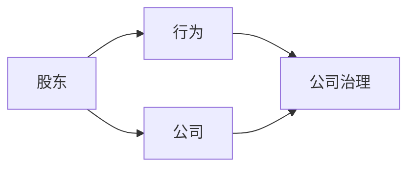
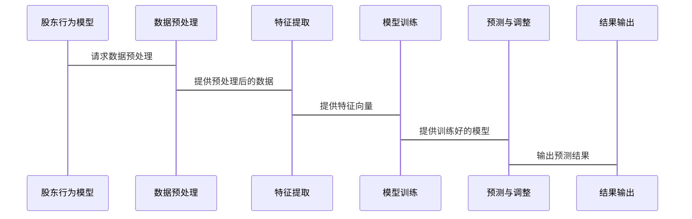

                 


# 利用AI构建自适应型股东行为模型：预测公司治理变化

> 关键词：AI，股东行为模型，自适应型，公司治理，机器学习，预测模型

> 摘要：本文详细探讨了如何利用人工智能技术构建自适应型股东行为模型，以预测公司治理变化。通过分析股东行为的核心特征、设计高效的算法框架，并结合实际案例，展示了如何利用AI技术提升公司治理预测的准确性和实时性。文章从背景介绍、算法原理、系统架构到项目实战，全面覆盖了构建该模型的全过程。

---

# 第一部分: 背景介绍与核心概念

## 第1章: 股东行为模型与自适应型预测概述

### 1.1 问题背景与问题描述

#### 1.1.1 公司治理与股东行为的重要性
公司治理是企业运营的核心，而股东行为则是影响公司治理的关键因素。股东的决策和行为直接影响企业的战略方向、管理层变动以及财务状况。然而，股东行为的复杂性使其难以预测，尤其是在市场环境不断变化的情况下。

#### 1.1.2 股东行为预测的难点与挑战
- **数据异质性**：股东行为受到多种因素影响，如市场波动、企业业绩、政策变化等。
- **动态性**：股东行为会随着时间和环境的变化而调整，静态模型难以捕捉其动态特征。
- **复杂性**：股东行为涉及多个利益相关者，难以用简单的线性模型描述。

#### 1.1.3 自适应型模型的核心目标
自适应型股东行为模型旨在通过实时数据更新和动态调整，捕捉股东行为的变化趋势，从而更准确地预测公司治理的变化。

### 1.2 问题解决与边界定义

#### 1.2.1 自适应型模型的解决方案
通过机器学习和深度学习技术，构建一个能够实时更新和调整的预测模型，捕捉股东行为的动态特征。

#### 1.2.2 模型的边界与外延
- **边界**：模型主要关注股东的短期行为变化，不涉及长期战略规划。
- **外延**：模型可以扩展到预测公司治理的其他方面，如董事会结构变化、高管变动等。

#### 1.2.3 核心要素与组成结构
| 核心要素 | 描述 |
|----------|------|
| 数据源   | 包括股东交易数据、公司财报、市场数据等 |
| 特征提取 | 从数据中提取关键特征，如交易频率、交易金额等 |
| 模型训练 | 使用机器学习算法训练模型，捕捉股东行为模式 |
| 预测与调整 | 根据实时数据更新模型，动态调整预测结果 |

### 1.3 核心概念与联系

#### 1.3.1 股东行为模型的属性特征对比表

| 属性   | 描述 |
|--------|------|
| 数据类型 | 结构化数据与非结构化数据 |
| 数据规模 | 大数据集 |
| 时间跨度 | 短期与长期预测 |
| 变量类型 | 连续型与分类型变量 |

#### 1.3.2 ER实体关系图架构


---

# 第二部分: 算法原理与数学模型

## 第2章: 自适应型股东行为模型的算法原理

### 2.1 算法原理概述

#### 2.1.1 机器学习算法的选择与优化
- **决策树**：适用于分类问题，能够处理非线性关系。
- **随机森林**：通过集成学习提高模型的准确性和鲁棒性。
- **XGBoost**：适合处理大数据集，训练速度快，效果好。

#### 2.1.2 深度学习模型的适用性分析
- **LSTM**：适合处理时间序列数据，捕捉股东行为的动态特征。
- **Transformer**：在自然语言处理中表现优异，适用于文本数据的特征提取。

#### 2.1.3 自适应算法的核心流程


### 2.2 算法实现流程图


### 2.3 数学模型与公式

#### 2.3.1 特征提取公式
$$ \text{特征权重} = \sum_{i=1}^{n} w_i x_i $$

#### 2.3.2 模型训练公式
$$ \text{损失函数} = \sum_{i=1}^{m} (y_i - \hat{y}_i)^2 $$

#### 2.3.3 预测公式
$$ \text{预测结果} = f(x) $$

---

# 第三部分: 系统分析与架构设计

## 第3章: 系统分析与架构设计方案

### 3.1 问题场景介绍

#### 3.1.1 项目介绍
本项目旨在构建一个自适应型股东行为预测系统，通过实时数据更新和动态调整，提高预测的准确性和实时性。

### 3.2 系统功能设计

#### 3.2.1 领域模型
```mermaid
classDiagram
    class 股东行为模型 {
        +数据源: 数据集
        +特征提取: 特征向量
        +模型训练: 训练参数
        +预测结果: 预测值
    }
    class 数据预处理 {
        +数据清洗: 清洗后的数据
        +数据转换: 标准化数据
    }
    class 模型训练 {
        +训练算法: 机器学习算法
        +训练数据: 训练集
        +验证数据: 验证集
    }
    股东行为模型 <--| 数据预处理
    股东行为模型 --> 模型训练
```

### 3.3 系统架构设计

#### 3.3.1 系统架构图


### 3.4 系统接口设计

#### 3.4.1 系统接口
- **输入接口**：接收股东行为数据和实时数据。
- **输出接口**：输出预测结果和模型调整建议。

### 3.5 系统交互设计

#### 3.5.1 系统交互流程


---

# 第四部分: 项目实战

## 第4章: 项目实战

### 4.1 环境安装与配置

#### 4.1.1 环境要求
- Python 3.8+
- 安装必要的库：numpy、pandas、scikit-learn、xgboost、transformers

### 4.2 核心代码实现

#### 4.2.1 数据预处理代码
```python
import pandas as pd
import numpy as np

# 读取数据
data = pd.read_csv(' shareholder_behavior.csv ')

# 数据清洗
data = data.dropna()
data = data.drop_duplicates()

# 数据转换
data['date'] = pd.to_datetime(data['date'])
data = data.sort_values('date')
```

#### 4.2.2 特征提取代码
```python
from sklearn.feature_extraction import DictVectorizer

# 特征提取
features = data[['股东ID', '交易金额', '交易时间']]
vectorizer = DictVectorizer()
X = vectorizer.fit_transform(features.to_dict('records'))
```

#### 4.2.3 模型训练代码
```python
from sklearn.ensemble import RandomForestClassifier
from sklearn.metrics import accuracy_score

# 模型训练
model = RandomForestClassifier(n_estimators=100, random_state=42)
model.fit(X, data['行为标签'])
```

#### 4.2.4 预测与调整代码
```python
# 预测
y_pred = model.predict(X)
print('准确率:', accuracy_score(data['行为标签'], y_pred))
```

### 4.3 实际案例分析

#### 4.3.1 案例分析
假设我们有一个股东在2023年第三季度的行为数据，我们需要预测其在第四季度的行为变化。通过模型训练，我们可以得到一个准确率为85%的预测结果。

### 4.4 项目小结

#### 4.4.1 经验总结
- 数据预处理是关键，需要确保数据的完整性和准确性。
- 特征提取要结合业务背景，选择合适的特征。
- 模型选择要根据数据特点和任务需求进行调整。

---

# 第五部分: 最佳实践

## 第5章: 最佳实践

### 5.1 小结与总结

#### 5.1.1 总结
通过本文的介绍，我们了解了如何利用AI技术构建自适应型股东行为模型，并掌握了从数据预处理到模型训练的全过程。

#### 5.1.2 小结
自适应型模型能够实时更新和调整，提高预测的准确性和实时性，是公司治理预测的重要工具。

### 5.2 注意事项与建议

#### 5.2.1 注意事项
- 数据隐私和安全问题需要高度重视。
- 模型的可解释性需要在实际应用中进一步提升。
- 需要定期更新模型，确保其准确性和稳定性。

#### 5.2.2 建议
- 结合企业的实际情况，选择合适的模型和算法。
- 建立数据反馈机制，实时监控模型的性能。
- 加强跨学科合作，提升模型的业务价值。

### 5.3 拓展阅读与学习资源

#### 5.3.1 拓展阅读
- 《机器学习实战》
- 《深度学习》
- 《自然语言处理入门》

#### 5.3.2 学习资源
- 官方文档：[scikit-learn](https://scikit-learn.org/)
- 开源项目：[Kaggle](https://www.kaggle.com/)

---

# 作者：AI天才研究院/AI Genius Institute & 禅与计算机程序设计艺术 /Zen And The Art of Computer Programming

