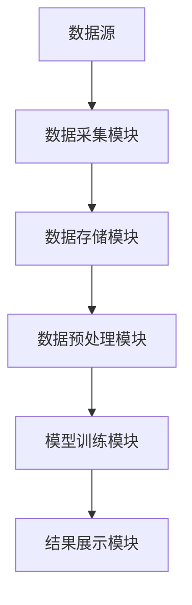
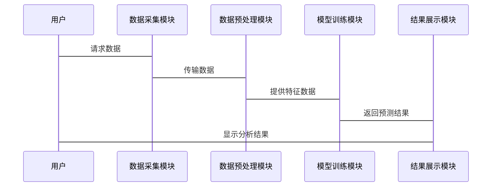

                 

# 利用AI进行全球资金流动分析：预测市场走向

## 关键词：AI技术、全球资金流动、市场预测、时间序列分析、机器学习、深度学习

## 摘要：  
本文将探讨如何利用人工智能技术进行全球资金流动分析，以预测市场走向。通过结合金融数据分析与AI算法，我们可以更精准地捕捉市场趋势，优化投资决策。本文将从资金流动分析的基本概念出发，逐步深入探讨AI技术的应用，包括算法原理、系统架构设计、项目实战以及案例分析，帮助读者全面理解并掌握利用AI进行全球资金流动分析的核心方法。

---

## 第1章 全球资金流动分析概述

### 1.1 全球资金流动的重要性
#### 1.1.1 全球资金流动的定义与特点
全球资金流动是指资金在全球范围内跨市场、跨资产的流动过程，具有实时性、复杂性和波动性的特点。

#### 1.1.2 全球资金流动对经济的影响
资金流动直接影响市场的供需关系，进而影响资产价格、汇率和经济政策。

#### 1.1.3 资金流动分析的挑战与难点
资金流动受多种因素影响，如经济指标、政策变化、市场情绪等，分析难度大且复杂。

### 1.2 AI技术在资金流动分析中的应用
#### 1.2.1 AI技术的基本概念与优势
人工智能技术通过数据挖掘、模式识别和自动化分析，为资金流动分析提供高效解决方案。

#### 1.2.2 AI在金融领域的应用现状
AI技术在金融领域的应用广泛，包括股票预测、风险评估、交易自动化等。

#### 1.2.3 资金流动分析中AI的独特价值
AI能够处理海量数据，发现隐藏规律，帮助预测市场走向并优化投资决策。

### 1.3 本书的目标与结构
#### 1.3.1 本书的核心目标
通过AI技术，掌握全球资金流动分析的方法和技巧，提升市场预测能力。

#### 1.3.2 本书的主要内容与结构
涵盖资金流动分析的基本概念、AI技术原理、算法实现、系统架构设计、项目实战和案例分析。

#### 1.3.3 本书的适用读者
适合金融从业者、数据科学家、技术爱好者以及对AI与金融结合感兴趣的研究者。

---

## 第2章 资金流动分析的核心概念与AI的结合

### 2.1 资金流动分析的基本概念
#### 2.1.1 资金流动的分类与特征
资金流动可以分为短期流动和长期流动，具有周期性、方向性和规模性特征。

#### 2.1.2 资金流动的驱动因素
经济指标（GDP、通胀率）、政策变化、市场情绪、地缘政治等是影响资金流动的主要因素。

#### 2.1.3 资金流动的数学模型
资金流动可以用时间序列模型（如ARIMA）和回归模型进行描述。

### 2.2 AI技术的核心原理
#### 2.2.1 机器学习的基本原理
机器学习通过训练数据，学习特征并进行预测，包括监督学习、无监督学习和强化学习。

#### 2.2.2 深度学习的基本原理
深度学习通过多层神经网络提取数据特征，适用于复杂模式识别。

#### 2.2.3 自然语言处理与时间序列分析
自然语言处理用于分析新闻和社交媒体，时间序列分析用于预测资金流动趋势。

### 2.3 资金流动分析与AI的结合方式
#### 2.3.1 数据驱动的预测模型
通过历史数据训练模型，预测未来的资金流动趋势。

#### 2.3.2 智能化决策支持系统
结合AI技术，提供实时市场分析和决策支持。

#### 2.3.3 AI在风险评估中的应用
利用AI技术评估市场风险，优化投资组合。

### 2.4 本章小结
本章介绍了资金流动分析的核心概念和AI技术的基本原理，探讨了两者结合的应用方式。

---

## 第3章 资金流动预测的算法原理

### 3.1 时间序列分析的基本原理
#### 3.1.1 时间序列的特征与分解
时间序列可以分解为趋势、周期、季节性和随机成分。

#### 3.1.2 常见的时间序列模型
ARIMA模型、指数平滑法（ Holt-Winter）和Prophet模型是常用的时间序列模型。

#### 3.1.3 时间序列预测的步骤
包括数据预处理、模型选择、参数优化和模型验证。

### 3.2 机器学习模型在资金流动预测中的应用
#### 3.2.1 线性回归模型
线性回归用于简单线性关系的预测，但对复杂关系表现有限。

#### 3.2.2 支持向量机（SVM）
SVM适用于小样本数据，通过非线性映射提高预测精度。

#### 3.2.3 随机森林与梯度提升树
随机森林和XGBoost等树模型在特征工程中表现优异，适用于高维数据。

### 3.3 深度学习模型在资金流动预测中的应用
#### 3.3.1 RNN与LSTM网络
RNN和LSTM适用于时间依赖性强的数据，能够捕捉长期依赖关系。

#### 3.3.2 Transformer模型
Transformer模型通过自注意力机制，提升对时间序列全局关系的捕捉能力。

#### 3.3.3 图神经网络（GNN）
GNN适用于复杂网络结构，能够分析资金流动的网络关系。

### 3.4 算法选择与优化策略
根据数据特性选择合适的算法，通过交叉验证和超参数优化提升模型性能。

---

## 第4章 资金流动分析的系统架构设计

### 4.1 系统功能设计
#### 4.1.1 数据采集模块
负责收集全球资金流动数据，包括汇率、股价、债券价格等。

#### 4.1.2 数据预处理模块
进行数据清洗、特征提取和数据增强。

#### 4.1.3 模型训练模块
选择合适的算法，训练预测模型并进行验证。

#### 4.1.4 结果展示模块
将预测结果可视化，并提供交互式界面供用户分析。

### 4.2 系统架构设计

### 4.3 系统接口设计
系统接口包括数据输入接口、模型调用接口和结果输出接口，支持API调用。

### 4.4 系统交互流程

---

## 第5章 项目实战：基于AI的资金流动预测系统

### 5.1 环境搭建
安装Python、TensorFlow、Keras、Pandas等必要的库和工具。

### 5.2 数据获取与预处理
使用Yahoo Finance API获取全球股票数据，进行清洗和特征工程。

### 5.3 模型实现
实现LSTM模型，训练并预测未来资金流动趋势。

### 5.4 模型优化
通过网格搜索优化超参数，提升模型性能。

### 5.5 系统部署
将模型部署到云平台，提供实时预测服务。

---

## 第6章 案例分析：全球市场资金流动预测

### 6.1 案例背景
分析某段时间内的全球市场资金流动情况，预测未来走势。

### 6.2 数据分析
使用LSTM模型进行预测，分析模型表现和误差来源。

### 6.3 结果解读
解读预测结果，提供投资建议和风险管理策略。

---

## 第7章 总结与展望

### 7.1 本章小结
总结全文内容，强调AI技术在全球资金流动分析中的重要作用。

### 7.2 未来展望
探讨AI技术在资金流动分析中的发展方向，如多模态数据融合和联邦学习。

### 7.3 注意事项
提醒读者注意数据隐私和模型局限性，避免过度依赖AI技术。

### 7.4 最佳实践 tips
分享AI项目实施中的经验和技巧，帮助读者更好地应用AI技术。

---

## 作者：AI天才研究院 & 禅与计算机程序设计艺术

---

以上是文章的完整目录大纲，每章内容将详细介绍相关知识点和实现细节，帮助读者全面掌握利用AI进行全球资金流动分析的方法。

