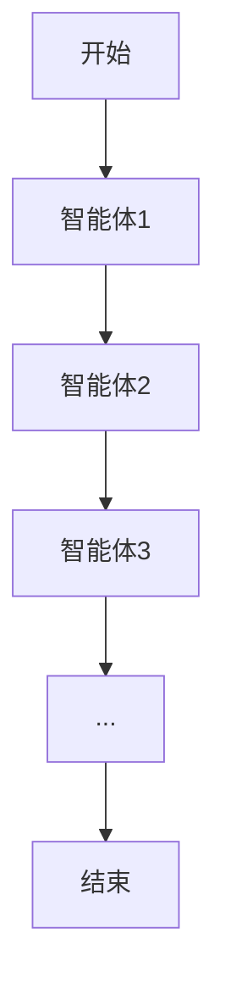
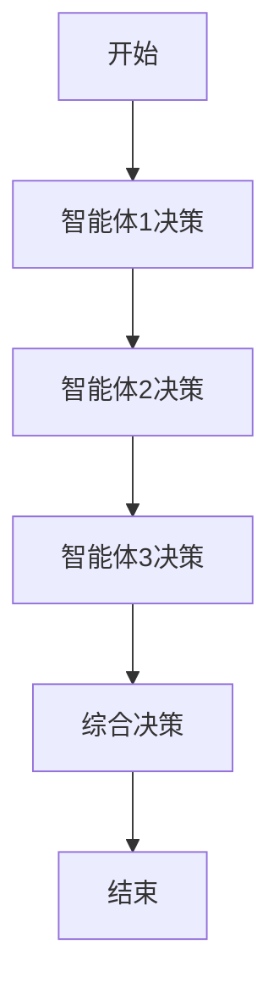
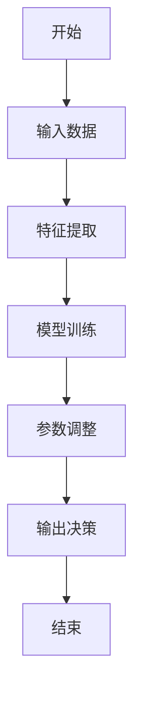
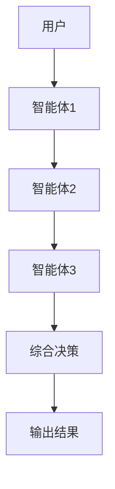
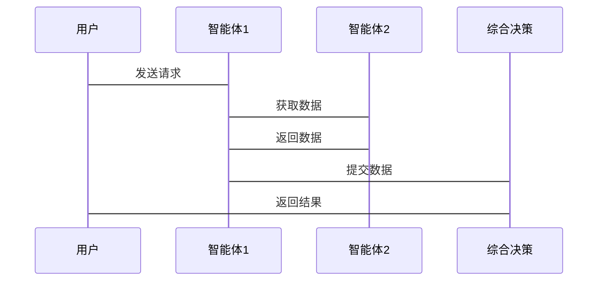

                 


# 利用多智能体AI优化公司扩张战略评估

**关键词**：多智能体AI，公司扩张，战略评估，分布式计算，协作算法，系统架构

**摘要**：本文详细探讨了如何利用多智能体人工智能技术优化公司的扩张战略评估过程。文章首先介绍了多智能体AI的基本概念和其在战略评估中的应用价值，然后深入分析了多智能体系统的原理与算法，包括协作机制、数学模型等。接着，文章详细阐述了系统架构设计，通过实际案例展示了多智能体AI在公司扩张战略评估中的具体应用。最后，本文总结了多智能体AI的优势与挑战，并提供了最佳实践建议。

---

# 第一部分：多智能体AI与公司扩张战略评估概述

## 第1章：多智能体AI与公司扩张战略评估概述

### 1.1 多智能体AI的定义与特点

#### 1.1.1 多智能体系统的定义
多智能体系统（Multi-Agent System, MAS）是由多个相互作用的智能体组成的系统，这些智能体能够自主决策、协作和通信。多智能体系统的核心在于智能体之间的协作与信息共享，以实现共同目标。

#### 1.1.2 多智能体系统的核心特点
- **分布式智能**：每个智能体都有自己的目标和决策机制，能够独立运作。
- **协作性**：智能体之间通过通信和协作，共同完成复杂任务。
- **动态性**：能够适应环境的变化，实时调整策略。
- **自主性**：智能体能够自主感知环境并做出决策。

#### 1.1.3 多智能体系统与传统AI的区别
传统的单智能体AI系统通常依赖中心化控制，而多智能体系统通过去中心化的结构实现协作。多智能体系统更注重智能体之间的互动与协作，适用于复杂、动态的环境。

### 1.2 公司扩张战略评估的背景与挑战

#### 1.2.1 公司扩张的定义与目标
公司扩张是指企业在现有业务基础上，通过并购、扩展市场或产品线等方式，实现业务增长和市场扩展。扩张战略的核心目标是寻找新的增长点，优化资源配置，降低风险。

#### 1.2.2 现有战略评估方法的局限性
传统的战略评估方法通常依赖专家经验和静态数据分析，难以应对复杂多变的市场环境。主要局限性包括：
- **信息滞后**：传统方法依赖历史数据，难以实时反馈。
- **单一视角**：难以综合考虑多个利益相关者的互动。
- **决策延迟**：复杂决策需要多次协调，效率低下。

#### 1.2.3 多智能体AI在战略评估中的优势
多智能体AI能够模拟多个利益相关者的互动，实时分析市场变化，提供动态反馈。其优势包括：
- **实时协作**：智能体之间能够实时通信，快速响应变化。
- **分布式计算**：通过去中心化的计算方式，提高处理效率。
- **动态调整**：能够根据环境变化自适应调整策略。

### 1.3 多智能体AI在公司扩张战略评估中的应用价值

#### 1.3.1 提高战略评估的效率与准确性
多智能体AI能够同时分析多个变量，提供更全面的评估结果，减少人为误差。

#### 1.3.2 优化资源分配与风险控制
通过模拟不同情景，多智能体AI可以帮助企业优化资源分配，降低扩张过程中的风险。

#### 1.3.3 支持动态决策与实时反馈
多智能体AI能够实时分析市场反馈，支持动态调整战略，提高决策的灵活性。

### 1.4 本章小结
本章介绍了多智能体AI的基本概念和其在公司扩张战略评估中的应用价值。通过对比传统方法，突出了多智能体AI的优势，为后续章节的分析奠定了基础。

---

# 第二部分：多智能体AI的核心概念与算法原理

## 第2章：多智能体系统的原理与模型

### 2.1 多智能体系统的组成与关系

#### 2.1.1 实体关系图（ER图）
以下是公司扩张战略评估中的实体关系图：

```mermaid
erd
    %% 基本信息
    图表的标题是：公司扩张战略评估的实体关系图
    actor 用户
    actor 管理员
    actor 第三方数据源
    
    %% 实体
    实体 公司
    实体 市场环境
    实体 竞争者
    实体 资源
    实体 机会
    实体 威胁
    实体 风险
    
    %% 关系
    用户 --> 公司：用户属于公司
    用户 --> 市场环境：用户感知市场环境
    用户 --> 竞争者：用户分析竞争者
    
    管理员 --> 公司：管理员管理公司
    管理员 --> 市场环境：管理员监控市场环境
    管理员 --> 竞争者：管理员分析竞争者
    
    第三方数据源 --> 市场环境：提供市场环境数据
    第三方数据源 --> 竞争者：提供竞争者数据
    第三方数据源 --> 机会：提供机会数据
    第三方数据源 --> 威胁：提供威胁数据
    
    公司 --> 资源：公司拥有资源
    市场环境 --> 机会：市场环境影响机会
    市场环境 --> 威胁：市场环境影响威胁
    竞争者 --> 威胁：竞争者带来威胁
    竞争者 --> 机会：竞争者提供机会
    资源 --> 机会：资源支持机会
    资源 --> 威胁：资源影响威胁
    机会 --> 风险：机会带来风险
    威胁 --> 风险：威胁带来风险
```

### 2.2 多智能体协作算法

#### 2.2.1 分布式计算与协调机制
多智能体协作算法的核心在于分布式计算和协调机制。以下是分布式计算的流程图：



#### 2.2.2 联合推理与决策算法
联合推理与决策算法通过智能体之间的协作完成。以下是一个简单的决策流程图：



#### 2.2.3 自适应学习与优化
自适应学习算法能够根据环境变化自动调整参数。以下是一个自适应学习的流程图：



### 2.3 多智能体协作的数学模型

#### 2.3.1 分布式计算模型
分布式计算模型可以表示为：

$$f(x) = \sum_{i=1}^{n} f_i(x_i)$$

其中，$x_i$ 表示第 $i$ 个智能体的输入，$f_i$ 表示第 $i$ 个智能体的计算函数。

#### 2.3.2 协作决策模型
协作决策模型可以表示为：

$$D = \argmax_{d} \sum_{i=1}^{m} w_i d_i$$

其中，$d_i$ 表示第 $i$ 个决策的权重，$w_i$ 表示第 $i$ 个决策的重要性。

### 2.4 本章小结
本章详细介绍了多智能体系统的组成与关系，分析了多智能体协作算法的核心机制，并通过数学模型展示了协作计算的原理。

---

# 第三部分：多智能体AI在公司扩张战略评估中的应用

## 第3章：系统分析与架构设计

### 3.1 问题场景介绍

#### 3.1.1 公司扩张的典型问题
公司扩张过程中通常面临以下问题：
- 市场环境复杂多变
- 竞争者行为难以预测
- 资源分配不合理
- 风险控制不足

### 3.2 系统功能设计

#### 3.2.1 领域模型设计
以下是领域模型设计的类图：

```mermaid
classDiagram
    class 公司 {
        +名称：string
        +行业：string
        +目标市场：string
        +资源：Resource[]
    }
    
    class 市场环境 {
        +经济状况：string
        +政策环境：string
        +技术发展：string
    }
    
    class 竞争者 {
        +名称：string
        +市场份额：float
        +产品线：Product[]
    }
    
    class 机会 {
        +类型：string
        +潜在收益：float
        +风险：float
    }
    
    class 威胁 {
        +类型：string
        +影响程度：float
        +应对策略：string
    }
    
    公司 --> 市场环境：受...影响
    公司 --> 竞争者：受...影响
    公司 --> 机会：抓住...
    公司 --> 威胁：应对...
```

### 3.3 系统架构设计

#### 3.3.1 系统架构图
以下是系统架构图：



### 3.4 系统接口设计

#### 3.4.1 智能体间的通信接口
智能体之间的通信接口可以定义为：

```json
{
    "type": "message",
    "content": {
        "action": "request_data",
        "data": {
            "param1": value1,
            "param2": value2
        }
    }
}
```

#### 3.4.2 外部数据接口
外部数据接口可以使用REST API的形式：

```http
GET /api/v1/market_data
Headers:
    Authorization: Bearer {token}
    Content-Type: application/json
```

### 3.5 系统交互设计

#### 3.5.1 序列图
以下是系统交互的序列图：



### 3.6 本章小结
本章通过系统分析与架构设计，详细描述了多智能体AI在公司扩张战略评估中的具体实现方式，包括系统功能设计、架构设计和接口设计。

---

## 第4章：项目实战

### 4.1 环境安装

#### 4.1.1 安装Python与相关库
安装Python和必要的库：

```bash
python -m pip install --upgrade pip
pip install numpy
pip install scikit-learn
pip install matplotlib
pip install networkx
pip install pymermaid
```

#### 4.1.2 安装Jupyter Notebook
安装Jupyter Notebook：

```bash
pip install jupyter
```

### 4.2 系统核心实现源代码

#### 4.2.1 智能体类实现
以下是智能体类的实现：

```python
class Agent:
    def __init__(self, id, role):
        self.id = id
        self.role = role
        self.data = {}
    
    def receive(self, message):
        # 处理接收的消息
        pass
    
    def send(self, message, recipient):
        # 发送消息
        pass
    
    def decide(self):
        # 制定决策
        pass
```

#### 4.2.2 协作算法实现
以下是协作算法的实现：

```python
def collaborative_algorithm(agents):
    for agent in agents:
        agent.receive(last_agent.decide())
    return agents[-1].decide()
```

### 4.3 代码应用解读与分析

#### 4.3.1 智能体协作流程
智能体协作流程如下：
1. 用户发送请求到智能体1。
2. 智能体1接收数据并发送到智能体2。
3. 智能体2处理数据并发送到智能体3。
4. 智能体3制定决策并返回结果。

### 4.4 实际案例分析与详细讲解剖析
以下是实际案例分析：

#### 4.4.1 案例背景
某公司计划进入新市场，需要评估市场环境、竞争者和资源分配。

#### 4.4.2 数据收集与分析
使用多智能体AI系统，分别分析市场环境、竞争者和资源分配。

#### 4.4.3 决策制定
基于多智能体协作算法，制定最优的扩张战略。

### 4.5 项目小结
本章通过项目实战，详细展示了多智能体AI在公司扩张战略评估中的具体实现，包括环境安装、代码实现和案例分析。

---

## 第5章：最佳实践与总结

### 5.1 小结
多智能体AI在公司扩张战略评估中具有显著优势，能够提高效率和准确性。

### 5.2 注意事项
在实际应用中，需要注意以下问题：
- 数据质量
- 智能体协作效率
- 系统安全性

### 5.3 拓展阅读
推荐以下书籍和资源：
- 《Multi-Agent Systems: Algorithmic, Complexity Theoretic, and Game Theoretic Foundations》
- 《Multi-Agent Machine Learning: A Reinforcement Approach》
- 《Distributed Computing and Multi-Agent Systems》

---

# 作者：AI天才研究院/AI Genius Institute & 禅与计算机程序设计艺术 /Zen And The Art of Computer Programming

