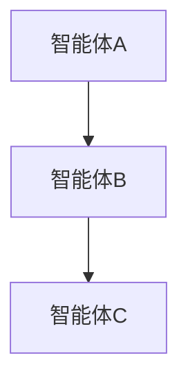
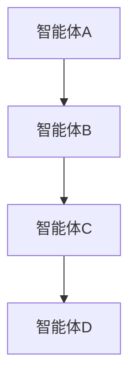
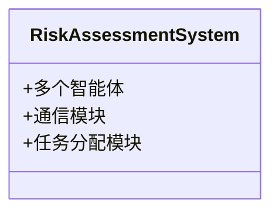
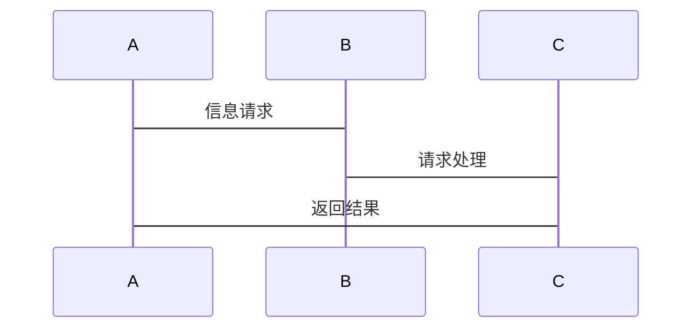

                 


# 利用多智能体AI优化监管风险评估流程

**关键词**：多智能体AI，监管风险评估，流程优化，算法原理，系统架构

**摘要**：本文探讨如何利用多智能体AI技术优化监管风险评估流程。通过分析传统方法的局限性，提出多智能体AI的应用优势，详细讲解其核心概念、算法原理，并通过系统架构设计和项目实战，展示实际应用案例。最后，总结经验教训，提供最佳实践建议，展望未来发展方向。

---

## 第一部分：背景介绍

### 第1章：问题背景与描述

#### 1.1 多智能体AI的背景

监管风险评估在金融、医疗、教育等领域至关重要，传统方法依赖人工分析，存在效率低、遗漏风险等问题。多智能体AI通过多个智能体协同工作，提高评估的全面性和准确性。

#### 1.2 问题描述

传统监管风险评估流程耗时长、效率低，人工错误率高。多智能体AI能够实时分析数据，协调处理复杂任务，减少遗漏风险。

---

## 第二部分：核心概念与联系

### 第2章：多智能体AI的核心概念

#### 2.1 多智能体AI的定义与特点

| **属性** | **传统AI** | **多智能体AI** |
|----------|------------|----------------|
| 单一智能体 | 独立运行    | 多个智能体协作 |
| 信息处理 | 单点处理    | 分布式处理    |
| 任务处理 | 单任务处理  | 多任务协作    |

#### 2.2 ER实体关系图架构

```mermaid
er
actor:监管机构
entity:风险评估报告
relationship:生成
```

---

## 第三部分：算法原理讲解

### 第3章：多智能体AI的算法原理

#### 3.1 协作与通信机制



```python
class Message:
    def __init__(self, sender, content):
        self.sender = sender
        self.content = content

class Agent:
    def __init__(self, name):
        self.name = name
        self.communication_channel = []

    def send(self, message):
        self.communication_channel.append(message)

    def receive(self):
        messages = self.communication_channel.copy()
        self.communication_channel.clear()
        return messages
```

#### 3.2 任务分配与协调



```python
def load_balancing_agents(agents, tasks):
    sorted_agents = sorted(agents, key=lambda x: x.load)
    for i in range(len(tasks)):
        agent = sorted_agents[i % len(sorted_agents)]
        agent.load += 1
    return agents
```

---

## 第四部分：系统分析与架构设计

### 第4章：系统分析与架构设计

#### 4.1 问题场景介绍

监管风险评估涉及多个数据源和评估维度，多智能体AI能够协调处理这些任务，提高评估效率。

#### 4.2 系统功能设计



#### 4.3 系统架构设计


#### 4.4 系统接口与交互设计



---

## 第五部分：项目实战

### 第5章：项目实战

#### 5.1 环境安装

安装Python和相关库，如`networkx`和`numpy`。

#### 5.2 核心代码实现

```python
class RiskAssessmentAgent(Agent):
    def __init__(self, name):
        super().__init__(name)
        self.risk_factors = []

    def assess_risk(self, data):
        # 数据处理和评估逻辑
        pass

    def communicate(self, message):
        received = self.receive()
        for msg in received:
            self.risk_factors.append(msg.content)
```

#### 5.3 代码解读与分析

- 每个智能体负责部分数据处理，通过通信模块交换信息，最终生成综合风险报告。

#### 5.4 案例分析

以金融监管为例，智能体分别分析财务数据、市场行为和合规记录，协同生成风险报告，及时预警潜在风险。

---

## 第六部分：最佳实践

### 第6章：最佳实践

#### 6.1 经验总结

- 合理分配任务，避免过载。
- 定期更新模型，适应新数据和规则。
- 确保通信机制高效，避免瓶颈。

#### 6.2 小结

多智能体AI优化监管风险评估流程，提高了效率和准确性，减少了人为错误。

#### 6.3 注意事项

- 数据隐私保护
- 系统容错设计
- 智能体间的信任机制

#### 6.4 拓展阅读

推荐书籍和论文，深入学习多智能体系统和AI技术。

---

**作者**：AI天才研究院 & 禅与计算机程序设计艺术

