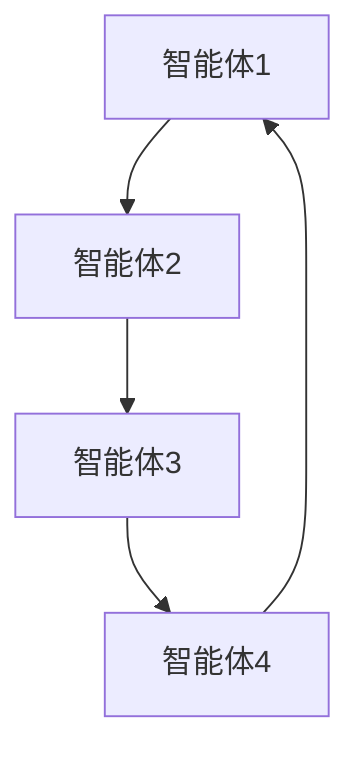
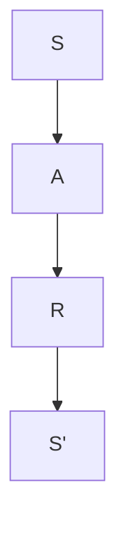

                 


# 利用多智能体AI分析数字化转型效果

> **关键词**：数字化转型，多智能体AI，协同学习，强化学习，系统架构，项目实战

> **摘要**：数字化转型是企业利用新技术优化业务流程、提升效率和竞争力的关键过程。多智能体AI作为一种新兴的技术，通过多个智能体的协作与学习，能够有效分析和优化数字化转型的效果。本文从多智能体AI的核心原理、系统架构、算法实现、实际案例等方面，详细探讨如何利用多智能体AI提升数字化转型的效果。通过分析多智能体AI的优势，结合实际案例，本文为读者提供了一套系统化的解决方案，帮助企业在数字化转型中实现更高效的管理和决策。

---

## 第一章：数字化转型与多智能体AI概述

### 1.1 数字化转型的背景

#### 1.1.1 什么是数字化转型
数字化转型（Digital Transformation）是指企业利用数字技术（如人工智能、大数据、云计算等）对业务流程、组织结构、文化模式等进行全方位、系统性地重新设计和优化，以实现业务创新和价值提升。数字化转型不仅仅是技术的更新，更是一种思维方式和商业模式的转变。

#### 1.1.2 数字化转型的核心目标
数字化转型的核心目标包括：
1. 提升企业效率：通过自动化和智能化手段，减少人工干预，提高业务处理速度。
2. 改善用户体验：通过数据分析和个性化服务，提供更优质的产品和服务。
3. 创新商业模式：利用数字技术探索新的业务模式和增长点。

#### 1.1.3 数字化转型的实施路径
数字化转型的实施路径通常包括以下几个阶段：
1. **战略规划**：明确转型目标和方向。
2. **技术选型**：选择适合的技术和工具。
3. **业务重构**：优化业务流程和组织结构。
4. **数据驱动**：利用数据进行决策和优化。
5. **持续改进**：通过反馈和迭代不断提升转型效果。

### 1.2 多智能体AI的定义与特点

#### 1.2.1 多智能体AI的基本概念
多智能体AI（Multi-Agent AI）是指由多个智能体（Agent）组成的系统，每个智能体都是一个能够感知环境、自主决策并采取行动的实体。多智能体AI的核心在于智能体之间的协作与通信。

#### 1.2.2 多智能体AI的核心特点
多智能体AI具有以下特点：
1. **分布式智能**：多个智能体协同工作，而非单一中心化决策。
2. **自主性**：每个智能体都能自主决策。
3. **协作性**：智能体之间通过通信和协作完成共同目标。
4. **动态性**：系统能够适应动态变化的环境。

#### 1.2.3 多智能体AI与传统AI的区别
| 特性               | 多智能体AI                            | 传统AI                              |
|--------------------|--------------------------------------|--------------------------------------|
| 决策主体           | 多个智能体协作                       | 单一中心化决策                      |
| 系统复杂性         | 更复杂，需要考虑智能体间的协作       | 较简单，决策集中在中心化系统        |
| 应用场景           | 适用于需要多方面协作的任务           | 适用于单点任务或简单问题            |

### 1.3 数字化转型与多智能体AI的关系

#### 1.3.1 多智能体AI在数字化转型中的作用
多智能体AI在数字化转型中的作用主要体现在以下几个方面：
1. **优化业务流程**：通过多个智能体协作，实现业务流程的优化。
2. **提升决策效率**：利用多智能体的协同学习能力，快速做出决策。
3. **增强系统弹性**：多智能体系统能够更好地应对复杂和动态的环境。

#### 1.3.2 多智能体AI如何提升数字化转型效果
多智能体AI通过以下方式提升数字化转型效果：
1. **协同学习**：多个智能体通过协作学习，提升整体系统的智能水平。
2. **分布式计算**：利用分布式计算能力，提高系统的处理效率。
3. **动态适应**：系统能够根据环境变化快速调整策略。

#### 1.3.3 多智能体AI的应用场景
多智能体AI在数字化转型中的应用场景包括：
1. **企业流程优化**：通过智能体协作优化业务流程。
2. **供应链管理**：利用多智能体AI优化供应链中的协作与调度。
3. **客户服务**：通过智能体协作提供更优质的服务。

---

## 第二章：多智能体AI的核心原理与算法

### 2.1 多智能体AI的核心原理

#### 2.1.1 多智能体系统的组成
多智能体系统由以下几个部分组成：
1. **智能体**：能够感知环境、自主决策并采取行动的实体。
2. **通信机制**：智能体之间进行信息交换的渠道。
3. **协作机制**：智能体之间协作完成共同目标的方式。
4. **环境**：智能体所处的外部环境。

#### 2.1.2 多智能体AI的通信机制
多智能体AI的通信机制包括以下几种形式：
1. **直接通信**：智能体之间通过共享内存或消息队列直接交换信息。
2. **间接通信**：智能体通过中间媒介（如数据库或消息队列）进行信息交换。

#### 2.1.3 多智能体AI的协作机制
多智能体AI的协作机制包括以下几种：
1. **协商协作**：智能体通过协商达成一致行动。
2. **分布式协作**：智能体在没有中心协调者的情况下自主协作。
3. **层次化协作**：智能体按层次结构进行协作。

### 2.2 多智能体AI的算法原理

#### 2.2.1 协同学习算法
协同学习（Collaborative Learning）是指多个智能体通过协作学习，共同提升整体系统的智能水平。协同学习的核心在于智能体之间的信息共享与策略协调。

**算法流程（使用 Mermaid）**：


#### 2.2.2 强化学习算法
强化学习（Reinforcement Learning）是一种通过智能体与环境交互，学习最优策略的方法。多智能体强化学习（Multi-Agent Reinforcement Learning, MARL）是强化学习在多智能体系统中的扩展。

**数学模型**：
- 状态空间：$S$
- 行动空间：$A$
- 奖励函数：$R: S \times A \rightarrow \mathbb{R}$

**算法流程（使用 Mermaid）**：


#### 2.2.3 联合推理算法
联合推理（Joint Inference）是指多个智能体通过协作推理，共同解决复杂问题。联合推理的核心在于智能体之间的信息共享与推理协调。

**数学模型**：
- 联合概率分布：$P(S, A)$
- 推理模型：$f(S, A) \rightarrow P(S')$

---

## 第三章：多智能体AI在数字化转型中的应用

### 3.1 多智能体AI在企业流程优化中的应用

#### 3.1.1 企业流程优化的痛点
企业流程优化的痛点包括：
1. **流程复杂性高**：企业流程涉及多个部门和环节，协调困难。
2. **信息孤岛**：各部门之间信息不共享，导致效率低下。
3. **决策延迟**：传统流程中决策依赖于人工审批，效率低下。

#### 3.1.2 多智能体AI如何优化企业流程
多智能体AI通过以下方式优化企业流程：
1. **自动化处理**：智能体自动处理流程中的任务。
2. **智能协调**：智能体之间协作解决流程中的冲突和瓶颈。
3. **实时反馈**：智能体实时监控流程状态，提供反馈和优化建议。

#### 3.1.3 实际案例分析
以某制造企业的生产流程优化为例，通过多智能体AI实现生产流程的自动化和智能化，大幅提升了生产效率。

### 3.2 多智能体AI在供应链管理中的应用

#### 3.2.1 供应链管理的挑战
供应链管理的挑战包括：
1. **供应链复杂性高**：涉及多个供应商、制造商和分销商。
2. **需求波动大**：市场需求波动大，难以预测。
3. **协作难度大**：供应链各环节之间的协作复杂。

#### 3.2.2 多智能体AI在供应链中的应用
多智能体AI通过以下方式优化供应链管理：
1. **智能预测**：智能体通过协同学习预测需求变化。
2. **智能调度**：智能体协作优化物流和库存管理。
3. **实时监控**：智能体实时监控供应链状态，及时发现和解决问题。

#### 3.2.3 实际案例分析
以某物流企业的供应链优化为例，通过多智能体AI实现物流调度的智能化，大幅降低了物流成本。

### 3.3 多智能体AI在客户服务中的应用

#### 3.3.1 客户服务的痛点
客户服务的痛点包括：
1. **服务响应慢**：客户问题需要人工处理，响应时间长。
2. **服务质量参差不齐**：人工客服难以保证服务质量一致性。
3. **客户体验差**：客户对服务不满意，影响企业形象。

#### 3.3.2 多智能体AI如何提升客户服务
多智能体AI通过以下方式提升客户服务：
1. **智能客服**：智能体通过自然语言处理（NLP）技术实现智能客服。
2. **协同服务**：多个智能体协作提供更优质的服务。
3. **实时反馈**：智能体实时监控客户反馈，优化服务流程。

#### 3.3.3 实际案例分析
以某银行的客户服务优化为例，通过多智能体AI实现客户服务的智能化，提升了客户满意度和效率。

---

## 第四章：多智能体AI系统的架构与实现

### 4.1 系统架构设计

#### 4.1.1 分层架构设计
多智能体AI系统的分层架构包括以下层次：
1. **感知层**：负责感知环境信息。
2. **决策层**：负责制定决策策略。
3. **执行层**：负责执行决策任务。

#### 4.1.2 分布式架构设计
多智能体AI系统的分布式架构包括以下部分：
1. **智能体节点**：负责处理具体的任务。
2. **通信模块**：负责智能体之间的信息交换。
3. **协调模块**：负责智能体之间的协作与协调。

#### 4.1.3 系统功能设计
系统功能设计包括：
1. **智能体管理**：管理多个智能体的生命周期。
2. **协作机制**：实现智能体之间的协作与通信。
3. **决策算法**：实现多智能体AI的核心算法。

### 4.2 系统实现

#### 4.2.1 环境安装
系统实现需要以下环境：
1. **编程语言**：Python
2. **框架**：如TensorFlow、PyTorch
3. **工具**：如Mermaid、Jupyter Notebook

#### 4.2.2 核心代码实现
以下是多智能体AI系统的核心代码实现（Python示例）：
```python
class Agent:
    def __init__(self, id):
        self.id = id
        self.state = None
        self.policy = None

    def perceive(self, environment):
        self.state = environment.get_state()

    def decide(self):
        action = self.policy.act(self.state)
        return action

    def learn(self, reward):
        self.policy.update(reward)
```

#### 4.2.3 系统交互设计
系统交互设计包括以下部分：
1. **用户界面**：供用户与系统交互的界面。
2. **智能体接口**：供智能体之间通信的接口。
3. **数据接口**：供系统与外部数据源交互的接口。

---

## 第五章：项目实战

### 5.1 项目背景与目标
项目背景：某企业希望利用多智能体AI技术优化其业务流程。

项目目标：
1. 实现多智能体AI系统。
2. 优化企业的业务流程。
3. 提升企业的效率和竞争力。

### 5.2 项目实施步骤

#### 5.2.1 环境安装
安装所需的编程语言和框架：
```bash
pip install python
pip install tensorflow
pip install pytorch
```

#### 5.2.2 核心代码实现
实现多智能体AI的核心代码：
```python
class MultiAgentSystem:
    def __init__(self, num_agents):
        self.agents = [Agent(i) for i in range(num_agents)]
        self.environment = Environment()

    def run(self):
        while True:
            for agent in self.agents:
                agent.perceive(self.environment)
                action = agent.decide()
                self.environment.apply_action(action)
                agent.learn(self.environment.get_reward())
```

#### 5.2.3 项目案例分析
以优化企业的生产流程为例，通过多智能体AI实现生产流程的自动化和智能化，提升生产效率。

#### 5.2.4 项目总结
项目总结包括：
1. 项目成果：成功实现多智能体AI系统，优化了企业的业务流程。
2. 项目经验：总结项目实施中的经验和教训。
3. 项目展望：未来进一步优化系统，扩展应用场景。

---

## 第六章：最佳实践与未来展望

### 6.1 最佳实践

#### 6.1.1 系统设计
1. **模块化设计**：将系统划分为多个模块，便于维护和扩展。
2. **可扩展性设计**：确保系统能够适应未来的需求变化。

#### 6.1.2 数据处理
1. **数据清洗**：确保数据的准确性和完整性。
2. **数据存储**：选择合适的数据库进行数据存储。

#### 6.1.3 算法选择
1. **算法优化**：选择适合的算法并进行优化。
2. **算法评估**：通过实验评估算法的性能。

#### 6.1.4 系统优化
1. **性能优化**：通过并行计算等技术提升系统性能。
2. **系统监控**：实时监控系统状态，及时发现和解决问题。

### 6.2 小结
通过多智能体AI技术，企业能够更高效地优化业务流程，提升效率和竞争力。多智能体AI的优势在于其分布式智能和协作能力，能够在复杂环境中实现高效的决策和优化。

### 6.3 未来展望
未来，随着人工智能技术的不断发展，多智能体AI将在更多领域得到应用，为企业数字化转型提供更强大的支持。同时，多智能体AI技术也将更加成熟，应用场景将更加广泛。

---

## 作者：AI天才研究院/AI Genius Institute & 禅与计算机程序设计艺术 /Zen And The Art of Computer Programming

