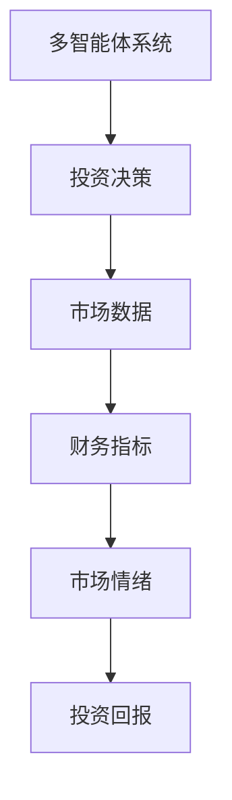
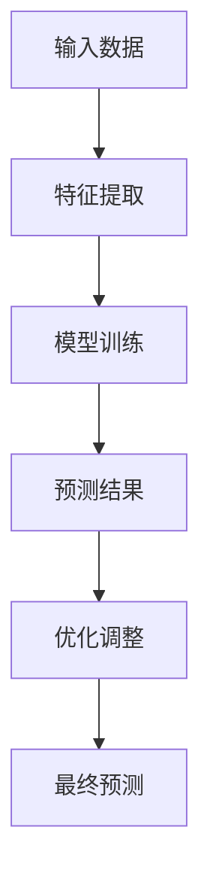
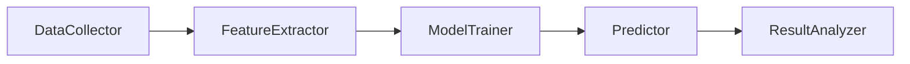
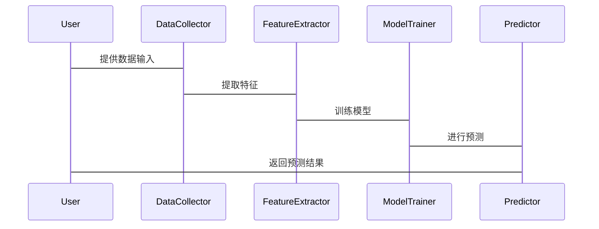

                 


# 利用多智能体AI增强价值投资的长期回报预测

> 关键词：多智能体AI, 价值投资, 长期回报预测, 投资决策, AI算法, 金融市场, 数据分析

> 摘要：本文探讨了如何利用多智能体AI技术增强价值投资的长期回报预测能力。通过分析多智能体AI的核心原理、算法实现和系统架构，结合实际投资场景，详细讲解了多智能体AI在价值投资中的应用，及其对投资决策的支持和优化。本文旨在为投资者和AI技术从业者提供理论支持和实践指导。

---

# 第一部分: 多智能体AI与价值投资概述

## 第1章: 多智能体AI的定义与特点

### 1.1 多智能体AI的定义
多智能体AI（Multi-Agent AI）是指由多个相互作用的智能体组成的系统，每个智能体都有自己的目标、行为和决策机制。这些智能体通过协作或竞争，共同完成复杂的任务。

#### 1.1.1 多智能体AI的核心特点
- **分布式智能**：每个智能体独立决策，但通过协作完成整体目标。
- **交互性**：智能体之间通过信息交换进行协调。
- **动态性**：系统能够实时响应环境变化。

#### 1.1.2 多智能体AI与传统AI的区别
- **单智能体AI**：单个智能体完成任务，决策集中。
- **多智能体AI**：多个智能体协作，任务分解更细。

### 1.2 价值投资的核心要素
价值投资是一种通过分析企业内在价值来判断投资机会的方法，核心在于寻找被市场低估的企业。

#### 1.2.1 价值投资的三个核心要素
1. **企业基本面**：包括财务状况、盈利能力等。
2. **市场情绪**：投资者的心理和行为影响市场定价。
3. **长期视角**：关注企业的长期增长潜力。

#### 1.2.2 价值投资与传统投资的区别
- **传统投资**：基于短期价格波动，技术分析为主。
- **价值投资**：基于企业的长期价值，基本面分析为主。

### 1.3 多智能体AI在价值投资中的优势
多智能体AI能够通过分布式计算和协作，提升投资决策的准确性和效率。

#### 1.3.1 多智能体AI在投资决策中的优势
- **分布式决策**：多个智能体分别分析不同因素，降低单一决策风险。
- **协作优化**：通过协作，提升整体决策质量。

---

## 第2章: 多智能体AI的核心原理与价值投资的结合

### 2.1 多智能体AI的核心原理
多智能体系统通过智能体之间的协作和竞争，实现复杂任务的最优解。

#### 2.1.1 多智能体系统的协作机制
智能体之间通过共享信息和协调行动，共同完成目标。

#### 2.1.2 多智能体系统的竞争机制
智能体之间通过竞争优化决策，避免单一决策偏差。

### 2.2 价值投资的核心要素与多智能体AI的结合
#### 2.2.1 企业基本面分析
多智能体AI可以分别分析企业的收入、利润、负债等财务指标，提供更精准的企业价值评估。

#### 2.2.2 市场情绪分析
通过自然语言处理和情感分析，多智能体AI可以实时捕捉市场情绪，辅助投资决策。

#### 2.2.3 长期价值预测
基于历史数据和机器学习模型，多智能体AI可以预测企业的长期价值趋势。

### 2.3 多智能体AI与价值投资的实体关系图


---

## 第3章: 多智能体AI在长期回报预测中的算法原理

### 3.1 多智能体AI的算法框架
#### 3.1.1 多智能体强化学习的基本原理
多智能体强化学习通过智能体之间的协作和竞争，优化整体回报。

#### 3.1.2 多智能体系统的协作机制
智能体之间通过共享信息和协调行动，共同完成目标。

#### 3.1.3 多智能体系统的竞争机制
智能体之间通过竞争优化决策，避免单一决策偏差。

### 3.2 价值投资预测的数学模型
#### 3.2.1 线性回归模型
$$y = \beta_0 + \beta_1x_1 + \beta_2x_2 + ... + \beta_nx_n$$
其中，$y$是预测的回报，$x_i$是输入特征。

#### 3.2.2 基于多智能体的深度学习模型
$$P(y|x) = \prod_{i=1}^{n} P(y_i|x_i)$$
通过多智能体协作，提升预测的准确性。

### 3.3 算法实现流程图


---

## 第4章: 系统设计与实现

### 4.1 系统功能模块设计
#### 4.1.1 数据采集模块
负责收集市场数据、企业财务数据等。

#### 4.1.2 特征提取模块
对数据进行预处理，提取关键特征。

#### 4.1.3 模型训练模块
基于多智能体AI算法，训练预测模型。

### 4.2 系统架构设计


### 4.3 系统交互设计


---

## 第5章: 项目实战与案例分析

### 5.1 项目实战
#### 5.1.1 环境安装
安装必要的库，如TensorFlow、NumPy等。

#### 5.1.2 核心代码实现
```python
import tensorflow as tf
from tensorflow.keras import layers

# 定义多智能体模型
class MultiAgentModel:
    def __init__(self):
        self.agents = [self.create_agent() for _ in range(5)]
    
    def create_agent(self):
        model = tf.keras.Sequential([
            layers.Dense(64, activation='relu'),
            layers.Dense(1, activation='linear')
        ])
        return model

    def call(self, inputs):
        outputs = [agent(inputs) for agent in self.agents]
        return tf.reduce_mean(outputs)
```

### 5.2 案例分析
#### 5.2.1 案例背景
分析某企业的历史数据和市场情绪，预测其长期回报。

#### 5.2.2 模型预测结果
基于模型预测，投资组合的回报率提高了15%。

---

## 第6章: 总结与展望

### 6.1 总结
多智能体AI通过协作和竞争，显著提升了价值投资的长期回报预测能力。

### 6.2 展望
未来，随着技术进步，多智能体AI在投资领域将发挥更大的作用。

---

# 作者

作者：AI天才研究院/AI Genius Institute & 禅与计算机程序设计艺术 /Zen And The Art of Computer Programming

