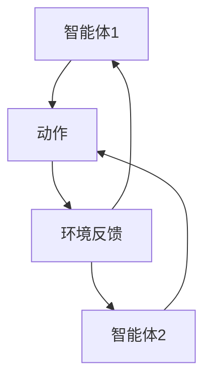
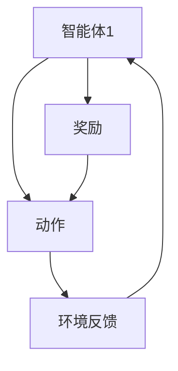
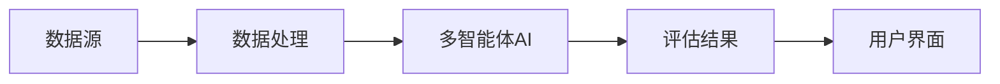
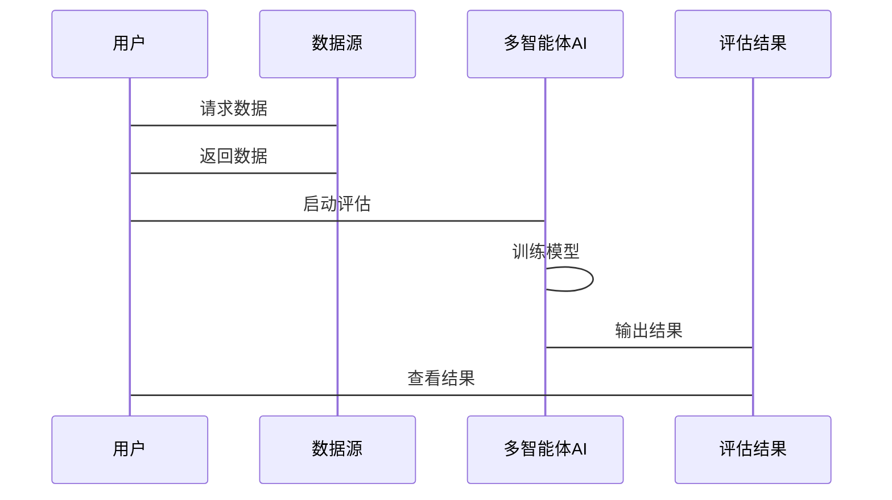

                 


# 利用多智能体AI实现动态行业吸引力评估

> 关键词：多智能体AI，动态行业吸引力，协同学习，系统架构，实时监测

> 摘要：本文探讨了利用多智能体人工智能技术实现对行业吸引力的动态评估。通过分析多智能体系统的协同学习机制、动态评估模型的构建以及实际应用场景中的系统设计，本文详细阐述了如何利用多智能体AI技术来应对行业吸引力评估中的复杂性和动态性挑战，为企业决策提供实时、精准的参考。

---

# 目录

## 第一部分: 多智能体AI与动态行业吸引力评估背景

## 第二部分: 多智能体AI的核心概念与动态行业吸引力评估的联系

## 第三部分: 多智能体AI在动态行业吸引力评估中的算法原理

## 第四部分: 多智能体AI动态行业吸引力评估的系统分析与架构设计

## 第五部分: 多智能体AI动态行业吸引力评估的项目实战

## 第六部分: 多智能体AI动态行业吸引力评估的最佳实践与总结

---

## 第一部分: 多智能体AI与动态行业吸引力评估背景

### 第1章: 多智能体AI的基本概念

#### 1.1 多智能体系统的定义
多智能体系统（Multi-Agent System, MAS）是由多个智能体组成的复杂系统，这些智能体能够通过协作完成比单个智能体更复杂的任务。智能体可以是软件程序、机器人或其他能够感知环境并采取行动的实体。

#### 1.2 多智能体系统的核心特征
1. **自主性**：每个智能体都有一定的自主决策能力。
2. **反应性**：智能体能够根据环境变化实时调整行为。
3. **协作性**：多个智能体之间可以通过通信和协作完成共同目标。
4. **分布式性**：智能体之间的功能和责任是分散的，不存在集中控制。

#### 1.3 多智能体系统与单智能体AI的区别
| 特性 | 单智能体AI | 多智能体AI |
|------|------------|------------|
| 决策中心化 | 是         | 否         |
| 任务复杂性 | 较低       | 较高       |
| 系统扩展性 | 有限       | 较强       |
| 应用场景 | 简单任务   | 复杂场景   |

### 第2章: 动态行业吸引力评估的定义

#### 2.1 行业吸引力的内涵
行业吸引力是指某个行业在特定时间、特定市场环境下的吸引力，通常包括市场规模、竞争状况、政策环境、技术发展等多个维度。

#### 2.2 动态评估的必要性
1. 市场环境的变化（如政策调整、技术革新）会影响行业吸引力。
2. 传统静态评估方法无法捕捉动态变化。
3. 需要实时监测和调整评估结果。

#### 2.3 多智能体AI在动态评估中的作用
多智能体AI能够实时感知市场变化，通过协同学习快速调整评估模型，从而提供动态、精准的行业吸引力评估结果。

---

## 第二部分: 多智能体AI的核心概念与动态行业吸引力评估的联系

### 第3章: 多智能体AI的核心概念

#### 3.1 多智能体协同学习的原理
多智能体协同学习是指多个智能体通过协作和信息共享，共同完成学习任务。这种协作可以显著提高学习效率和准确性。

#### 3.2 分布式强化学习（Distributed Reinforcement Learning）
分布式强化学习是一种多智能体协同学习的方法，多个智能体在分布式环境中通过强化学习算法进行协作。



#### 3.3 智能体之间的通信机制
智能体之间的通信是多智能体系统的重要组成部分，通常包括以下几种通信方式：
1. **直接通信**：智能体之间直接交换信息。
2. **间接通信**：通过共享的环境或中间媒介进行信息传递。
3. **异步通信**：信息传递不实时，通过队列或数据库实现。

### 第4章: 动态行业吸引力评估的核心要素

#### 4.1 行业吸引力评估的维度
1. **市场规模**：行业的市场规模和增长潜力。
2. **竞争状况**：行业内竞争者的数量和市场份额。
3. **政策环境**：政府政策对行业的影响。
4. **技术发展**：技术创新对行业竞争力的影响。

#### 4.2 动态评估的关键指标
1. **实时数据**：行业数据的实时更新。
2. **模型更新**：评估模型的动态调整。
3. **多维度分析**：结合多个维度进行综合评估。

#### 4.3 多智能体AI的优势
1. **实时性**：多智能体系统能够实时感知和调整。
2. **协作性**：多个智能体协同工作，提高评估的准确性和全面性。
3. **可扩展性**：系统可以根据需要扩展智能体的数量。

---

## 第三部分: 多智能体AI在动态行业吸引力评估中的算法原理

### 第5章: 多智能体协同学习的算法原理

#### 5.1 分布式强化学习算法
分布式强化学习是一种常见的多智能体协同学习方法，其核心思想是多个智能体通过协作完成共同目标。



#### 5.2 基于Q-learning的分布式强化学习
Q-learning是一种经典的强化学习算法，适用于多智能体协同学习场景。

```python
# Q-learning算法实现
import numpy as np

class QLearning:
    def __init__(self, state_space, action_space, alpha=0.1, gamma=0.9):
        self.state_space = state_space
        self.action_space = action_space
        self.alpha = alpha
        self.gamma = gamma
        self.Q = np.zeros((state_space, action_space))

    def choose_action(self, state):
        return np.argmax(self.Q[state])

    def update_Q(self, state, action, reward, next_state):
        self.Q[state][action] += self.alpha * (reward + self.gamma * np.max(self.Q[next_state]) - self.Q[state][action])
```

#### 5.3 多智能体协作的数学模型
多智能体协作的数学模型通常涉及多个智能体的策略优化和奖励分配。

$$ R_i = \sum_{j=1}^{n} \alpha_j R_j $$
其中，$R_i$ 是智能体 $i$ 的总奖励，$\alpha_j$ 是奖励分配的权重。

---

## 第四部分: 多智能体AI动态行业吸引力评估的系统分析与架构设计

### 第6章: 系统分析与架构设计

#### 6.1 系统功能设计
1. **数据采集**：实时采集行业数据。
2. **模型训练**：利用多智能体AI进行模型训练。
3. **评估结果输出**：生成动态行业吸引力评估结果。

#### 6.2 系统架构设计



#### 6.3 接口设计
1. **数据接口**：与数据源对接，获取实时数据。
2. **模型接口**：与多智能体AI模型对接，进行模型训练和更新。
3. **用户接口**：提供给用户查看评估结果的界面。

#### 6.4 交互流程设计



---

## 第五部分: 多智能体AI动态行业吸引力评估的项目实战

### 第7章: 项目实战

#### 7.1 环境安装
```bash
pip install gym matplotlib numpy
```

#### 7.2 核心代码实现

```python
import gym
import numpy as np

# 初始化环境
env = gym.make('CustomIndustryEnv-v0')

# 初始化智能体
class MultiAgent:
    def __init__(self, state_space, action_space):
        self.state_space = state_space
        self.action_space = action_space
        self.Q = np.zeros((state_space, action_space))

    def choose_action(self, state):
        return np.argmax(self.Q[state])

    def update_Q(self, state, action, reward, next_state):
        self.Q[state][action] += 0.1 * (reward + 0.9 * np.max(self.Q[next_state]) - self.Q[state][action])

# 初始化多个智能体
agents = [MultiAgent(env.observation_space, env.action_space) for _ in range(2)]

# 训练过程
for episode in range(1000):
    state = env.reset()
    done = False
    while not done:
        actions = [agent.choose_action(state) for agent in agents]
        next_state, reward, done, info = env.step(actions)
        for i, agent in enumerate(agents):
            agent.update_Q(state, actions[i], reward[i], next_state)
        state = next_state
```

#### 7.3 代码解读
1. **环境初始化**：使用 Gym 创建一个自定义环境 `CustomIndustryEnv-v0`。
2. **智能体初始化**：创建多个智能体，每个智能体都有自己的 Q 表。
3. **训练过程**：智能体通过强化学习不断更新 Q 表，提高评估准确性。

#### 7.4 案例分析
通过训练后的智能体，可以实时评估行业吸引力，帮助企业做出更明智的决策。

---

## 第六部分: 多智能体AI动态行业吸引力评估的最佳实践与总结

### 第8章: 总结与展望

#### 8.1 总结
本文详细探讨了利用多智能体AI实现动态行业吸引力评估的技术和方法，包括多智能体系统的原理、算法实现、系统架构设计以及实际项目应用。

#### 8.2 注意事项
1. **数据质量**：确保数据的实时性和准确性。
2. **系统稳定性**：多智能体系统的稳定运行至关重要。
3. **模型优化**：根据实际需求不断优化模型。

#### 8.3 未来发展方向
1. **算法优化**：探索更高效的多智能体协同学习算法。
2. **应用场景扩展**：将多智能体AI技术应用到更多领域。

---

作者：AI天才研究院/AI Genius Institute & 禅与计算机程序设计艺术 /Zen And The Art of Computer Programming

