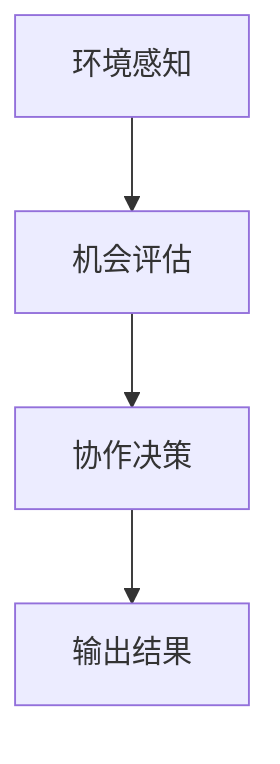
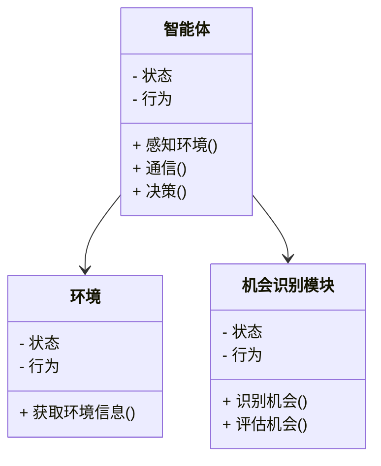
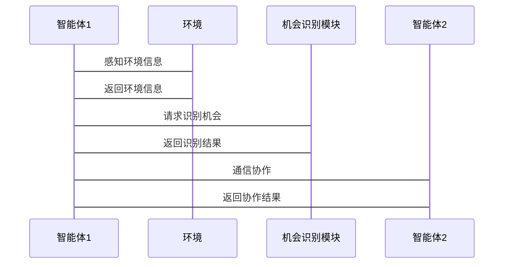

                 


# 利用多智能体AI实现动态行业转型机会识别

> 关键词：多智能体AI，动态行业转型，机会识别，协作机制，系统架构

> 摘要：本文深入探讨了多智能体AI在动态行业转型机会识别中的应用。通过分析多智能体AI的核心原理、算法设计和系统架构，结合实际案例，展示了如何利用多智能体AI技术在复杂动态环境中识别和把握行业转型机会。本文旨在为读者提供从理论到实践的全面指导，帮助企业在数字化转型中抢占先机。

---

## 第一部分: 多智能体AI与动态行业转型概述

### 第1章: 多智能体AI与动态行业转型概述

#### 1.1 多智能体AI的基本概念

##### 1.1.1 多智能体系统的定义
多智能体系统（Multi-Agent System, MAS）是由多个智能体（Agent）组成的分布式系统，每个智能体都是一个能够感知环境、自主决策的实体。多智能体系统通过智能体之间的协作与通信，共同完成复杂任务。

##### 1.1.2 多智能体AI的核心特征
- **自主性**：智能体能够自主决策。
- **反应性**：智能体能够实时感知环境并做出反应。
- **协作性**：智能体之间能够通过通信和协作完成复杂任务。
- **分布式性**：智能体分布在网络中，不存在中心控制节点。

##### 1.1.3 多智能体AI与传统AI的区别
传统AI（如单智能体系统）依赖于预定义的规则和数据，而多智能体AI通过智能体之间的协作，能够更好地应对复杂和动态的环境。

#### 1.2 动态行业转型的背景与挑战

##### 1.2.1 行业动态转型的定义
行业动态转型是指企业为了适应市场变化、技术进步和客户需求，不断调整和优化自身的业务模式、组织结构和技术架构的过程。

##### 1.2.2 数字化转型的现状与趋势
随着数字化转型的深入，企业需要更加灵活地应对市场变化，利用新技术（如AI、大数据）实现业务创新。

##### 1.2.3 动态行业转型的核心问题
- **不确定性**：市场环境复杂多变，难以预测。
- **多样性**：不同行业、不同企业的转型需求差异大。
- **实时性**：需要快速响应市场变化。

#### 1.3 多智能体AI在行业转型中的作用

##### 1.3.1 多智能体AI的优势
- **分布式协作**：能够高效地协调多个部门或业务单元。
- **实时响应**：能够快速适应环境变化。
- **智能决策**：通过多智能体协作实现更优的决策。

##### 1.3.2 多智能体AI在机会识别中的应用
- **市场分析**：识别市场趋势和机会。
- **竞争分析**：分析竞争对手的动态。
- **风险评估**：评估转型过程中可能遇到的风险。

##### 1.3.3 多智能体AI与行业转型的结合
通过多智能体AI技术，企业可以更高效地识别和把握转型机会，降低转型成本，提高转型成功率。

---

## 第二部分: 多智能体AI的核心理论与技术

### 第2章: 多智能体AI的核心理论与技术

#### 2.1 多智能体系统的结构与协作机制

##### 2.1.1 多智能体系统的组成
- **智能体**：系统的基本单元，负责执行具体任务。
- **环境**：智能体所处的外部环境。
- **通信机制**：智能体之间交换信息的方式。
- **协作机制**：智能体之间协调合作的方式。

##### 2.1.2 多智能体协作的基本原理
- **分布式计算**：任务分解为多个子任务，由不同智能体分别执行。
- **通信协议**：智能体之间通过预定义的协议进行信息交换。
- **协作策略**：智能体根据环境信息和任务需求，动态调整协作方式。

##### 2.1.3 多智能体系统的通信协议
- **基于消息传递的通信**：智能体通过发送消息进行信息交换。
- **基于订阅-发布模型的通信**：智能体通过订阅感兴趣的信息源，接收实时更新。

#### 2.2 多智能体AI的算法基础

##### 2.2.1 基于强化学习的多智能体协作
- **强化学习的基本原理**：智能体通过与环境交互，学习最优策略。
- **多智能体强化学习**：多个智能体通过协作，共同学习最优策略。

##### 2.2.2 基于博弈论的多智能体决策
- **博弈论的基本原理**：分析多个决策者之间的互动和博弈关系。
- **纳什均衡**：所有智能体都采取最优策略，使得任何单个智能体都无法通过单方面改变策略而受益。

##### 2.2.3 多智能体系统的优化算法
- **分布式优化算法**：将任务分解为多个子任务，分别优化后进行组合。
- **协同优化算法**：通过智能体之间的协作，共同优化整体目标。

---

## 第三部分: 动态机会识别的算法原理

### 第3章: 动态机会识别的算法原理

#### 3.1 动态机会识别的定义与挑战

##### 3.1.1 动态机会识别的定义
动态机会识别是指在复杂、动态的环境中，快速发现和评估潜在机会的过程。

##### 3.1.2 动态环境中的机会识别难点
- **环境复杂性**：环境信息多变，难以预测。
- **信息不完全性**：部分信息缺失，影响决策。
- **实时性要求高**：需要快速做出决策。

##### 3.1.3 多智能体AI在动态机会识别中的优势
- **分布式感知**：多个智能体同时感知环境，提高信息获取能力。
- **协作推理**：通过智能体之间的协作，提高推理能力。

#### 3.2 多智能体协作算法

##### 3.2.1 基于分布式计算的协作算法
- **分布式计算的基本原理**：任务分解为多个子任务，由不同智能体分别执行。
- **分布式协作的优势**：提高系统的可扩展性和容错性。

##### 3.2.2 基于图神经网络的协作机制
- **图神经网络的基本原理**：通过图结构表示智能体之间的关系，进行信息传播和特征提取。
- **图神经网络的优势**：能够处理复杂的智能体关系，提高协作效果。

##### 3.2.3 基于强化学习的协作策略
- **强化学习的基本原理**：智能体通过与环境交互，学习最优策略。
- **多智能体强化学习的优势**：能够动态调整协作策略，适应环境变化。

#### 3.3 动态机会识别的数学模型

##### 3.3.1 动态机会识别的数学表达
$$ \text{机会识别} = \sum_{i=1}^{n} w_i \cdot x_i $$
其中，\( w_i \) 是特征 \( x_i \) 的权重，\( n \) 是特征数量。

##### 3.3.2 多智能体协作的数学模型
$$ \text{协作效果} = \sum_{i=1}^{m} f_i(x_i) $$
其中，\( f_i \) 是智能体 \( i \) 的处理函数，\( x_i \) 是输入数据。

##### 3.3.3 动态环境下的优化目标函数
$$ \text{优化目标} = \min_{\theta} \sum_{i=1}^{k} (y_i - f_{\theta}(x_i))^2 $$
其中，\( \theta \) 是模型参数，\( y_i \) 是目标值，\( x_i \) 是输入数据。

---

## 第四部分: 系统架构与设计

### 第4章: 系统架构与设计

#### 4.1 系统架构概述

##### 4.1.1 系统组成模块
- **机会识别模块**：负责发现和评估潜在机会。
- **多智能体协作模块**：负责智能体之间的协作与通信。
- **结果分析模块**：负责分析协作结果，优化系统性能。

##### 4.1.2 系统功能模块划分
- **输入模块**：接收环境信息和任务需求。
- **处理模块**：执行机会识别和协作推理。
- **输出模块**：输出识别结果和协作策略。

##### 4.1.3 系统架构的可扩展性
- **模块化设计**：各模块独立开发，便于扩展和维护。
- **接口标准化**：模块之间通过标准化接口进行通信，提高系统的灵活性。

#### 4.2 系统功能设计

##### 4.2.1 动态机会识别的功能模块
- **环境感知模块**：感知环境信息，提取特征。
- **机会评估模块**：评估潜在机会的可行性和价值。

##### 4.2.2 多智能体协作的功能模块
- **通信模块**：实现智能体之间的信息交换。
- **协作决策模块**：制定协作策略，优化协作效果。

##### 4.2.3 系统功能的流程图


#### 4.3 系统架构的实现细节

##### 4.3.1 系统架构的类图


##### 4.3.2 系统架构的交互图


---

## 第五部分: 项目实战

### 第5章: 项目实战

#### 5.1 项目背景与目标

##### 5.1.1 项目背景
- **行业选择**：选择一个具体行业（如金融、零售）。
- **项目目标**：利用多智能体AI技术，实现动态机会识别。

#### 5.2 项目环境搭建

##### 5.2.1 环境安装
- **Python**：安装Python 3.8及以上版本。
- **TensorFlow**：安装TensorFlow和Keras。
- **numpy**：安装numpy库。
- **其他依赖**：根据具体需求安装其他库。

#### 5.3 核心代码实现

##### 5.3.1 多智能体协作算法实现
```python
import tensorflow as tf
import numpy as np

class Agent:
    def __init__(self, input_dim, output_dim):
        self.model = self.build_model(input_dim, output_dim)
        self.optimizer = tf.keras.optimizers.Adam(learning_rate=0.001)
    
    def build_model(self, input_dim, output_dim):
        model = tf.keras.Sequential([
            tf.keras.layers.Dense(64, activation='relu', input_dim=input_dim),
            tf.keras.layers.Dense(output_dim, activation='softmax')
        ])
        return model
    
    def act(self, state):
        prediction = self.model.predict(np.array([state]))
        return np.argmax(prediction[0])
    
    def update(self, state, action, reward):
        target = np.zeros((1, self.model.output_shape[-1]))
        target[0][action] = reward
        self.model.fit(np.array([state]), target, epochs=1, verbose=0)
```

##### 5.3.2 动态机会识别算法实现
```python
def dynamic_opportunity Recognition(environment, agents):
    opportunities = []
    for agent in agents:
        state = environment.get_state()
        action = agent.act(state)
        reward = environment.get_reward(action)
        agent.update(state, action, reward)
        opportunities.append((action, reward))
    return opportunities
```

#### 5.4 实际案例分析

##### 5.4.1 案例背景
假设我们选择零售行业，目标是通过多智能体AI技术，识别市场趋势和机会。

##### 5.4.2 案例实现
```python
environment = RetailEnvironment()
agents = [Agent(input_dim=10, output_dim=5), Agent(input_dim=10, output_dim=5)]
opportunities = dynamic_opportunity_Recognition(environment, agents)
```

##### 5.4.3 案例分析
通过上述代码，我们可以识别出多个潜在机会，并根据奖励值选择最优机会。

#### 5.5 项目总结

##### 5.5.1 项目总结
通过本项目，我们成功实现了多智能体AI在动态机会识别中的应用，验证了算法的有效性和可行性。

##### 5.5.2 项目经验
- **算法优化**：需要进一步优化多智能体协作算法，提高识别精度。
- **系统扩展性**：需要进一步增强系统的扩展性，支持更多智能体和更复杂的环境。

---

## 第六部分: 总结与展望

### 第6章: 总结与展望

#### 6.1 总结

##### 6.1.1 核心内容回顾
- **多智能体AI的核心原理**：自主性、协作性、分布式性。
- **动态机会识别的算法设计**：基于强化学习、博弈论的协作算法。
- **系统架构设计**：模块化设计、标准化接口。

#### 6.2 展望

##### 6.2.1 当前技术的局限性
- **计算资源限制**：多智能体协作需要大量的计算资源。
- **算法优化**：需要进一步优化多智能体协作算法，提高识别精度。

##### 6.2.2 未来发展方向
- **结合边缘计算**：通过边缘计算优化多智能体协作的实时性和效率。
- **强化学习优化**：进一步优化强化学习算法，提高协作效果。

#### 6.3 最佳实践 Tips

##### 6.3.1 实践建议
- **选择合适的工具链**：根据需求选择合适的开发框架和库。
- **注重系统扩展性**：设计系统时，注重模块化和标准化接口。
- **持续优化算法**：根据实际需求，不断优化算法和模型。

##### 6.3.2 注意事项
- **数据隐私**：注意数据隐私和安全问题。
- **系统稳定性**：确保系统的稳定性和容错性。
- **可解释性**：注重算法的可解释性，便于调试和优化。

##### 6.3.3 拓展阅读
- **推荐书籍**：《Multi-Agent Systems: Algorithmic, Complexity Theoretic, and Game Theoretic Foundations》。
- **推荐论文**：《Multi-Agent Reinforcement Learning: A Survey》。

---

## 作者信息

作者：AI天才研究院/AI Genius Institute & 禅与计算机程序设计艺术/Zen And The Art of Computer Programming

---

通过以上内容，您可以系统地学习和理解多智能体AI在动态行业转型机会识别中的应用，从理论到实践，逐步掌握相关技术和方法。

