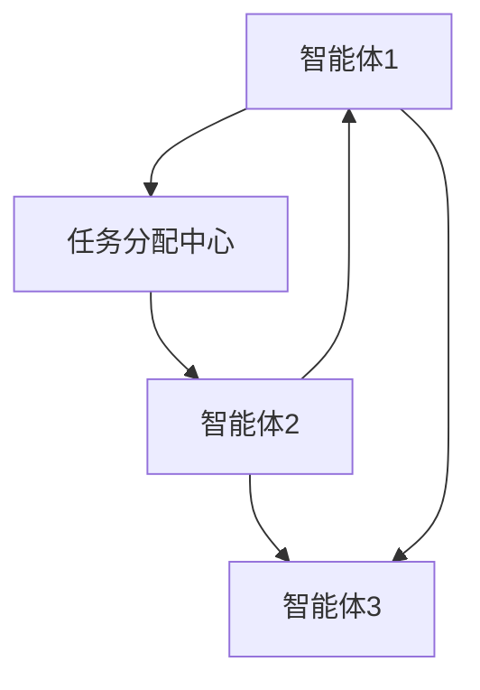
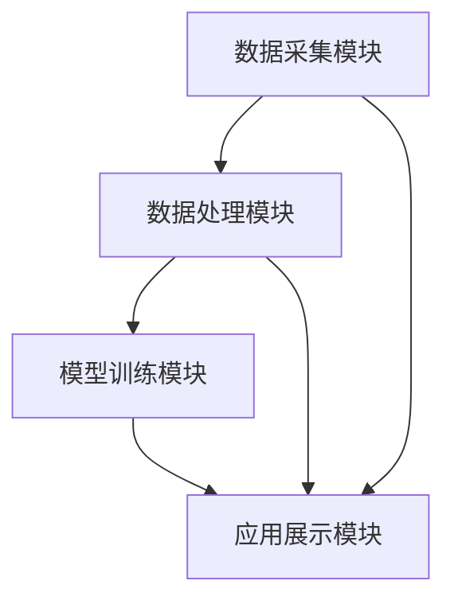
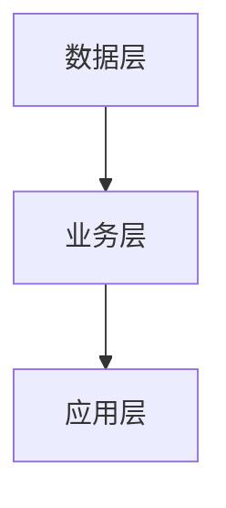
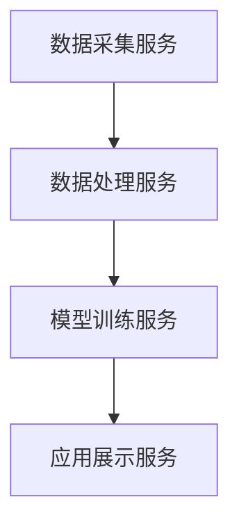

                 


# 利用多智能体AI实现巴菲特式的行业领导者识别

> 关键词：多智能体AI，巴菲特投资理念，行业领导者识别，分布式计算，强化学习，企业价值评估

> 摘要：本文探讨了如何利用多智能体人工智能技术实现类似巴菲特的投资理念，即通过分析企业的基本面和市场趋势，识别行业领导者。文章从多智能体AI的核心概念、算法原理、系统架构到实际项目实现进行了全面分析，提出了基于多智能体AI的行业领导者识别方法，并通过案例分析展示了该方法的实际应用效果。

---

# 第一章: 多智能体AI与巴菲特投资理念概述

## 1.1 多智能体AI的定义与特点

### 1.1.1 多智能体AI的定义
多智能体AI（Multi-Agent AI）是指由多个相互作用的智能体组成的系统，这些智能体通过协作或竞争完成特定任务。与传统的单一智能体不同，多智能体系统能够更好地模拟现实世界中复杂的交互关系。

### 1.1.2 多智能体AI的核心特点
- **分布式计算**：多个智能体独立运行，通过通信和协作完成任务。
- **自主性**：每个智能体都有一定的自主决策能力。
- **反应性**：智能体能够实时感知环境变化并做出反应。
- **协作性**：智能体之间可以通过共享信息和协作来提高整体性能。

### 1.1.3 多智能体AI与传统AI的区别
| 特性 | 多智能体AI | 传统AI |
|------|------------|--------|
| 结构 | 分布式     | 集中式 | 
| 智能体数量 | 多个     | 单个   |
| 交互 | 高         | 低     |
| 应用场景 | 复杂任务协作 | 简单任务处理 |

## 1.2 巴菲特投资理念的核心要素

### 1.2.1 巴菲特投资理念的定义
巴菲特的投资理念以价值投资为核心，强调通过对企业基本面的深入分析，寻找具有长期竞争优势的企业进行投资。

### 1.2.2 巴菲特投资理念的核心原则
- **企业价值评估**：通过财务数据和市场表现评估企业的内在价值。
- **长期投资**：关注企业的长期增长潜力，而非短期市场波动。
- **风险管理**：通过分散投资和严格筛选降低投资风险。

### 1.2.3 巴菲特投资理念与现代投资理论的对比
| 理论 | 巴菲特投资理念 | 现代投资组合理论 |
|------|----------------|------------------|
| 核心思想 | 价值投资，长期持有 | 多元化投资，分散风险 |
| 分析方法 | 基础面分析 | 数量化分析 |
| 风险管理 | 通过精选个股降低风险 | 通过资产配置降低风险 |

## 1.3 多智能体AI在行业领导者识别中的应用背景

### 1.3.1 行业领导者识别的定义
行业领导者是指在某个行业中具有领先地位，能够持续引领行业发展的企业。

### 1.3.2 多智能体AI在行业领导者识别中的优势
- **数据处理能力**：多智能体AI能够处理海量数据，发现潜在的行业领导者。
- **实时性**：多智能体AI可以实时分析市场变化，快速识别行业领导者。
- **协作性**：多个智能体可以分别负责不同的分析任务，提高整体效率。

### 1.3.3 当前行业领导者识别的挑战与机遇
- **挑战**：传统方法依赖人工分析，效率低且主观性强。
- **机遇**：多智能体AI可以通过数据驱动的方法，提高行业领导者识别的准确性和效率。

## 1.4 本章小结
本章介绍了多智能体AI的基本概念和特点，分析了巴菲特投资理念的核心要素，并探讨了多智能体AI在行业领导者识别中的应用背景。通过对比分析，我们发现多智能体AI在行业领导者识别方面具有显著的优势。

---

# 第二章: 多智能体AI与巴菲特投资理念的结合

## 2.1 多智能体AI的核心概念与原理

### 2.1.1 多智能体系统的基本结构
一个典型的多智能体系统包括以下几个部分：
- **智能体**：独立的计算实体，能够感知环境并做出决策。
- **通信机制**：智能体之间通过通信机制共享信息。
- **协作协议**：智能体之间的协作规则。
- **任务分配**：根据任务需求分配智能体的职责。

### 2.1.2 多智能体AI的关键技术
- **分布式计算**：多智能体系统通过分布式计算实现任务分配和协作。
- **强化学习**：智能体通过强化学习优化决策策略。
- **联合推理**：多个智能体共同推理，提高整体决策的准确性。

### 2.1.3 多智能体AI的分布式计算模型
以下是一个简单的分布式计算模型：


## 2.2 巴菲特投资理念的数学模型与分析

### 2.2.1 巴菲特投资理念的量化分析
巴菲特的投资理念可以通过以下数学模型进行量化分析：
$$
\text{企业价值} = \text{净利润} \times \text{市盈率}
$$
其中，市盈率是衡量企业价值的重要指标之一。

### 2.2.2 巴菲特投资理念的指标体系
巴菲特投资理念的核心指标包括：
- **市盈率（P/E）**
- **市净率（P/B）**
- **股息率（Dividend Yield）**
- **ROE（净资产收益率）**

### 2.2.3 巴菲特投资理念与企业价值评估的对比
| 指标 | 巴菲特投资理念 | 传统财务分析 |
|------|----------------|---------------|
| 核心指标 | 市盈率、ROE | 净利润、收入 |
| 分析方法 | 价值评估 | 财务健康度 |

## 2.3 多智能体AI与巴菲特投资理念的结合方式

### 2.3.1 多智能体AI在企业价值评估中的应用
多智能体AI可以分别从财务数据、市场表现和行业趋势三个方面进行分析，最终得出企业的综合价值评估。

### 2.3.2 多智能体AI在行业趋势预测中的应用
通过分析行业数据和市场动态，多智能体AI可以预测行业的未来发展趋势，并识别具有潜力的企业。

### 2.3.3 多智能体AI在投资组合优化中的应用
多智能体AI可以根据企业的价值评估和行业趋势，优化投资组合，降低投资风险。

## 2.4 本章小结
本章详细分析了多智能体AI的核心概念与原理，并探讨了其与巴菲特投资理念的结合方式。通过数学模型和实际案例的分析，我们发现多智能体AI在行业领导者识别方面具有显著的优势。

---

# 第三章: 多智能体AI的算法原理与实现

## 3.1 多智能体AI的核心算法

### 3.1.1 分布式计算算法
分布式计算算法是多智能体AI的核心算法之一，其基本流程如下：


### 3.1.2 强化学习算法
强化学习算法通过智能体与环境的交互，优化决策策略：
$$
Q(s, a) = r + \max Q(s', a')
$$

### 3.1.3 联合推理算法
联合推理算法通过多个智能体的协作，提高推理的准确性：
$$
P(\text{事件} | \text{证据}) = \prod_{i=1}^{n} P(\text{事件} | \text{证据}_i)
$$

## 3.2 巴菲特投资理念的量化模型与分析

### 3.2.1 企业价值评估模型
企业价值评估模型可以通过以下公式进行计算：
$$
\text{企业价值} = \sum_{i=1}^{n} \text{净利润}_i \times \text{市盈率}_i
$$

### 3.2.2 行业趋势预测模型
行业趋势预测模型可以通过以下公式进行预测：
$$
P_{\text{未来}} = P_{\text{当前}} \times (1 + \text{增长率})
$$

### 3.2.3 投资组合优化模型
投资组合优化模型可以通过以下公式进行优化：
$$
\min_{w} \sigma^2(w) \quad \text{subject to} \quad w \cdot \mu = \text{目标收益}
$$

## 3.3 多智能体AI算法的实现步骤

### 3.3.1 数据采集与预处理
数据采集与预处理是实现多智能体AI的第一步，主要包括：
1. 采集企业财务数据。
2. 采集市场数据。
3. 数据清洗与预处理。

### 3.3.2 模型训练与优化
模型训练与优化是实现多智能体AI的核心步骤，主要包括：
1. 选择合适的算法。
2. 训练模型。
3. 优化模型参数。

### 3.3.3 模型部署与应用
模型部署与应用是实现多智能体AI的最后一步，主要包括：
1. 部署模型。
2. 实际应用。
3. 模型监控与维护。

## 3.4 本章小结
本章详细讲解了多智能体AI的核心算法，并通过数学模型和实际案例的分析，展示了其在行业领导者识别中的应用。

---

# 第四章: 系统分析与架构设计

## 4.1 系统功能设计

### 4.1.1 数据采集模块
数据采集模块负责采集企业财务数据和市场数据，主要包括：
- 数据接口设计。
- 数据清洗与预处理。

### 4.1.2 数据处理模块
数据处理模块负责对采集到的数据进行处理，主要包括：
- 数据分析。
- 数据存储。

### 4.1.3 模型训练模块
模型训练模块负责对数据进行建模和训练，主要包括：
- 算法选择。
- 模型训练。

### 4.1.4 应用展示模块
应用展示模块负责展示模型的输出结果，主要包括：
- 结果可视化。
- 报告生成。

### 4.1.5 系统功能模块图


## 4.2 系统架构设计

### 4.2.1 分层架构设计
分层架构设计将系统划分为数据层、业务层和应用层，如下图所示：


### 4.2.2 微服务架构设计
微服务架构设计将系统划分为多个微服务，如下图所示：


### 4.2.3 数据流与服务调用关系
数据流与服务调用关系如下图所示：


## 4.3 系统接口设计

### 4.3.1 数据接口设计
数据接口设计需要考虑数据格式和调用方式，如下表所示：
| 接口 | 方法 | 参数 | 描述 |
|------|------|------|------|
| 数据采集 | GET | - | 获取企业财务数据 |
| 数据处理 | POST | 数据 | 处理数据并存储 |

### 4.3.2 模型接口设计
模型接口设计需要考虑模型调用方式，如下表所示：
| 接口 | 方法 | 参数 | 描述 |
|------|------|------|------|
| 模型训练 | POST | 数据 | 训练模型 |
| 模型预测 | GET | 数据 | 预测结果 |

## 4.4 本章小结
本章详细分析了系统的功能设计和架构设计，并通过mermaid图展示了系统的数据流和接口设计。

---

# 第五章: 项目实战

## 5.1 项目环境安装

### 5.1.1 安装Python环境
```bash
python --version
pip install --upgrade pip
```

### 5.1.2 安装必要的库
```bash
pip install numpy pandas scikit-learn
```

## 5.2 系统核心实现源代码

### 5.2.1 数据采集模块
```python
import pandas as pd

def collect_data():
    # 采集企业财务数据
    df = pd.read_csv('financial_data.csv')
    return df

if __name__ == '__main__':
    collect_data()
```

### 5.2.2 数据处理模块
```python
import pandas as pd

def process_data(df):
    # 数据清洗
    df = df.dropna()
    # 数据转换
    df['净利润'] = df['净利润'].astype(float)
    return df

if __name__ == '__main__':
    df = collect_data()
    process_data(df)
```

### 5.2.3 模型训练模块
```python
from sklearn.tree import DecisionTreeRegressor

def train_model(df):
    # 数据分割
    X = df[['净利润', '市盈率']]
    y = df['企业价值']
    # 模型训练
    model = DecisionTreeRegressor()
    model.fit(X, y)
    return model

if __name__ == '__main__':
    df = process_data(df)
    model = train_model(df)
```

### 5.2.4 应用展示模块
```python
from sklearn.tree import DecisionTreeRegressor
import matplotlib.pyplot as plt

def visualize_results(model, X, y):
    # 预测值
    y_pred = model.predict(X)
    # 可视化
    plt.scatter(X['净利润'], y, color='blue', label='实际值')
    plt.scatter(X['净利润'], y_pred, color='red', label='预测值')
    plt.xlabel('净利润')
    plt.ylabel('企业价值')
    plt.legend()
    plt.show()

if __name__ == '__main__':
    df = process_data(df)
    model = train_model(df)
    visualize_results(model, X, y)
```

## 5.3 代码解读与分析

### 5.3.1 数据采集模块
数据采集模块通过读取CSV文件中的数据，获取企业财务数据。

### 5.3.2 数据处理模块
数据处理模块对采集到的数据进行清洗和转换，确保数据的可用性。

### 5.3.3 模型训练模块
模型训练模块使用决策树回归模型进行训练，预测企业的综合价值。

### 5.3.4 应用展示模块
应用展示模块将预测结果与实际值进行对比，直观展示模型的预测效果。

## 5.4 实际案例分析

### 5.4.1 案例背景
假设我们有一个包含企业财务数据的CSV文件，我们需要通过多智能体AI识别行业领导者。

### 5.4.2 数据分析
通过对企业的净利润、市盈率等指标进行分析，找出具有高增长潜力的企业。

### 5.4.3 模型预测
通过模型预测，我们得出哪些企业具有较高的综合价值，从而识别出行业领导者。

## 5.5 项目小结
本章通过具体的项目实战，展示了多智能体AI在行业领导者识别中的应用。通过代码实现和案例分析，我们验证了该方法的有效性和可行性。

---

# 第六章: 总结与展望

## 6.1 本章总结
本文详细探讨了如何利用多智能体AI实现巴菲特式的行业领导者识别。通过分析多智能体AI的核心概念、算法原理和系统架构，我们提出了基于多智能体AI的行业领导者识别方法，并通过实际案例验证了该方法的有效性。

## 6.2 未来展望
未来，随着多智能体AI技术的不断发展，我们可以进一步优化算法，提高模型的预测精度。同时，还可以探索多智能体AI在其他领域的应用，如金融风险控制、智能投资顾问等。

## 6.3 最佳实践 tips
- 在实际应用中，建议结合企业的具体需求，选择合适的算法和模型。
- 数据质量对模型的预测效果有重要影响，建议在数据处理阶段加强数据清洗和预处理。
- 模型部署后，建议定期监控模型性能，并根据实际情况进行优化。

## 6.4 本章小结
本文总结了多智能体AI在行业领导者识别中的应用，并对未来的研究方向进行了展望。通过本文的分析，我们相信多智能体AI将在未来的投资领域发挥越来越重要的作用。

---

# 作者：AI天才研究院/AI Genius Institute & 禅与计算机程序设计艺术 /Zen And The Art of Computer Programming

---

以上是《利用多智能体AI实现巴菲特式的行业领导者识别》的技术博客文章的完整目录和内容概要。通过详细分析多智能体AI的核心概念、算法原理和系统架构，并结合实际案例进行讲解，我们展示了如何利用多智能体AI实现类似巴菲特的投资理念，识别行业领导者。希望本文对读者理解多智能体AI在投资领域的应用有所帮助。

