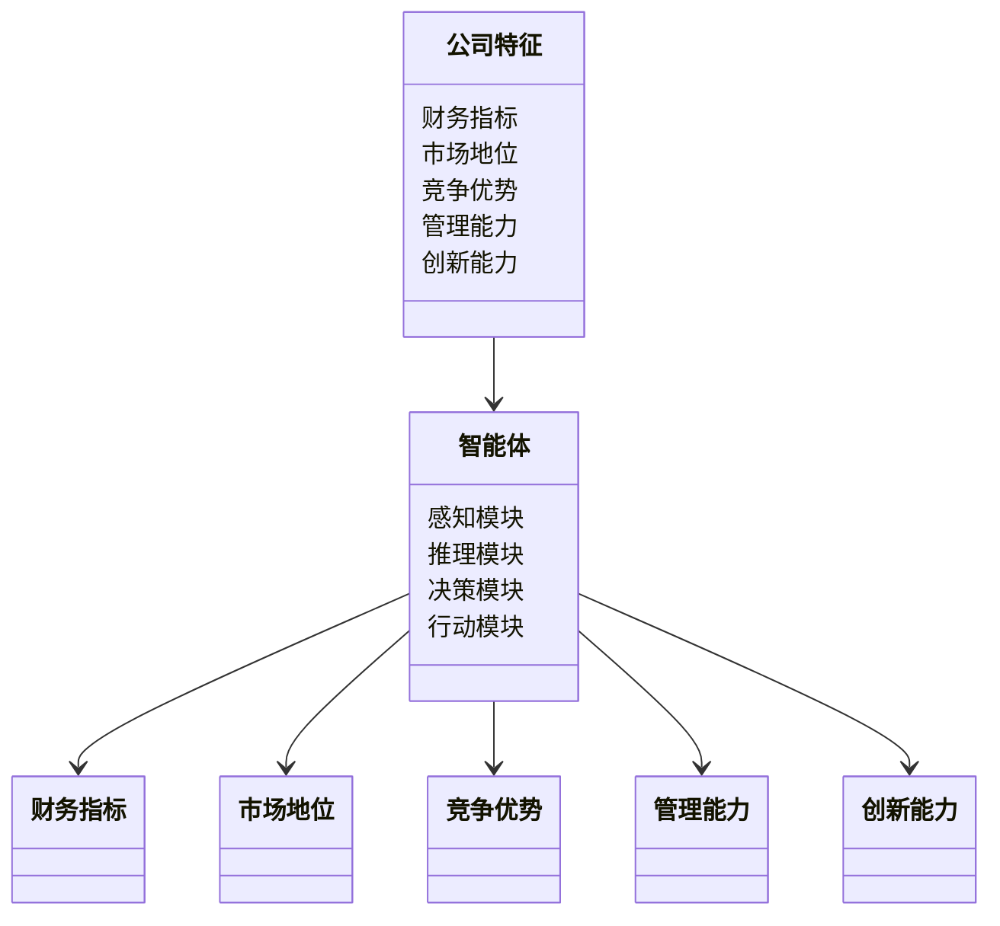

                 


# 利用多智能体AI实现费雪式的卓越公司识别

> 关键词：多智能体AI，费雪理论，卓越公司识别，分布式智能，投资决策

> 摘要：本文详细探讨了利用多智能体人工智能技术实现费雪式的卓越公司识别的方法。通过分析费雪投资理论的核心要素，结合多智能体AI的优势，提出了一种创新的公司识别框架。文章从背景介绍、核心概念、算法原理、系统架构到项目实战，全面阐述了多智能体AI在卓越公司识别中的应用，并通过具体案例分析展示了其实现效果。最后，本文总结了多智能体AI在投资决策中的优势与未来发展方向。

----------------------------------------------------------------

# 第一部分: 多智能体AI与卓越公司识别的背景与基础

# 第1章: 多智能体AI与卓越公司识别概述

## 1.1 问题背景与目标

### 1.1.1 传统公司识别方法的局限性
传统公司识别方法主要依赖于财务指标、市场表现等单一维度的分析，难以全面捕捉公司内在价值和长期发展潜力。这种方法往往忽视了公司内部管理、行业地位、创新能力和竞争优势等关键因素。

### 1.1.2 费雪投资理论的核心思想
费雪投资理论强调投资的三阶段法，即**第一阶段**寻找卓越的公司，**第二阶段**评估其内在价值，**第三阶段**判断其成长性和可持续性。费雪认为，卓越的公司具备持续创新、强大的市场地位和高效的管理能力。

### 1.1.3 多智能体AI的优势与应用前景
多智能体AI通过分布式计算和协作学习，能够从多维度、多层次对目标公司进行分析。其优势在于能够同时处理海量数据、实时反馈和动态调整，为复杂的投资决策提供支持。

## 1.2 多智能体AI的基本概念

### 1.2.1 多智能体系统的定义
多智能体系统（Multi-Agent System，MAS）是由多个具有独立决策能力的智能体组成的分布式系统，各智能体通过协作完成复杂任务。

### 1.2.2 多智能体系统的组成要素
- **智能体**：具有感知、决策和行动能力的独立实体。
- **通信机制**：智能体之间的信息交互方式。
- **协作协议**：定义智能体之间的合作规则。
- **环境**：智能体所处的外部世界或数据源。

### 1.2.3 多智能体与单智能体AI的区别
| 特性                | 单智能体AI                | 多智能体AI               |
|---------------------|--------------------------|--------------------------|
| 智能体数量          | 单个                     | 多个                     |
| 决策方式            | 中央化决策               | 去中心化决策             |
| 任务处理            | 单一任务                | 多任务协作               |
| 信息处理            | 信息集中处理             | 信息分布式处理           |

## 1.3 费雪卓越公司识别的核心要素

### 1.3.1 费雪投资理论的三个阶段
- **第一阶段**：寻找具备竞争优势的公司。
- **第二阶段**：评估公司的内在价值。
- **第三阶段**：判断公司的成长性和可持续性。

### 1.3.2 卓越公司的核心特征
| 特征                | 描述                     |
|---------------------|--------------------------|
| 市场地位            | 在行业中占据领先地位   |
| 竞争优势            | 具备独特的竞争优势       |
| 管理能力            | 高效且透明的管理团队     |
| 创新能力            | 持续创新能力             |
| 财务健康            | 良好的财务状况和现金流   |

## 1.4 本章小结

### 1.4.1 多智能体AI与卓越公司识别的结合点
- 利用多智能体AI的分布式计算能力，从多维度分析公司特征。
- 通过协作学习，提升公司在不同维度的评估精度。

### 1.4.2 本书的研究目标与结构安排
本书旨在探索多智能体AI在费雪理论中的应用，通过系统设计和实践案例，展示如何利用多智能体技术实现卓越公司识别。

# 第2章: 多智能体AI的原理与实现

## 2.1 多智能体系统的核心原理

### 2.1.1 分布式智能与协作机制
多智能体系统通过分布式智能实现任务分解和协作。每个智能体负责特定任务，通过通信机制共享信息，完成整体目标。

### 2.1.2 多智能体的通信与协调
智能体之间的通信可以通过**直接通信**（点对点）或**间接通信**（通过共享数据库）实现。协调机制包括**一致性协议**和**仲裁机制**。

### 2.1.3 多智能体的决策机制
决策机制包括**基于规则的决策**、**基于模型的决策**和**基于学习的决策**。其中，基于学习的决策（如强化学习）是当前研究的热点。

## 2.2 多智能体系统的实现框架

### 2.2.1 智能体的结构与功能
智能体由感知、推理、决策和行动四个部分组成：
- **感知**：获取环境信息。
- **推理**：分析信息并生成知识。
- **决策**：基于知识做出选择。
- **行动**：执行决策。

### 2.2.2 智能体之间的交互协议
- **通信协议**：定义信息交换的格式和规则。
- **协作协议**：定义智能体之间的合作规则。

### 2.2.3 系统的可扩展性与灵活性
多智能体系统的扩展性体现在：
- **智能体的可扩展性**：可以动态添加或删除智能体。
- **功能的可扩展性**：可以增加新的任务或功能。

## 2.3 多智能体系统的算法基础

### 2.3.1 分布式强化学习
分布式强化学习（Distributed Reinforcement Learning）是一种通过多个智能体协作来学习策略的方法。每个智能体在自己的经验中学习，并通过通信共享信息。

### 2.3.2 协作与竞争机制
- **协作机制**：通过共享信息和协同决策实现目标。
- **竞争机制**：通过竞争优化个体行为。

### 2.3.3 联合推理与决策
联合推理通过多个智能体的协作，结合各自的知识和信息，形成全局决策。

## 2.4 本章小结

### 2.4.1 多智能体系统的实现要点
- 分布式计算与协作机制是实现多智能体系统的核心。
- 通信协议和协作协议的设计是系统实现的关键。

### 2.4.2 与卓越公司识别的结合方式
- 利用分布式计算分析公司多维度特征。
- 通过协作学习提升评估精度。

# 第3章: 费雪理论与卓越公司识别的结合

## 3.1 费雪理论的核心要素分析

### 3.1.1 费雪的三阶段投资法
- **第一阶段**：寻找具备竞争优势的公司。
- **第二阶段**：评估公司的内在价值。
- **第三阶段**：判断公司的成长性和可持续性。

### 3.1.2 费雪的内在价值评估
内在价值是公司未来现金流的现值。费雪认为，内在价值是投资决策的核心依据。

### 3.1.3 费雪的成长性判断标准
成长性是指公司未来收入和利润的增长潜力。费雪认为，卓越的公司具备持续的成长能力。

## 3.2 多智能体AI在费雪理论中的应用

### 3.2.1 智能体分工与协作
- **智能体分工**：每个智能体负责特定任务，如市场分析、财务分析、竞争优势分析等。
- **智能体协作**：通过通信机制共享信息，完成综合评估。

### 3.2.2 数据收集与特征提取
- **数据来源**：公司财务数据、市场数据、行业报告等。
- **特征提取**：从多维度提取公司特征，如财务指标、市场地位、竞争优势等。

### 3.2.3 决策与反馈
- **决策机制**：基于多智能体的协作结果，生成公司评估报告。
- **反馈机制**：根据市场反馈调整评估模型。

## 3.3 本章小结

### 3.3.1 多智能体AI在费雪理论中的应用优势
- 分布式计算能力能够处理海量数据。
- 协作学习能够提升评估精度。

### 3.3.2 未来研究方向
- 提升多智能体系统的协作效率。
- 扩展多智能体系统的应用场景。

# 第4章: 基于多智能体AI的卓越公司识别系统设计

## 4.1 问题场景介绍

### 4.1.1 投资决策的复杂性
投资决策涉及多个因素，包括市场波动、公司基本面、行业趋势等。

### 4.1.2 现有方法的不足
传统方法依赖于单一指标，难以全面评估公司价值。

## 4.2 系统功能设计

### 4.2.1 领域模型


### 4.2.2 系统架构


### 4.2.3 系统接口设计
- **输入接口**：接收公司数据和用户指令。
- **输出接口**：输出公司评估报告和投资建议。

## 4.3 系统实现

### 4.3.1 环境安装
```bash
pip install multi-agent-system
```

### 4.3.2 核心代码实现
```python
class Agent:
    def __init__(self, role):
        self.role = role
        self.data = {}
    
    def perceive(self, environment):
        self.data = environment.get_data()
    
    def decide(self):
        if self.role == 'financial':
            return self.analyze_financials()
        elif self.role == 'market':
            return self.analyze_market()
        # 更多角色分析
    
    def analyze_financials(self):
        # 财务分析逻辑
        pass
    
    def analyze_market(self):
        # 市场分析逻辑
        pass

class MAS:
    def __init__(self, agents):
        self.agents = agents
    
    def run(self):
        for agent in self.agents:
            agent.perceive(self.get_environment_data())
            result = agent.decide()
            self.handle_result(result)
    
    def get_environment_data(self):
        # 获取环境数据
        pass
    
    def handle_result(self, result):
        # 处理结果
        pass
```

### 4.3.3 代码解读与分析
- **Agent类**：代表一个智能体，具备感知和决策能力。
- **MAS类**：管理多个智能体，协调它们的行动。

## 4.4 本章小结

### 4.4.1 系统设计要点
- 领域模型和系统架构的设计是系统实现的基础。
- 多智能体协作是系统的核心。

### 4.4.2 代码实现的关键点
- 智能体的分工与协作。
- 系统的通信机制和反馈机制。

# 第5章: 项目实战与案例分析

## 5.1 环境安装与配置

### 5.1.1 安装依赖
```bash
pip install multi-agent-system
pip install pandas
pip install numpy
```

## 5.2 核心代码实现

### 5.2.1 数据预处理
```python
import pandas as pd
import numpy as np

def preprocess_data(dataframe):
    # 删除缺失值
    dataframe.dropna(inplace=True)
    # 标准化处理
    from sklearn.preprocessing import StandardScaler
    scaler = StandardScaler()
    scaled_data = scaler.fit_transform(dataframe)
    return scaled_data
```

### 5.2.2 多智能体协作
```python
from multi_agent_system import Agent, MAS

agents = [
    Agent('financial'),
    Agent('market'),
    Agent('competition')
]

mas = MAS(agents)
mas.run()
```

## 5.3 案例分析与结果解读

### 5.3.1 案例分析
- **数据来源**：某行业内的公司数据。
- **分析过程**：多智能体协作完成公司特征分析。
- **结果解读**：生成公司评估报告。

## 5.4 本章小结

### 5.4.1 项目实战的关键点
- 数据预处理和特征提取是项目成功的基础。
- 多智能体协作是实现卓越公司识别的核心。

### 5.4.2 案例分析的启示
- 多智能体AI能够有效提升公司识别的准确性和全面性。

# 第6章: 最佳实践与未来展望

## 6.1 本章小结

### 6.1.1 核心要点总结
- 多智能体AI在卓越公司识别中的应用前景广阔。
- 费雪理论与多智能体AI的结合能够提升投资决策的科学性和精准性。

## 6.2 投资决策中的注意事项

### 6.2.1 数据质量的重要性
- 数据的全面性和准确性直接影响评估结果。

### 6.2.2 模型的可解释性
- 模型的可解释性是投资决策的重要因素。

## 6.3 未来研究方向

### 6.3.1 提升多智能体系统的协作效率
- 研究更高效的通信机制和协作协议。

### 6.3.2 扩展应用场景
- 将多智能体AI技术应用于更多领域。

## 6.4 拓展阅读

### 6.4.1 推荐书籍
- 《Multi-Agent Systems: Algorithm and Applications》
- 《The Intelligent Investor》

### 6.4.2 推荐论文
- "Distributed Reinforcement Learning in Multi-Agent Systems"
- "Multi-Agent Collaboration for Stock Market Prediction"

# 第7章: 结语

## 7.1 总结
多智能体AI为卓越公司识别提供了新的思路和方法。通过与费雪投资理论的结合，能够实现更科学、更精准的投资决策。

## 7.2 展望
未来，随着多智能体AI技术的不断发展，其在投资决策中的应用将更加广泛和深入。

# 参考文献
（此处列出相关的书籍和论文）

# 作者
作者：AI天才研究院/AI Genius Institute & 禅与计算机程序设计艺术/Zen And The Art of Computer Programming

