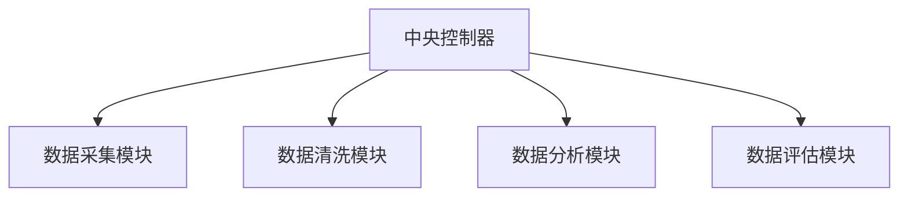
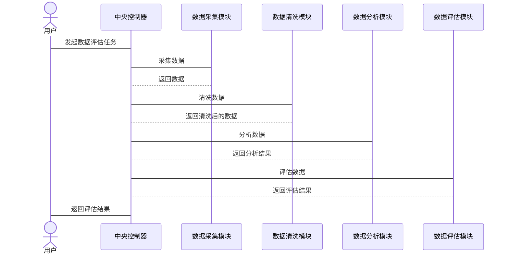

                 


# 利用多智能体AI评估公司的数据资产价值

## 关键词：多智能体AI，数据资产评估，数据资产价值，数据清洗，数据协同，数据隐私

## 摘要：随着数据成为企业最重要的资产之一，如何准确评估数据资产的价值变得至关重要。本文探讨了利用多智能体人工智能技术进行数据资产评估的方法，详细分析了多智能体AI的核心概念、算法原理、系统架构以及实际应用案例，为企业提供了一种高效、智能的数据资产评估解决方案。

---

# 第1章: 数据资产价值评估的背景与挑战

## 1.1 数据资产的重要性

### 1.1.1 数据资产的定义与分类

数据资产是指企业拥有或控制的、能够为企业创造价值的各类数据资源。根据其来源和用途，数据资产可以分为以下几类：

1. **结构化数据**：如数据库中的表格数据，包括客户信息、交易记录等。
2. **非结构化数据**：如文本、图像、音频等。
3. **实时数据**：如 IoT 设备实时产生的数据。
4. **历史数据**：如过去的交易记录、日志数据等。

数据资产的价值不仅体现在数据本身，还体现在数据的质量、可用性和对业务的贡献程度上。

### 1.1.2 数据资产在企业中的价值体现

数据资产是企业决策的重要依据，能够帮助企业优化运营、提高效率、创造新的业务模式。例如：

- **客户价值评估**：通过分析客户数据，评估客户的生命周期价值（CLV），从而制定精准的营销策略。
- **风险控制**：通过对交易数据的分析，识别潜在的欺诈行为，降低企业风险。
- **产品优化**：通过分析用户行为数据，优化产品设计和用户体验。

### 1.1.3 数据资产价值评估的难点与挑战

数据资产价值评估面临以下挑战：

1. **数据质量**：数据可能存在缺失、噪声、重复等问题，影响评估结果。
2. **数据隐私**：数据可能包含敏感信息，如何在保护隐私的前提下进行评估是一个难题。
3. **数据多样性**：不同类型的数据如何有效整合和评估是一个技术难点。
4. **评估模型的复杂性**：数据资产评估需要考虑多个因素，构建合适的模型较为复杂。

---

## 1.2 多智能体AI的概述

### 1.2.1 多智能体系统的定义与特点

多智能体系统（Multi-Agent System, MAS）是由多个独立或部分独立的智能体（Agent）组成的系统。这些智能体能够通过协作完成复杂的任务。多智能体系统的特点包括：

1. **分布性**：智能体之间分布在网络中，各自负责不同的任务。
2. **协作性**：智能体通过协作完成整体目标。
3. **自主性**：每个智能体都有一定的自主决策能力。
4. **动态性**：系统能够适应环境的变化。

### 1.2.2 多智能体AI与传统AI的区别

多智能体AI与传统AI的区别主要体现在以下几个方面：

1. **单点决策 vs 分布式决策**：传统AI通常由中心化的系统进行决策，而多智能体AI通过分布式智能体进行决策。
2. **任务分配 vs 单任务处理**：多智能体AI能够将任务分配给多个智能体协作完成，而传统AI通常处理单个任务。
3. **协作 vs 竞争**：多智能体系统中的智能体之间可以协作，也可以存在竞争，而传统AI系统通常不涉及协作。

### 1.2.3 多智能体AI在数据资产评估中的优势

多智能体AI在数据资产评估中的优势包括：

1. **分布式计算**：多智能体系统可以并行处理大量数据，提高计算效率。
2. **协作能力**：多个智能体可以协作完成复杂的评估任务。
3. **适应性**：多智能体系统能够根据环境变化动态调整评估策略。

---

# 第2章: 多智能体AI的核心概念与原理

## 2.1 多智能体系统的组成与交互

### 2.1.1 实体关系图（ER图）展示多智能体系统的核心要素

```mermaid
erDiagram
    actor 智能体1 {
        string id
        string 任务
        string 状态
    }
    actor 智能体2 {
        string id
        string 任务
        string 状态
    }
    actor 中央控制器 {
        string id
        string 策略
        string 目标
    }
    智能体1 --> 中央控制器 : 传递数据
    智能体2 --> 中央控制器 : 传递数据
    中央控制器 --> 智能体1 : 发送指令
    中央控制器 --> 智能体2 : 发送指令
```

### 2.1.2 多智能体系统的协作机制

多智能体系统的协作机制包括任务分配、信息共享和决策制定。以下是协作机制的关键步骤：

1. **任务分配**：中央控制器根据任务的性质和智能体的能力，将任务分配给不同的智能体。
2. **信息共享**：智能体之间通过共享数据和信息，确保任务的顺利进行。
3. **决策制定**：智能体根据共享的信息和自身的知识，制定决策并执行任务。

---

## 2.2 多智能体AI的协作机制

### 2.2.1 协作任务分配的算法原理

协作任务分配的算法原理包括以下几个步骤：

1. **任务分析**：分析任务的需求和目标。
2. **智能体能力评估**：评估每个智能体的能力和资源。
3. **任务分配**：根据任务需求和智能体能力，将任务分配给合适的智能体。
4. **任务执行**：智能体根据分配的任务进行执行。
5. **反馈与调整**：根据执行结果，调整任务分配策略。

---

## 2.3 多智能体AI在数据资产评估中的应用

### 2.3.1 数据清洗与预处理的多智能体协作

数据清洗与预处理是数据资产评估的重要步骤。多智能体系统可以通过以下方式实现数据清洗：

1. **数据采集**：智能体1负责从多个数据源采集数据。
2. **数据清洗**：智能体2负责对数据进行去重、填补缺失值和去除噪声。
3. **数据转换**：智能体3负责将数据转换为适合评估的形式。

---

## 2.4 多智能体AI的数据价值评估

### 2.4.1 数据价值评估的多智能体协同计算

多智能体系统可以通过以下方式实现数据价值评估：

1. **数据分析**：智能体1对数据进行统计分析，提取关键特征。
2. **模型训练**：智能体2利用机器学习算法训练评估模型。
3. **协同计算**：智能体3根据模型结果进行最终的价值评估。

---

# 第3章: 多智能体AI在数据资产评估中的应用

## 3.1 数据资产评估的核心要素

### 3.1.1 数据的完整性、准确性和及时性

数据的完整性、准确性和及时性是数据资产评估的重要指标。多智能体系统可以通过以下方式确保数据的完整性：

1. **数据采集**：智能体1负责从多个数据源采集数据。
2. **数据清洗**：智能体2负责对数据进行去重、填补缺失值和去除噪声。
3. **数据转换**：智能体3负责将数据转换为适合评估的形式。

---

## 3.2 多智能体AI在数据资产评估中的具体应用

### 3.2.1 数据清洗与预处理的多智能体协作

多智能体系统可以通过以下方式实现数据清洗：

1. **数据采集**：智能体1负责从多个数据源采集数据。
2. **数据清洗**：智能体2负责对数据进行去重、填补缺失值和去除噪声。
3. **数据转换**：智能体3负责将数据转换为适合评估的形式。

---

## 3.3 多智能体AI在数据价值评估中的应用

### 3.3.1 数据价值评估的多智能体协同计算

多智能体系统可以通过以下方式实现数据价值评估：

1. **数据分析**：智能体1对数据进行统计分析，提取关键特征。
2. **模型训练**：智能体2利用机器学习算法训练评估模型。
3. **协同计算**：智能体3根据模型结果进行最终的价值评估。

---

# 第4章: 多智能体AI的算法原理

## 4.1 多智能体AI的协作任务分配算法

### 4.1.1 协作任务分配的算法流程

以下是协作任务分配的算法流程：

1. **任务分析**：分析任务的需求和目标。
2. **智能体能力评估**：评估每个智能体的能力和资源。
3. **任务分配**：根据任务需求和智能体能力，将任务分配给合适的智能体。
4. **任务执行**：智能体根据分配的任务进行执行。
5. **反馈与调整**：根据执行结果，调整任务分配策略。

---

## 4.2 多智能体AI的协作机制

### 4.2.1 信息共享与协同决策的实现方式

多智能体系统可以通过以下方式实现信息共享与协同决策：

1. **信息共享**：智能体之间通过共享数据和信息，确保任务的顺利进行。
2. **决策制定**：智能体根据共享的信息和自身的知识，制定决策并执行任务。

---

## 4.3 多智能体AI的数学模型

### 4.3.1 协作任务分配的数学模型

以下是协作任务分配的数学模型：

$$
\text{效用函数} = \sum_{i=1}^{n} \text{智能体}_i \text{的贡献}
$$

### 4.3.2 协作增益的计算

以下是协作增益的计算公式：

$$
\text{协作增益} = \text{整体效益} - \text{个体效益}
$$

---

# 第5章: 多智能体AI的系统分析与架构设计

## 5.1 系统功能设计

### 5.1.1 数据采集模块

数据采集模块负责从多个数据源采集数据，包括数据库、API和文件等。

### 5.1.2 数据清洗模块

数据清洗模块负责对采集到的数据进行去重、填补缺失值和去除噪声。

### 5.1.3 数据分析模块

数据分析模块负责对清洗后的数据进行统计分析，提取关键特征。

### 5.1.4 数据评估模块

数据评估模块负责根据分析结果进行数据价值评估。

---

## 5.2 系统架构设计

### 5.2.1 系统架构图

以下是系统架构图：



---

## 5.3 系统接口设计

### 5.3.1 系统接口设计

以下是系统接口设计：

1. 数据采集模块接口：
   - 输入：数据源配置
   - 输出：采集到的数据

2. 数据清洗模块接口：
   - 输入：原始数据
   - 输出：清洗后的数据

3. 数据分析模块接口：
   - 输入：清洗后的数据
   - 输出：分析结果

4. 数据评估模块接口：
   - 输入：分析结果
   - 输出：评估结果

---

## 5.4 系统交互设计

### 5.4.1 系统交互图

以下是系统交互图：



---

# 第6章: 多智能体AI的项目实战

## 6.1 项目背景与目标

### 6.1.1 项目背景

本项目旨在利用多智能体AI技术，评估某电商公司客户数据的资产价值。

### 6.1.2 项目目标

1. 实现数据采集模块。
2. 实现数据清洗模块。
3. 实现数据分析模块。
4. 实现数据评估模块。

---

## 6.2 环境配置与安装

### 6.2.1 环境配置

1. 操作系统：Linux
2. Python版本：3.8以上
3. 需要安装的库：
   - `numpy`
   - `pandas`
   - `scikit-learn`
   - `networkx`
   - `mermaid`

---

## 6.3 核心代码实现

### 6.3.1 数据采集模块

以下是数据采集模块的实现代码：

```python
import requests
import json

def collect_data(url):
    response = requests.get(url)
    data = json.loads(response.text)
    return data
```

### 6.3.2 数据清洗模块

以下是数据清洗模块的实现代码：

```python
import pandas as pd
import numpy as np

def clean_data(df):
    df = df.dropna()
    df = df.drop_duplicates()
    df = df.replace(np.nan, 0)
    return df
```

### 6.3.3 数据分析模块

以下是数据分析模块的实现代码：

```python
import pandas as pd
import numpy as np
from sklearn.preprocessing import StandardScaler

def analyze_data(df):
    scaler = StandardScaler()
    df_scaled = scaler.fit_transform(df)
    return df_scaled
```

### 6.3.4 数据评估模块

以下是数据评估模块的实现代码：

```python
import pandas as pd
import numpy as np
from sklearn.metrics import accuracy_score

def evaluate_data(true_labels, predicted_labels):
    accuracy = accuracy_score(true_labels, predicted_labels)
    return accuracy
```

---

## 6.4 实际案例分析

### 6.4.1 案例背景

某电商公司希望通过多智能体AI技术，评估其客户数据的资产价值。

### 6.4.2 数据分析与评估

以下是数据分析与评估的具体步骤：

1. 数据采集：从数据库中采集客户数据。
2. 数据清洗：清洗采集到的数据。
3. 数据分析：对清洗后的数据进行分析。
4. 数据评估：根据分析结果，评估数据的资产价值。

---

## 6.5 项目总结与经验分享

### 6.5.1 项目总结

通过本项目，我们成功实现了多智能体AI在数据资产评估中的应用，验证了多智能体AI技术的有效性和可行性。

### 6.5.2 经验分享

在实际应用中，需要注意以下几点：

1. 数据隐私保护。
2. 智能体协作效率的优化。
3. 系统的可扩展性。

---

# 第7章: 总结与展望

## 7.1 本章总结

本文详细探讨了利用多智能体AI技术评估公司数据资产价值的方法，从背景、核心概念、算法原理到实际应用，全面阐述了多智能体AI在数据资产评估中的应用。

## 7.2 未来展望

未来，随着多智能体AI技术的不断发展，其在数据资产评估中的应用将更加广泛和深入。我们可以期待更多创新性的应用和更高效的解决方案。

---

# 作者

作者：AI天才研究院/AI Genius Institute & 禅与计算机程序设计艺术/Zen And The Art of Computer Programming

---

希望这篇文章能为您提供有价值的信息和启示！

