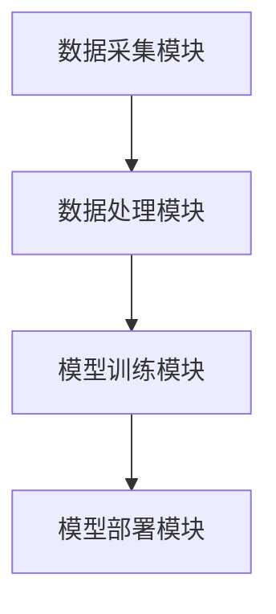

                 


# 利用多智能体系统构建动态估值模型：适应市场变化

**关键词**：多智能体系统、动态估值模型、市场变化、人工智能、系统架构、实时估值、数据驱动

**摘要**：  
随着市场环境的快速变化，传统的静态估值模型已难以满足实时性和动态性的需求。本文通过引入多智能体系统（Multi-Agent System, MAS）的概念，提出了一种基于多智能体的动态估值模型（Dynamic Valuation Model, DVM）。该模型能够实时捕捉市场变化，通过多个智能体的协同工作，实现对市场动态的精准建模和高效估值。本文详细探讨了多智能体系统的原理、动态估值模型的构建方法，以及两者的结合方式，并通过实际案例展示了该模型在市场估值中的应用。文章最后总结了该模型的优势和未来的发展方向。

---

## 第一部分：背景与问题背景

### 第1章：多智能体系统与动态估值模型的背景

#### 1.1 多智能体系统的定义与特点
多智能体系统（Multi-Agent System, MAS）是由多个智能体（Agent）组成的分布式系统，这些智能体能够通过协作完成复杂任务。智能体具有以下特点：
- **自主性**：智能体能够自主决策。
- **反应性**：能够感知环境并实时响应。
- **协作性**：通过通信和协作完成共同目标。
- **分布式**：智能体之间不存在中心化的控制节点。

#### 1.2 动态估值模型的定义与特点
动态估值模型（Dynamic Valuation Model, DVM）是一种能够实时更新估值的数学模型，其核心在于捕捉市场环境的变化，并快速调整估值结果。动态估值模型具有以下特点：
- **实时性**：能够实时更新估值。
- **适应性**：能够适应市场环境的变化。
- **数据驱动**：依赖于实时数据进行建模和估值。

#### 1.3 问题背景
在金融、经济等领域，传统的静态估值模型（如Black-Scholes模型）虽然在特定条件下表现良好，但难以应对市场环境的快速变化。例如，在股票市场中，价格波动、市场情绪变化等因素都会影响估值结果。传统的静态模型无法实时捕捉这些变化，导致估值结果的滞后性和不准确性。

#### 1.4 问题解决思路
通过引入多智能体系统，将市场环境分解为多个子问题，每个子问题由一个智能体负责。这些智能体协同工作，实时更新市场数据，并通过动态估值模型快速调整估值结果。这种方法能够显著提高估值的实时性和准确性。

---

## 第二部分：多智能体系统与动态估值模型的核心概念

### 第2章：多智能体系统的原理与实现

#### 2.1 多智能体系统的组成结构
多智能体系统由以下几部分组成：
- **智能体**：负责感知环境、决策和执行。
- **通信机制**：智能体之间的信息交互渠道。
- **协作机制**：智能体之间协同工作的规则。
- **环境**：智能体所处的外部世界。

#### 2.2 多智能体系统的通信机制
通信机制是多智能体系统的核心之一，主要包括以下内容：
- **通信协议**：定义智能体之间信息交换的规则。
- **信息格式**：定义信息的结构和内容。
- **通信方式**：包括同步通信和异步通信。

#### 2.3 多智能体系统的决策机制
智能体的决策机制包括以下几种：
- **反应式决策**：基于当前环境状态做出决策。
- **规划式决策**：通过规划未来行动步骤做出决策。
- **混合式决策**：结合反应式和规划式决策。

### 第3章：动态估值模型的数学基础

#### 3.1 动态估值模型的基本假设
动态估值模型基于以下假设：
- 市场环境是动态变化的。
- 数据是实时更新的。
- 估值结果需要实时反馈。

#### 3.2 动态估值模型的数学表达
动态估值模型可以用以下数学公式表示：
$$
V(t) = f(V(t-1), D(t))
$$
其中，$V(t)$ 表示第 $t$ 时刻的估值，$D(t)$ 表示第 $t$ 时刻的市场数据，$f$ 是动态估值函数。

#### 3.3 动态估值模型的优化方法
动态估值模型的优化方法包括：
- 参数优化：通过调整模型参数提高估值准确性。
- 结构优化：优化模型的结构以提高计算效率。
- 实时更新：动态调整模型以适应市场变化。

---

## 第三部分：多智能体系统与动态估值模型的结合

### 第4章：多智能体系统在动态估值模型中的应用

#### 4.1 多智能体系统的分工与协作
多智能体系统在动态估值模型中的分工与协作如下：
- 每个智能体负责一个特定的市场数据源。
- 智能体之间通过通信机制实时交换数据。
- 智能体协作完成动态估值模型的更新。

#### 4.2 动态估值模型的构建过程
动态估值模型的构建过程包括以下步骤：
1. 数据采集与处理。
2. 模型训练与优化。
3. 模型部署与实时更新。

#### 4.3 多智能体系统与动态估值模型的协同机制
多智能体系统与动态估值模型的协同机制包括：
- 协同目标的定义。
- 协同过程的控制。
- 协同效果的评估。

---

## 第四部分：动态估值模型的算法实现

### 第5章：动态估值模型的算法框架

#### 5.1 算法的整体流程
动态估值模型的算法流程如下：
1. 数据采集：实时采集市场数据。
2. 数据处理：对数据进行清洗和预处理。
3. 模型训练：训练动态估值模型。
4. 模型部署：将模型部署到生产环境。
5. 实时更新：根据最新数据实时更新模型。

#### 5.2 算法的实现细节
动态估值模型的实现细节包括：
- 数据采集接口的设计。
- 模型训练算法的选择。
- 模型实时更新的机制。

---

## 第五部分：系统架构与项目实战

### 第6章：系统架构设计

#### 6.1 系统架构的组成
系统架构由以下部分组成：
- 数据采集模块。
- 数据处理模块。
- 模型训练模块。
- 模型部署模块。

#### 6.2 系统架构图
以下是系统架构图的 mermaid 代码：


#### 6.3 系统接口设计
系统接口设计包括：
- 数据接口：数据采集模块与外部数据源的接口。
- 模型接口：模型训练模块与模型部署模块的接口。

### 第7章：项目实战

#### 7.1 环境安装
项目实战需要以下环境：
- Python 3.8+
- NumPy
- Pandas
- Scikit-learn

#### 7.2 核心代码实现
以下是动态估值模型的核心代码实现：
```python
import numpy as np
import pandas as pd
from sklearn import linear_model

# 数据采集与处理
data = pd.read_csv('market_data.csv')
X = data[['price', 'volume', 'market_sentiment']]
y = data['valuation']

# 模型训练
model = linear_model.LinearRegression()
model.fit(X, y)

# 模型部署
def predict_valuation(new_data):
    return model.predict(new_data)

# 实时更新
def update_model(new_data, new_labels):
    model.partial_fit(new_data, new_labels)
```

#### 7.3 案例分析
通过实际案例分析，验证动态估值模型的准确性。例如，在股票市场中，利用动态估值模型实时更新股票估值，捕捉市场波动。

---

## 第六部分：总结与展望

### 第8章：总结与展望

#### 8.1 本章小结
本文提出了基于多智能体系统的动态估值模型，详细探讨了其原理、实现和应用。通过实际案例验证了该模型的有效性。

#### 8.2 注意事项
在实际应用中，需要注意以下几点：
- 数据的实时性和准确性。
- 模型的可解释性和可维护性。
- 系统的安全性和稳定性。

#### 8.3 拓展阅读
建议读者进一步阅读以下内容：
- 多智能体系统的最新研究进展。
- 动态估值模型的优化方法。
- 市场预测的其他先进技术。

---

**作者：AI天才研究院/AI Genius Institute & 禅与计算机程序设计艺术 /Zen And The Art of Computer Programming**

