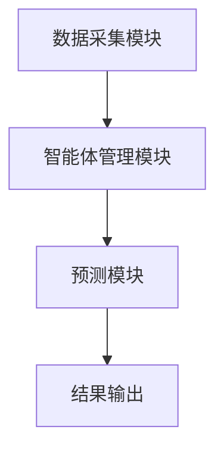
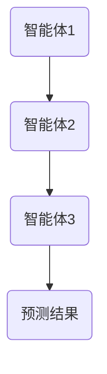

                 


# 利用多智能体系统构建动态市场份额预测模型

> **关键词**：多智能体系统、动态市场份额预测、博弈论、强化学习、系统架构设计  
> **摘要**：本文详细探讨了利用多智能体系统构建动态市场份额预测模型的方法。首先介绍了多智能体系统的定义、特点及其在经济领域的应用；接着分析了动态市场份额预测的核心概念和挑战；然后从数学模型和算法的角度详细推导了基于多智能体系统的预测模型；最后通过实际案例展示了系统的实现过程，并对未来的研究方向进行了展望。

---

## 第1章: 多智能体系统概述

### 1.1 多智能体系统的定义与特点

#### 1.1.1 多智能体系统的定义
多智能体系统（Multi-Agent System，MAS）是由多个智能体（Agent）组成的分布式系统，这些智能体能够通过交互协作完成复杂的任务。每个智能体都具有一定的自主性、反应性和社会性。

#### 1.1.2 多智能体系统的核心特点
- **自主性**：智能体能够独立决策。
- **反应性**：智能体能够根据环境变化做出实时响应。
- **社会性**：智能体之间能够通过通信协作完成任务。
- **分布性**：智能体分布在网络中，不存在集中控制节点。

#### 1.1.3 多智能体系统与传统单智能体系统的主要区别
| 特性 | 单智能体系统 | 多智能体系统 |
|------|--------------|--------------|
| 结构  | 集中式       | 分布式       |
| 控制  | 单一控制     | 分散控制     |
| 交互  | 无           | 有           |

---

### 1.2 多智能体系统的应用场景

#### 1.2.1 经济与金融领域的应用
- 股市交易：智能体模拟投资者行为，预测股票价格。
- 货币市场：智能体模拟央行或金融机构的决策。

#### 1.2.2 市场竞争分析中的应用
- 市场份额预测：智能体模拟不同企业的竞争行为。
- 消费者行为分析：智能体模拟消费者的选择过程。

#### 1.2.3 多智能体系统在动态环境中的优势
- 高度动态性：智能体能够快速响应环境变化。
- 分布式计算：多个智能体协作处理复杂问题。

---

### 1.3 动态市场份额预测的背景与意义

#### 1.3.1 市场份额预测的定义与重要性
市场份额预测是指通过分析市场数据和竞争行为，预测不同企业在市场中的份额占比。其重要性在于帮助企业制定战略决策，优化资源配置。

#### 1.3.2 动态市场份额预测的挑战
- 市场环境的高度不确定性。
- 竞争对手行为的不可预测性。
- 数据的实时性和动态性。

#### 1.3.3 多智能体系统在动态市场份额预测中的优势
- 模拟多个竞争主体的行为。
- 实时响应市场变化。
- 通过智能体协作提高预测精度。

---

## 第2章: 多智能体系统的核心概念

### 2.1 多智能体系统中的智能体

#### 2.1.1 智能体的定义与特征
智能体是一个能够感知环境并采取行动以实现目标的实体。其特征包括：
- **自主性**：无需外部干预。
- **反应性**：能够实时感知并响应环境。
- **社会性**：能够与其他智能体协作。

#### 2.1.2 智能体的分类
| 类型 | 描述                     |
|------|--------------------------|
| 简单反射型 | 基于当前感知直接行动     |
| 目标驱动型 | 为实现特定目标而行动     |
| 学习型    | 能够通过经验改进行为     |

#### 2.1.3 智能体的交互方式
- **直接通信**：智能体之间直接交换信息。
- **间接通信**：通过中间媒介间接传递信息。

---

### 2.2 多智能体系统的通信机制

#### 2.2.1 智能体之间的通信方式
- **同步通信**：通信过程需要等待对方响应。
- **异步通信**：信息可以非实时传递。

#### 2.2.2 通信协议的设计与实现
通信协议定义了智能体之间信息交换的规则。常见的协议包括：
- **FIPA**（Foundation for Intelligent Physical Agents）：基于标准的通信协议。
- **KQCB**：基于请求-响应模型的协议。

#### 2.2.3 通信中的信息处理与安全性
- **信息加密**：防止信息被篡改或窃取。
- **数据完整性**：确保信息在传输过程中不被破坏。

---

### 2.3 多智能体系统的协调与协作

#### 2.3.1 协调机制的定义与作用
协调机制是指智能体之间通过某种规则或协议实现协作的过程。其作用在于提高系统的整体效率。

#### 2.3.2 基于博弈论的协作模型
博弈论是研究智能体之间竞争与合作的数学理论。常见的博弈类型包括：
- **零和博弈**：总和为零，一方收益即另一方损失。
- **非零和博弈**：收益可以是任意值。

#### 2.3.3 协调与协作中的冲突解决
- **协商机制**：通过协商解决资源分配问题。
- **仲裁机制**：由第三方仲裁解决冲突。

---

## 第3章: 动态市场份额预测模型的构建

### 3.1 动态市场份额预测的数学模型

#### 3.1.1 动态市场份额预测的基本假设
- 市场环境是动态变化的。
- 消费者行为是可预测的。
- 竞争对手的行为是理性的。

#### 3.1.2 市场份额预测的数学公式
市场份额预测公式：
$$ S_i = \frac{v_i}{\sum_{j=1}^{n} v_j} $$
其中，$S_i$ 表示第 $i$ 个企业的市场份额，$v_i$ 表示第 $i$ 个企业的市场价值，$n$ 表示市场参与者的数量。

#### 3.1.3 动态环境下的市场份额预测模型
动态市场份额预测模型需要考虑多个因素，包括市场趋势、竞争对手策略等。

---

### 3.2 基于多智能体系统的预测模型

#### 3.2.1 模型的基本原理
多智能体系统通过模拟多个竞争主体的行为，预测它们在市场中的份额变化。

#### 3.2.2 模型的实现步骤
1. 初始化智能体。
2. 智能体感知环境并做出决策。
3. 智能体之间进行信息交换。
4. 更新市场份额预测结果。

---

## 第4章: 多智能体系统的算法实现

### 4.1 基于博弈论的算法

#### 4.1.1 博弈论的基本概念
- **纳什均衡**：一种稳定的策略组合，使得任何单方面改变都会导致至少一个参与者受损。

#### 4.1.2 基于博弈论的市场份额预测算法
通过模拟多个智能体之间的博弈过程，预测市场份额变化。

---

### 4.2 基于强化学习的算法

#### 4.2.1 强化学习的基本原理
强化学习是一种通过试错方式学习策略的方法，智能体通过与环境交互获得奖励或惩罚。

#### 4.2.2 基于强化学习的市场份额预测算法
使用策略梯度方法优化智能体的决策策略。

---

## 第5章: 系统架构设计

### 5.1 系统功能设计

#### 5.1.1 系统功能模块
- 智能体管理模块：管理多个智能体。
- 数据采集模块：采集市场数据。
- 预测模块：进行市场份额预测。

#### 5.1.2 系统功能流程
1. 数据采集模块获取市场数据。
2. 智能体管理模块初始化多个智能体。
3. 智能体感知环境并做出决策。
4. 预测模块输出市场份额预测结果。

---

### 5.2 系统架构设计

#### 5.2.1 系统架构图


#### 5.2.2 智能体交互流程图


---

## 第6章: 项目实战

### 6.1 环境配置

#### 6.1.1 系统环境
- 操作系统：Linux
- 开发工具：Python、Jupyter Notebook
- 库：numpy、pandas、matplotlib

### 6.2 核心代码实现

#### 6.2.1 智能体类实现
```python
class Agent:
    def __init__(self, id):
        self.id = id
        self.strategy = "random"
```

#### 6.2.2 预测模块实现
```python
def predict_market_share(agents):
    total = sum(agent.value for agent in agents)
    return {agent.id: agent.value / total for agent in agents}
```

### 6.3 实际案例分析

#### 6.3.1 案例介绍
以智能家居市场为例，模拟多个企业之间的竞争。

#### 6.3.2 数据分析
分析市场数据，提取特征并训练模型。

---

## 第7章: 总结与展望

### 7.1 本章小结
本文详细介绍了利用多智能体系统构建动态市场份额预测模型的方法，包括系统设计、算法实现和项目实战。

### 7.2 未来研究方向
- 提高预测模型的精度。
- 引入更多数据源。
- 优化智能体之间的协作机制。

---

**作者**：AI天才研究院/AI Genius Institute & 禅与计算机程序设计艺术 /Zen And The Art of Computer Programming

