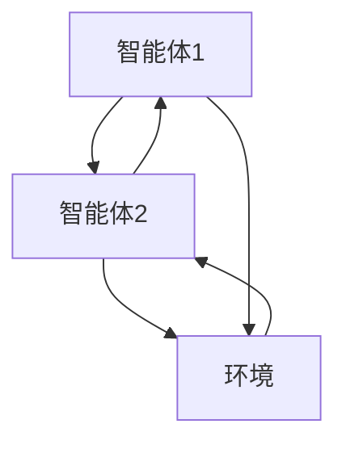
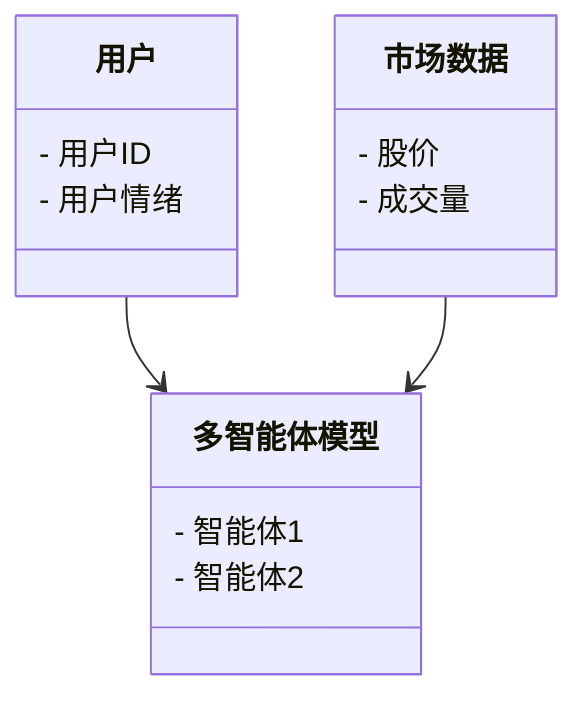
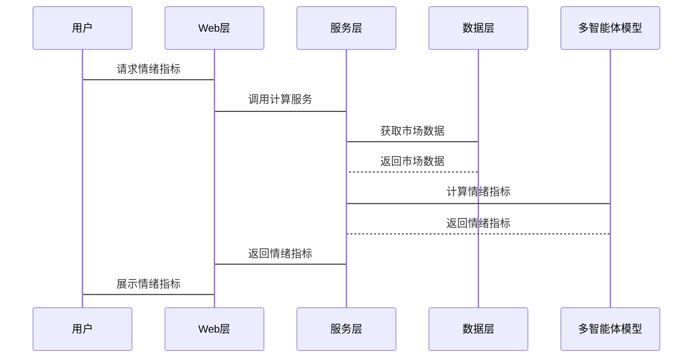

                 


# 利用多智能体系统构建动态市场情绪指标：把握市场脉搏

---

## 关键词：多智能体系统、市场情绪指标、动态指标、协同学习、实时分析、金融建模

---

## 摘要：  
本文探讨了利用多智能体系统构建动态市场情绪指标的方法，详细介绍了多智能体系统的核心概念、算法原理、系统架构及实际应用。通过协同学习和实时分析，本文展示了如何利用多智能体系统动态捕捉市场情绪，为投资决策提供有力支持。

---

# 第一部分：多智能体系统与市场情绪指标概述

## 第1章：多智能体系统与市场情绪指标概述

### 1.1 多智能体系统的定义与特点

#### 1.1.1 多智能体系统的定义  
多智能体系统（Multi-Agent System, MAS）是由多个智能体（Agent）组成的分布式系统，每个智能体具备自主性、反应性和社会性等特征，能够通过交互完成复杂任务。

#### 1.1.2 多智能体系统的核心特点  
- **自主性**：智能体能够独立决策。  
- **反应性**：智能体能够实时感知环境并做出反应。  
- **社会性**：智能体之间可以协同合作或竞争。  
- **分布式性**：智能体之间通过分布式计算完成任务。  

#### 1.1.3 多智能体系统与传统单智能体系统的区别  
| 特性             | 单智能体系统               | 多智能体系统               |
|------------------|----------------------------|----------------------------|
| 结构             | 单一中心化结构             | 分布式结构                 |
| 智能体数量       | 1个                       | 多个                       |
| 任务分配         | 中心化决策                 | 分散式决策                 |
| 适应性           | 较低                      | 较高                      |

---

### 1.2 市场情绪指标的定义与重要性

#### 1.2.1 市场情绪指标的定义  
市场情绪指标（Market Sentiment Indicator）是反映市场参与者情绪状态的量化指标，通常基于市场行为数据（如交易量、价格波动）和自然语言数据（如新闻、社交媒体评论）进行分析。

#### 1.2.2 市场情绪指标的分类  
- **基于交易数据**：如成交量、买卖价差等。  
- **基于文本数据**：如新闻标题、社交媒体情绪分析。  
- **混合型指标**：结合交易数据和文本数据。  

#### 1.2.3 市场情绪指标在投资决策中的作用  
- **风险预警**：通过情绪指标提前发现市场风险。  
- **交易信号**：情绪指标可作为交易策略的输入。  
- **投资组合优化**：根据市场情绪调整资产配置。  

---

### 1.3 多智能体系统在市场情绪分析中的应用

#### 1.3.1 多智能体系统如何模拟市场行为  
- 每个智能体代表一个市场参与者（如投资者、机构）。  
- 智能体通过协同学习模拟市场的买卖行为。  

#### 1.3.2 多智能体系统在情绪指标构建中的优势  
- **实时性**：多智能体系统能够实时捕捉市场情绪变化。  
- **复杂性**：能够模拟市场参与者的复杂行为。  
- **鲁棒性**：能够应对市场的不确定性。  

#### 1.3.3 实际应用场景与案例  
- **股票市场情绪分析**：通过多智能体系统模拟股票价格波动。  
- **外汇市场情绪分析**：分析交易者的汇率交易行为。  

---

# 第二部分：多智能体系统的核心概念与联系

## 第2章：多智能体系统的核心概念与联系

### 2.1 多智能体系统的结构与功能

#### 2.1.1 多智能体系统的组成要素  
- **智能体**：具备自主决策能力的个体。  
- **环境**：智能体所处的外部环境。  
- **交互机制**：智能体之间的通信与协作机制。  

#### 2.1.2 各智能体之间的关系与交互  
- **协同关系**：智能体之间通过协作完成共同目标。  
- **竞争关系**：智能体之间通过竞争优化系统性能。  

#### 2.1.3 多智能体系统的层次结构  
- **物理层**：智能体与环境的物理交互。  
- **逻辑层**：智能体的决策逻辑与规则。  
- **通信层**：智能体之间的信息传递机制。  

---

### 2.2 多智能体系统与市场情绪指标的关系

#### 2.2.1 市场情绪指标的动态性与多智能体系统的实时性  
- 市场情绪指标需要实时更新，多智能体系统的实时性满足这一需求。  

#### 2.2.2 多智能体系统如何捕捉市场情绪的复杂性  
- 通过多个智能体模拟市场参与者的不同情绪状态。  

#### 2.2.3 市场情绪指标的构建过程与多智能体系统的协同作用  
- **数据采集**：智能体实时采集市场数据。  
- **情绪计算**：智能体协同计算市场情绪指标。  

---

### 2.3 多智能体系统的ER实体关系图

```mermaid
er
actor(投资者) -->
user(用户) -->
market_data(市场数据)
actor(投资者) -->
action(市场行为)
user(用户) -->
model(多智能体模型)
market_data(市场数据) -->
model(多智能体模型)
```

---

## 第3章：多智能体协同学习算法原理

### 3.1 多智能体协同学习的定义与特点

#### 3.1.1 协同学习的定义  
协同学习（Collaborative Learning）是指多个智能体通过协作完成学习任务。  

#### 3.1.2 多智能体协同学习的核心特点  
- **分布式学习**：学习过程分布在多个智能体中。  
- **信息共享**：智能体之间共享信息以优化学习效果。  

---

### 3.2 多智能体协同学习的算法实现

#### 3.2.1 基于强化学习的协同算法  
- **算法原理**：通过强化学习训练智能体之间的协同策略。  
- **算法流程图**：  



- **数学模型**：  
  $$ Q(s, a) = r + \gamma \max_{a'} Q(s', a') $$  

其中，\( Q(s, a) \) 表示状态 \( s \) 下动作 \( a \) 的价值，\( r \) 是奖励，\( \gamma \) 是折扣因子。  

#### 3.2.2 基于博弈论的协同算法  
- **纳什均衡**：所有智能体达到均衡状态时，协同学习完成。  
- **数学模型**：  
  $$ \text{纳什均衡条件：} \forall i, \sum_{j \neq i} p_j = 1 - p_i $$  

---

### 3.3 多智能体协同学习的数学模型与公式

#### 3.3.1 基于强化学习的数学模型  
$$ Q(s, a) = Q(s, a) + \alpha (r + \gamma Q(s', a') - Q(s, a)) $$  

其中，\( \alpha \) 是学习率，\( \gamma \) 是折扣因子。  

#### 3.3.2 基于博弈论的数学模型  
$$ \text{收益函数：} R(a_i, a_j) = a_i \cdot a_j $$  

---

## 第4章：多智能体系统的系统分析与架构设计

### 4.1 系统分析与设计

#### 4.1.1 问题场景介绍  
- **目标**：构建动态市场情绪指标。  
- **输入**：市场数据（如价格、成交量）、文本数据（如新闻）。  
- **输出**：市场情绪指标（如情绪分数）。  

#### 4.1.2 系统功能设计  
- **数据采集模块**：采集市场数据和文本数据。  
- **情绪计算模块**：基于多智能体协同计算情绪指标。  
- **结果展示模块**：将情绪指标可视化。  

#### 4.1.3 领域模型设计  


---

### 4.2 系统架构设计

#### 4.2.1 系统架构设计图  


#### 4.2.2 系统接口设计  
- **数据接口**：提供市场数据接口。  
- **计算接口**：提供情绪计算接口。  
- **展示接口**：提供结果展示接口。  

---

### 4.3 系统交互设计

#### 4.3.1 系统交互流程图  


---

## 第5章：项目实战：多智能体系统实现动态市场情绪指标

### 5.1 项目环境安装与配置

#### 5.1.1 环境安装  
- **Python 3.8+**  
- **依赖库**：numpy、pandas、scikit-learn、matplotlib  

```bash
pip install numpy pandas scikit-learn matplotlib
```

---

### 5.2 系统核心实现源代码

#### 5.2.1 数据采集模块  

```python
import numpy as np
import pandas as pd

def collect_data():
    # 示例：从数据库采集市场数据
    data = pd.read_sql('SELECT * FROM market_data', connection)
    return data
```

#### 5.2.2 多智能体协同计算模块  

```python
class Agent:
    def __init__(self, id):
        self.id = id
        self.state = None
        self.q_values = {}

    def act(self, state):
        if state not in self.q_values:
            self.q_values[state] = 0
        # 选择动作
        action = max(self.q_values.keys())
        return action

    def update(self, state, action, reward):
        self.q_values[state] = reward + 0.1 * max(self.q_values.values())
```

#### 5.2.3 情绪指标计算模块  

```python
def compute_emotion_score(agents):
    score = 0
    for agent in agents:
        score += agent.q_values.get(current_state, 0)
    return score / len(agents)
```

---

### 5.3 代码应用解读与分析

#### 5.3.1 数据采集模块解读  
- 从数据库采集市场数据，包括价格和成交量。  

#### 5.3.2 多智能体协同计算模块解读  
- 每个智能体维护自己的状态和动作策略，通过强化学习更新Q值。  

#### 5.3.3 情绪指标计算模块解读  
- 根据多个智能体的Q值计算综合情绪指标。  

---

### 5.4 实际案例分析与详细讲解  

#### 5.4.1 案例背景  
假设我们有一个股票市场数据集，包含股票价格和交易量。  

#### 5.4.2 数据采集与处理  
```python
data = collect_data()
data['日期'] = pd.date_range(start='2023-01-01', periods=len(data))
```

#### 5.4.3 情绪指标计算  
```python
agents = [Agent(i) for i in range(5)]
for _ in range(100):
    for agent in agents:
        agent.act(current_state)
        agent.update(current_state, action, reward)
emotion_score = compute_emotion_score(agents)
```

#### 5.4.4 结果展示  
```python
import matplotlib.pyplot as plt

plt.plot(emotion_score)
plt.title('市场情绪指标')
plt.xlabel('时间')
plt.ylabel('情绪分数')
plt.show()
```

---

## 第6章：最佳实践与小结

### 6.1 最佳实践 tips

#### 6.1.1 系统设计  
- 确保系统的实时性和稳定性。  

#### 6.1.2 算法优化  
- 定期更新智能体的协同策略。  

#### 6.1.3 数据处理  
- 使用高质量的市场数据和文本数据。  

---

### 6.2 小结  

本文详细介绍了利用多智能体系统构建动态市场情绪指标的方法，包括多智能体系统的定义、核心概念、协同学习算法、系统架构设计和实际应用案例。通过本文的讲解，读者可以掌握如何利用多智能体系统动态捕捉市场情绪，为投资决策提供支持。

---

## 第7章：附录：工具与技术

### 7.1 附录：多智能体系统相关工具

#### 7.1.1 NLP工具  
- **自然语言处理库**：如spaCy、NLTK。  

#### 7.1.2 数据可视化工具  
- **可视化库**：如Matplotlib、Seaborn。  

---

## 作者：AI天才研究院/AI Genius Institute & 禅与计算机程序设计艺术 /Zen And The Art of Computer Programming

