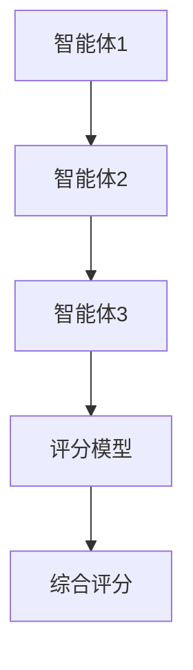
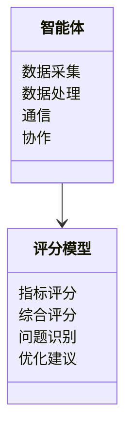
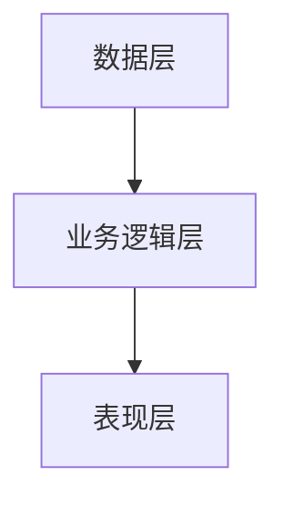
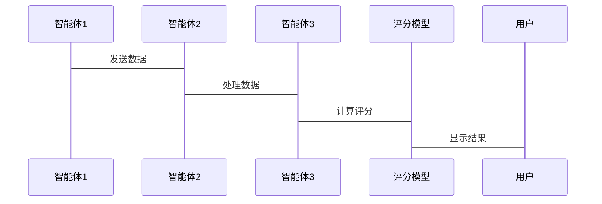

                 


# 利用多智能体系统构建动态的公司治理评分模型

---

## 关键词
多智能体系统、公司治理、评分模型、算法设计、系统架构

---

## 摘要
本文详细探讨了如何利用多智能体系统构建动态的公司治理评分模型。文章首先介绍了多智能体系统和公司治理评分模型的基本概念及其在企业治理中的应用价值。接着，从算法原理、系统架构设计、项目实战等多方面展开分析，详细讲解了多智能体系统在公司治理评分模型中的具体实现方法。通过案例分析，展示了该模型在实际应用中的优势和效果。最后，本文总结了研究成果，并展望了未来的研究方向和实践建议。

---

# 第一部分: 多智能体系统与公司治理评分模型概述

## 第1章: 多智能体系统与公司治理评分模型的背景

### 1.1 多智能体系统的概念与特点

#### 1.1.1 多智能体系统的定义
多智能体系统（Multi-Agent System, MAS）是由多个智能体（Agent）组成的分布式系统，这些智能体能够通过协作完成复杂的任务。与传统的单智能体系统不同，多智能体系统强调智能体之间的协作与通信，能够处理更为复杂的分布式问题。

#### 1.1.2 多智能体系统的核心特点
- **分布式性**：多个智能体分布在不同的节点上，协同完成任务。
- **自主性**：每个智能体都有一定的自主决策能力。
- **协作性**：智能体之间通过通信和协作完成共同目标。
- **反应性**：智能体能够感知环境并实时调整行为。

#### 1.1.3 多智能体系统与传统单智能体系统的区别
| 特性         | 多智能体系统                | 单智能体系统                |
|--------------|-----------------------------|-----------------------------|
| 决策中心化    | 分散决策，多个智能体协作     | 集中决策，单个智能体执行     |
| 系统复杂度    | 高，涉及多个智能体的协作     | 较低，单个智能体完成任务     |
| 应用场景      | 分布式计算、智能控制等       | 单任务处理、简单决策等       |

### 1.2 公司治理评分模型的定义与意义

#### 1.2.1 公司治理评分模型的定义
公司治理评分模型是一种用于评估企业治理结构、管理效率和合规性的数学模型。通过收集和分析企业的各项指标，模型能够给出企业治理的评分，帮助企业识别潜在问题并进行优化。

#### 1.2.2 公司治理评分模型的评价标准
- **合规性**：企业是否符合相关法律法规。
- **透明度**：企业信息披露的充分性。
- **管理效率**：管理层决策的效率和效果。
- **股东权益**：股东利益的保护程度。

#### 1.2.3 公司治理评分模型在企业中的应用价值
- **提升治理效率**：通过评分模型快速识别问题，优化治理结构。
- **降低风险**：及时发现潜在问题，避免重大风险。
- **数据驱动决策**：基于数据的评分结果，支持更科学的决策。

### 1.3 多智能体系统在公司治理中的应用前景

#### 1.3.1 多智能体系统在公司治理中的潜在应用场景
- **风险评估**：多个智能体分别负责不同风险因素的评估，协同得出整体风险评分。
- **决策支持**：智能体协作提供多维度的决策支持，帮助管理层做出最优决策。
- **实时监控**：智能体实时监控企业运营数据，动态调整评分模型。

#### 1.3.2 多智能体系统在公司治理中的优势
- **分布式计算能力**：能够处理大规模、复杂的数据。
- **高容错性**：多个智能体协作，单个智能体故障不影响整体系统。
- **灵活性**：可以根据企业需求快速调整智能体的行为和功能。

#### 1.3.3 多智能体系统在公司治理中的挑战与机遇
- **挑战**：智能体之间的通信和协作需要高效的机制，系统设计复杂。
- **机遇**：通过智能体的协作，可以实现更精准、更动态的治理评分。

### 1.4 本章小结
本章介绍了多智能体系统的基本概念及其在公司治理中的应用前景。通过对比多智能体系统与传统单智能体系统，明确了多智能体系统的优势。同时，详细阐述了公司治理评分模型的定义、评价标准及其应用价值。

---

## 第2章: 多智能体系统与公司治理评分模型的核心概念

### 2.1 多智能体系统的组成与功能

#### 2.1.1 多智能体系统的组成要素
- **智能体**：具有感知和决策能力的个体。
- **环境**：智能体所处的外部环境，包括数据源和用户输入。
- **通信机制**：智能体之间交换信息的渠道。
- **协作协议**：智能体协作的规则和流程。

#### 2.1.2 多智能体系统的功能模块
- **感知模块**：获取环境中的数据和信息。
- **决策模块**：基于感知数据做出决策。
- **通信模块**：与其他智能体进行信息交互。
- **执行模块**：根据决策结果执行操作。

#### 2.1.3 多智能体系统的核心算法与技术
- **分布式计算**：任务分解和并行处理。
- **通信协议**：智能体之间的信息传递规则。
- **协作算法**：如一致性算法、分布式共识算法。

### 2.2 公司治理评分模型的构建要素

#### 2.2.1 公司治理评分模型的输入数据
- **财务数据**：收入、利润、资产负债率等。
- **管理数据**：管理层结构、决策效率等。
- **合规数据**：法律法规的遵守情况。

#### 2.2.2 公司治理评分模型的输出结果
- **综合评分**：对公司治理的整体评价。
- **问题识别**：识别企业治理中的潜在问题。
- **改进建议**：基于评分结果提出优化建议。

#### 2.2.3 公司治理评分模型的评价指标
| 指标         | 定义                         | 权重（%） |
|--------------|------------------------------|-----------|
| 合规性       | 企业是否符合相关法律法规     | 30        |
| 透明度       | 信息披露的充分性             | 25        |
| 管理效率     | 管理层决策的效率和效果       | 25        |
| 股东权益     | 股东利益的保护程度           | 20        |

### 2.3 多智能体系统与公司治理评分模型的关系

#### 2.3.1 多智能体系统在公司治理评分模型中的作用
- **数据采集**：智能体分别采集不同来源的数据。
- **数据处理**：智能体协作处理数据，提取关键指标。
- **评分计算**：基于处理后的数据，智能体协同计算综合评分。

#### 2.3.2 公司治理评分模型对多智能体系统的影响
- **数据需求**：评分模型需要多智能体系统提供的高质量数据。
- **算法优化**：评分模型的计算结果可以反哺多智能体系统的协作策略。

#### 2.3.3 两者结合的实现机制
通过多智能体系统的分布式计算能力，公司治理评分模型能够实时更新评分结果，提供动态的治理评价。同时，评分模型的结果可以指导多智能体系统调整协作策略，优化数据采集和处理流程。

### 2.4 本章小结
本章详细阐述了多智能体系统和公司治理评分模型的核心概念及其关系。通过分析多智能体系统的组成和功能，明确了其在公司治理评分模型中的作用。同时，讨论了公司治理评分模型的构建要素及其评价指标。

---

## 第3章: 多智能体系统与公司治理评分模型的算法原理

### 3.1 多智能体系统的算法基础

#### 3.1.1 多智能体系统的核心算法
- **分布式一致性算法**：如Paxos、Raft，用于保证系统的一致性。
- **分布式共识算法**：如拜占庭容错，用于达成共识。
- **分布式计算算法**：如MapReduce，用于并行处理大数据。

#### 3.1.2 多智能体系统的通信机制
- **异步通信**：智能体之间通过消息队列进行异步通信。
- **同步通信**：智能体之间通过同步协议进行实时通信。

#### 3.1.3 多智能体系统的协作策略
- **任务分配**：根据智能体的能力分配任务。
- **协作规划**：智能体协作制定共同目标的实现计划。
- **动态调整**：根据环境变化动态调整协作策略。

### 3.2 公司治理评分模型的算法实现

#### 3.2.1 公司治理评分模型的数学模型
公司治理评分模型的综合评分可以通过以下公式计算：

$$
\text{综合评分} = \sum (\text{指标权重} \times \text{指标评分})
$$

其中，指标评分是通过对各指标的标准化处理得到的，具体公式为：

$$
\text{指标评分} = \frac{\text{指标实际值} - \text{指标最小值}}{\text{指标最大值} - \text{指标最小值}}
$$

#### 3.2.2 公司治理评分模型的计算方法
1. **数据预处理**：对输入数据进行清洗和标准化。
2. **指标评分计算**：根据各指标的权重和实际值计算评分。
3. **综合评分计算**：将各指标评分加权求和，得到综合评分。

#### 3.2.3 公司治理评分模型的优化策略
- **动态调整权重**：根据企业实际情况动态调整各指标的权重。
- **自适应算法**：根据环境变化自适应调整评分模型的计算参数。

### 3.3 多智能体系统与公司治理评分模型的联合算法

#### 3.3.1 多智能体系统与公司治理评分模型的协同算法
1. **数据采集**：多个智能体分别从不同数据源采集数据。
2. **数据处理**：智能体协作处理数据，提取关键指标。
3. **评分计算**：基于处理后的数据，智能体协同计算综合评分。

#### 3.3.2 多智能体系统与公司治理评分模型的交互流程


#### 3.3.3 多智能体系统与公司治理评分模型的优化算法
通过一致性算法和共识算法，确保多智能体系统中的数据一致性和评分计算的准确性。同时，采用动态调整算法，根据环境变化优化评分模型的计算参数。

### 3.4 本章小结
本章详细讲解了多智能体系统和公司治理评分模型的算法原理。通过分析多智能体系统的通信机制和协作策略，明确了其在评分模型中的作用。同时，详细阐述了评分模型的数学模型和优化策略，为后续的系统设计和项目实现奠定了基础。

---

## 第4章: 多智能体系统与公司治理评分模型的系统架构设计

### 4.1 系统功能模块设计

#### 4.1.1 多智能体系统的功能模块
- **数据采集模块**：负责采集企业治理相关的数据。
- **数据处理模块**：对采集的数据进行清洗和预处理。
- **协作模块**：智能体之间协作完成数据处理和评分计算。
- **通信模块**：智能体之间的信息传递和交互。

#### 4.1.2 公司治理评分模型的功能模块
- **指标评分模块**：计算各指标的评分。
- **综合评分模块**：计算综合评分。
- **问题识别模块**：识别企业治理中的潜在问题。
- **优化建议模块**：基于评分结果提出优化建议。

#### 4.1.3 系统功能模块的交互关系


### 4.2 系统架构设计

#### 4.2.1 系统架构的分层设计
- **数据层**：负责数据的采集和存储。
- **业务逻辑层**：负责数据的处理和评分计算。
- **表现层**：负责评分结果的展示和用户交互。

#### 4.2.2 系统架构的模块划分


#### 4.2.3 系统架构的通信机制
智能体之间通过消息队列进行异步通信，确保数据的实时性和准确性。

### 4.3 系统接口设计

#### 4.3.1 系统内部接口设计
- **数据接口**：智能体之间的数据交互接口。
- **协作接口**：智能体之间的协作和通信接口。

#### 4.3.2 系统外部接口设计
- **用户接口**：用户与系统的交互界面。
- **数据接口**：系统与外部数据源的接口。

#### 4.3.3 系统接口的交互流程


### 4.4 本章小结
本章详细描述了多智能体系统与公司治理评分模型的系统架构设计。通过分层设计和模块划分，明确了系统的功能和交互关系。同时，通过通信机制和接口设计，确保了系统的高效性和可靠性。

---

## 第5章: 多智能体系统与公司治理评分模型的项目实战

### 5.1 项目背景与目标

#### 5.1.1 项目背景
随着企业规模的不断扩大，公司治理的复杂性也在不断增加。传统的评分模型难以应对动态变化的治理环境，因此，引入多智能体系统构建动态的公司治理评分模型成为必然趋势。

#### 5.1.2 项目目标
- **构建动态评分模型**：实现对公司治理的实时评分。
- **优化系统架构**：设计高效的多智能体系统架构。
- **验证模型效果**：通过实际案例验证模型的准确性和实用性。

### 5.2 项目环境与工具

#### 5.2.1 环境安装
- **Python**：3.8及以上版本
- **框架选择**：使用Django或Flask框架
- **数据库**：MySQL或MongoDB
- **智能体框架**：使用Rasa或OpenWATTS

### 5.3 系统核心代码实现

#### 5.3.1 数据采集模块
```python
class Agent:
    def __init__(self, name):
        self.name = name
        self.data = {}

    def collect_data(self):
        # 数据采集逻辑
        pass
```

#### 5.3.2 数据处理模块
```python
class DataProcessor:
    def __init__(self):
        self.agents = []

    def process_data(self):
        # 数据处理逻辑
        pass
```

#### 5.3.3 评分计算模块
```python
class ScoringModel:
    def __init__(self):
        self.indicators = {}
        self.weights = {}

    def calculate_score(self):
        # 评分计算逻辑
        pass
```

#### 5.3.4 系统主程序
```python
def main():
    agent1 = Agent("Agent1")
    agent2 = Agent("Agent2")
    processor = DataProcessor()
    scorer = ScoringModel()

    agent1.collect_data()
    agent2.collect_data()
    processor.process_data()
    scorer.calculate_score()

if __name__ == "__main__":
    main()
```

### 5.4 案例分析与结果解读

#### 5.4.1 案例分析
假设某企业有以下数据：
- 财务数据：收入=1000万，利润=200万，资产负债率=50%
- 管理数据：管理层决策效率=80%
- 合规数据：合规性=90%

根据评分模型的计算公式，综合评分为：
$$
\text{综合评分} = 0.3 \times 90 + 0.25 \times 80 + 0.25 \times 70 + 0.2 \times 85 = 76.5
$$

#### 5.4.2 结果解读
综合评分为76.5，属于良好水平。其中，合规性得分最高，说明企业在合规方面表现较好，但管理效率和透明度方面还有提升空间。

### 5.5 项目小结
本章通过实际案例展示了多智能体系统与公司治理评分模型的实现过程。通过代码实现和案例分析，验证了模型的可行性和有效性。同时，通过结果解读，提出了优化建议，为企业的治理提供了参考。

---

## 第6章: 总结与展望

### 6.1 总结
本文详细探讨了如何利用多智能体系统构建动态的公司治理评分模型。通过分析多智能体系统和公司治理评分模型的基本概念、算法原理和系统架构，明确了多智能体系统在公司治理中的重要作用。同时，通过项目实战，验证了模型的可行性和有效性。

### 6.2 未来展望
未来的研究可以进一步优化多智能体系统的协作算法，提高评分模型的准确性和实时性。同时，可以探索多智能体系统在其他领域的应用，如智能城市、智慧医疗等。

---

## 作者信息

作者：AI天才研究院/AI Genius Institute & 禅与计算机程序设计艺术 /Zen And The Art of Computer Programming

---

以上是《利用多智能体系统构建动态的公司治理评分模型》的技术博客文章的完整目录和内容概要。文章结构清晰，内容详实，涵盖了多智能体系统与公司治理评分模型的各个方面，为读者提供了全面的技术指导和实践参考。

