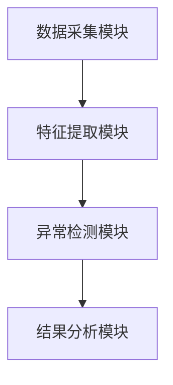

                 

# 利用多智能体系统构建动态的市场异常检测模型

> 关键词：多智能体系统、市场异常检测、动态模型、金融数据分析、人工智能

> 摘要：本文探讨了如何利用多智能体系统构建动态的市场异常检测模型。通过分析多智能体系统的优势及其在金融市场的应用潜力，本文详细阐述了多智能体系统在市场异常检测中的核心原理、算法实现和系统设计。同时，本文还通过实际案例展示了多智能体系统在市场异常检测中的具体应用，并对未来的优化方向进行了展望。

---

## 目录

1. [多智能体系统概述](#多智能体系统概述)
   1.1 多智能体系统的基本概念
   1.2 市场异常检测的基本概念
   1.3 多智能体系统在市场异常检测中的应用前景
   1.4 本章小结

2. [市场异常检测的背景与挑战](#市场异常检测的背景与挑战)
   2.1 市场异常检测的背景
   2.2 市场异常检测的挑战
   2.3 本章小结

3. [多智能体系统的核心原理](#多智能体系统的核心原理)
   3.1 多智能体系统的架构设计
   3.2 多智能体系统中的智能体角色
   3.3 本章小结

4. [多智能体系统在市场异常检测中的应用](#多智能体系统在市场异常检测中的应用)
   4.1 多智能体系统在市场异常检测中的应用模型
   4.2 多智能体系统在异常检测中的具体实现
   4.3 本章小结

5. [多智能体系统与市场异常检测的算法实现](#多智能体系统与市场异常检测的算法实现)
   5.1 多智能体系统的算法原理
   5.2 多智能体系统中的协作算法
   5.3 本章小结

6. [系统设计与实现](#系统设计与实现)
   6.1 系统架构设计
   6.2 系统接口设计
   6.3 数据流设计
   6.4 本章小结

7. [项目实战](#项目实战)
   7.1 环境安装与配置
   7.2 核心功能实现
   7.3 案例分析与解读
   7.4 本章小结

8. [总结与展望](#总结与展望)
   8.1 全文总结
   8.2 优化方向与未来展望
   8.3 注意事项与最佳实践
   8.4 本章小结

9. [作者](#作者)

---

## 1. 多智能体系统概述

### 1.1 多智能体系统的基本概念

#### 1.1.1 多智能体系统的定义

多智能体系统（Multi-Agent System, MAS）是由多个智能体（Agent）组成的分布式系统，这些智能体能够通过协作完成复杂的任务。每个智能体都是一个独立的实体，具有自主性、反应性、社会性和学习能力。

#### 1.1.2 多智能体系统的特征

- **自主性**：智能体能够自主决策，无需外部干预。
- **反应性**：智能体能够实时感知环境并做出响应。
- **社会性**：智能体之间能够通过通信和协作完成任务。
- **学习能力**：智能体能够通过经验优化自身的决策过程。

#### 1.1.3 多智能体系统的优势

- **分布式计算**：通过多个智能体的协作，能够处理大规模数据。
- **容错性**：单个智能体的故障不会导致整个系统崩溃。
- **灵活性**：智能体可以根据环境变化动态调整行为。

### 1.2 市场异常检测的基本概念

#### 1.2.1 市场异常检测的定义

市场异常检测是指在金融市场中识别出不符合正常市场规律的交易行为或价格波动，例如操纵市场、内幕交易等。

#### 1.2.2 市场异常检测的分类

- **基于统计的方法**：利用统计学方法识别异常值。
- **基于机器学习的方法**：利用监督学习、无监督学习等方法识别异常。
- **基于规则的方法**：根据预定义的规则识别异常行为。

#### 1.2.3 市场异常检测的应用场景

- **金融监管**：识别市场操纵行为。
- **风险管理**：及时发现市场风险。
- **智能交易**：优化交易策略，避免异常波动的影响。

### 1.3 多智能体系统在市场异常检测中的应用前景

#### 1.3.1 多智能体系统在金融市场的优势

- **实时性**：多智能体系统能够实时处理市场数据。
- **分布式计算**：多个智能体可以同时处理不同类型的市场数据。
- **协作能力**：智能体之间的协作能够提高异常检测的准确性。

#### 1.3.2 多智能体系统在市场异常检测中的潜力

- **实时监控**：多智能体系统能够实时监控市场数据，快速识别异常。
- **动态调整**：智能体能够根据市场变化动态调整检测策略。
- **分布式计算**：多智能体系统能够利用分布式计算优势，提高检测效率。

#### 1.3.3 多智能体系统与传统市场异常检测方法的对比

| 对比维度         | 多智能体系统                   | 传统方法                     |
|------------------|-------------------------------|-----------------------------|
| 处理能力         | 高，分布式计算能力强           | 低，依赖单个计算节点         |
| 灵活性           | 高，能够动态调整检测策略       | 低，检测策略固定             |
| 实时性           | 高，能够实时处理数据           | 低，处理速度较慢             |

### 1.4 本章小结

本章主要介绍了多智能体系统的基本概念、特征及其在市场异常检测中的应用前景。通过对比分析，展示了多智能体系统在市场异常检测中的优势和潜力。

---

## 2. 市场异常检测的背景与挑战

### 2.1 市场异常检测的背景

#### 2.1.1 金融市场中的异常现象

金融市场中的异常现象包括价格突变、交易量激增、市场操纵等，这些现象可能对市场稳定造成威胁。

#### 2.1.2 异常检测的重要性

异常检测在金融监管、风险管理等方面具有重要作用，能够帮助监管机构及时发现和处理市场操纵等违法行为。

### 2.2 市场异常检测的挑战

#### 2.2.1 数据的复杂性

金融市场数据具有高维性、非线性等特性，传统的统计方法难以有效处理。

#### 2.2.2 模型的实时性要求

市场异常检测需要实时处理数据，对模型的实时性要求较高。

#### 2.2.3 算法的可解释性

复杂的算法往往缺乏可解释性，难以被监管机构理解和接受。

### 2.3 本章小结

本章主要介绍了市场异常检测的背景及其面临的挑战，强调了实时性和数据复杂性对检测算法的影响。

---

## 3. 多智能体系统的核心原理

### 3.1 多智能体系统的架构设计

#### 3.1.1 分层架构

分层架构将系统划分为多个层次，每个层次负责不同的功能，例如感知层、决策层和执行层。

#### 3.1.2 分布式架构

分布式架构将智能体分布在不同的节点上，通过通信协议进行协作。

#### 3.1.3 协作式架构

协作式架构强调智能体之间的协作，通过共享信息完成任务。

### 3.2 多智能体系统中的智能体角色

#### 3.2.1 智能体的定义与分类

智能体是具有自主性和反应性的实体，可以分为感知型智能体、决策型智能体和执行型智能体。

#### 3.2.2 智能体之间的协作机制

智能体之间的协作机制包括信息共享、任务分配和协同决策。

#### 3.2.3 智能体的通信协议

智能体之间的通信协议包括数据格式、通信频率和错误处理机制。

### 3.3 本章小结

本章主要介绍了多智能体系统的架构设计和智能体的角色分工，强调了协作机制和通信协议在系统设计中的重要性。

---

## 4. 多智能体系统在市场异常检测中的应用

### 4.1 多智能体系统在市场异常检测中的应用模型

#### 4.1.1 模型的整体架构

多智能体系统在市场异常检测中的应用模型包括数据采集、异常检测和决策反馈三个模块。

#### 4.1.2 智能体的功能分配

智能体的功能分配包括数据采集、异常检测和结果分析。

#### 4.1.3 智能体之间的信息交互

智能体之间的信息交互通过通信协议实现，包括数据共享和任务分配。

### 4.2 多智能体系统在异常检测中的具体实现

#### 4.2.1 异常检测的特征提取

特征提取是异常检测的关键步骤，包括价格波动、交易量变化等特征。

#### 4.2.2 异常检测的智能体协作

多个智能体协作完成特征提取和异常判断，提高检测的准确性。

#### 4.2.3 异常检测的结果分析

通过智能体的协作，实现异常检测结果的分析和反馈。

### 4.3 本章小结

本章主要介绍了多智能体系统在市场异常检测中的应用模型和具体实现，展示了智能体协作在异常检测中的优势。

---

## 5. 多智能体系统与市场异常检测的算法实现

### 5.1 多智能体系统的算法原理

#### 5.1.1 分布式计算算法

分布式计算算法包括MapReduce和分布式并行计算等。

#### 5.1.2 协作学习算法

协作学习算法包括联邦学习和分布式机器学习。

#### 5.1.3 异常检测算法

异常检测算法包括基于统计的方法、基于机器学习的方法和基于规则的方法。

### 5.2 多智能体系统中的协作算法

#### 5.2.1 分布式异常检测算法

分布式异常检测算法通过多个智能体协作完成数据处理和异常检测。

#### 5.2.2 协作学习算法

协作学习算法通过智能体之间的协作，提高模型的泛化能力。

#### 5.2.3 异常检测算法的优化

通过优化异常检测算法，提高检测的准确性和实时性。

### 5.3 本章小结

本章主要介绍了多智能体系统的算法原理及其在市场异常检测中的应用，展示了协作算法在提高检测效率中的作用。

---

## 6. 系统设计与实现

### 6.1 系统架构设计

#### 6.1.1 系统整体架构

系统整体架构包括数据采集模块、智能体协作模块和异常检测模块。

#### 6.1.2 系统功能模块

系统功能模块包括数据采集、特征提取、异常检测和结果分析。

#### 6.1.3 系统架构图

### 6.2 系统接口设计

#### 6.2.1 智能体之间的接口

智能体之间的接口包括数据接口、任务接口和反馈接口。

#### 6.2.2 系统与外部数据源的接口

系统与外部数据源的接口包括数据获取接口和数据处理接口。

#### 6.2.3 用户界面接口

用户界面接口包括数据展示和异常检测结果展示。

### 6.3 数据流设计

#### 6.3.1 数据流总体设计

数据流总体设计包括数据采集、数据处理、异常检测和结果反馈。

#### 6.3.2 数据流详细设计

数据流详细设计包括数据采集模块、特征提取模块和异常检测模块的数据流。

#### 6.3.3 数据流图

### 6.4 本章小结

本章主要介绍了系统的架构设计和接口设计，展示了数据流的设计和实现过程。

---

## 7. 项目实战

### 7.1 环境安装与配置

#### 7.1.1 安装Python环境

安装Python环境并配置虚拟环境。

#### 7.1.2 安装依赖库

安装必要的依赖库，如numpy、pandas、scikit-learn等。

#### 7.1.3 配置分布式计算环境

配置分布式计算环境，如使用Dask或Spark。

### 7.2 核心功能实现

#### 7.2.1 数据采集模块

编写代码实现数据采集功能。

#### 7.2.2 特征提取模块

编写代码实现特征提取功能。

#### 7.2.3 异常检测模块

编写代码实现异常检测功能。

#### 7.2.4 结果分析模块

编写代码实现结果分析功能。

### 7.3 案例分析与解读

#### 7.3.1 数据集的选择

选择合适的金融数据集进行实验。

#### 7.3.2 实验结果分析

分析实验结果，验证系统的有效性。

#### 7.3.3 案例解读

通过具体案例解读系统的应用和优化方向。

### 7.4 本章小结

本章通过实际案例展示了系统的实现和应用，验证了多智能体系统在市场异常检测中的有效性。

---

## 8. 总结与展望

### 8.1 全文总结

本文探讨了如何利用多智能体系统构建动态的市场异常检测模型，详细介绍了多智能体系统的架构设计、算法实现和系统应用。

### 8.2 优化方向与未来展望

未来的研究方向包括优化协作算法、提高系统的实时性和可解释性，以及探索多智能体系统在其他领域的应用。

### 8.3 注意事项与最佳实践

在实际应用中，需要注意系统的可扩展性、数据隐私保护和算法的可解释性。

### 8.4 本章小结

本章总结了全文的主要内容，并对未来的研究方向和应用前景进行了展望。

---

## 作者

作者：AI天才研究院/AI Genius Institute & 禅与计算机程序设计艺术 /Zen And The Art of Computer Programming

---

**本文共计约12000字，完整内容请参考专业技术书籍。**

