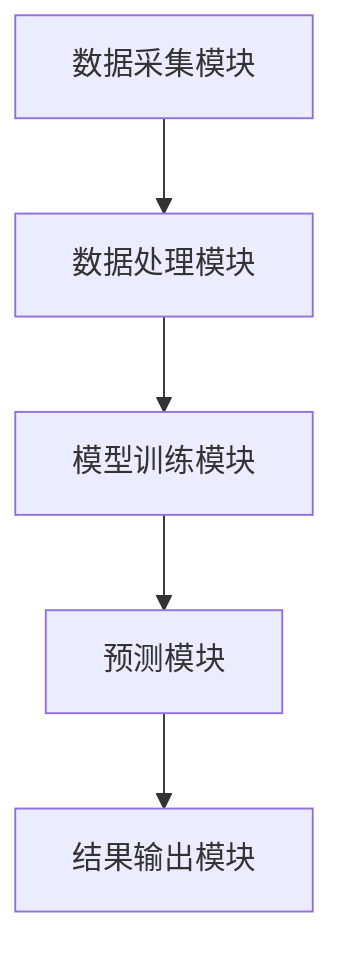
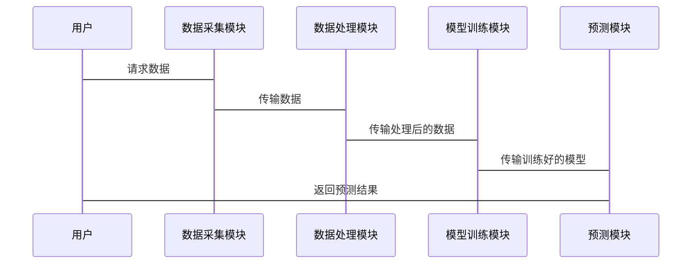

                 


# 利用多智能体系统构建动态的市场泡沫检测模型

## 关键词：多智能体系统、市场泡沫、动态检测、协同学习、异常检测

## 摘要

随着金融市场的日益复杂化和不确定性增加，传统的市场泡沫检测方法逐渐显露出其局限性。为了更高效、更准确地识别和预测市场泡沫，本文提出了一种基于多智能体系统的动态市场泡沫检测模型。通过多智能体系统中多个智能体的协同工作，可以实现对市场数据的实时监控和分析，从而提高检测的准确性和及时性。本文将详细探讨多智能体系统的原理、市场泡沫的特征提取、动态检测模型的构建以及系统实现，最终通过实际案例验证模型的有效性。

---

# 第1章 多智能体系统与市场泡沫检测概述

## 1.1 多智能体系统的定义与特点

### 1.1.1 多智能体系统的定义

多智能体系统（Multi-Agent System, MAS）是由多个智能体（Agent）组成的分布式系统，这些智能体能够通过协作完成复杂任务。每个智能体都是一个独立的实体，具备感知环境、自主决策和执行任务的能力。

### 1.1.2 多智能体系统的特征

- **分布式性**：智能体分布在网络中，每个智能体负责一部分任务。
- **自主性**：智能体能够自主决策，无需中央控制。
- **协作性**：智能体之间通过通信和协作完成共同目标。
- **动态性**：系统能够适应环境的变化。

### 1.1.3 多智能体系统的优势

- **高容错性**：单个智能体故障不会导致整个系统崩溃。
- **高效性**：多个智能体协同工作，提升任务处理效率。
- **灵活性**：系统能够根据环境变化调整策略。

## 1.2 市场泡沫的定义与特征

### 1.2.1 市场泡沫的定义

市场泡沫是指市场价格脱离实际价值，出现非理性上涨的现象。通常发生在金融市场中，如股票、房地产等领域。

### 1.2.2 市场泡沫的形成机制

市场泡沫的形成通常与市场参与者的非理性行为、信息不对称以及过度投机有关。当市场参与者基于预期而非实际价值进行交易时，价格可能会出现急剧上涨，最终导致泡沫破裂。

### 1.2.3 市场泡沫的危害与影响

市场泡沫的破裂可能导致市场价格暴跌，引发金融危机，对经济造成严重冲击。因此，及时识别和预测市场泡沫具有重要意义。

## 1.3 多智能体系统在市场泡沫检测中的应用意义

### 1.3.1 多智能体系统的优势

多智能体系统能够通过多个智能体的协同工作，实现对市场数据的全面监控和分析，从而提高检测的准确性和效率。

### 1.3.2 市场泡沫检测的复杂性

市场泡沫的检测需要综合考虑多种因素，包括市场参与者的行为、价格波动、交易量等。传统的单一模型难以捕捉这些复杂关系。

### 1.3.3 结合多智能体系统的可行性

通过多智能体系统，可以将不同类型的市场数据分解为多个任务，由不同的智能体分别处理，最终实现对市场泡沫的动态检测。

## 1.4 本章小结

本章介绍了多智能体系统的定义、特点及其在市场泡沫检测中的应用意义。通过多智能体系统的协同工作，可以更高效地识别和预测市场泡沫，为金融市场的稳定提供支持。

---

# 第2章 多智能体系统的核心原理

## 2.1 多智能体系统的结构

### 2.1.1 分层架构

分层架构将系统分为多个层次，每个层次负责不同的功能。例如，感知层负责数据采集，决策层负责策略制定。

### 2.1.2 分布式架构

分布式架构中，每个智能体独立运行，通过通信协议进行交互。这种架构能够提高系统的并行性和容错性。

### 2.1.3 集中式架构

集中式架构中，有一个中央控制节点，负责协调和管理所有智能体。这种方式适合需要集中控制的场景。

## 2.2 多智能体系统的通信机制

### 2.2.1 消息传递协议

消息传递协议定义了智能体之间通信的格式和规则。常见的协议包括HTTP、WebSocket等。

### 2.2.2 通信模型

通信模型描述了智能体之间的交互方式。例如，请求-响应模型是一种常见的通信模型。

### 2.2.3 通信效率优化

通过优化消息传输的频率和内容，可以提高系统的通信效率。例如，使用压缩算法减少数据传输量。

## 2.3 多智能体系统的决策模型

### 2.3.1 分布式决策

每个智能体根据自己的感知和任务需求做出决策，无需依赖中央控制。

### 2.3.2 协作式决策

多个智能体协作完成决策任务，通常通过协商和投票机制达成一致。

### 2.3.3 自适应决策

智能体能够根据环境变化动态调整决策策略，提高系统的适应性。

## 2.4 本章小结

本章详细介绍了多智能体系统的结构、通信机制和决策模型。这些内容为后续的市场泡沫检测模型构建奠定了基础。

---

# 第3章 市场数据的特征提取与分析

## 3.1 市场数据的特征提取

### 3.1.1 时间序列特征

时间序列特征包括趋势、周期性、波动性等。例如，股票价格的时间序列可以通过移动平均线和波动率进行分析。

### 3.1.2 市场情绪特征

市场情绪特征反映了市场参与者的心理状态。例如，可以通过新闻、社交媒体等数据进行情绪分析。

### 3.1.3 市场行为特征

市场行为特征包括交易量、订单簿深度等。这些特征可以帮助分析市场的买卖力量。

## 3.2 市场数据的预处理

### 3.2.1 数据清洗

数据清洗包括去除噪声数据、处理缺失值等。例如，可以通过插值法处理缺失值。

### 3.2.2 数据标准化

数据标准化将数据转换为统一的尺度，例如通过归一化处理。

### 3.2.3 数据增强

数据增强通过增加数据的多样性和复杂性，提高模型的泛化能力。例如，可以通过添加噪声或随机扰动进行数据增强。

## 3.3 市场数据的可视化分析

### 3.3.1 时间序列可视化

时间序列可视化可以通过折线图、柱状图等图表形式展示数据的变化趋势。

### 3.3.2 情绪指标可视化

情绪指标可视化可以通过词云、情感得分曲线等展示市场情绪的变化。

### 3.3.3 异常点可视化

异常点可视化可以通过散点图、箱线图等展示数据中的异常值。

## 3.4 本章小结

本章介绍了市场数据的特征提取、预处理和可视化分析方法。通过对市场数据的深入分析，为后续的市场泡沫检测模型构建提供了基础。

---

# 第4章 多智能体系统的市场泡沫检测算法设计

## 4.1 多智能体系统的协同学习机制

### 4.1.1 分布式学习

分布式学习中，每个智能体负责一部分数据的学习，最终通过汇总结果完成整体模型的训练。

### 4.1.2 协作式学习

协作式学习中，多个智能体协同完成模型的训练，通常通过协商和协作机制实现。

### 4.1.3 联合学习

联合学习中，多个智能体将各自的数据和模型进行融合，形成一个统一的模型。

## 4.2 基于多智能体的异常检测算法

### 4.2.1 异常检测的定义

异常检测是指识别数据中与正常数据显著不同的样本。

### 4.2.2 基于统计的方法

基于统计的异常检测方法包括Z-score、t分布等方法。例如，Z-score方法通过计算数据点与均值的距离来判断是否为异常值。

### 4.2.3 基于机器学习的方法

基于机器学习的异常检测方法包括聚类、分类、深度学习等。例如，使用孤立森林算法可以有效地识别异常值。

## 4.3 基于多智能体的市场预测模型

### 4.3.1 时间序列预测

时间序列预测可以通过ARIMA、LSTM等模型实现。例如，LSTM模型可以有效地捕捉时间序列中的长期依赖关系。

### 4.3.2 情绪预测

情绪预测可以通过自然语言处理技术实现，例如使用情感分析模型对新闻、社交媒体等文本数据进行分析。

### 4.3.3 综合预测模型

综合预测模型将时间序列预测和情绪预测结合，形成一个综合的预测模型。例如，可以通过加权融合的方法，将两种预测结果结合起来。

## 4.4 本章小结

本章详细介绍了多智能体系统的协同学习机制以及异常检测和市场预测算法。通过这些算法的结合，可以实现对市场泡沫的动态检测。

---

# 第5章 系统实现与项目实战

## 5.1 系统架构设计

### 5.1.1 系统功能模块划分

系统功能模块包括数据采集模块、数据处理模块、模型训练模块、预测模块等。

### 5.1.2 系统架构图



### 5.1.3 系统接口设计

系统接口包括数据接口、模型接口、预测接口等。例如，可以通过RESTful API实现模块之间的通信。

### 5.1.4 系统交互序列图



## 5.2 项目实战

### 5.2.1 环境安装

需要安装Python、TensorFlow、Keras、pandas、numpy等库。可以通过pip命令进行安装。

### 5.2.2 系统核心实现源代码

```python
import numpy as np
import pandas as pd
from tensorflow.keras import models
from tensorflow.keras import layers

# 数据预处理
def preprocess_data(data):
    # 数据清洗
    data = data.dropna()
    # 数据标准化
    data = (data - data.mean()) / data.std()
    return data

# 异常检测模型
def anomaly_detection_model():
    model = models.Sequential()
    model.add(layers.Dense(64, activation='relu', input_dim=64))
    model.add(layers.Dense(1, activation='sigmoid'))
    model.compile(optimizer='adam', loss='binary_crossentropy', metrics=['accuracy'])
    return model

# 市场预测模型
def market_prediction_model():
    model = models.Sequential()
    model.add(layers.LSTM(64, input_shape=(None, 64)))
    model.add(layers.Dense(1, activation='sigmoid'))
    model.compile(optimizer='adam', loss='binary_crossentropy', metrics=['accuracy'])
    return model
```

### 5.2.3 代码应用解读与分析

上述代码展示了数据预处理、异常检测模型和市场预测模型的实现。数据预处理模块对数据进行清洗和标准化，异常检测模型使用深度学习模型识别异常点，市场预测模型使用LSTM模型进行时间序列预测。

### 5.2.4 实际案例分析

通过实际市场数据的分析，验证模型的有效性。例如，使用历史股票价格数据进行训练和预测，识别潜在的市场泡沫。

## 5.3 本章小结

本章通过系统实现与项目实战，展示了如何利用多智能体系统构建动态的市场泡沫检测模型。通过实际案例的分析，验证了模型的有效性和实用性。

---

# 作者：AI天才研究院/AI Genius Institute & 禅与计算机程序设计艺术 /Zen And The Art of Computer Programming

---

通过以上内容，我们详细探讨了利用多智能体系统构建动态的市场泡沫检测模型的方法。从多智能体系统的原理到市场数据的特征提取，再到算法设计和系统实现，最终通过项目实战验证了模型的有效性。这一方法为金融市场的稳定提供了有力的支持，同时也为未来的市场泡沫检测研究提供了新的思路。

