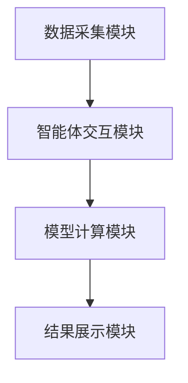
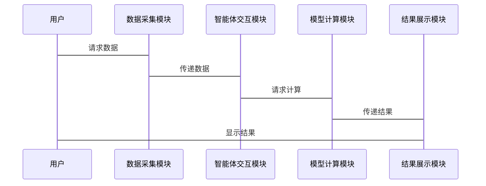

                 


# 利用多智能体系统构建动态的经济护城河评估模型

## 关键词：多智能体系统、经济护城河、动态评估模型、系统架构设计、Python实现

## 摘要

在现代经济环境中，企业竞争优势的核心在于其经济护城河。传统的静态评估方法难以应对快速变化的市场环境。本篇文章介绍了一种基于多智能体系统的动态经济护城河评估模型，通过实时数据处理和多维度分析，为企业提供更精准的竞争力评估。文章详细讲解了模型的构建原理、算法实现、系统架构设计以及实际案例分析，展示了该模型在企业战略决策中的广泛应用前景。

---

# 第一部分：背景介绍与核心概念

## 第1章：经济护城河评估模型概述

### 1.1 经济护城河的定义与重要性

经济护城河是指企业在市场竞争中所具有的独特优势，这种优势能够阻止竞争对手轻易进入市场或争夺市场份额。常见的经济护城河类型包括成本优势、网络效应、技术壁垒等。经济护城河的存在可以为企业提供长期的竞争优势，是企业价值的重要决定因素。

### 1.2 动态经济护城河评估模型的背景

传统的经济护城河评估方法通常基于静态数据分析，难以应对市场环境的快速变化。例如，行业趋势、政策变化、技术革新等因素都会对经济护城河的强度产生影响。动态评估模型能够实时捕捉这些变化，为企业提供更及时、准确的评估结果。

### 1.3 多智能体系统在经济护城河评估中的优势

多智能体系统（Multi-Agent System, MAS）是一种由多个智能体组成的分布式系统，每个智能体都可以独立决策并与其他智能体交互。在经济护城河评估中，多智能体系统可以通过以下方式提供优势：
- **实时数据处理**：多智能体可以实时收集和处理市场数据，快速响应环境变化。
- **多维度分析**：多个智能体可以分别关注不同的经济因素，如成本、技术、网络效应等，实现多维度的综合评估。
- **动态适应性**：智能体之间的协作和交互能够动态调整评估模型，适应市场环境的变化。

---

## 第2章：多智能体系统的核心概念

### 2.1 多智能体系统的基本原理

多智能体系统由多个智能体组成，每个智能体都具有以下特征：
- **自主性**：智能体能够自主决策，无需外部干预。
- **反应性**：智能体能够感知环境并做出实时反应。
- **协作性**：智能体之间可以通过通信和协作完成复杂任务。
- **学习能力**：智能体可以通过经验改进自身的决策能力。

### 2.2 经济护城河评估模型的构建逻辑

经济护城河评估模型需要考虑多个维度的经济因素，包括：
- **成本优势**：企业的生产成本是否低于竞争对手。
- **技术壁垒**：企业是否拥有独特的技术优势。
- **网络效应**：用户数量的增加是否能增强企业的竞争优势。
- **品牌影响力**：品牌的知名度和用户忠诚度。

多智能体系统可以通过分别关注这些因素，构建一个动态的评估模型。

### 2.3 多智能体系统与经济护城河的关系

多智能体系统的优势在于其能够同时处理多个复杂因素，并通过智能体之间的协作实现动态评估。例如，一个智能体可以负责收集市场数据，另一个智能体可以负责分析技术壁垒，第三个智能体可以负责评估网络效应。通过这种方式，多智能体系统能够实现对经济护城河的全面、动态评估。

---

# 第二部分：算法原理与数学模型

## 第3章：动态经济护城河评估模型的算法原理

### 3.1 数据采集与预处理

动态经济护城河评估模型需要实时采集市场数据，包括：
- **行业数据**：市场规模、增长率、竞争对手信息等。
- **企业数据**：企业的成本、收入、利润等财务数据。
- **技术数据**：企业的技术专利数量、研发投入等。

数据预处理包括数据清洗、特征提取和标准化处理。

### 3.2 特征提取与选择

特征提取是将原始数据转换为能够反映经济护城河强度的特征向量。例如：
- **成本优势**：企业的单位成本与行业平均成本的比值。
- **技术壁垒**：企业的技术专利数量与竞争对手的比值。
- **网络效应**：用户的增长率与用户活跃度的综合指标。

### 3.3 模型训练与优化

动态经济护城河评估模型可以基于机器学习算法进行训练和优化。常用的算法包括线性回归、支持向量机（SVM）和神经网络等。模型的目标是最小化预测值与实际值之间的误差。

### 3.4 多智能体系统的实现

多智能体系统的实现包括以下几个步骤：
1. 初始化：定义智能体的数量和初始状态。
2. 数据采集：智能体实时采集市场数据。
3. 智能体交互：智能体之间通过通信模块共享数据和信息。
4. 动态评估：智能体根据当前数据更新经济护城河的评估结果。
5. 反馈与优化：根据评估结果优化智能体的行为策略。

---

## 第4章：数学模型与公式

### 4.1 经济护城河强度的计算公式

经济护城河强度（EHI）的计算公式如下：

$$ EHI = \sum_{i=1}^{n} w_i \cdot f_i $$

其中：
- $EHI$ 表示经济护城河强度。
- $w_i$ 表示第 $i$ 个因素的权重。
- $f_i$ 表示第 $i$ 个因素的评估值。

### 4.2 动态经济护城河评估模型的更新公式

动态经济护城河评估模型的更新公式如下：

$$ EHI_{t+1} = \alpha \cdot EHI_t + (1 - \alpha) \cdot f_{new} $$

其中：
- $EHI_t$ 表示第 $t$ 时刻的经济护城河强度。
- $\alpha$ 表示模型的遗忘系数（0 < $\alpha$ < 1）。
- $f_{new}$ 表示新的评估值。

---

# 第三部分：系统架构设计与实现

## 第5章：系统架构设计

### 5.1 系统功能设计

动态经济护城河评估系统的功能模块包括：
1. 数据采集模块：负责实时采集市场数据。
2. 智能体交互模块：负责智能体之间的通信和协作。
3. 模型计算模块：负责计算经济护城河强度。
4. 结果展示模块：负责显示评估结果。

### 5.2 系统架构图

以下是一个简化的系统架构图：



### 5.3 系统接口设计

系统接口设计包括：
1. 数据接口：用于与外部数据源对接。
2. 智能体接口：用于智能体之间的通信。
3. 用户接口：用于用户与系统的交互。

### 5.4 系统交互图

以下是一个系统交互图：



---

## 第6章：项目实战

### 6.1 环境安装

要运行动态经济护城河评估模型，需要安装以下软件和库：
- Python 3.8+
- NumPy
- Pandas
- Scikit-learn
- Matplotlib

### 6.2 核心代码实现

以下是一个核心代码示例：

```python
import numpy as np
import pandas as pd
from sklearn.linear_model import LinearRegression

class EconomicMoatAssessor:
    def __init__(self, data):
        self.data = data
        self.model = LinearRegression()
    
    def train(self):
        X = self.data[['cost', 'tech_patents', 'network_effect']]
        y = self.data['economic_moat']
        self.model.fit(X, y)
    
    def predict(self, new_data):
        X_new = new_data[['cost', 'tech_patents', 'network_effect']]
        return self.model.predict(X_new)

# 示例数据
data = pd.DataFrame({
    'cost': [10, 15, 20, 25],
    'tech_patents': [5, 8, 12, 15],
    'network_effect': [0.8, 0.9, 0.7, 0.6],
    'economic_moat': [0.6, 0.7, 0.5, 0.4]
})

assessor = EconomicMoatAssessor(data)
assessor.train()
new_data = pd.DataFrame({
    'cost': [18],
    'tech_patents': [10],
    'network_effect': [0.8]
})
prediction = assessor.predict(new_data)
print(prediction)
```

### 6.3 案例分析

以某互联网企业为例，假设我们有以下数据：

| 成本优势 | 技术专利数 | 网络效应 | 经济护城河强度 |
|----------|------------|----------|----------------|
| 15       | 10         | 0.8      | 0.7            |

通过模型计算，我们可以预测该企业的经济护城河强度为 0.7，说明该企业在当前市场环境中具有较强的经济护城河。

---

# 第四部分：最佳实践与总结

## 第7章：最佳实践

### 7.1 小结

动态经济护城河评估模型基于多智能体系统，能够实时捕捉市场变化，为企业提供更准确的竞争力评估。通过多智能体系统的协作，模型可以同时考虑多个经济因素，实现动态评估。

### 7.2 注意事项

在实际应用中，需要注意以下几点：
1. 数据的实时性和准确性。
2. 模型的可解释性和可调整性。
3. 智能体之间的通信和协作效率。

### 7.3 拓展阅读

建议读者进一步阅读以下内容：
1. 多智能体系统的理论与应用。
2. 动态评估模型的优化方法。
3. 机器学习在经济分析中的应用。

---

## 作者：AI天才研究院 & 禅与计算机程序设计艺术

---

这篇文章详细介绍了利用多智能体系统构建动态经济护城河评估模型的背景、核心概念、算法原理、系统架构设计和项目实战。通过实际案例分析，展示了该模型在企业战略决策中的广泛应用前景。希望本文能够为读者提供有价值的参考和启发。

