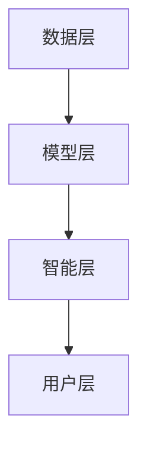
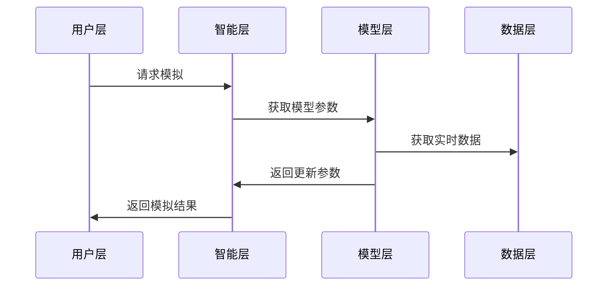

                 


# 利用多智能体系统构建动态行业生命周期模型

> 关键词：多智能体系统，动态行业生命周期，行业模型，系统构建，协作机制，动态适应

> 摘要：本文探讨了利用多智能体系统构建动态行业生命周期模型的方法，详细分析了多智能体系统的定义、核心概念、算法原理及在动态行业生命周期模型中的应用。通过案例分析和项目实战，展示了如何设计和实现一个基于多智能体的动态行业生命周期模型，并提出了相关的最佳实践和未来研究方向。

---

## 第一章：多智能体系统与动态行业生命周期模型概述

### 1.1 多智能体系统的定义与特点

#### 1.1.1 多智能体系统的定义

多智能体系统（Multi-Agent System，MAS）是由多个智能体（Agent）组成的复杂系统。智能体是具有自主性、反应性、目标导向和协作能力的实体，能够感知环境、做出决策并执行动作。MAS通过智能体之间的协作完成复杂的任务，广泛应用于分布式计算、机器人、自动驾驶、游戏AI等领域。

$$
\text{智能体} = \{\text{自主性, 反应性, 目标导向, 协作能力}\}
$$

#### 1.1.2 多智能体系统的分类

多智能体系统可以分为以下几类：

1. **基于任务的多智能体系统**：智能体协作完成特定任务。
2. **基于模型的多智能体系统**：通过共享模型进行协作。
3. **基于市场的多智能体系统**：智能体通过市场机制进行资源分配和交易。

#### 1.1.3 多智能体系统的核心特点

- **分布式性**：智能体独立运行，不依赖中央控制。
- **协作性**：智能体之间通过通信和协作完成任务。
- **动态性**：环境和任务动态变化，智能体需实时调整策略。

### 1.2 动态行业生命周期模型的定义与特点

#### 1.2.1 行业生命周期的定义

行业生命周期描述了行业从初创、成长、成熟到衰退的演变过程。每个阶段具有不同的特征和挑战，企业需根据阶段调整战略。

#### 1.2.2 动态行业生命周期的特点

- **动态性**：行业环境和竞争格局不断变化。
- **复杂性**：不同阶段涉及多种因素，如技术、市场、政策等。
- **预测性**：通过模型预测行业趋势，辅助决策。

#### 1.2.3 动态行业生命周期模型的构建方法

构建动态行业生命周期模型需要考虑数据采集、模型设计和动态更新等步骤。模型需能够捕捉行业变化，实时调整预测结果。

### 1.3 多智能体系统与动态行业生命周期模型的关系

#### 1.3.1 多智能体系统在动态行业生命周期中的作用

多智能体系统能够模拟行业中的多个参与者（如企业、消费者、政策制定者）的行为，分析它们的互动对行业生命周期的影响。

#### 1.3.2 多智能体系统与动态行业生命周期模型的结合

通过将智能体嵌入模型中，动态行业生命周期模型能够实时反映行业变化，提供更准确的预测和决策支持。

#### 1.3.3 多智能体系统在动态行业生命周期模型中的应用

多智能体系统用于模拟行业中的竞争、合作和市场变化，帮助企业制定适应性战略。

---

## 第二章：多智能体系统的核心概念与原理

### 2.1 多智能体系统的组成与结构

#### 2.1.1 智能体的定义与分类

智能体是具有感知、决策和行动能力的实体。根据智能体的智能水平，可分为反应式智能体、基于模型的智能体和目标导向智能体。

#### 2.1.2 多智能体系统的层次结构

多智能体系统的层次结构包括：

1. **智能体层**：具体智能体的实现。
2. **协作层**：智能体之间的协作机制。
3. **环境层**：智能体所处的环境。

#### 2.1.3 多智能体系统的通信机制

智能体之间通过消息传递、黑板机制等方式进行通信，共享信息和协调行动。

### 2.2 多智能体系统的协作机制

#### 2.2.1 协作的定义与分类

协作是指智能体为实现共同目标而协同工作的方式。协作可以是同步的或异步的，基于共享知识或分布式决策。

#### 2.2.2 协作协议的设计

协作协议需要定义智能体之间的通信格式、任务分配和冲突解决规则。

#### 2.2.3 协作机制的实现

常见的协作机制包括基于合同 nets 的协作、基于角色的协作和基于市场的协作。

### 2.3 多智能体系统的动态性与适应性

#### 2.3.1 动态环境的定义与特点

动态环境是指环境和任务不断变化，智能体需要实时调整策略。

#### 2.3.2 多智能体系统的动态适应机制

通过自适应算法和反馈机制，智能体能够快速响应环境变化。

#### 2.3.3 多智能体系统的自适应能力

自适应能力包括学习能力、容错能力和协作能力，使系统能够在复杂环境中生存。

---

## 第三章：动态行业生命周期模型的构建与分析

### 3.1 行业生命周期的阶段划分

#### 3.1.1 初创阶段

行业初创阶段，企业数量少，市场增长快，竞争较小。

#### 3.1.2 成长阶段

行业进入快速发展期，企业数量增加，竞争加剧。

#### 3.1.3 成熟阶段

行业增长放缓，竞争趋于稳定，企业利润下降。

#### 3.1.4 衰退阶段

行业需求下降，企业倒闭或转型。

### 3.2 动态行业生命周期模型的构建方法

#### 3.2.1 数据采集与处理

通过市场调研、数据分析等方式获取行业数据，进行清洗和预处理。

#### 3.2.2 模型构建与验证

使用统计学和机器学习方法构建模型，验证模型的准确性和稳定性。

#### 3.2.3 模型的动态更新与维护

定期更新模型参数和规则，确保模型反映最新的行业动态。

### 3.3 动态行业生命周期模型的分析与应用

#### 3.3.1 行业趋势预测

通过模型预测行业未来的发展趋势，帮助企业制定战略。

#### 3.3.2 企业战略制定

根据模型分析结果，优化企业的市场进入、产品开发和投资策略。

#### 3.3.3 风险评估与应对

模型帮助企业识别潜在风险，制定应对措施。

---

## 第四章：基于多智能体的动态行业生命周期模型算法原理

### 4.1 算法原理概述

基于多智能体的动态行业生命周期模型需要智能体协作模拟行业变化。智能体根据环境信息调整行为，影响行业生命周期。

### 4.2 协作算法的设计

#### 4.2.1 多智能体协作算法

智能体通过通信和协作完成任务，算法需要考虑任务分配、冲突解决和信息共享。

#### 4.2.2 动态模型更新算法

根据实时数据更新模型参数，确保模型准确性。

### 4.3 算法实现

#### 4.3.1 算法流程

1. 初始化智能体和环境。
2. 智能体感知环境并做出决策。
3. 智能体之间通信和协作。
4. 更新模型参数和环境状态。

#### 4.3.2 代码示例

```python
class Agent:
    def __init__(self, id):
        self.id = id
        self.state = 'idle'
    
    def感知环境(self, 环境):
        self.环境信息 = 环境
    
    def 决策(self):
        if self.环境信息 == '机会':
            self.state = '行动'
        else:
            self.state = '等待'
    
    def 通信(self, 其他智能体):
        for agent in 其他智能体:
            agent.感知环境(self.环境信息)

# 初始化环境和智能体
环境 = '机会'
agents = [Agent(1), Agent(2), Agent(3)]

# 执行算法
for agent in agents:
    agent.感知环境(环境)
    agent.决策()
    agent.通信(agents)
```

### 4.4 数学模型与公式

动态行业生命周期模型可以表示为：

$$
\text{生命周期阶段} = f(\text{市场增长率}, \text{竞争强度}, \text{技术创新})
$$

其中，f是综合考虑市场、竞争和技术因素的函数。

---

## 第五章：系统分析与架构设计

### 5.1 系统分析

#### 5.1.1 问题场景介绍

构建一个动态行业生命周期模型，模拟不同阶段的行业变化，帮助企业制定战略。

#### 5.1.2 系统功能设计

系统需要实现以下功能：

1. 数据采集与处理。
2. 模型构建与验证。
3. 智能体协作模拟。
4. 模型动态更新。

#### 5.1.3 系统架构设计

采用分层架构：

1. 数据层：存储行业数据。
2. 模型层：实现模型构建和更新。
3. 智能层：智能体协作模拟。
4. 用户层：提供人机交互界面。

### 5.2 系统架构图



### 5.3 系统接口设计

系统接口包括数据接口、模型接口和用户接口，确保各模块协同工作。

### 5.4 系统交互图



---

## 第六章：项目实战

### 6.1 环境安装

需要安装Python、NumPy、Matplotlib、网络库等工具。

### 6.2 核心代码实现

实现多智能体协作和动态模型更新的核心代码。

```python
import numpy as np
import matplotlib.pyplot as plt

class IndustryModel:
    def __init__(self):
        self.stage = '初创'
    
    def update_stage(self, 市场增长率, 竞争强度):
        if 市场增长率 > 0.1 and 竞争强度 < 0.5:
            self.stage = '成长'
        elif 市场增长率 < 0.05 and 竞争强度 > 0.8:
            self.stage = '衰退'
        else:
            self.stage = '成熟'

class Agent:
    def __init__(self, id):
        self.id = id
        self.model = IndustryModel()
    
    def simulate(self, 市场增长率, 竞争强度):
        self.model.update_stage(市场增长率, 竞争强度)
        return self.model.stage

# 案例分析
市场增长率 = np.random.uniform(0, 0.2)
竞争强度 = np.random.uniform(0, 1)
agent = Agent(1)
print(agent.simulate(市场增长率, 竞争强度))
```

### 6.3 案例分析与结果解读

通过模拟不同市场增长率和竞争强度，分析行业生命周期的变化。

### 6.4 项目总结

项目展示了如何利用多智能体系统构建动态行业生命周期模型，为企业提供决策支持。

---

## 第七章：最佳实践与未来展望

### 7.1 最佳实践

1. **数据质量**：确保数据的准确性和完整性。
2. **模型更新**：定期更新模型参数，保持模型的准确性。
3. **智能体协作**：优化协作机制，提高系统的效率。

### 7.2 小结

本文详细探讨了多智能体系统在动态行业生命周期模型中的应用，展示了如何通过智能体协作和动态更新实现准确的行业预测和决策支持。

### 7.3 注意事项

在实际应用中，需注意系统的实时性和可扩展性，避免因环境复杂性导致的性能瓶颈。

### 7.4 拓展阅读

建议进一步研究多智能体系统的自适应算法和分布式计算技术，探索其在更多领域的应用。

---

## 作者：AI天才研究院/AI Genius Institute & 禅与计算机程序设计艺术/Zen And The Art of Computer Programming

---

通过以上结构，文章详细讲解了多智能体系统在动态行业生命周期模型中的应用，从理论到实践，从算法到系统设计，为读者提供了全面的知识和实用的指导。

