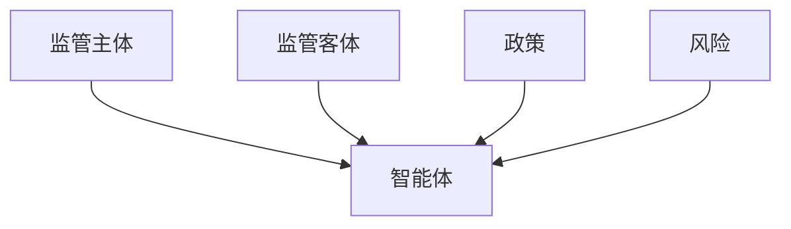

                 


# 利用多智能体系统模拟不同监管情景：评估政策风险

## 关键词：多智能体系统、监管情景模拟、政策风险评估、分布式协作算法、系统架构设计

## 摘要：  
随着政策制定和监管需求的日益复杂化，利用多智能体系统模拟不同监管情景成为评估政策风险的重要手段。本文通过详细分析多智能体系统的原理、算法设计、系统架构以及实际应用案例，探讨如何利用多智能体系统来模拟监管情景，从而评估政策风险，为政策制定者提供科学依据。

---

## 第一部分: 多智能体系统与监管情景模拟概述

### 第1章: 多智能体系统与监管情景模拟概述

#### 1.1 多智能体系统的基本概念
- **智能体的定义**：智能体是指具有感知环境、做出决策并采取行动的能力的实体。  
- **多智能体系统的分类**：  
  - 单智能体系统：单个智能体完成任务。  
  - 多智能体系统：多个智能体协作完成任务。  
  - 分布式多智能体系统：智能体分布在不同的物理或逻辑位置，通过通信协作完成任务。  
- **多智能体系统的核心特征**：  
  - 分布式性：智能体分布在网络中，通过通信协作完成任务。  
  - 协作性：智能体之间需要协同合作，共同完成目标。  
  - 动态性：环境和任务需求可能会动态变化，智能体需要具备适应能力。  

#### 1.2 监管情景模拟的目的与意义
- **监管情景模拟的定义**：通过模拟不同监管政策的实施效果，评估政策风险和影响。  
- **监管情景模拟的应用场景**：  
  - 金融监管：评估不同金融政策对市场的影响。  
  - 环境保护：模拟不同环保政策对生态系统的 impact。  
  - 公共安全：评估不同安全政策在应急情况下的效果。  
- **监管情景模拟的重要性**：  
  - 帮助政策制定者在实施政策前预测其效果。  
  - 降低政策实施的潜在风险。  
  - 提高政策制定的科学性和准确性。  

#### 1.3 政策风险评估的核心要素
- **政策风险的定义**：政策实施可能带来的负面影响，如经济损失、社会稳定问题等。  
- **政策风险的评估指标**：  
  - 经济影响：政策对 GDP、就业率等经济指标的影响。  
  - 社会影响：政策对社会稳定、公众满意度的影响。  
  - 法律风险：政策是否符合法律法规，是否存在法律纠纷。  
- **政策风险与监管情景的关系**：  
  - 监管情景模拟可以揭示政策实施中的潜在风险。  
  - 通过模拟不同情景，找到最优政策组合，降低政策风险。  

#### 1.4 本章小结
本章介绍了多智能体系统的基本概念、监管情景模拟的目的与意义，以及政策风险评估的核心要素。通过这些内容，读者可以理解为什么需要利用多智能体系统来模拟监管情景，并如何通过模拟来评估政策风险。

---

## 第二部分: 多智能体系统的核心概念与联系

### 第2章: 多智能体系统的原理与模型

#### 2.1 多智能体系统的原理
- **智能体的基本属性**：  
  - 知识库：智能体的知识存储，包括事实、规则和目标。  
  - 感知器：智能体感知环境的能力，如传感器、数据库查询等。  
  - 决策器：智能体根据感知信息做出决策的逻辑模块。  
  - 行动器：智能体根据决策结果采取行动的执行模块。  
- **多智能体系统的协作机制**：  
  - 分布式协作：智能体之间通过通信协议协作完成任务。  
  - 集中式协作：智能体通过中央控制节点协作完成任务。  
  - 混合式协作：结合分布式和集中式协作的优点。  
- **多智能体系统的通信协议**：  
  - 通信方式：智能体之间可以通过消息传递、共享数据库等方式进行通信。  
  - 通信内容：包括任务分配、状态更新、决策结果等。  

#### 2.2 多智能体系统的模型构建
- **智能体行为模型**：  
  - 行为规则：定义智能体在特定情况下的行为方式。  
  - 行为策略：智能体在不同情况下选择最优行为的策略。  
- **智能体交互模型**：  
  - 交互规则：定义智能体之间如何协作和通信。  
  - 交互协议：定义智能体之间的通信格式和内容。  
- **多智能体系统的整体模型**：  
  - 系统架构：定义系统中智能体的分布和协作方式。  
  - 系统功能：定义系统需要完成的任务和目标。  

#### 2.3 多智能体系统的ER实体关系图


#### 2.4 本章小结
本章详细介绍了多智能体系统的原理与模型，包括智能体的基本属性、协作机制、通信协议，以及系统的整体模型。通过ER实体关系图，读者可以清晰地理解系统中各实体之间的关系。

---

## 第三部分: 监管情景模拟的算法原理

### 第3章: 监管情景模拟算法的设计与实现

#### 3.1 多智能体协作算法
- **分布式协作算法**：  
  - 每个智能体独立决策，通过通信协议协作完成任务。  
  - 适用于大规模分布式系统。  
- **集中式协作算法**：  
  - 智能体通过中央控制节点进行协作，任务分配和决策由中央节点统一管理。  
  - 适用于任务简单、规模较小的系统。  
- **混合式协作算法**：  
  - 结合分布式和集中式协作的优点，适用于复杂任务的协作。  

#### 3.2 监管情景生成算法
- **基于规则的情景生成**：  
  - 根据预定义的规则生成监管情景，适用于规则明确的场景。  
- **基于案例的情景生成**：  
  - 根据历史案例生成新的监管情景，适用于规则复杂、变化多样的场景。  
- **基于模型的情景生成**：  
  - 使用数学模型生成监管情景，适用于需要精确预测的场景。  

#### 3.3 多智能体系统协作算法的实现
- **算法流程图**：  
  ```mermaid
  graph TD
  A[开始] --> B[智能体初始化]
  B --> C[任务分配]
  C --> D[智能体协作]
  D --> E[结果输出]
  E --> F[结束]
  ```
- **Python实现代码**：
  ```python
  class Agent:
      def __init__(self, id):
          self.id = id
          self.role = None
          self.task = None
      def assign_task(self, task):
          self.task = task
      def collaborate(self, agents):
          for agent in agents:
              if agent.id != self.id:
                  self.role = agent.role
                  self.task = agent.task
  def simulate():
      agents = [Agent(i) for i in range(5)]
      for agent in agents:
          agent.assign_task("完成任务")
          agent.collaborate(agents)
      return agents
  simulate()
  ```

#### 3.4 本章小结
本章详细讲解了多智能体协作算法和监管情景生成算法的设计与实现。通过流程图和代码示例，读者可以理解算法的工作原理和实现方式。

---

## 第四部分: 系统分析与架构设计

### 第4章: 监管情景模拟系统的架构设计

#### 4.1 系统功能设计
- **领域模型**：  
  ```mermaid
  classDiagram
  class 智能体 {
      id: int
      role: string
      task: string
  }
  class 系统 {
      初始化智能体
      分配任务
      协作完成任务
      输出结果
  }
  智能体 --> 系统
  ```

- **系统架构图**：  
  ```mermaid
  graph TD
  A[智能体1] --> B[智能体2]
  B --> C[智能体3]
  C --> D[智能体4]
  D --> E[智能体5]
  ```

- **系统接口设计**：  
  - 输入接口：接收监管情景参数和政策参数。  
  - 输出接口：输出模拟结果和政策风险评估报告。  

- **系统交互流程**：  
  ```mermaid
  sequenceDiagram
  participant A as 智能体1
  participant B as 智能体2
  A -> B: 通信协作
  B -> A: 返回结果
  ```

#### 4.2 本章小结
本章详细介绍了监管情景模拟系统的架构设计，包括功能设计、架构图、接口设计和交互流程。通过这些设计，读者可以理解如何构建一个高效的监管情景模拟系统。

---

## 第五部分: 项目实战

### 第5章: 监管情景模拟系统的实现与案例分析

#### 5.1 项目环境安装
- **安装Python**：确保Python版本为3.x。  
- **安装依赖库**：使用pip安装numpy、matplotlib等库。  

#### 5.2 系统核心实现代码
- **智能体类实现**：
  ```python
  class Agent:
      def __init__(self, id):
          self.id = id
          self.role = "监管主体"
          self.task = "政策评估"
      def assign_task(self, task):
          self.task = task
      def collaborate(self, agents):
          for agent in agents:
              if agent.id != self.id:
                  self.role = agent.role
                  self.task = agent.task
  ```

- **模拟函数实现**：
  ```python
  def simulate_agents(n):
      agents = [Agent(i) for i in range(n)]
      for agent in agents:
          agent.assign_task("完成任务")
          agent.collaborate(agents)
      return agents
  ```

#### 5.3 项目案例分析
- **案例描述**：模拟某城市交通政策的实施效果。  
- **模拟结果分析**：通过模拟结果，评估政策对交通流量、拥堵情况的影响。  

#### 5.4 项目总结
通过本项目，读者可以理解如何将多智能体系统的理论应用到实际中，掌握监管情景模拟系统的实现方法。

---

## 第六部分: 最佳实践与总结

### 第6章: 最佳实践与总结

#### 6.1 最佳实践
- **数据收集**：确保数据的准确性和完整性。  
- **模型选择**：根据实际需求选择合适的算法和模型。  
- **系统优化**：通过优化算法和架构，提高系统的运行效率。  

#### 6.2 总结
本文详细介绍了利用多智能体系统模拟不同监管情景的方法，探讨了其在政策风险评估中的应用。通过理论分析和实际案例，读者可以掌握如何利用多智能体系统来模拟监管情景，评估政策风险。

#### 6.3 注意事项
- 确保智能体之间的通信效率。  
- 定期更新模型和算法，以适应变化的环境和需求。  

#### 6.4 拓展阅读
- 《Multi-Agent Systems: Complexity Decomposition and Its Applications》  
- 《Policy Simulation and Risk Assessment: A Multi-Agent Approach》  

---

## 作者：AI天才研究院/AI Genius Institute & 禅与计算机程序设计艺术/Zen And The Art of Computer Programming

---

以上是完整的技术博客文章目录大纲，确保每部分都详细展开，符合技术博客的风格和要求。

