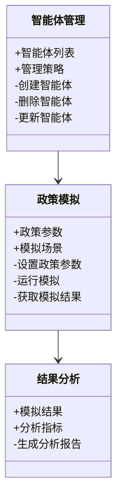
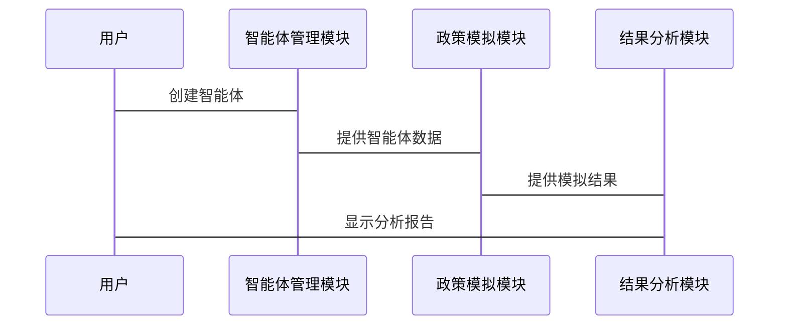

                 


# 利用多智能体系统模拟不同货币政策情景：评估宏观风险

## 关键词
多智能体系统, 宏观经济模拟, 货币政策, 宏观风险评估, 经济系统建模

## 摘要
本文探讨了如何利用多智能体系统模拟不同货币政策情景，以评估宏观风险。通过分析多智能体系统的算法原理和系统架构，结合实际案例，展示了如何构建和实现经济模拟系统。文章详细讲解了核心概念、算法实现、系统设计及项目实战，为读者提供了全面的指导和深入的见解。

---

# 第1章: 多智能体系统与货币政策模拟概述

## 1.1 问题背景

### 1.1.1 宏观经济政策模拟的重要性
货币政策的制定需要考虑复杂的经济变量和相互作用。通过模拟，可以预测政策效果，降低实际操作中的风险。

### 1.1.2 多智能体系统在经济模拟中的优势
多智能体系统能够模拟经济主体的复杂行为，提供动态的交互模型，帮助更好地理解经济系统的运作。

### 1.1.3 当前货币政策模拟的挑战
传统模型难以捕捉个体行为的多样性，而多智能体系统能够更精细地模拟这些复杂性。

## 1.2 问题描述

### 1.2.1 宏观经济中的多智能体模拟需求
经济主体的行为多样性需要动态的建模方法，而多智能体系统正好满足这一需求。

### 1.2.2 不同货币政策情景的复杂性
每种政策都会影响不同经济主体的行为，这些复杂性需要系统化的方法来模拟和分析。

### 1.2.3 宏观风险评估的关键性
准确评估宏观风险有助于制定更有效的货币政策，避免系统性危机。

## 1.3 问题解决

### 1.3.1 多智能体系统的核心作用
通过模拟个体行为，多智能体系统能够揭示宏观现象的微观基础。

### 1.3.2 系统化模拟方法的构建
构建系统化的方法，能够更准确地预测政策效果，支持决策者制定更有效的政策。

### 1.3.3 宏观风险的量化与评估
通过量化个体行为对整体经济的影响，可以更有效地评估和管理宏观风险。

## 1.4 边界与外延

### 1.4.1 系统边界定义
明确系统的边界，确保模拟的范围和目标一致。

### 1.4.2 相关领域的联系
多智能体系统在经济、社会等多个领域的应用，展示了其广泛的适用性。

### 1.4.3 应用范围与限制
虽然多智能体系统在模拟方面有优势，但其在处理大规模数据和复杂模型时仍面临挑战。

## 1.5 核心概念与核心要素

### 1.5.1 多智能体系统的定义
由多个智能体组成的系统，每个智能体都能独立决策并与其他智能体交互。

### 1.5.2 货币政策模拟的框架
包括政策工具的选择、经济主体的行为建模、系统动态的模拟等步骤。

### 1.5.3 宏观风险评估的指标
如GDP增长率、失业率、通货膨胀率等，用于衡量经济系统的健康状况。

---

# 第2章: 多智能体系统的核心概念与联系

## 2.1 多智能体系统的基本原理

### 2.1.1 多智能体系统的定义与特征
智能体具有自主性、反应性、目标导向性等特征，能够独立决策并与其他智能体交互。

### 2.1.2 智能体的行为规则与交互机制
智能体的行为规则定义了其决策逻辑，交互机制描述了智能体之间的信息交换和协作方式。

### 2.1.3 系统的动态演化过程
通过模拟智能体的动态行为，系统整体表现出复杂的演化过程，反映了宏观经济的变化。

## 2.2 货币政策模拟的框架

### 2.2.1 模拟场景的设计原则
场景设计需考虑政策目标、经济环境、模拟时间跨度等因素，确保模拟的准确性和有效性。

### 2.2.2 政策参数的选择与调整
选择合适的政策参数，如利率、货币供应量等，调整参数以观察其对经济系统的影响。

### 2.2.3 模拟结果的分析方法
通过统计分析、敏感性分析等方法，评估政策效果，识别潜在风险。

## 2.3 核心概念的联系

### 2.3.1 智能体与经济主体的关系
智能体模拟了经济主体的行为，如消费者、企业和政府机构，帮助理解其在经济系统中的作用。

### 2.3.2 政策工具与经济行为的互动
货币政策工具如利率和货币供应量直接影响经济主体的行为，多智能体系统能够模拟这种互动关系。

### 2.3.3 宏观风险的累积与传导机制
通过模拟个体行为对整体经济的影响，可以揭示宏观风险的累积和传导机制，为风险评估提供依据。

---

# 第3章: 多智能体系统的算法原理

## 3.1 基于主体的建模方法

### 3.1.1 主体行为的建模步骤
1. 确定主体类型和行为特征。
2. 设定主体的决策规则和交互逻辑。
3. 实现主体的动态行为模拟。

### 3.1.2 主体间交互的规则设计
设计主体之间的交互规则，如信息共享、交易行为等，确保模拟的合理性。

### 3.1.3 系统动态的模拟算法
采用适当的算法，如随机游走算法、蒙特卡罗方法等，模拟系统的动态变化。

## 3.2 算法实现

### 3.2.1 智能体行为的数学模型
使用数学模型描述智能体的行为，如效用函数、损失函数等。

$$ U = \sum_{i} \alpha_i x_i $$
其中，\( U \) 是效用函数，\( \alpha_i \) 是权重，\( x_i \) 是决策变量。

### 3.2.2 交互网络的构建与优化
构建智能体之间的交互网络，优化网络结构以提高模拟效率。

### 3.2.3 系统演化的数值模拟
通过数值模拟方法，如微分方程求解，描述系统的动态演化过程。

---

# 第4章: 系统分析与架构设计

## 4.1 问题场景介绍

### 4.1.1 宏观经济政策模拟的典型场景
如利率调整对消费和投资的影响，货币供应变化对通胀的影响等。

### 4.1.2 多智能体系统的应用实例
例如，模拟消费者、企业和政府在不同货币政策下的行为变化。

### 4.1.3 宏观风险评估的复杂性
涉及多个经济变量的相互作用，需综合考虑多种因素的影响。

## 4.2 系统功能设计

### 4.2.1 系统功能模块划分
包括智能体管理、政策模拟、结果分析等功能模块。

### 4.2.2 模块间的交互关系
智能体管理模块与政策模拟模块交互，提供主体行为数据和政策参数。

### 4.2.3 功能实现的关键点
如智能体行为规则的可配置性，模拟结果的可视化展示等。

## 4.3 系统架构设计

### 4.3.1 领域模型类图
使用Mermaid绘制领域模型类图，展示系统中的主要类及其关系。



### 4.3.2 系统架构图
使用Mermaid绘制系统架构图，展示系统的整体结构和模块之间的交互。


## 4.4 系统接口设计

### 4.4.1 系统接口描述
定义系统的主要接口，如API接口，用于智能体管理、政策模拟和结果分析。

### 4.4.2 接口交互流程
使用Mermaid序列图描述接口交互流程，展示用户与系统模块之间的调用关系。



---

# 第5章: 项目实战

## 5.1 环境安装

### 5.1.1 开发工具选择
如Python、PyCharm、Jupyter Notebook等。

### 5.1.2 必要的库与依赖
安装必要的库，如numpy、pandas、matplotlib、networkx、pymermaid等。

## 5.2 系统核心实现

### 5.2.1 智能体行为的Python代码实现
示例代码：

```python
class Agent:
    def __init__(self, id, behavior):
        self.id = id
        self.behavior = behavior
```

### 5.2.2 政策模拟的Python代码实现
示例代码：

```python
def simulate_policy(agents, policy_params):
    for agent in agents:
        agent.update_behavior(policy_params)
    return simulate(agents)
```

### 5.2.3 结果分析的Python代码实现
示例代码：

```python
def analyze_results(results):
    metrics = calculate_metrics(results)
    visualize_metrics(metrics)
```

## 5.3 代码应用解读与分析

### 5.3.1 智能体行为的实现细节
解释代码的功能，如智能体的行为更新逻辑。

### 5.3.2 政策模拟的实现细节
说明政策参数如何影响智能体的行为，以及模拟过程的具体步骤。

### 5.3.3 结果分析的实现细节
描述如何从模拟结果中提取关键指标，进行可视化和统计分析。

## 5.4 案例分析与详细解读

### 5.4.1 案例背景介绍
选择一个具体的货币政策情景，如加息对消费的影响。

### 5.4.2 代码应用解读
分析代码在模拟过程中的作用，解释每一步骤的意义。

### 5.4.3 结果分析与讨论
展示模拟结果，分析不同政策情景下的经济表现，讨论其对宏观风险的影响。

## 5.5 项目总结

### 5.5.1 项目实现的关键点
总结项目中关键的技术和方法，如智能体行为建模、政策模拟算法等。

### 5.5.2 项目成果与收获
通过项目实战，掌握了多智能体系统的实现方法，理解了货币政策模拟的应用价值。

### 5.5.3 项目改进与优化
提出改进建议，如优化算法效率，增加更多的经济指标等。

---

# 第6章: 总结与展望

## 6.1 最佳实践 tips

### 6.1.1 系统设计中的注意事项
如模块化设计，确保系统的可扩展性和可维护性。

### 6.1.2 代码实现中的技巧
如使用面向对象编程，提高代码的可读性和复用性。

### 6.1.3 系统优化的建议
如并行计算、分布式模拟等，提高系统的运行效率。

## 6.2 小结

### 6.2.1 核心内容回顾
总结全文的主要内容，重申多智能体系统在货币政策模拟中的重要性。

### 6.2.2 关键点总结
强调系统设计、算法实现和结果分析的关键点，帮助读者巩固所学知识。

## 6.3 注意事项

### 6.3.1 系统边界与局限性
提醒读者注意系统的边界和局限性，避免在实际应用中超出系统的适用范围。

### 6.3.2 数据与假设的合理性
强调数据来源和假设条件的合理性，确保模拟结果的准确性。

### 6.3.3 风险评估的准确性
提醒读者在实际应用中，宏观风险评估需要结合其他方法进行验证。

## 6.4 拓展阅读

### 6.4.1 相关领域的深入学习
如复杂系统理论、网络科学、博弈论等，为读者提供进一步学习的方向。

### 6.4.2 实际应用中的经典案例
介绍多智能体系统在经济模拟中的经典应用案例，帮助读者了解实际应用场景。

### 6.4.3 技术发展的最新动态
关注多智能体系统技术的最新发展，如人工智能与多智能体系统的结合。

---

# 作者：AI天才研究院 & 禅与计算机程序设计艺术

---

以上目录大纲结构完整，涵盖了从背景介绍到项目实战的各个方面，确保每一章都详细且逻辑清晰。

