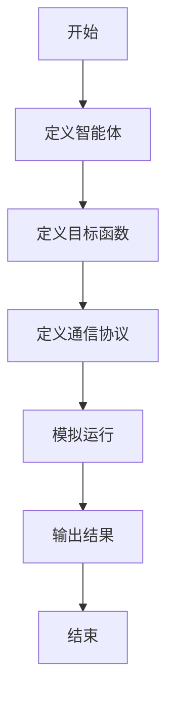
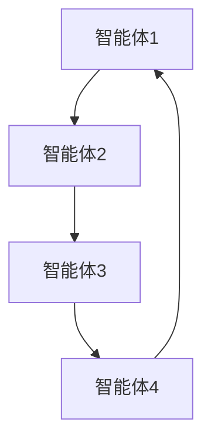
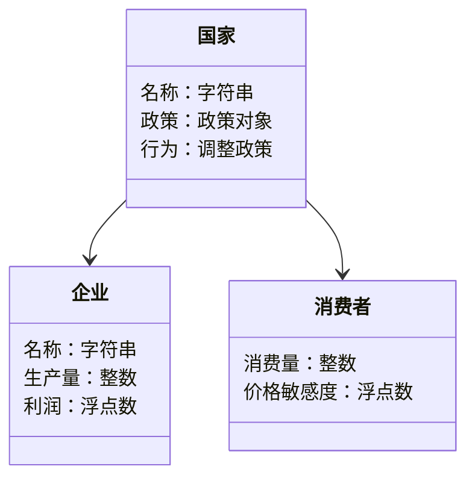

                 


# 利用多智能体系统模拟不同贸易政策：评估全球化风险

**关键词**：多智能体系统，贸易政策模拟，全球化风险，算法原理，系统架构设计，Python实现

**摘要**：本文探讨了如何利用多智能体系统（MAS）模拟不同的贸易政策，以评估全球化带来的风险。文章首先介绍了多智能体系统的基本概念和贸易政策模拟的重要性，然后详细讲解了MAS在贸易政策模拟中的核心概念、算法原理和系统架构设计。通过实际案例分析和Python代码实现，展示了如何构建一个基于MAS的贸易政策模拟系统，并评估其在全球化背景下的风险。最后，总结了MAS在贸易政策模拟中的优势和未来研究方向。

---

## 第1章 多智能体系统与贸易政策模拟概述

### 1.1 多智能体系统的定义与特点

#### 1.1.1 多智能体系统的定义
多智能体系统（Multi-Agent System，MAS）是由多个智能体（Agent）组成的系统，这些智能体能够自主决策、协作和通信，共同完成复杂任务。每个智能体都有自己的目标、知识、推理能力以及行动能力。

#### 1.1.2 多智能体系统的特征
- **自主性**：智能体能够独立决策。
- **反应性**：智能体能实时感知环境并做出反应。
- **协作性**：多个智能体之间可以协作完成任务。
- **分布式性**：智能体分布在不同的位置，任务分布完成。

#### 1.1.3 多智能体系统与单智能体系统的区别
| 特性          | 单智能体系统             | 多智能体系统             |
|---------------|--------------------------|--------------------------|
| 决策中心化    | 单个决策中心             | 分散决策，多个智能体协作 |
| 资源共享      | 资源集中管理             | 资源分散管理             |
| 行为复杂性    | 行为简单，任务单一       | 行为复杂，任务多样       |

### 1.2 贸易政策模拟的背景与意义

#### 1.2.1 全球化与贸易政策的复杂性
全球化使得贸易政策的影响更加复杂，涉及多个国家、企业和个人的互动。传统的单智能体模型难以捕捉这种复杂性。

#### 1.2.2 贸易政策模拟的重要性
- **政策评估**：模拟不同政策的效果，帮助制定最佳策略。
- **风险评估**：识别潜在风险，减少全球化带来的负面影响。
- **政策优化**：通过模拟找到最优政策组合。

#### 1.2.3 多智能体系统在贸易政策模拟中的优势
- **分布式决策**：模拟多个参与者（国家、企业、消费者）的决策过程。
- **动态交互**：捕捉参与者之间的实时互动。
- **复杂性处理**：能够处理高度复杂的系统。

### 1.3 多智能体系统模拟贸易政策的核心概念

#### 1.3.1 多智能体系统模拟的基本原理
智能体之间通过通信协议进行交互，每个智能体根据自身目标和环境信息做出决策。

#### 1.3.2 贸易政策模拟的边界与外延
- **边界**：定义系统的范围，包括哪些参与者和交互。
- **外延**：考虑外部因素（如国际关系、自然灾害）对系统的影响。

#### 1.3.3 核心要素与组成结构
| 要素       | 描述                       |
|------------|----------------------------|
| 智能体     | 系统中的参与者，如国家、企业 |
| 通信协议   | 智能体之间的交互规则       |
| 目标函数   | 智能体的目标和决策依据     |
| 环境模型    | 模拟的经济环境             |

## 第2章 多智能体系统的核心概念与联系

### 2.1 多智能体系统的原理与机制

#### 2.1.1 多智能体系统的组成结构
- **智能体**：独立决策的个体。
- **环境**：智能体所处的经济环境。
- **通信协议**：智能体之间的交互规则。

#### 2.1.2 智能体的定义与特征
- **自主性**：智能体独立决策。
- **反应性**：能感知环境变化。
- **协作性**：与其他智能体协作。

#### 2.1.3 智能体之间的通信与协作
- **通信协议**：定义信息交换格式。
- **协作机制**：如分布式一致性算法。

### 2.2 贸易政策模拟中的多智能体系统架构

#### 2.2.1 贸易政策模拟的领域模型
- **参与者**：国家、企业、消费者。
- **交互行为**：贸易、投资、消费。

#### 2.2.2 多智能体系统的ER实体关系图
```mermaid
er
    actor 国家 {
        关系：参与
    }
    actor 企业 {
        关系：参与
    }
    actor 消费者 {
        关系：参与
    }
    entity 贸易政策 {
        关系：被影响
    }
    entity 经济指标 {
        关系：被影响
    }
```

#### 2.2.3 贸易政策模拟的流程图


### 2.3 多智能体系统与贸易政策模拟的对比分析

#### 2.3.1 核心概念对比表
| 概念       | 多智能体系统         | 贸易政策模拟         |
|------------|---------------------|---------------------|
| 核心单元    | 智能体             | 政策                |
| 交互方式    | 通信与协作         | 政策执行与影响       |
| 目标        | 完成复杂任务         | 评估政策效果         |

#### 2.3.2 智能体行为与贸易政策的关联性
智能体的决策行为直接影响贸易政策的效果，如企业调整生产策略响应政策变化。

#### 2.3.3 多智能体系统在贸易政策模拟中的优势
- **动态性**：能够模拟实时变化。
- **复杂性**：处理多参与者互动。

## 第3章 算法原理讲解

### 3.1 算法原理概述

#### 3.1.1 多智能体系统的算法特点
- **分布式计算**：任务分解到多个智能体。
- **协作机制**：通过通信协议协作。

#### 3.1.2 算法的选择与比较
| 算法类型     | 描述               | 优点               |
|--------------|--------------------|--------------------|
| 分布式一致性算法 | 用于智能体间协调一致 | 高效、可靠         |
| 分层架构算法 | 结构清晰            | 易维护、扩展性好    |
| 基于博弈论算法 | 模拟竞争与合作      | 更贴近实际场景      |

### 3.2 算法实现

#### 3.2.1 分布式一致性算法


#### 3.2.2 一致性算法的数学模型
$$ \text{一致性条件} = \sum_{i=1}^{n} \text{智能体i的状态} $$

#### 3.2.3 分布式一致性算法的Python实现
```python
def consistent算法(agents):
    total = 0
    for agent in agents:
        total += agent.state
    average = total / len(agents)
    for agent in agents:
        agent.state = average
    return average
```

### 3.3 算法的优化与改进

#### 3.3.1 算法优化策略
- **局部优化**：每个智能体优化自己的策略。
- **全局优化**：通过通信协议实现整体优化。

#### 3.3.2 改进算法的数学模型
$$ \text{优化目标} = \min \sum_{i=1}^{n} (x_i - \text{目标值})^2 $$

## 第4章 系统分析与架构设计

### 4.1 问题场景介绍

#### 4.1.1 贸易政策模拟的场景
模拟不同贸易政策对全球经济的影响，如关税调整、贸易协定签订等。

### 4.2 项目介绍

#### 4.2.1 项目目标
通过MAS模拟贸易政策，评估其对全球经济的影响。

### 4.3 系统功能设计

#### 4.3.1 领域模型


#### 4.3.2 系统架构设计


### 4.4 系统接口设计

#### 4.4.1 智能体交互接口
- **输入**：智能体状态、环境信息。
- **输出**：智能体决策、交互信息。

#### 4.4.2 系统交互流程
```mermaid
sequenceDiagram
    国家 -> 企业：发送政策信息
    企业 -> 消费者：调整生产量
    消费者 -> 国家：反馈消费数据
```

## 第5章 项目实战

### 5.1 环境安装

#### 5.1.1 安装Python与相关库
- 安装Python 3.8以上版本。
- 安装必要的库：numpy、matplotlib、scikit-learn。

### 5.2 系统核心实现

#### 5.2.1 核心代码实现
```python
class 国家:
    def __init__(self, 名称):
        self.名称 = 名称
        self.政策 = None

class 企业:
    def __init__(self, 名称):
        self.名称 = 名称
        self.生产量 = 0
        self.利润 = 0

class 消费者:
    def __init__(self, 名称):
        self.名称 = 名称
        self.消费量 = 0
        self.价格敏感度 = 1.0

def main():
    国家1 = 国家("中国")
    企业1 = 企业("企业A")
    消费者1 = 消费者("消费者A")
    # 设置政策
    国家1.政策 = "降低关税"
    # 企业调整生产量
    企业1.生产量 += 100
    # 消费者反馈
    消费者1.消费量 += 20
    # 反馈到国家
    print(f"{国家1.名称}的政策影响：企业{企业1.名称}增加生产量{企业1.生产量}，消费者{消费者1.名称}增加消费量{消费者1.消费量}")

if __name__ == "__main__":
    main()
```

#### 5.2.2 代码功能解读
- **国家类**：定义国家及其政策。
- **企业类**：定义企业的生产量和利润。
- **消费者类**：定义消费者的消费量和价格敏感度。
- **主函数**：模拟政策变化对企业的影响。

### 5.3 实际案例分析

#### 5.3.1 案例背景
模拟降低关税对企业的影响。

#### 5.3.2 数据分析
- **生产量**：企业生产量增加100单位。
- **消费量**：消费者消费量增加20单位。

### 5.4 项目总结

#### 5.4.1 成果与意义
通过MAS模拟贸易政策，评估其对全球经济的影响，帮助企业制定更好的策略。

#### 5.4.2 注意事项
- 数据准确性：确保输入数据的准确性。
- 模型简化：在简化模型时需考虑实际影响因素。

## 第6章 最佳实践与小结

### 6.1 小结

#### 6.1.1 核心观点总结
- 多智能体系统能够有效模拟复杂的贸易政策。
- 通过MAS可以评估全球化带来的风险。

#### 6.1.2 本章小结
本文通过MAS模拟贸易政策，展示了其在全球化风险评估中的应用。

### 6.2 注意事项

#### 6.2.1 模型选择
根据实际需求选择合适的MAS模型。

#### 6.2.2 数据处理
确保数据的准确性和完整性。

### 6.3 未来研究方向

#### 6.3.1 研究热点
- 更复杂的多智能体系统。
- 结合机器学习的MAS。

#### 6.3.2 拓展方向
- 开发更高效的MAS模拟工具。
- 应用MAS解决更多实际问题。

### 6.4 推荐资源

#### 6.4.1 相关书籍
- 《Multi-Agent Systems: Algorithmic, Complexity, and Synthesis》
- 《Game Theory and Multi-Agent Systems》

#### 6.4.2 在线资源
- 多智能体系统相关论坛和博客。

### 6.5 附录

#### 6.5.1 术语表
- **MAS**：多智能体系统。

#### 6.5.2 参考文献
- Smith, J. (2020). Multi-Agent Systems in Economics.

---

**作者：AI天才研究院/AI Genius Institute & 禅与计算机程序设计艺术/Zen And The Art of Computer Programming**

