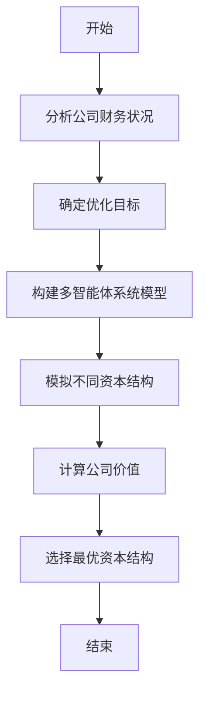
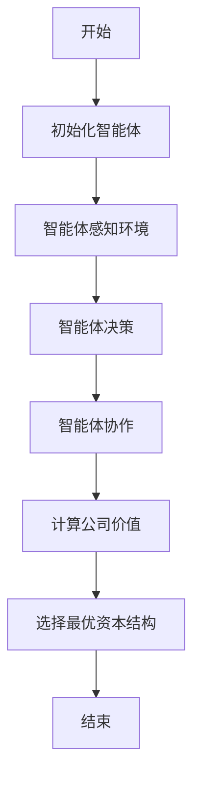
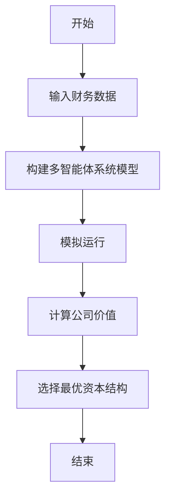

                 


# 利用多智能体系统模拟不同资本结构：优化公司价值

> 关键词：多智能体系统, 资本结构优化, 公司价值, 人工智能, 系统模拟

> 摘要：本文深入探讨了利用多智能体系统模拟不同资本结构以优化公司价值的方法。通过详细分析多智能体系统的原理、资本结构优化的数学模型，以及系统的架构设计，结合实际案例，展示了如何通过多智能体系统实现资本结构的动态优化，从而提升公司价值。文章内容涵盖背景介绍、核心概念、算法原理、系统架构、项目实战以及总结与展望，为读者提供了一个全面的技术视角。

---

## 第一部分: 背景介绍

### 第1章: 问题背景与重要性

#### 1.1 什么是资本结构？
资本结构是指公司各种长期资本的构成及其比例，主要包括股权资本和债务资本。合理的资本结构能够降低公司的资本成本，提高公司的市场价值。

#### 1.2 为什么需要优化资本结构？
- 资本成本最小化
- 企业价值最大化
- 降低财务风险

#### 1.3 多智能体系统在资本结构优化中的作用
- 多智能体系统能够模拟不同资本结构对公司价值的影响
- 通过分布式计算和协作优化，实现资本结构的动态调整

### 第2章: 多智能体系统的基本概念

#### 2.1 多智能体系统的定义
多智能体系统（Multi-Agent System, MAS）是由多个智能体组成的系统，这些智能体能够自主决策、协作和通信，共同完成复杂任务。

#### 2.2 多智能体系统的特征
| 特征 | 描述 |
|------|------|
| 分布式 | 智能体独立运行，协同完成任务 |
| 协作性 | 智能体之间通过协作提高整体效率 |
| 反应性 | 智能体能够感知环境并做出反应 |

#### 2.3 多智能体系统的分类
- 分中心化：基于中心服务器的多智能体系统
- 去中心化：无中心服务器的多智能体系统

---

## 第二部分: 多智能体系统与资本结构优化的核心概念

### 第3章: 多智能体系统与资本结构的关系

#### 3.1 多智能体系统的ER图
```mermaid
er
  actor 股东
  actor 债权人
  actor 公司
  entity 股权资本
  entity 债务资本
  entity 资本结构
  entity 公司价值
  股东 --> 股权资本
  债权人 --> 债务资本
  公司 --> 资本结构
  资本结构 --> 公司价值
```

#### 3.2 多智能体系统的流程图


### 第4章: 资本结构优化的数学模型与公式

#### 4.1 加权平均资本成本（WACC）公式
$$ WACC = \frac{E}{V} \times r_e + \frac{D}{V} \times r_d \times (1 - t) $$

其中：
- \( E \)：股权价值
- \( D \)：债务价值
- \( V = E + D \)：总价值
- \( r_e \)：股权资本成本
- \( r_d \)：债务资本成本
- \( t \)：企业所得税率

#### 4.2 净现值（NPV）公式
$$ NPV = \sum_{t=1}^{n} \frac{CF_t}{(1 + r)^t} $$

其中：
- \( CF_t \)：第 \( t \) 年的现金流
- \( r \)：折现率
- \( n \)：项目寿命

---

## 第三部分: 多智能体系统优化资本结构的算法原理

### 第5章: 多智能体协作优化算法

#### 5.1 算法流程图


#### 5.2 多智能体协作优化的Python实现
```python
class Agent:
    def __init__(self, id, capital):
        self.id = id
        self.capital = capital

    def decide(self, environment):
        # 根据环境决策
        pass

# 初始化智能体
agents = [Agent(1, 100), Agent(2, 200)]

# 智能体协作优化
for agent in agents:
    agent.decide(environment)
```

### 第6章: 数学模型与算法结合

#### 6.1 WACC与NPV的计算
- WACC公式用于计算加权平均资本成本
- NPV公式用于评估资本结构对项目价值的影响

#### 6.2 优化目标
$$ \text{最大化公司价值} = \text{最大化 NPV} $$

---

## 第四部分: 系统分析与架构设计

### 第7章: 系统功能设计

#### 7.1 系统功能模块
- 数据输入模块：输入公司财务数据
- 模型构建模块：构建多智能体系统模型
- 模拟运行模块：模拟不同资本结构
- 结果分析模块：分析公司价值

#### 7.2 系统功能流程图


### 第8章: 系统架构设计

#### 8.1 系统架构图


---

## 第五部分: 项目实战与案例分析

### 第9章: 环境安装与配置

#### 9.1 安装Python环境
```bash
python --version
pip install numpy
pip install matplotlib
```

### 第10章: 核心功能实现

#### 10.1 资本结构优化算法实现
```python
def calculate_wacc(e, d, re, rd, t):
    v = e + d
    wacc = (e / v) * re + (d / v) * rd * (1 - t)
    return wacc

# 示例计算
e = 500
d = 500
re = 0.1
rd = 0.05
t = 0.25
wacc = calculate_wacc(e, d, re, rd, t)
print(f"Weighted Average Cost of Capital (WACC): {wacc:.2f}%")
```

### 第11章: 案例分析与解读

#### 11.1 案例分析
某公司当前资本结构为 \( E = 500 \)，\( D = 500 \)，\( re = 10\% \)，\( rd = 5\% \)，税率 \( t = 25\% \)。计算其 WACC：
$$ WACC = \frac{500}{1000} \times 0.1 + \frac{500}{1000} \times 0.05 \times (1 - 0.25) = 0.05 + 0.01875 = 0.06875 \) 即 6.875%。

---

## 第六部分: 总结与展望

### 第12章: 总结与思考

#### 12.1 核心内容回顾
- 多智能体系统的概念与特点
- 资本结构优化的数学模型与算法
- 系统架构设计与实现

#### 12.2 未来展望
- 研究多智能体系统在其他领域的应用
- 探索更高效的优化算法
- 结合大数据和机器学习提升模型精度

---

## 作者：AI天才研究院/AI Genius Institute & 禅与计算机程序设计艺术 /Zen And The Art of Computer Programming

---

以上是完整的技术博客文章目录和部分内容的详细说明，您可以根据实际需要进一步扩展每个部分的具体内容。

