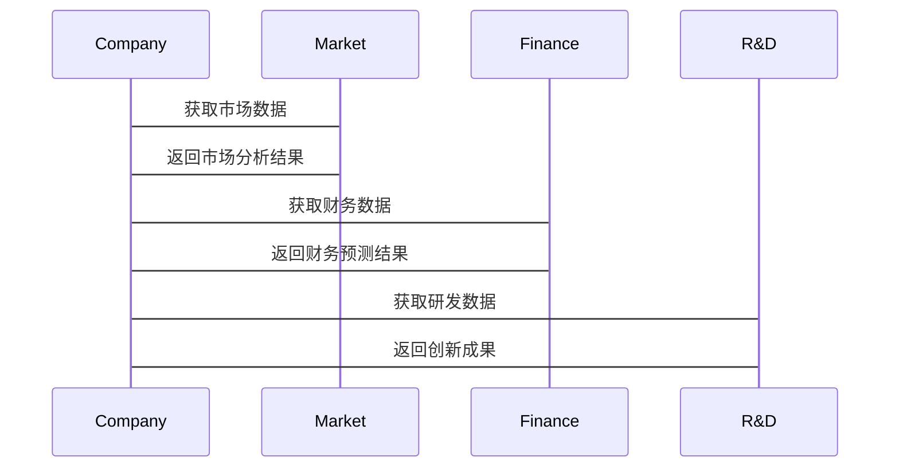

                 


# 利用多智能体系统模拟公司成长轨迹：长期价值预测

> 关键词：多智能体系统，公司成长轨迹，长期价值预测，模拟分析，人工智能，系统架构，算法原理

> 摘要：本文探讨了如何利用多智能体系统来模拟公司成长轨迹并预测其长期价值。通过分析多智能体系统的原理、算法和架构，结合实际案例，展示了如何在企业战略规划和市场预测中应用多智能体系统，为公司成长提供科学依据。

---

## 第一部分: 多智能体系统与公司成长轨迹模拟基础

### 第1章: 多智能体系统与公司成长轨迹模拟概述

#### 1.1 多智能体系统的定义与特点
##### 1.1.1 多智能体系统的定义
多智能体系统（Multi-Agent System, MAS）是由多个智能体（Agent）组成的系统，这些智能体能够自主决策、协作和互动，共同完成复杂任务。

##### 1.1.2 多智能体系统的核心特点
- **自主性**：每个智能体都能独立决策。
- **反应性**：能够实时感知环境并做出反应。
- **协作性**：智能体之间可以协作完成任务。
- **分布式智能**：智能分布在多个智能体中，而非集中在一个地方。

##### 1.1.3 多智能体系统与传统单智能体系统的区别
| 特性         | 单智能体系统       | 多智能体系统       |
|--------------|--------------------|--------------------|
| 智能体数量   | 单个               | 多个               |
| 决策集中度   | 高                 | 低                 |
| 协作能力     | 无                 | 强                 |
| 系统复杂度   | 低                 | 高                 |

#### 1.2 公司成长轨迹模拟的背景与意义
##### 1.2.1 公司成长轨迹的定义
公司成长轨迹指的是公司在不同时间点的发展状态，包括收入、利润、市场份额等关键指标的变化。

##### 1.2.2 利用多智能体系统模拟公司成长轨迹的优势
- **复杂性建模**：多智能体系统能够模拟公司内外部的多种因素。
- **动态性**：能够实时反映市场变化对公司的影响。
- **协作性**：模拟公司内部各部门的协作过程。

##### 1.2.3 公司成长轨迹模拟的实际应用价值
- **战略规划**：帮助公司制定长期发展计划。
- **风险预测**：提前识别潜在风险并制定应对策略。
- **优化决策**：通过模拟找到最优的经营策略。

#### 1.3 多智能体系统在公司成长模拟中的应用前景
##### 1.3.1 多智能体系统在企业战略规划中的应用
- **市场进入策略**：模拟不同市场进入策略对公司成长的影响。
- **并购决策**：评估并购目标公司的潜在影响。

##### 1.3.2 多智能体系统在市场预测中的作用
- **市场需求预测**：通过模拟不同市场环境，预测公司产品的需求变化。
- **竞争分析**：分析竞争对手的策略对公司成长的影响。

##### 1.3.3 多智能体系统在风险评估中的潜在价值
- **财务风险**：模拟不同经济环境对公司财务状况的影响。
- **政策风险**：评估政策变化对公司业务的影响。

#### 1.4 本章小结
本章介绍了多智能体系统的定义和特点，探讨了公司成长轨迹模拟的背景和意义，并展望了多智能体系统在公司成长模拟中的应用前景。

---

## 第二部分: 多智能体系统的核心概念与联系

### 第2章: 多智能体系统的原理与架构

#### 2.1 多智能体系统的原理
##### 2.1.1 多智能体系统的组成要素
- **智能体**：能够感知环境并采取行动的实体。
- **环境**：智能体所处的外部世界，包括其他智能体和非智能体。
- **通信机制**：智能体之间交换信息的方式。
- **协作机制**：智能体之间协同工作的规则。

##### 2.1.2 多智能体系统的核心原理
- **自主性**：每个智能体独立决策。
- **反应性**：根据环境变化实时调整行为。
- **协作性**：通过通信和协作完成复杂任务。

##### 2.1.3 多智能体系统与传统单智能体系统的对比
| 特性         | 单智能体系统       | 多智能体系统       |
|--------------|--------------------|--------------------|
| 智能体数量   | 单个               | 多个               |
| 决策集中度   | 高                 | 低                 |
| 协作能力     | 无                 | 强                 |
| 系统复杂度   | 低                 | 高                 |

#### 2.2 多智能体系统的架构设计
##### 2.2.1 分层架构
- **感知层**：负责感知环境信息。
- **决策层**：负责制定决策。
- **执行层**：负责执行决策。

##### 2.2.2 分布式架构
- **去中心化**：没有中央控制节点。
- **对等通信**：智能体之间直接通信。

##### 2.2.3 集中式架构
- **中央控制节点**：负责协调和管理智能体。
- **集中决策**：所有决策由中央节点制定。

#### 2.3 多智能体系统在公司成长模拟中的应用
##### 2.3.1 公司内部智能体的分工
- **市场智能体**：负责市场分析和预测。
- **财务智能体**：负责财务管理和预测。
- **研发智能体**：负责技术研发和创新。

##### 2.3.2 公司外部环境的模拟
- **市场环境**：包括竞争对手、消费者需求等。
- **政策环境**：包括法律法规、政府政策等。

##### 2.3.3 公司成长轨迹的模拟过程
- **初始化**：设定初始参数，如公司规模、市场环境等。
- **运行**：智能体根据环境信息采取行动，模拟公司成长过程。
- **结果分析**：分析模拟结果，提取有价值的信息。

#### 2.4 本章小结
本章详细讲解了多智能体系统的原理和架构，并探讨了其在公司成长模拟中的应用。

---

## 第三部分: 多智能体系统的算法原理

### 第3章: 多智能体系统的算法与实现

#### 3.1 多智能体协作算法
##### 3.1.1 基于强化学习的协作算法
- **定义**：通过奖励机制让智能体学习最优策略。
- **实现步骤**：
  1. 初始化智能体参数。
  2. 智能体与环境互动，获取状态和奖励。
  3. 更新智能体策略，最大化奖励。

##### 3.1.2 基于遗传算法的协作算法
- **定义**：通过模拟自然选择过程优化智能体行为。
- **实现步骤**：
  1. 初始化智能体种群。
  2. 评估种群适应度。
  3. 进行选择、交叉和变异操作，生成新种群。

##### 3.1.3 基于博弈论的协作算法
- **定义**：通过分析智能体之间的博弈关系，找到 Nash均衡。
- **实现步骤**：
  1. 建立博弈模型，定义策略和收益。
  2. 分析各智能体的策略组合，找到最优解。

#### 3.2 多智能体系统的通信与协作
##### 3.2.1 通信机制
- **直接通信**：智能体之间直接交换信息。
- **间接通信**：通过中间媒介传递信息。

##### 3.2.2 协作机制
- **任务分配**：根据智能体能力和环境需求分配任务。
- **协同决策**：多个智能体共同制定决策。

#### 3.3 多智能体系统的数学模型
##### 3.3.1 状态空间
$$ S = \{ s_1, s_2, ..., s_n \} $$
其中，$s_i$ 表示智能体的状态。

##### 3.3.2 动作空间
$$ A = \{ a_1, a_2, ..., a_m \} $$
其中，$a_j$ 表示智能体的动作。

##### 3.3.3 收益函数
$$ R = \sum_{i=1}^{n} r_i $$
其中，$r_i$ 表示第 $i$ 个智能体的收益。

#### 3.4 本章小结
本章详细讲解了多智能体系统的几种主要算法，并分析了其数学模型。

---

## 第四部分: 系统分析与架构设计方案

### 第4章: 系统分析与架构设计

#### 4.1 系统分析
##### 4.1.1 问题场景介绍
- **目标**：模拟公司成长轨迹，预测长期价值。
- **需求**：需要考虑市场、财务、研发等多个因素。

##### 4.1.2 项目介绍
- **项目目标**：构建一个多智能体系统，模拟公司成长轨迹。
- **项目范围**：包括公司内部各部门和外部市场环境。

##### 4.1.3 系统功能设计
- **市场分析模块**：分析市场趋势和竞争对手。
- **财务预测模块**：预测公司财务状况。
- **研发创新模块**：模拟技术研发过程。

##### 4.1.4 系统架构设计
```mermaid
classDiagram
    class Company {
        + market: Market
        + finance: Finance
        + R&D: R&D
    }
    class Market {
        + competitors: Competitors
        + consumers: Consumers
    }
    class Finance {
        + revenue: Revenue
        + profit: Profit
    }
    class R&D {
        + innovation: Innovation
    }
    Company --> Market
    Company --> Finance
    Company --> R&D
```

##### 4.1.5 系统接口设计
- **输入接口**：接收市场、财务、研发等数据。
- **输出接口**：输出模拟结果，如公司价值预测。

#### 4.2 系统架构设计
##### 4.2.1 分层架构
- **数据层**：存储公司和市场数据。
- **业务层**：处理业务逻辑。
- **表现层**：展示模拟结果。

##### 4.2.2 分布式架构
- **节点分布**：公司各部门分别作为独立节点。
- **通信机制**：智能体之间通过网络通信。

##### 4.2.3 系统交互流程


#### 4.3 本章小结
本章详细分析了系统的架构设计和交互流程。

---

## 第五部分: 项目实战

### 第5章: 项目实战

#### 5.1 环境安装
##### 5.1.1 安装Python
- 使用Anaconda安装Python 3.8及以上版本。

##### 5.1.2 安装机器学习库
- 安装TensorFlow、Keras、Scikit-learn等。

##### 5.1.3 安装可视化工具
- 安装Matplotlib、Seaborn等。

#### 5.2 系统核心实现
##### 5.2.1 初始化参数
```python
# 初始化公司参数
company = {
    'revenue': 1000000,
    'profit': 100000,
    'market_share': 20,
    'R&D': 50000
}
```

##### 5.2.2 智能体互动
```python
# 智能体互动
def agent_communication(agent1, agent2):
    # 获取信息
    info1 = agent1.get_info()
    info2 = agent2.get_info()
    # 交换信息
    agent1.receive_info(info2)
    agent2.receive_info(info1)
```

##### 5.2.3 数据处理
```python
# 数据预处理
import pandas as pd
data = pd.read_csv('company_data.csv')
data = data.dropna()
```

#### 5.3 实际案例分析
##### 5.3.1 案例选择
- 选择一个典型行业，如科技行业。

##### 5.3.2 模拟过程
```python
# 模拟公司成长过程
for year in range(10):
    company.update_market()
    company.update_financials()
    company.update_R&D()
```

##### 5.3.3 结果分析
- 绘制公司价值随时间变化的曲线图。

#### 5.4 本章小结
本章通过实际案例展示了多智能体系统在公司成长模拟中的应用。

---

## 第六部分: 案例分析与详细讲解

### 第6章: 案例分析与详细讲解

#### 6.1 案例分析
##### 6.1.1 案例背景
- 选择一个具体公司，如某科技公司。

##### 6.1.2 模拟结果展示
- 绘制公司价值随时间变化的曲线图。

##### 6.1.3 结果分析
- 分析市场环境、政策变化对公司成长的影响。

#### 6.2 详细讲解
##### 6.2.1 关键因素分析
- 研发投入、市场策略、财务状况等。

##### 6.2.2 模拟结果的意义
- 通过模拟找到最优的经营策略。

#### 6.3 本章小结
本章通过具体案例分析，详细讲解了多智能体系统在公司成长模拟中的应用。

---

## 第七部分: 总结与展望

### 第7章: 总结与展望

#### 7.1 总结
- 本文详细介绍了多智能体系统在公司成长模拟中的应用。
- 展示了如何利用多智能体系统预测公司长期价值。

#### 7.2 未来展望
- **技术发展**：结合大数据和深度学习，提高模拟精度。
- **应用拓展**：扩展到更多行业和领域。
- **挑战与机遇**：随着技术进步，未来有更多可能性。

#### 7.3 最佳实践 tips
- 数据质量至关重要，确保输入数据的准确性和完整性。
- 模型调参需要反复试验，找到最优参数组合。
- 持续学习，跟踪技术发展，不断优化模型。

#### 7.4 本章小结
本文总结了多智能体系统在公司成长模拟中的应用，并展望了未来的发展方向。

---

## 作者：AI天才研究院/AI Genius Institute & 禅与计算机程序设计艺术 /Zen And The Art of Computer Programming

---

感谢您的阅读！希望这篇文章能为您提供有价值的见解和启发。

