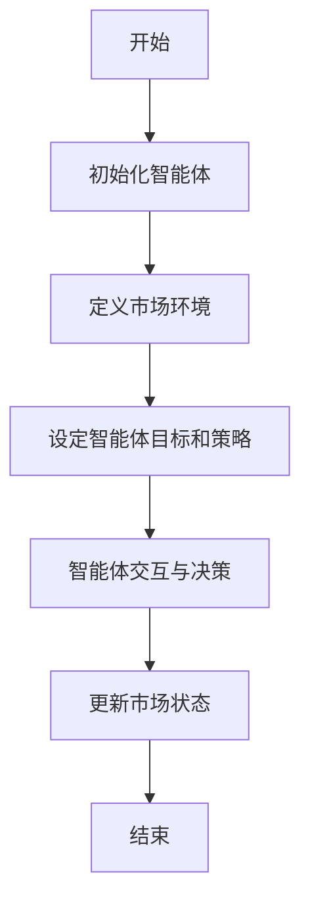
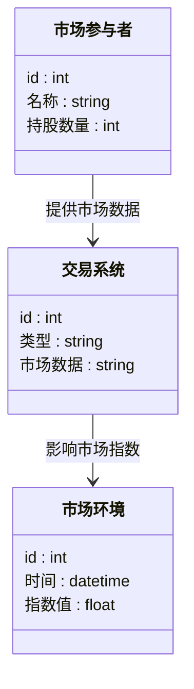
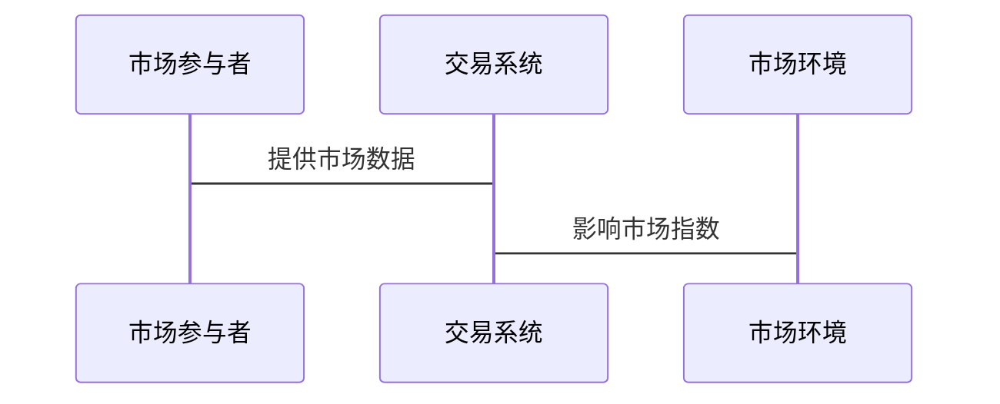

                 


# 利用多智能体系统模拟市场情景：增强风险管理

## 关键词：多智能体系统、风险管理、市场模拟、分布式计算、人工智能

## 摘要：  
本文探讨如何利用多智能体系统模拟市场情景，以增强风险管理能力。通过分析多智能体系统的原理、算法实现及其在金融市场中的应用，结合实际案例，展示如何利用多智能体系统预测和应对市场波动，从而提升风险管理的效率和准确性。

---

## 第1章 多智能体系统与风险管理概述

### 1.1 多智能体系统的定义与特点

#### 1.1.1 多智能体系统的定义  
多智能体系统（Multi-Agent System, MAS）是由多个智能体（Agent）组成的分布式系统，这些智能体能够自主决策、协作和交互，共同完成复杂任务。  

#### 1.1.2 多智能体系统的核心特点  
- **自主性**：智能体能够独立决策。  
- **反应性**：能够实时感知环境并做出反应。  
- **协作性**：多个智能体可以协同工作以实现共同目标。  
- **分布式性**：智能体分布在不同的位置，通过通信完成任务。  

#### 1.1.3 多智能体系统与传统风险管理的区别  
传统风险管理依赖于中心化决策，而多智能体系统通过分布式的智能体模拟市场参与者的行为，提供更实时和动态的分析。

---

### 1.2 多智能体系统在风险管理中的应用背景

#### 1.2.1 风险管理的传统方法与局限性  
传统方法依赖统计模型，难以捕捉市场参与者的复杂行为和实时动态。

#### 1.2.2 多智能体系统在风险管理中的优势  
- 模拟真实市场行为。  
- 实时反映市场波动。  
- 提供多种情景分析。  

#### 1.2.3 当前市场环境对多智能体系统的需求  
金融市场日益复杂，多智能体系统能够模拟市场参与者的博弈行为，帮助机构应对不确定性。

---

## 第2章 多智能体系统的核心概念与联系

### 2.1 多智能体系统的原理

#### 2.1.1 多智能体系统的组成要素  
- **智能体**：市场参与者（如投资者、交易员）。  
- **环境**：金融市场环境（如价格、成交量）。  
- **通信机制**：智能体之间的信息交换。  

#### 2.1.2 智能体的属性与行为  
- **属性**：目标、知识、信念、能力。  
- **行为**：买入、卖出、持有。  

#### 2.1.3 智能体之间的交互机制  
通过通信协议进行信息交换，影响彼此的决策。

### 2.2 多智能体系统的ER实体关系图

```mermaid
erDiagram
    市场参与者[市场参与者] {
        id : int
        名称 : string
        持股数量 : int
    }
    交易系统[交易系统] {
        id : int
        类型 : string
        市场数据 : string
    }
    市场环境[市场环境] {
        id : int
        时间 : datetime
        指数值 : float
    }
    市场参与者 --> 交易系统 : 提供市场数据
    交易系统 --> 市场环境 : 影响市场指数
```

---

## 第3章 多智能体系统模拟市场的算法原理

### 3.1 基于多智能体的市场模拟算法

#### 3.1.1 算法流程



#### 3.1.2 算法实现

```python
class Agent:
    def __init__(self, id, strategy):
        self.id = id
        self.strategy = strategy

class MarketEnvironment:
    def __init__(self):
        self.index_value = 0.0
```

#### 3.1.3 数学模型与公式

$$\text{价格变化} = \sum_{i=1}^{n} (\text{智能体}_i \text{的交易行为})$$

---

## 第4章 系统分析与架构设计

### 4.1 问题场景介绍

#### 4.1.1 项目背景  
模拟股票市场的价格波动，评估风险。

### 4.2 系统功能设计

#### 4.2.1 领域模型



### 4.3 系统架构设计


### 4.4 接口设计与交互

#### 4.4.1 交互序列图



---

## 第5章 项目实战：模拟股票市场波动

### 5.1 环境安装

```bash
pip install numpy matplotlib
```

### 5.2 核心代码实现

```python
import numpy as np
import matplotlib.pyplot as plt

class MarketSimulator:
    def __init__(self, num_agents):
        self.agents = [Agent(i, "随机交易") for i in range(num_agents)]
        self.index_value = 100.0

    def simulate(self, days):
        for _ in range(days):
            for agent in self.agents:
                # 智能体做出交易决策
                if np.random.random() < 0.5:
                    self.index_value += 0.1
                else:
                    self.index_value -= 0.1
            plt.plot(self.index_value)
        plt.show()
```

### 5.3 代码解读与分析

- **MarketSimulator**：管理多个智能体和市场指数。  
- **simulate**：模拟市场波动，根据智能体的决策更新指数值。  

### 5.4 案例分析

模拟10天的市场波动，观察指数变化。

### 5.5 项目小结

通过模拟股票市场，展示了多智能体系统在风险管理中的应用潜力。

---

## 第6章 最佳实践、小结、注意事项和拓展阅读

### 6.1 最佳实践 tips  
- 定期更新市场数据。  
- 使用分布式计算提高效率。  

### 6.2 小结  
多智能体系统能够模拟市场行为，帮助机构更好地进行风险管理。

### 6.3 注意事项  
- 数据质量和实时性影响准确性。  
- 系统维护和更新成本较高。  

### 6.4 拓展阅读  
推荐相关书籍和论文，进一步学习多智能体系统在金融领域的应用。

---

## 作者：AI天才研究院 & 禅与计算机程序设计艺术

