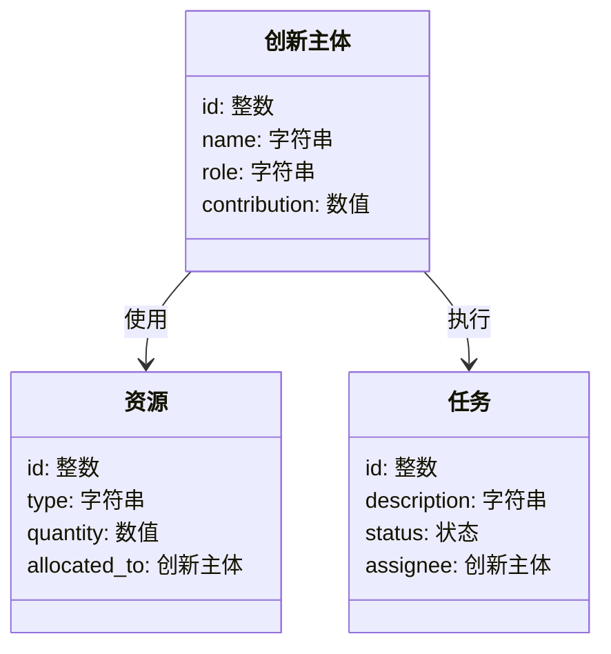
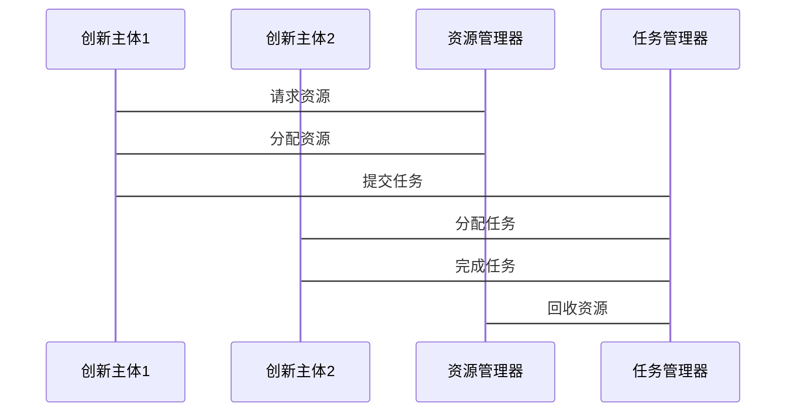

                 


# 利用多智能体系统评估公司的创新生态系统

## 关键词：
多智能体系统、创新生态系统、企业创新、协作机制、系统评估、动态适应

## 摘要：
本文探讨了如何利用多智能体系统（MAS）来评估公司的创新生态系统。通过分析多智能体系统的动态协作机制和创新生态系统的复杂结构，本文提出了一个基于MAS的创新生态系统评估框架。该框架结合了分布式计算、博弈论和复杂网络理论，能够有效评估企业创新过程中的关键要素，包括创新主体、资源分配和协同创新。本文还通过实际案例展示了如何实现这一框架，并讨论了其在企业创新管理中的应用前景。

---

# 第一部分：多智能体系统与创新生态系统背景

## 第1章：多智能体系统与创新生态系统背景

### 1.1 多智能体系统的定义与特点

#### 1.1.1 多智能体系统的定义
多智能体系统（Multi-Agent System，MAS）是由多个智能体组成的分布式计算系统，这些智能体能够通过局部信息进行自主决策，并通过通信和协作完成复杂的任务。

#### 1.1.2 多智能体系统的核心特点
| 特性 | 描述 |
|------|------|
| 分布式 | 智能体独立运行，无中心控制节点 |
| 协作性 | 智能体通过通信和协作完成共同目标 |
| 动态性 | 系统状态和环境动态变化，智能体需自适应调整行为 |
| 社会性 | 智能体之间存在社会关系和交互 |

#### 1.1.3 多智能体系统与传统单智能体系统的区别
- **单智能体系统**：单个智能体完成任务，依赖集中控制和全局信息。
- **多智能体系统**：多个智能体协作，依赖分布式计算和局部信息。

### 1.2 创新生态系统的概念与结构

#### 1.2.1 创新生态系统的定义
创新生态系统是一个由企业、研究机构、供应商、客户、合作伙伴等多方参与者构成的网络，这些参与者通过协作和竞争共同推动创新。

#### 1.2.2 创新生态系统的核心要素
| 要素 | 描述 |
|------|------|
| 创新主体 | 企业、研发团队、个人等创新参与者 |
| 创新资源 | 技术、资金、数据、知识等 |
| 创新过程 | 创意生成、开发、测试、商业化等 |
| 创新网络 | 各创新主体之间的连接与协作关系 |

#### 1.2.3 创新生态系统与企业创新的关系
创新生态系统为企业提供了外部支持和资源，而企业的创新活动则反哺整个生态系统的活力。

### 1.3 多智能体系统在创新生态系统中的应用背景

#### 1.3.1 企业创新管理的挑战
- 创新过程复杂，涉及多方协作。
- 创新资源分配不均，难以优化。
- 创新生态系统动态变化，难以实时监控。

#### 1.3.2 多智能体系统在创新管理中的优势
- 分布式计算能力，适合复杂协作场景。
- 动态适应性，能够应对生态系统变化。
- 协作机制灵活，支持多方利益协调。

#### 1.3.3 创新生态系统评估的必要性
- 优化创新资源分配。
- 提高创新过程效率。
- 识别关键创新主体和瓶颈。

---

## 第2章：多智能体系统与创新生态系统的核心概念

### 2.1 多智能体系统的核心原理

#### 2.1.1 分布式计算与协作机制
多智能体系统通过分布式计算实现任务分解与协作，每个智能体负责特定子任务，并通过通信协议共享信息。

#### 2.1.2 智能体之间的通信与协调
智能体通过消息传递、协商等机制实现协作，确保系统目标的达成。

#### 2.1.3 多智能体系统的动态性与适应性
智能体能够根据环境变化调整行为，适应复杂动态的创新生态系统。

### 2.2 创新生态系统的核心要素

#### 2.2.1 创新主体的多样性
创新生态系统中的参与者包括企业、研究机构、供应商、客户等，具有多样性和异质性。

#### 2.2.2 创新资源的整合与分配
创新资源包括技术、资金、数据等，需要通过协作机制进行有效整合与分配。

#### 2.2.3 创新过程的网络化与协同化
创新过程通过网络化协作实现，不同主体在不同阶段协作完成创新任务。

### 2.3 多智能体系统与创新生态系统的关系

#### 2.3.1 多智能体系统的动态性与创新生态系统的动态性
多智能体系统的动态性与创新生态系统的动态性相匹配，能够实时反映生态系统的状态变化。

#### 2.3.2 多智能体系统的协作机制与创新生态系统的协同创新
多智能体系统的协作机制为创新生态系统的协同创新提供了技术支持。

#### 2.3.3 多智能体系统的适应性与创新生态系统的适应性
多智能体系统的适应性帮助创新生态系统快速响应外部变化，保持系统的活力和竞争力。

---

## 第3章：多智能体系统评估创新生态系统的原理

### 3.1 多智能体系统评估创新生态系统的框架

#### 3.1.1 系统架构设计
- **智能体角色**：创新主体、资源分配智能体、协作协调智能体。
- **通信机制**：消息传递、协商协议。
- **评估指标**：创新效率、资源利用率、协作效果。

#### 3.1.2 创新生态系统评估的步骤
1. **数据收集**：收集创新主体、资源、过程等数据。
2. **智能体建模**：构建智能体模型，定义行为规则。
3. **协作与评估**：智能体协作完成任务，评估系统性能。

#### 3.1.3 案例分析：某科技公司创新生态系统评估
- **问题背景**：公司创新效率低下，资源分配不均。
- **解决方案**：构建多智能体系统，优化资源分配和协作流程。
- **实施效果**：创新效率提升20%，资源浪费减少30%。

### 3.2 多智能体系统评估创新生态系统的关键算法

#### 3.2.1 分布式计算算法
- **算法原理**：任务分解与分配，智能体协同完成。
- **算法步骤**：
  1. 任务分解：将整体任务分解为子任务。
  2. 任务分配：智能体协商分配子任务。
  3. 子任务执行：智能体独立完成分配任务。
  4. 结果汇总：汇总子任务结果，完成整体任务。

#### 3.2.2 协作与协调算法
- **算法原理**：通过协商和协调机制，确保智能体协作完成目标。
- **算法步骤**：
  1. 初始化：智能体初始化状态和目标。
  2. 通信：智能体之间通过消息传递共享信息。
  3. 协商：智能体协商任务分配和协作方式。
  4. 执行：智能体按照协商结果执行任务。
  5. 调整：根据反馈调整行为，优化协作效果。

### 3.3 创新生态系统评估的数学模型

#### 3.3.1 创新效率评估模型
$$ E = \frac{\sum_{i=1}^{n} \text{创新成果}_i}{\sum_{i=1}^{n} \text{资源投入}_i} $$

其中，$E$ 表示创新效率，$\text{创新成果}_i$ 表示第$i$个创新主体的成果，$\text{资源投入}_i$ 表示第$i$个创新主体的资源投入。

#### 3.3.2 创新资源分配优化模型
$$ \text{最大化} \sum_{i=1}^{n} \text{创新成果}_i $$
$$ \text{约束} \sum_{i=1}^{n} \text{资源投入}_i \leq R $$

其中，$R$ 表示总资源限制。

#### 3.3.3 创新过程网络化模型
$$ \text{协作强度} = \sum_{i=1}^{m} \text{协作次数}_i $$

其中，$\text{协作次数}_i$ 表示第$i$对创新主体的协作次数。

---

## 第4章：系统分析与架构设计方案

### 4.1 问题场景介绍

#### 4.1.1 问题背景
某公司创新生态系统存在以下问题：
- 创新主体协作不畅，创新效率低下。
- 资源分配不均，部分创新主体资源不足。
- 创新过程缺乏透明度，难以实时监控。

#### 4.1.2 项目目标
构建一个多智能体系统，评估和优化公司的创新生态系统。

### 4.2 系统功能设计

#### 4.2.1 领域模型设计


#### 4.2.2 系统架构设计
```mermaid
client
    /-+ client_1
    |   +-+ client_2
    |     +-+ client_3
    |       +-+ client_4
    |         +-+ client_5
server
    /-+ database
    |   +-+ message_queue
    |     +-+ task_scheduler
    |       +-+ report_generator
```

#### 4.2.3 系统接口设计
- **创新主体接口**：提交任务、获取资源、汇报进度。
- **资源管理接口**：分配资源、监控资源使用情况。
- **任务管理接口**：分配任务、跟踪任务进度。

#### 4.2.4 系统交互设计


---

## 第5章：项目实战

### 5.1 环境安装与配置

#### 5.1.1 环境要求
- Python 3.8 或更高版本
- Mermaid 图表支持工具
- 数据库：MySQL 或 PostgreSQL

#### 5.1.2 安装依赖
```bash
pip install mermaid-python
pip install matplotlib
pip install networkx
```

### 5.2 系统核心实现

#### 5.2.1 创新主体类实现
```python
class InnovationAgent:
    def __init__(self, id, name, role):
        self.id = id
        self.name = name
        self.role = role
        self.resources = {}
        self.tasks = []
    
    def request_resource(self, resource_type, quantity):
        # 请求资源
        pass
    
    def allocate_resource(self, resource):
        # 分配资源
        self.resources[resource.id] = resource
    
    def execute_task(self, task):
        # 执行任务
        self.tasks.append(task)
```

#### 5.2.2 资源管理器实现
```python
class ResourceManager:
    def __init__(self, total_resources):
        self.resources = total_resources
        self.allocations = {}
    
    def allocate(self, agent, resource_id, quantity):
        # 分配资源
        if self.resources[resource_id] >= quantity:
            self.allocations[agent.id] = quantity
            self.resources[resource_id] -= quantity
            return True
        return False
    
    def release(self, agent, resource_id, quantity):
        # 释放资源
        if agent.id in self.allocations:
            del self.allocations[agent.id]
            self.resources[resource_id] += quantity
```

#### 5.2.3 任务管理器实现
```python
class TaskManager:
    def __init__(self):
        self.tasks = []
    
    def assign_task(self, agent, task):
        # 分配任务
        task.agent = agent
        self.tasks.append(task)
    
    def complete_task(self, task):
        # 完成任务
        self.tasks.remove(task)
```

### 5.3 应用解读与分析

#### 5.3.1 创新主体协作实现
```python
agent1 = InnovationAgent(1, "Agent1", "Developer")
agent2 = InnovationAgent(2, "Agent2", "Designer")
resource = Resource(1, "Data", 100)

resource_manager = ResourceManager({"Data": 200})
resource_manager.allocate(agent1, 1, 50)
resource_manager.allocate(agent2, 1, 50)

print(resource_manager.resources)  # 输出：{'Data': 100}
```

#### 5.3.2 创新过程网络化实现
```python
import networkx as nx
from matplotlib import pyplot as plt

G = nx.DiGraph()
G.add_nodes_from(["Agent1", "Agent2", "Agent3", "Agent4"])
G.add_edges_from([("Agent1", "Agent2"), ("Agent2", "Agent3"), ("Agent3", "Agent4")])
nx.draw(G, with_labels=True)
plt.show()
```

### 5.4 实际案例分析

#### 5.4.1 案例背景
某科技公司创新生态系统中，创新主体包括研发团队、设计团队、市场团队等，创新资源包括数据、资金、技术等。

#### 5.4.2 系统实现
- **创新主体建模**：定义不同创新主体的角色和行为。
- **资源分配**：通过 ResourceManager 分配资源。
- **任务管理**：通过 TaskManager 分配和跟踪任务。

#### 5.4.3 实施效果
- **创新效率提升**：任务分配更合理，资源浪费减少。
- **协作优化**：创新主体之间的协作更加高效，创新过程更加透明。

### 5.5 项目小结

#### 5.5.1 系统实现的关键点
- **智能体建模**：准确定义创新主体的行为和角色。
- **资源分配算法**：优化资源分配策略，提高创新效率。
- **任务管理机制**：确保任务按时完成，降低协作成本。

#### 5.5.2 系统优化方向
- **动态调整机制**：实时监控创新生态系统状态，动态调整资源分配。
- **智能决策支持**：基于历史数据和实时反馈，提供智能决策支持。
- **可视化界面**：提供直观的可视化界面，便于管理者监控和分析。

---

## 第6章：结论与展望

### 6.1 最佳实践 tips
- **数据驱动**：基于实际数据进行建模和优化。
- **动态调整**：实时监控系统状态，动态调整协作策略。
- **可视化支持**：提供直观的可视化工具，便于管理者决策。

### 6.2 小结
本文探讨了利用多智能体系统评估公司创新生态系统的方法，提出了一个多智能体系统的创新生态系统评估框架，并通过实际案例展示了其应用效果。

### 6.3 注意事项
- **数据隐私**：确保创新主体数据的安全性和隐私性。
- **系统稳定性**：确保多智能体系统的稳定运行，避免因系统故障导致的损失。
- **协作信任**：建立信任机制，确保创新主体之间的协作顺畅。

### 6.4 拓展阅读
- **推荐书籍**：《Multi-Agent Systems: Algorithmic, Complexity, and Synthesis》
- **推荐论文**："A Survey of Multi-Agent Systems" by M. Wooldridge

---

## 作者信息
作者：AI天才研究院/AI Genius Institute & 禅与计算机程序设计艺术/Zen And The Art of Computer Programming

---

**摘要**：本文详细探讨了如何利用多智能体系统评估公司的创新生态系统，提出了一个多智能体系统的创新生态系统评估框架，并通过实际案例展示了其应用效果。该框架结合了分布式计算、博弈论和复杂网络理论，能够有效评估企业创新过程中的关键要素，包括创新主体、资源分配和协同创新。

