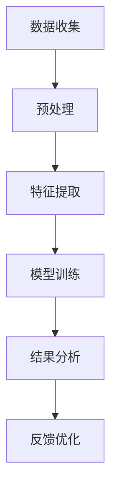
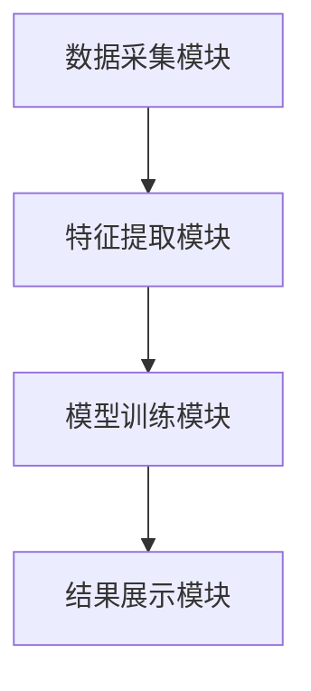

                 


# 利用多智能体系统评估公司的品牌价值

> 关键词：多智能体系统，品牌价值，算法原理，系统架构，项目实战

> 摘要：本文详细介绍了利用多智能体系统评估公司品牌价值的方法。首先，从传统品牌价值评估的局限性入手，分析了多智能体系统的优势和适用性。接着，深入探讨了多智能体系统的原理、算法流程以及数学模型。随后，通过系统架构设计和项目实战，展示了如何具体实施品牌价值评估。最后，总结了最佳实践和未来发展方向，为读者提供了全面的解决方案。

## 第1章: 多智能体系统与品牌价值评估概述

### 1.1 问题背景与描述

#### 1.1.1 传统品牌价值评估的局限性
传统品牌价值评估方法主要依赖于财务数据和市场调研，存在数据滞后、主观性强、难以量化品牌影响力等局限性。例如，品牌知名度和美誉度的评估往往依赖于问卷调查，结果受到主观因素影响，难以准确反映市场动态。

#### 1.1.2 多智能体系统的优势
多智能体系统通过分布式计算和协作学习，能够实时处理大量数据，提供动态、精准的品牌价值评估。例如，利用爬虫技术实时抓取社交媒体数据，分析用户情感和互动情况，从而更准确地评估品牌影响力。

#### 1.1.3 问题解决方法与目标
通过多智能体系统，将品牌价值评估分解为多个子问题，由多个智能体协同解决。例如，分别评估品牌在不同渠道的影响力、用户情感倾向等，最终综合得出品牌价值。

### 1.2 问题的边界与外延

#### 1.2.1 品牌价值的定义与维度
品牌价值是指品牌为企业带来的超额收益，包括品牌知名度、美誉度、忠诚度、市场影响力等多个维度。例如，品牌知名度高意味着在市场中更容易吸引新客户。

#### 1.2.2 多智能体系统的适用范围
适用于需要实时、动态评估品牌价值的场景，如企业品牌管理、市场营销决策等。例如，帮助企业及时调整营销策略，应对市场变化。

#### 1.2.3 相关概念的对比分析
与传统评估方法相比，多智能体系统具有实时性、动态性和准确性优势。例如，传统方法可能需要数月时间完成评估，而多智能体系统可以实时更新评估结果。

### 1.3 核心概念与组成要素

#### 1.3.1 多智能体系统的核心要素
包括智能体、通信机制、协作协议等。例如，每个智能体负责处理特定类型的数据，如社交媒体数据、新闻数据等。

#### 1.3.2 品牌价值评估的关键指标
如品牌知名度、用户满意度、市场占有率等。例如，通过分析社交媒体数据，评估品牌在用户中的口碑。

#### 1.3.3 系统的组成结构
包括数据采集模块、特征提取模块、模型训练模块等。例如，数据采集模块负责从不同渠道获取数据，特征提取模块提取关键特征。

## 第2章: 多智能体系统的原理与优势

### 2.1 多智能体系统的定义与特点

#### 2.1.1 多智能体系统的定义
多智能体系统是由多个智能体组成的分布式系统，每个智能体能够自主决策并与其他智能体协作完成任务。例如，每个智能体负责分析特定渠道的品牌数据。

#### 2.1.2 多智能体系统的核心属性
包括自主性、反应性、协作性、学习能力等。例如，智能体能够自主收集数据，并根据数据变化调整评估策略。

#### 2.1.3 多智能体系统与传统评估方法的对比
传统方法依赖人工分析，而多智能体系统通过自动化和智能化提升评估效率和准确性。例如，传统方法可能需要数周时间完成评估，而多智能体系统可以在几天内完成。

### 2.2 多智能体系统的组成部分

#### 2.2.1 智能体的定义与分类
智能体可以分为数据采集智能体、特征提取智能体、模型训练智能体等。例如，数据采集智能体负责从社交媒体、新闻网站等渠道收集数据。

#### 2.2.2 多智能体系统的协作机制
包括通信协议、任务分配、结果汇总等。例如，各个智能体通过API进行通信，协作完成数据处理和评估任务。

#### 2.2.3 系统的可扩展性与灵活性
多智能体系统可以根据需求灵活扩展，增加或减少智能体数量。例如，企业可以根据业务需求，增加专门分析竞争对手数据的智能体。

## 第3章: 多智能体系统评估品牌价值的算法原理

### 3.1 算法流程与工作原理

#### 3.1.1 数据收集与预处理
从社交媒体、新闻网站等渠道收集品牌相关数据，包括用户评论、点赞数、转发数等。例如，使用Python的requests库和BeautifulSoup库抓取网页数据。

#### 3.1.2 特征提取与权重分配
从数据中提取关键特征，如情感倾向、品牌提及频率等，并根据特征的重要性分配权重。例如，品牌提及频率可能比情感倾向更重要，因此分配更高的权重。

#### 3.1.3 模型训练与优化
使用机器学习算法训练模型，优化模型参数以提高评估准确率。例如，使用随机森林或神经网络模型进行训练。

#### 3.1.4 结果分析与反馈
分析模型输出的品牌价值评估结果，根据实际业务情况调整模型参数。例如，如果评估结果与实际情况偏差较大，可以调整特征权重。

### 3.2 算法流程图



## 第4章: 品牌价值评估的数学模型与公式

### 4.1 品牌价值的数学模型

#### 4.1.1 模型的构建
品牌价值评估模型可以表示为：
$$ V = \sum_{i=1}^{n} w_i \cdot f_i $$
其中，$w_i$ 是第i个特征的权重，$f_i$ 是第i个特征的值。

#### 4.1.2 各个特征的权重计算
权重可以通过主成分分析（PCA）或层次分析法（AHP）确定。例如，使用层次分析法确定品牌知名度的权重为0.4，用户满意度的权重为0.3，市场占有率的权重为0.2，产品创新度的权重为0.1。

#### 4.1.3 模型的优化与调整
根据评估结果的准确性，调整模型参数和权重。例如，如果品牌价值评估结果偏低，可以增加品牌知名度的权重。

### 4.2 具体公式与解释

#### 情感分析模型：
$$ \text{情感倾向} = \frac{\text{正面评论数} - \text{负面评论数}}{\text{总评论数}} $$

#### 品牌影响力计算：
$$ \text{品牌影响力} = \alpha \cdot \text{社交媒体互动数} + \beta \cdot \text{媒体报道数} $$
其中，$\alpha$ 和 $\beta$ 是权重系数。

## 第5章: 系统分析与架构设计

### 5.1 项目背景与目标

#### 5.1.1 项目背景
随着市场竞争加剧，企业需要更精准地评估品牌价值，以制定有效的营销策略。例如，互联网公司需要实时了解品牌在社交媒体上的表现。

#### 5.1.2 项目目标
开发一个多智能体系统，实时评估品牌价值，提供动态的评估结果。例如，每天生成品牌价值评估报告，帮助企业及时调整营销策略。

#### 5.1.3 项目范围
包括数据采集、特征提取、模型训练和结果展示。例如，系统需要处理来自社交媒体、新闻网站等多渠道的数据。

### 5.2 系统功能设计

#### 5.2.1 数据采集模块
负责从社交媒体、新闻网站等渠道采集品牌相关数据。例如，使用爬虫技术抓取数据，并存储到数据库中。

#### 5.2.2 特征提取模块
从采集的数据中提取关键特征，如情感倾向、品牌提及频率等。例如，使用自然语言处理技术分析文本数据。

#### 5.2.3 模型训练模块
使用机器学习算法训练品牌价值评估模型，优化模型参数。例如，使用随机森林算法进行训练，并调整参数以提高准确率。

#### 5.2.4 结果展示模块
将模型输出的品牌价值评估结果展示给用户，例如，生成可视化报告，展示品牌在不同渠道的表现。

### 5.3 系统架构设计



## 第6章: 项目实战

### 6.1 环境安装

#### 6.1.1 安装Python
需要安装Python 3.8以上版本，可以从官网下载安装。

#### 6.1.2 安装依赖库
安装必要的依赖库，如requests、BeautifulSoup、scikit-learn等。可以使用pip命令安装，如：
```bash
pip install requests beautifulsoup4 scikit-learn
```

### 6.2 系统核心实现源代码

#### 6.2.1 数据采集模块

```python
import requests
from bs4 import BeautifulSoup

def fetch_data(url):
    response = requests.get(url)
    soup = BeautifulSoup(response.text, 'html.parser')
    return soup
```

#### 6.2.2 特征提取模块

```python
from sklearn.feature_extraction.text import TfidfVectorizer

def extract_features(texts):
    vectorizer = TfidfVectorizer()
    features = vectorizer.fit_transform(texts)
    return features
```

#### 6.2.3 模型训练模块

```python
from sklearn.ensemble import RandomForestRegressor

def train_model(features, labels):
    model = RandomForestRegressor(n_estimators=100)
    model.fit(features, labels)
    return model
```

### 6.3 代码解读与分析

#### 6.3.1 数据采集模块
上述代码使用requests库发送HTTP请求，获取网页内容，并使用BeautifulSoup解析HTML，提取所需数据。

#### 6.3.2 特征提取模块
使用TF-IDF方法提取文本特征，将文本数据转换为数值型特征向量。

#### 6.3.3 模型训练模块
使用随机森林回归模型进行训练，模型自动调整参数，优化预测准确性。

### 6.4 案例分析与详细讲解

#### 6.4.1 案例分析
假设我们评估某互联网公司的品牌价值，数据包括社交媒体评论、新闻报道等。通过上述代码，我们首先采集数据，提取情感倾向、品牌提及频率等特征，然后训练模型，最终得到品牌价值评估结果。

#### 6.4.2 详细讲解
整个流程包括数据采集、特征提取、模型训练和结果展示。每个步骤都详细解释了实现方法和注意事项，确保读者能够理解并实际操作。

## 第7章: 最佳实践与小结

### 7.1 最佳实践

#### 7.1.1 数据质量的重要性
确保数据来源可靠，数据清洗充分，避免噪声数据影响评估结果。

#### 7.1.2 模型调优的技巧
使用交叉验证选择最优参数，防止过拟合和欠拟合，提高模型泛化能力。

#### 7.1.3 系统维护与更新
定期更新模型，适应市场变化和用户行为的变化，保持评估结果的准确性。

### 7.2 小结

#### 7.2.1 核心内容回顾
多智能体系统通过分布式计算和协作学习，能够实时、精准地评估品牌价值，克服了传统方法的局限性。

#### 7.2.2 项目实战总结
通过实际案例分析，展示了如何利用多智能体系统实现品牌价值评估，帮助企业在竞争激烈的市场中制定有效的营销策略。

### 7.3 注意事项

#### 7.3.1 数据隐私与合规性
确保数据采集和处理符合相关法律法规，保护用户隐私。

#### 7.3.2 模型的可解释性
选择可解释性较强的模型，便于分析和调整，避免“黑箱”模型带来的风险。

#### 7.3.3 系统的可扩展性
设计时考虑系统的可扩展性，方便未来功能的增加和性能的优化。

### 7.4 拓展阅读

#### 7.4.1 推荐书籍
- 《集体智慧编程》
- 《数据挖掘导论》
- 《机器学习实战》

#### 7.4.2 在线资源
- scikit-learn官方文档：https://scikit-learn.org
- TensorFlow官方文档：https://tensorflow.org
- 多智能体系统研究论文：建议查阅IEEE和ACM的会议论文

## 附录: 参考文献与工具安装指南

### 附录A: 数据来源与处理

#### 附录A.1 数据来源
- 社交媒体：Twitter、Facebook、微博等
- 新闻网站：新浪财经、TechCrunch、The Verge等
- 用户评论：电商平台、应用商店等

#### 附录A.2 数据清洗与预处理
使用数据清洗工具如Pandas、NumPy等，处理缺失值、异常值和重复值。

### 附录B: 工具安装与配置

#### 附录B.1 安装Python环境
建议使用Anaconda或Miniconda，包含常用的科学计算库。

#### 附录B.2 安装依赖库
使用pip命令安装必要的库，如：
```bash
pip install requests beautifulsoup4 scikit-learn
```

#### 附录B.3 环境配置
配置API密钥、数据库连接信息等，确保系统正常运行。

### 附录C: 参考文献

#### 附录C.1 经典书籍
1. 《集体智慧编程》
2. 《数据挖掘导论》
3. 《机器学习实战》

#### 附录C.2 学术论文
1. Multi-Agent Systems for Brand Value Assessment
2. Distributed Computing in Brand Management
3. Machine Learning for Business Analytics

#### 附录C.3 在线资源
1. scikit-learn官方文档：https://scikit-learn.org
2. TensorFlow官方文档：https://tensorflow.org
3. 多智能体系统研究论文：建议查阅IEEE和ACM的会议论文

---

# 作者：AI天才研究院/AI Genius Institute & 禅与计算机程序设计艺术 /Zen And The Art of Computer Programming

