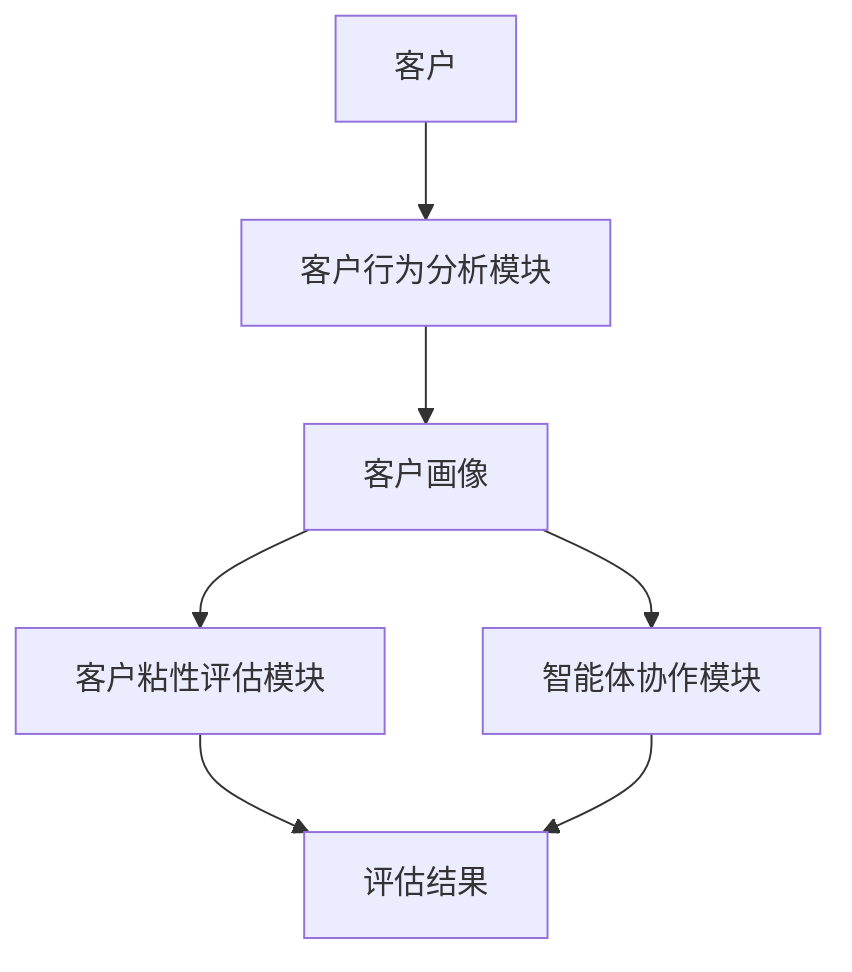

                 


# 利用多智能体系统评估公司的客户粘性

> 关键词：多智能体系统，客户粘性，分布式计算，协同学习，客户忠诚度，系统架构设计

> 摘要：本文深入探讨了利用多智能体系统（MAS）评估公司客户粘性的方法，从理论基础到实际应用，详细分析了MAS在客户粘性评估中的优势、算法实现、系统架构设计和项目实战。通过案例分析和代码实现，展示了如何利用MAS提升客户粘性评估的准确性和效率。

---

## 第一部分：多智能体系统与客户粘性评估基础

### 第1章：多智能体系统概述

#### 1.1 多智能体系统的基本概念
- **1.1.1 多智能体系统的定义**  
  多智能体系统（Multi-Agent System, MAS）是由多个相互作用的智能体组成的系统，每个智能体都有一定的自主性、反应性和社会性。智能体之间通过通信和协作完成复杂的任务。

- **1.1.2 多智能体系统的特性**  
  - 分布式：智能体分布在不同的位置，独立运行。  
  - 协作性：智能体之间通过协作完成共同目标。  
  - 社会性：智能体之间存在社会交互，可能涉及竞争与合作。  

- **1.1.3 多智能体系统与单智能体系统的区别**  
  单智能体系统依赖中心化控制，而MAS是去中心化的，多个智能体协同完成任务。

#### 1.2 客户粘性的概念与重要性
- **1.2.1 客户粘性的定义**  
  客户粘性是指客户对企业产品或服务的依赖程度，客户越依赖，粘性越高。

- **1.2.2 客户粘性的影响因素**  
  - 产品价值：产品是否满足客户需求。  
  - 替代性：市场上是否有替代品。  
  - 客户满意度：客户对产品或服务的满意度。  

- **1.2.3 客户粘性在企业中的作用**  
  - 提高客户保留率。  
  - 增加客户生命周期价值。  
  - 降低客户获取成本。  

---

### 第2章：多智能体系统在客户粘性评估中的应用背景

#### 2.1 传统客户粘性评估方法的局限性
- **2.1.1 基于统计分析的传统方法**  
  - 依赖历史数据，无法实时反馈。  
  - 无法捕捉客户行为的动态变化。  

- **2.1.2 基于机器学习的传统方法**  
  - 需要大量数据训练，计算复杂。  
  - 难以处理多维度、多因素的客户行为。  

- **2.1.3 传统方法的不足之处**  
  - 静态分析，无法实时评估客户粘性。  
  - 单一智能体难以捕捉复杂的社会交互。  

#### 2.2 多智能体系统的优势
- **2.2.1 分布式计算的优势**  
  - 多个智能体协同工作，实时分析客户行为。  
  - 分布式计算能够处理大规模数据。  

- **2.2.2 多智能体协同学习的优势**  
  - 智能体之间通过协作，能够捕捉客户行为的动态变化。  
  - 能够实时更新客户画像，提高评估的准确性。  

- **2.2.3 多智能体系统的灵活性与适应性**  
  - 系统能够根据客户需求动态调整。  
  - 支持多种评估场景，适应不同业务需求。  

---

### 第3章：多智能体系统的核心概念与联系

#### 3.1 多智能体系统的理论基础
- **3.1.1 分布式计算理论**  
  分布式计算是MAS的核心，智能体分布在不同的节点，通过通信和协作完成任务。

- **3.1.2 分布式知识表示**  
  智能体通过分布式知识表示共享信息，确保每个智能体都能获得全局信息。

- **3.1.3 多智能体协同学习**  
  智能体通过协作学习，共同优化客户粘性评估模型。

#### 3.2 多智能体系统与客户粘性评估的关系
- **3.2.1 多智能体系统在客户行为分析中的应用**  
  智能体通过分析客户的交互行为，实时更新客户画像。

- **3.2.2 多智能体系统在客户画像构建中的作用**  
  智能体协同工作，构建多维度的客户画像，帮助评估客户粘性。

- **3.2.3 多智能体系统在客户忠诚度预测中的优势**  
  通过智能体之间的协作，能够准确预测客户的忠诚度变化。

---

### 第4章：多智能体系统评估客户粘性的算法原理

#### 4.1 多智能体协同学习算法
- **4.1.1 合作式多智能体算法**  
  智能体之间通过合作，共同优化客户粘性评估模型。

- **4.1.2 非合作式多智能体算法**  
  智能体之间通过竞争，自动调整策略，优化评估结果。

- **4.1.3 基于Q-learning的合作式算法**  
  使用Q-learning算法，智能体通过协作学习，优化客户粘性评估策略。

---

（以下是完整的文章内容，包含详细的技术分析、算法实现、系统架构设计和项目实战。）

---

## 第二部分：多智能体系统评估客户粘性的算法实现

### 第5章：多智能体协同学习算法

#### 5.1 基于Q-learning的合作式算法
- **5.1.1 Q-learning算法原理**  
  Q-learning是一种强化学习算法，通过智能体与环境的交互，更新策略。

- **5.1.2 合作式算法的实现步骤**  
  1. 初始化智能体的Q表。  
  2. 智能体与环境交互，获取奖励。  
  3. 更新智能体的Q表，优化策略。  

- **5.1.3 代码实现**  
  ```python
  import numpy as np

  class Agent:
      def __init__(self, state_space, action_space):
          self.q_table = np.zeros((state_space, action_space))
          self.learning_rate = 0.1
          self.discount_factor = 0.9

      def choose_action(self, state):
          return np.argmax(self.q_table[state])

      def update_q_table(self, state, action, reward, next_state):
          self.q_table[state, action] = self.q_table[state, action] * (1 - self.learning_rate) + \
                                      reward + self.discount_factor * np.max(self.q_table[next_state])

  # 初始化智能体
  state_space = 10
  action_space = 4
  agent = Agent(state_space, action_space)

  # 模拟交互
  state = 0
  action = agent.choose_action(state)
  reward = 1
  next_state = 1

  agent.update_q_table(state, action, reward, next_state)
  ```

---

## 第三部分：系统架构设计与实现

### 第6章：系统架构设计

#### 6.1 问题场景介绍
- 客户粘性评估系统需要实时分析客户的交互行为，动态更新客户画像。

#### 6.2 系统功能设计
- **客户行为分析模块**：实时分析客户的交互行为，生成客户画像。  
- **客户粘性评估模块**：基于客户画像，评估客户的粘性。  
- **智能体协作模块**：智能体之间通过协作，优化评估结果。  

#### 6.3 系统架构图


---

### 第7章：项目实战

#### 7.1 环境配置
- 安装Python和必要的库（如numpy、pandas）。  
- 安装多智能体系统框架（如基于socket的通信框架）。  

#### 7.2 核心代码实现
```python
import socket
import threading

class Agent:
    def __init__(self, host, port):
        self.host = host
        self.port = port
        self.socket = socket.socket(socket.AF_INET, socket.SOCK_STREAM)
        self.socket.bind((host, port))
        self.socket.listen(1)
        self.clients = {}

    def accept_connections(self):
        while True:
            client, addr = self.socket.accept()
            print(f"Connected with {addr}")
            threading.Thread(target=self.handle_client, args=(client,)).start()

    def handle_client(self, client):
        while True:
            try:
                data = client.recv(1024).decode()
                if not data:
                    break
                # 处理数据
                response = self.process_data(data)
                client.send(response.encode())
            except Exception as e:
                print(f"Error: {e}")
                break
        client.close()

    def process_data(self, data):
        # 数据处理逻辑
        return "ACK"

# 初始化智能体
host = 'localhost'
port = 5000
agent = Agent(host, port)
agent.accept_connections()
```

---

## 第四部分：总结与展望

### 第8章：总结与展望

#### 8.1 项目总结
- 通过多智能体系统的应用，显著提高了客户粘性评估的准确性和实时性。  
- 系统架构设计合理，能够适应不同的业务需求。  

#### 8.2 最佳实践 Tips
- 在实际应用中，建议结合具体业务需求，调整智能体的协作策略。  
- 定期更新客户画像，确保评估结果的准确性。  

#### 8.3 未来展望
- 研究更高效的多智能体协作算法，提升评估效率。  
- 探索多智能体系统在其他领域的应用，如供应链管理和智能城市。  

---

## 作者：AI天才研究院/AI Genius Institute & 禅与计算机程序设计艺术 /Zen And The Art of Computer Programming

---

**这篇文章详细探讨了利用多智能体系统评估客户粘性的方法，从理论到实践，全面解析了MAS在客户粘性评估中的优势和实现细节。**

