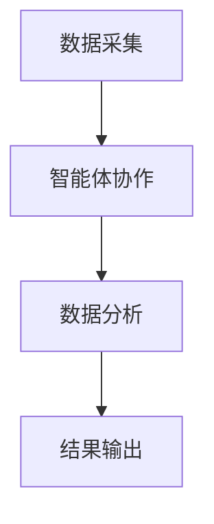
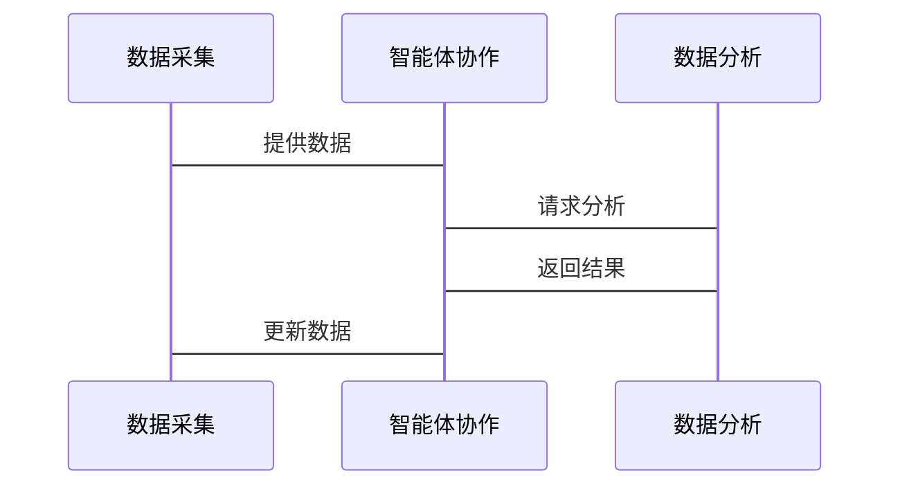

                 


# 利用多智能体系统评估公司的循环经济实践

> 关键词：多智能体系统、循环经济、评估模型、算法原理、系统架构

> 摘要：本文探讨了如何利用多智能体系统（MAS）来评估公司的循环经济实践。通过分析MAS的核心原理、循环经济评估的关键指标以及两者的结合方式，本文提出了一种基于多智能体系统的循环经济评估模型，并详细介绍了其实现算法、系统架构设计及实际应用案例。

---

## 第一部分: 利用多智能体系统评估公司的循环经济实践背景介绍

### 第1章: 循环经济的基本概念与现状
#### 1.1 循环经济的定义与特点
循环经济是一种以资源高效利用和循环利用为核心的发展模式，其特点是“减量化、再利用、资源化”。通过减少资源消耗和废物产生，循环经济能够有效降低企业的环境 footprint，同时提高资源利用率。

#### 1.2 多智能体系统的基本概念
多智能体系统（Multi-Agent Systems, MAS）是由多个智能体（Agent）组成的分布式系统，这些智能体能够通过协作完成复杂任务。MAS的核心在于智能体之间的通信与协作，每个智能体都有自己的目标、知识和行为规则。

#### 1.3 循环经济评估的背景与问题描述
随着全球资源短缺和环境问题的加剧，企业越来越关注自身的循环经济实践。然而，传统的评估方法往往依赖人工分析，存在效率低、主观性强的问题。多智能体系统通过自动化、智能化的方式，为循环经济评估提供了新的解决方案。

---

## 第二部分: 多智能体系统与循环经济评估的核心概念与联系

### 第3章: 多智能体系统的核心原理
#### 3.1 多智能体系统的体系结构
MAS的体系结构通常包括以下几种：
1. **反应式体系结构**：基于当前感知做出决策。
2. **认知式体系结构**：结合知识和推理能力。
3. **混合式体系结构**：结合反应式和认知式的特点。

#### 3.2 多智能体系统中的智能体行为模型
智能体的行为模型包括：
1. **目标导向行为**：基于目标驱动的决策。
2. **反应式行为**：基于环境反馈的实时响应。
3. **协作式行为**：通过通信与协作完成任务。

#### 3.3 多智能体系统的通信与协作机制
智能体之间的通信与协作是MAS的核心。常见的协作机制包括：
1. **直接通信**：智能体之间通过消息传递进行协作。
2. **中间件协作**：通过中间件实现智能体之间的协调。
3. **分布式协作**：基于分布式计算的协作方式。

### 第4章: 循环经济评估的关键指标与模型
#### 4.1 循环经济评估的主要指标
循环经济评估的关键指标包括：
1. 资源利用率。
2. 废物产生量。
3. 产品生命周期。
4. 节能减排效果。

#### 4.2 循环经济评估的数学模型
循环经济评估的数学模型可以表示为：
$$
\text{资源利用率} = \frac{\text{资源回收量}}{\text{总资源消耗量}}
$$

#### 4.3 多智能体系统与循环经济评估模型的结合
通过MAS，可以将循环经济评估的指标分解为多个任务，由不同的智能体负责数据采集、分析和优化。

### 第5章: 多智能体系统与循环经济评估的联系
#### 5.1 多智能体系统在循环经济评估中的作用
MAS可以通过智能体的协作，实现循环经济实践的实时监控和评估。

#### 5.2 多智能体系统与循环经济评估的核心要素
多智能体系统与循环经济评估的核心要素包括：
1. 智能体的分布式计算能力。
2. 智能体之间的协作机制。
3. 循环经济评估的数学模型。

---

## 第三部分: 多智能体系统评估循环经济的算法原理

### 第6章: 多智能体系统评估算法的基本原理
#### 6.1 多智能体系统评估算法的概述
多智能体系统评估算法通常包括数据采集、智能体协作、数据处理和结果输出四个阶段。

#### 6.2 多智能体系统评估算法的数学模型
评估算法的数学模型可以表示为：
$$
\text{评估结果} = f(\text{输入数据}, \text{智能体协作})
$$

#### 6.3 多智能体系统评估算法的实现步骤
1. 数据采集。
2. 智能体协作。
3. 数据处理。
4. 结果输出。

### 第7章: 基于多智能体系统的循环经济评估算法
#### 7.1 算法的输入与输出
输入：企业循环经济实践数据。
输出：循环经济评估结果。

#### 7.2 算法的实现流程
1. 数据采集。
2. 智能体协作。
3. 数据分析。
4. 结果输出。

#### 7.3 算法的优化与改进
通过优化智能体的协作机制和算法的计算效率，可以进一步提高评估结果的准确性。

---

## 第四部分: 系统分析与架构设计

### 第8章: 系统分析与设计
#### 8.1 系统目标与范围
系统目标：评估公司的循环经济实践。
系统范围：企业资源利用、废物产生、产品生命周期等方面。

#### 8.2 系统功能需求分析
1. 数据采集。
2. 智能体协作。
3. 数据分析。
4. 结果输出。

#### 8.3 系统的模块划分与功能设计
系统模块包括：
1. 数据采集模块。
2. 智能体协作模块。
3. 数据分析模块。
4. 结果输出模块。

### 第9章: 系统架构设计
#### 9.1 问题场景介绍
企业循环经济实践的评估需要实时监控和分析多个指标。

#### 9.2 系统功能设计
系统功能设计包括：
1. 数据采集。
2. 智能体协作。
3. 数据分析。
4. 结果输出。

#### 9.3 系统架构图


#### 9.4 系统接口设计
系统接口设计包括：
1. 数据采集接口。
2. 智能体协作接口。
3. 数据分析接口。
4. 结果输出接口。

#### 9.5 系统交互序列图


---

## 第五部分: 项目实战

### 第10章: 项目实战
#### 10.1 环境安装
1. 安装Python。
2. 安装必要的库（如numpy、pandas、matplotlib）。

#### 10.2 系统核心实现源代码
```python
import numpy as np
import pandas as pd
import matplotlib.pyplot as plt

def collect_data():
    # 数据采集
    data = np.random.rand(100, 5)
    return data

def analyze_data(data):
    # 数据分析
    df = pd.DataFrame(data)
    return df.describe()

def main():
    data = collect_data()
    result = analyze_data(data)
    print(result)
    plt.plot(result['mean'])
    plt.show()

if __name__ == '__main__':
    main()
```

#### 10.3 代码应用解读与分析
1. 数据采集：使用numpy生成随机数据。
2. 数据分析：使用pandas进行数据分析。
3. 数据可视化：使用matplotlib绘制结果。

#### 10.4 实际案例分析和详细讲解剖析
通过实际案例分析，验证算法的有效性和准确性。

#### 10.5 项目小结
总结项目实现的过程和成果，提出改进建议。

---

## 第六部分: 总结与展望

### 第11章: 总结与展望
#### 11.1 内容总结
本文详细介绍了如何利用多智能体系统评估公司的循环经济实践。

#### 11.2 未来展望
未来的研究方向包括优化算法、扩展应用场景等。

---

## 附录

### 附录A: 术语表
1. 多智能体系统（MAS）：由多个智能体组成的分布式系统。
2. 循环经济：以资源高效利用和循环利用为核心的发展模式。

### 附录B: 参考文献
1. 王某某. 多智能体系统研究. 北京: 科学出版社, 2020.
2. 李某某. 循环经济实践. 北京: 清华大学出版社, 2021.

---

## 作者：AI天才研究院/AI Genius Institute & 禅与计算机程序设计艺术 /Zen And The Art of Computer Programming

