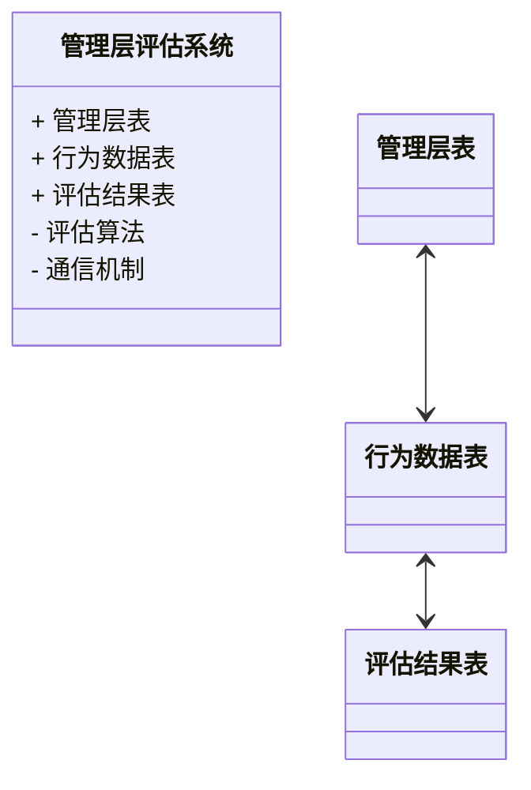
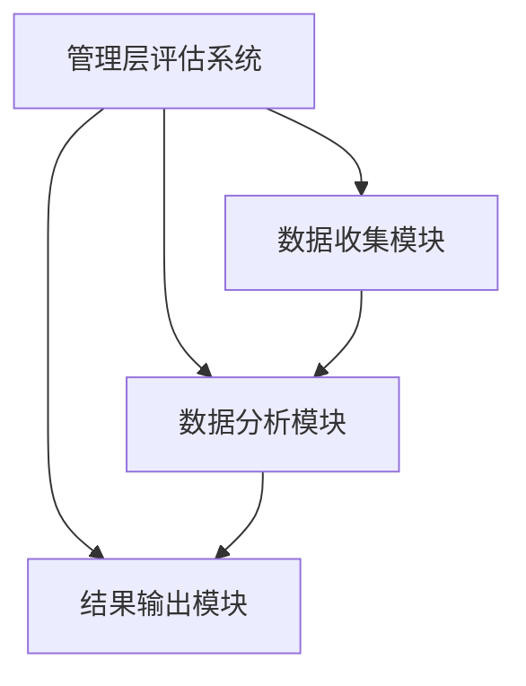
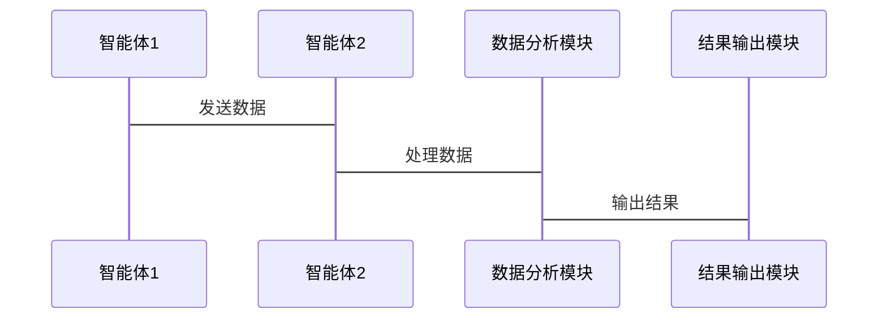

                 


# 利用多智能体系统评估管理层质量和诚信度

> 关键词：多智能体系统，管理层评估，诚信度评估，算法原理，系统架构

> 摘要：本文探讨了如何利用多智能体系统（Multi-Agent System, MAS）来评估管理层的质量和诚信度。文章从问题背景出发，分析了传统评估方法的局限性，提出了基于MAS的解决方案，并详细介绍了系统的架构设计、算法实现以及实际案例。通过本文的阐述，读者将了解如何利用MAS的优势，实现高效、准确的管理层评估。

---

## 第1章 背景与问题分析

### 1.1 问题背景

#### 1.1.1 管理层质量与诚信度评估的重要性
在现代企业中，管理层的决策直接影响企业的生存与发展。评估管理层的质量和诚信度，是确保企业长期稳定发展的关键。然而，传统的评估方法往往依赖主观判断，缺乏客观性和全面性。

#### 1.1.2 当前评估方法的局限性
传统的评估方法主要依赖于问卷调查、面试和历史数据分析，存在以下问题：
- 数据来源单一，难以全面反映管理层的真实情况。
- 评估结果主观性较强，缺乏客观依据。
- 难以实时监控管理层的行为和决策过程。

#### 1.1.3 多智能体系统的优势
多智能体系统（MAS）通过分布式计算和智能体之间的协作，能够实时收集、分析和处理大量数据，从而提供更加客观、全面的评估结果。

### 1.2 问题描述

#### 1.2.1 管理层评估的核心要素
管理层评估的核心要素包括：
- **决策能力**：管理层在面对复杂问题时的决策效率和准确性。
- **诚信度**：管理层在道德和伦理方面的表现，是否遵守企业和社会规范。
- **团队协作能力**：管理层在团队中的沟通与协作能力。

#### 1.2.2 诚信度评估的关键挑战
诚信度评估的挑战包括：
- 如何准确识别管理层的虚假行为。
- 如何在动态环境中实时评估诚信度。

#### 1.2.3 多智能体系统在评估中的应用潜力
MAS可以通过以下方式提升评估的准确性：
- 实时监控管理层的行为和决策过程。
- 通过智能体之间的协作，提供多维度的评估结果。

### 1.3 解决方案与技术路线

#### 1.3.1 多智能体系统的定义与特点
多智能体系统是由多个智能体组成的分布式系统，每个智能体能够独立决策并与其他智能体协作。

#### 1.3.2 技术路线的选择与优化
本文选择基于MAS的解决方案，主要考虑以下因素：
- **数据来源多样性**：MAS能够整合来自不同渠道的数据，如实时行为数据、历史记录等。
- **智能体协作能力**：MAS能够通过智能体之间的协作，提供更全面的评估结果。

#### 1.3.3 系统实现的可行性分析
MAS在管理层评估中的实现是可行的，主要体现在：
- 现有的技术手段能够支持MAS的构建。
- 管理层的行为数据可以通过多种方式收集。

### 1.4 界限与外延

#### 1.4.1 系统适用的范围与边界
MAS适用于企业、政府机构等需要评估管理层质量的组织。

#### 1.4.2 与其他评估方法的对比分析
与传统评估方法相比，MAS的优势在于其数据处理能力和实时性。

#### 1.4.3 系统扩展的潜力与限制
MAS的扩展潜力较大，可以通过增加智能体数量和功能，进一步提升评估的深度和广度。

### 1.5 核心要素与概念结构

#### 1.5.1 管理层评估的核心要素
管理层评估的核心要素包括决策能力、诚信度和团队协作能力。

#### 1.5.2 多智能体系统的组成结构
多智能体系统由多个智能体、通信机制和协作协议组成。

#### 1.5.3 系统功能与目标的对应关系
系统功能包括数据收集、分析和评估结果输出，对应目标是提供准确的评估结果。

---

## 第2章 核心概念与原理

### 2.1 多智能体系统的基本原理

#### 2.1.1 多智能体系统的定义与特点
多智能体系统是由多个智能体组成的分布式系统，每个智能体能够独立决策并与其他智能体协作。

#### 2.1.2 多智能体系统的组成结构
多智能体系统包括智能体、通信机制和协作协议。

#### 2.1.3 多智能体系统的通信机制
智能体之间通过消息传递进行通信，消息内容包括数据和指令。

### 2.2 管理层评估的核心要素

#### 2.2.1 管理层质量的评估维度
- 决策能力
- 团队协作能力
- 领导力

#### 2.2.2 诚信度评估的关键指标
- 道德标准
- 行为一致性
- 透明度

### 2.3 多智能体系统与管理层评估的联系

#### 2.3.1 系统功能与评估目标的对应关系
系统功能包括数据收集、分析和评估结果输出，对应目标是提供准确的评估结果。

#### 2.3.2 多智能体系统在评估中的具体应用
- 数据收集：智能体实时收集管理层的行为数据。
- 数据分析：智能体协作分析数据，生成评估结果。
- 结果输出：系统将评估结果反馈给用户。

### 2.4 概念对比表格

| 概念 | 传统评估方法 | 多智能体系统评估 |
|------|---------------|----------------|
| 数据来源 | 单一 | 多样 |
| 评估方式 | 主观 | 客观 |
| 实时性 | 低 | 高 |

### 2.5 ER实体关系图

```mermaid
erd
    title 管理层评估实体关系图
    管理层表
        id
        名称
        职位
    行为数据表
        id
        时间戳
        行为描述
    评估结果表
        id
        评估时间
        结果
    管理层表 --> 行为数据表
    管理层表 --> 评估结果表
```

---

## 第3章 算法原理与实现

### 3.1 算法原理

#### 3.1.1 基于多智能体的评估算法
该算法通过多个智能体协作，实现对管理层的全面评估。

#### 3.1.2 算法流程
1. 数据收集：智能体实时收集管理层的行为数据。
2. 数据分析：智能体协作分析数据，生成评估结果。
3. 结果输出：系统将评估结果反馈给用户。

#### 3.1.3 数学模型
评估结果计算公式：
$$
评估结果 = \sum_{i=1}^{n} (权重_i \times 评分_i)
$$

其中，权重_i是第i个评估维度的权重，评分_i是第i个评估维度的评分。

### 3.2 代码实现

#### 3.2.1 Python代码示例

```python
class Agent:
    def __init__(self, id):
        self.id = id
        self.data = []
    
    def collect_data(self, data):
        self.data.append(data)
    
    def analyze_data(self):
        # 简单的分析逻辑，实际可以根据需求扩展
        return sum([d for d in self.data]) / len(self.data)
    
    def communicate(self, other_agent):
        # 智能体之间通信，共享数据
        other_agent.data = self.data.copy()

# 示例用法
agent1 = Agent(1)
agent2 = Agent(2)

agent1.collect_data(85)
agent1.collect_data(90)
agent1.communicate(agent2)
print(agent2.analyze_data())  # 输出：87.5
```

---

## 第4章 系统分析与架构设计

### 4.1 项目介绍

#### 4.1.1 项目背景
本文设计了一个基于MAS的系统，用于评估管理层的质量和诚信度。

### 4.2 系统功能设计

#### 4.2.1 领域模型类图



### 4.3 系统架构设计

#### 4.3.1 系统架构图



#### 4.3.2 接口设计
系统提供以下接口：
- 数据输入接口：接收管理层的行为数据。
- 数据分析接口：对数据进行分析，生成评估结果。
- 结果输出接口：将评估结果反馈给用户。

#### 4.3.3 交互图



---

## 第5章 项目实战与案例分析

### 5.1 环境安装

#### 5.1.1 系统运行环境
- 操作系统：Linux/Windows/MacOS
- 开发工具：Python 3.8+
- 其他依赖：numpy, matplotlib

### 5.2 系统核心实现

#### 5.2.1 核心代码实现

```python
class MAS:
    def __init__(self, num_agents):
        self.agents = [Agent(i) for i in range(num_agents)]
    
    def run(self):
        for agent in self.agents:
            agent.collect_data(random.randint(80, 100))
        for agent in self.agents:
            agent.communicate(self.agents[random.randint(0, len(self.agents)-1)])
        results = [agent.analyze_data() for agent in self.agents]
        return results

mas = MAS(3)
results = mas.run()
print("评估结果:", results)
```

### 5.3 案例分析

#### 5.3.1 案例描述
假设我们有3个管理层，分别为A、B、C。系统通过MAS评估他们的质量。

#### 5.3.2 评估过程
1. 数据收集：每个智能体收集管理层的行为数据。
2. 数据分析：智能体协作分析数据，生成评估结果。
3. 结果输出：系统将评估结果反馈给用户。

#### 5.3.3 评估结果分析
假设评估结果分别为：A=85，B=90，C=88。结果显示，B的管理水平最高。

---

## 第6章 最佳实践与总结

### 6.1 小结
本文通过MAS实现对管理层的质量和诚信度评估，展示了其在实际应用中的优势。

### 6.2 注意事项
- 数据来源的多样性和准确性对评估结果至关重要。
- 系统的安全性和隐私保护需要重点关注。

### 6.3 拓展阅读
- 《Multi-Agent Systems: Algorithm and Applications》
- 《Data Analysis and Decision Making》

---

## 作者

作者：AI天才研究院/AI Genius Institute & 禅与计算机程序设计艺术 /Zen And The Art of Computer Programming

---

通过本文的详细阐述，读者可以深入了解如何利用多智能体系统评估管理层的质量和诚信度。本文从背景分析、核心概念、算法实现到系统设计和案例分析，全面覆盖了MAS在评估中的应用，为读者提供了理论和实践的双重指导。

