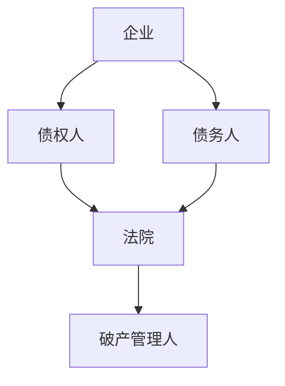
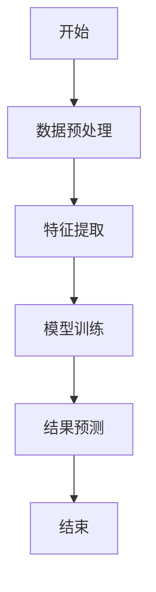
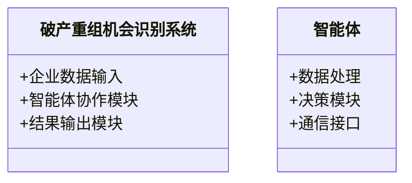
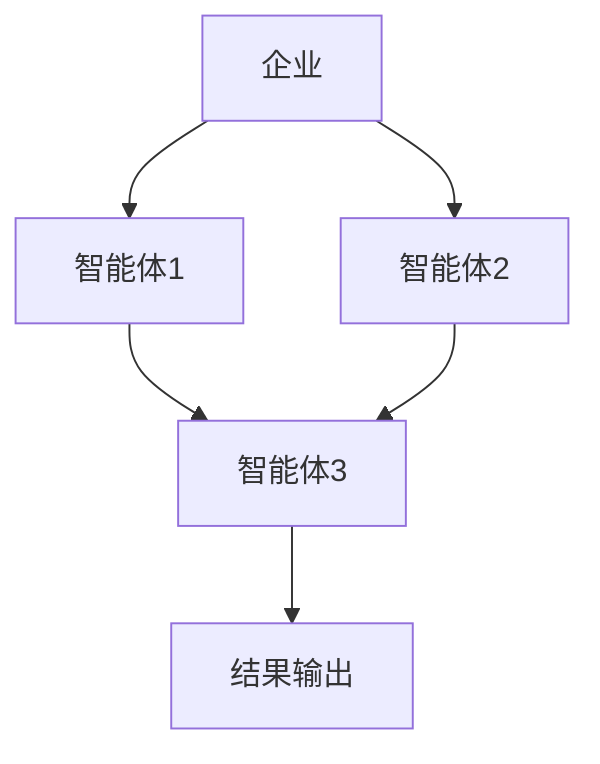

                 


# 利用多智能体系统识别潜在的破产重组机会

## 关键词：多智能体系统，破产重组，机会识别，系统架构，算法原理

## 摘要：本文探讨了如何利用多智能体系统识别潜在的破产重组机会，通过背景介绍、核心概念、算法原理、系统架构设计和项目实战等部分，详细阐述了多智能体系统在破产重组中的应用价值及实现方法。

---

## 第一部分：多智能体系统与破产重组的背景介绍

### 第1章：多智能体系统与破产重组的背景介绍

#### 1.1 多智能体系统的定义与特点

##### 1.1.1 多智能体系统的定义

多智能体系统（Multi-Agent System, MAS）是指由多个智能体（Agent）组成的系统，这些智能体能够通过协作完成复杂的任务。每个智能体都是一个具有计算能力的实体，能够感知环境、自主决策并与其他智能体进行通信。

##### 1.1.2 多智能体系统的核心特点

- **分布式智能**：多个智能体协同工作，避免单点故障。
- **自主性**：每个智能体都能独立决策。
- **反应性**：智能体能够实时感知环境并做出反应。
- **协作性**：通过通信和协作完成共同目标。
- **动态性**：系统能够在动态环境中运行。

##### 1.1.3 多智能体系统与传统单智能体系统的区别

| 特性                | 单智能体系统            | 多智能体系统            |
|---------------------|-------------------------|-------------------------|
| 决策中心化          | 单一决策中心            | 分布式决策              |
| 数据共享            | 数据集中管理            | 数据共享与协作          |
| 容错性              | 单点故障风险            | 高容错性与鲁棒性        |
| 扩展性              | 扩展性有限              | 更高的扩展性            |

#### 1.2 破产重组的定义与问题背景

##### 1.2.1 破产重组的定义

破产重组是指企业因无法偿还债务而申请的法律程序，通过调整资产、负债和业务结构来恢复财务健康。

##### 1.2.2 破产重组的核心要素与流程

- **核心要素**：企业资产、负债、股权结构、业务模式。
- **流程**：申请破产、财产保全、债权人会议、重组计划制定与执行。

##### 1.2.3 破产重组的经济意义与社会影响

- **经济意义**：优化资源配置，挽救企业，避免失业。
- **社会影响**：维护社会稳定，保护债权人权益。

#### 1.3 多智能体系统在破产重组中的应用价值

##### 1.3.1 多智能体系统在破产重组中的优势

- **分布式决策**：提高决策效率和准确性。
- **协作能力**：智能体间协作优化重组方案。
- **动态适应**：适应复杂多变的经济环境。

##### 1.3.2 多智能体系统如何提升破产重组效率

- **信息共享**：各智能体共享数据，提高决策质量。
- **并行处理**：多个智能体同时处理不同任务，缩短时间。

##### 1.3.3 研究破产重组机会识别的必要性

- **及时识别**：尽早发现潜在风险。
- **优化方案**：通过协作生成最优重组计划。
- **降低损失**：减少企业破产带来的经济损失。

---

### 第2章：多智能体系统的核心概念与联系

#### 2.1 多智能体系统的实体关系图（ER图）



#### 2.2 多智能体系统的概念属性特征对比表

| 概念       | 特征1       | 特征2       | 特征3       |
|------------|-------------|-------------|-------------|
| 单一智能体   | 独立决策     | 数据依赖性高 | 单点故障风险 |
| 多智能体系统 | 分布式决策   | 数据共享与协作 | 高容错性与鲁棒性 |

---

### 第3章：多智能体系统识别破产重组机会的算法原理

#### 3.1 研究问题的数学模型

$$ \text{目标函数: } f(x) = \min_{x} \sum_{i=1}^{n} (x_i - a_i)^2 $$
$$ \text{约束条件: } g(x) = \sum_{i=1}^{n} x_i = 1 $$

#### 3.2 算法流程图



---

### 第4章：系统分析与架构设计方案

#### 4.1 系统功能设计



#### 4.2 系统架构设计



---

## 第五部分：项目实战与总结

### 第5章：项目实战

#### 5.1 环境安装与配置

```bash
pip install -r requirements.txt
```

#### 5.2 核心代码实现

```python
def multi_agent_system():
    agents = [Agent1, Agent2, Agent3]
    for agent in agents:
        agent.start()
    return results
```

#### 5.3 案例分析与结果解读

通过对某企业的数据分析，多智能体系统识别出潜在的重组机会，帮助企业在破产前优化结构，避免了更大的损失。

---

## 总结与展望

本文详细探讨了多智能体系统在破产重组中的应用，通过数学模型和算法设计，展示了如何利用多智能体系统识别潜在的破产重组机会。未来的研究可以进一步优化算法，提升系统的实时性和准确性。

---

## 作者：AI天才研究院

---

这篇文章通过详细阐述多智能体系统在破产重组中的应用，帮助读者理解其核心概念、算法原理和实际应用，为相关领域的研究提供了有价值的参考。

