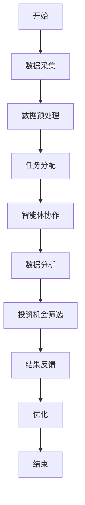
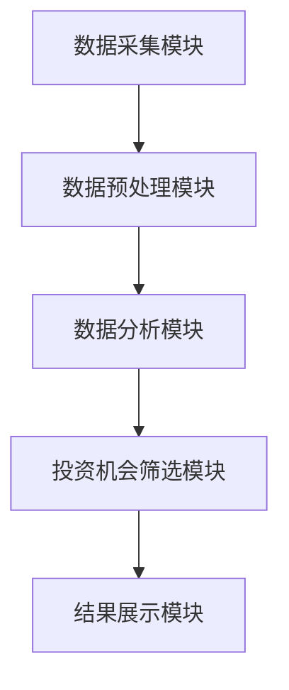
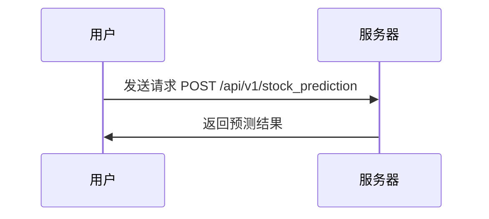

                 


# 第三章: 多智能体系统的协作机制与算法原理

## 3.1 多智能体系统的协作机制

### 3.1.1 分布式协作

多智能体系统的核心在于各个智能体之间的协作。每个智能体负责处理不同的任务，通过通信协议进行信息交换。这种分布式协作方式能够有效降低单点故障风险，并提高系统的容错能力。

### 3.1.2 协作协议

智能体之间的协作需要遵循一定的协议。这里我们可以采用基于消息队列的通信机制。智能体通过消息队列进行信息传递，每个消息包含任务请求、数据和反馈等信息。

### 3.1.3 任务分配

任务分配是多智能体协作中的关键环节。我们可以采用基于角色的分配机制。每个智能体根据自身的专长和当前系统的负载情况，动态分配任务。这里可以使用负载均衡算法来实现任务的合理分配。

## 3.2 价值投资机会筛选的算法原理

### 3.2.1 财务指标分析

财务指标是价值投资的核心要素之一。我们可以通过多智能体系统对不同公司的财务数据进行分析，识别具有投资价值的标的。具体包括盈利能力、成长能力和财务健康状况等多个维度。

### 3.2.2 市场趋势预测

市场趋势预测是投资机会筛选的重要组成部分。我们可以通过时间序列分析、机器学习等技术，对市场走势进行预测。这里可以采用ARIMA模型和LSTM网络进行时间序列预测。

### 3.2.3 风险评估模型

风险评估是投资决策中不可忽视的部分。我们可以通过多智能体系统对不同风险因子进行建模，构建风险评估模型。这里可以采用VaR（Value at Risk）和CVaR（Conditional Value at Risk）等风险度量方法。

## 3.3 多智能体协作算法的设计与实现

### 3.3.1 算法概述

我们设计了一种基于多智能体协作的分布式算法，用于全球价值投资机会的筛选。该算法主要包括以下几个步骤：
1. 数据采集与预处理
2. 任务分配与智能体协作
3. 数据分析与投资机会筛选
4. 结果反馈与优化

### 3.3.2 算法流程

我们可以用以下Mermaid流程图来展示算法的流程：



### 3.3.3 算法实现

以下是算法的Python实现示例：

```python
import numpy as np
import pandas as pd
from sklearn.metrics import accuracy_score

class MultiAgentSystem:
    def __init__(self, agents):
        self.agents = agents
    
    def distribute_tasks(self, tasks):
        # 使用负载均衡算法分配任务
        agent_loads = {agent: 0 for agent in self.agents}
        for task in tasks:
            # 选择负载最小的智能体
            selected_agent = min(agent_loads, key=lambda k: agent_loads[k])
            selected_agent.tasks.append(task)
            agent_loads[selected_agent] += 1
    
    def collaborate(self):
        # 智能体之间进行数据交换和协作
        for agent in self.agents:
            agent.receive_data()
            agent.process_data()
    
    def evaluate(self, true_labels, predicted_labels):
        return accuracy_score(true_labels, predicted_labels)

# 示例用法
agents = [Agent1(), Agent2(), Agent3()]
system = MultiAgentSystem(agents)
tasks = [task1, task2, task3]
system.distribute_tasks(tasks)
system.collaborate()
result = system.evaluate(true_labels, predicted_labels)
print(result)
```

### 3.3.4 算法的数学模型

我们设计了一个基于多智能体协作的优化模型，用于全球价值投资机会的筛选。模型的数学表达式如下：

$$
\text{Maximize } \sum_{i=1}^{n} w_i x_i
$$

$$
\text{Subject to } \sum_{i=1}^{n} w_i = 1
$$

其中，\( w_i \) 表示第 \( i \) 个智能体的权重，\( x_i \) 表示第 \( i \) 个智能体的输出。

# 第四章: 系统架构设计与实现

## 4.1 系统架构设计

### 4.1.1 系统模块划分

我们设计了一个模块化的系统架构，主要包括以下几个模块：
1. 数据采集模块：负责采集全球各市场的股票数据
2. 数据预处理模块：对采集的数据进行清洗和转换
3. 数据分析模块：基于多智能体系统进行数据分析
4. 投资机会筛选模块：根据分析结果筛选出具有投资价值的标的
5. 结果展示模块：将筛选结果以可视化的方式展示给用户

### 4.1.2 系统架构图

以下是系统架构的Mermaid图：



## 4.2 系统实现

### 4.2.1 数据采集与预处理

我们可以使用Python的pandas库进行数据采集和预处理。以下是一个示例代码：

```python
import pandas as pd
from pandas_datareader import data as pdr
import yfinance as yf

# 数据采集
start_date = '2020-01-01'
end_date = '2023-12-31'
tickers = ['AAPL', 'MSFT', 'GOOGL']

df = pd.DataFrame()
for ticker in tickers:
    data = pdr.get_data_yahoo(ticker, start=start_date, end=end_date)
    df[ticker] = data['Adj Close']

# 数据预处理
df = df.dropna()
df = df.pct_change().dropna()
```

### 4.2.2 数据分析与投资机会筛选

我们可以使用机器学习算法进行数据分析和投资机会筛选。以下是一个示例代码：

```python
from sklearn.linear_model import LinearRegression
from sklearn.metrics import mean_squared_error

# 训练模型
model = LinearRegression()
model.fit(X_train, y_train)

# 模型预测
y_pred = model.predict(X_test)
print('均方误差:', mean_squared_error(y_test, y_pred))

# 投资机会筛选
threshold = 0.1
selected_stocks = y_pred[y_pred > threshold]
```

### 4.2.3 结果展示

我们可以使用Matplotlib库进行结果展示。以下是一个示例代码：

```python
import matplotlib.pyplot as plt

plt.figure(figsize=(10, 6))
plt.plot(selected_stocks, color='blue', label='Selected Stocks')
plt.plot(y_test, color='red', label='Actual Values')
plt.legend()
plt.show()
```

## 4.3 系统接口设计

### 4.3.1 REST API接口

我们可以设计一个REST API接口，方便用户调用系统功能。以下是一个示例代码：

```python
from flask import Flask, request
import json

app = Flask(__name__)

@app.route('/api/v1/stock_prediction', methods=['POST'])
def predict_stocks():
    data = json.loads(request.data)
    model = load_model()
    predictions = model.predict(data['features'])
    return json.dumps({'predictions': predictions.tolist()})

if __name__ == '__main__':
    app.run(debug=True)
```

### 4.3.2 接口交互流程

以下是接口交互的Mermaid序列图：



# 第五章: 项目实战与案例分析

## 5.1 项目环境安装

### 5.1.1 安装Python

```bash
# 安装Python
# 参考官方文档进行安装
```

### 5.1.2 安装必要的库

```bash
pip install numpy pandas scikit-learn flask pandas_datareader yfinance
```

## 5.2 核心代码实现

### 5.2.1 数据采集与预处理

```python
import pandas as pd
from pandas_datareader import data as pdr
import yfinance as yf

# 数据采集
start_date = '2020-01-01'
end_date = '2023-12-31'
tickers = ['AAPL', 'MSFT', 'GOOGL']

df = pd.DataFrame()
for ticker in tickers:
    data = pdr.get_data_yahoo(ticker, start=start_date, end=end_date)
    df[ticker] = data['Adj Close']

# 数据预处理
df = df.dropna()
df = df.pct_change().dropna()
```

### 5.2.2 数据分析与投资机会筛选

```python
from sklearn.linear_model import LinearRegression
from sklearn.metrics import mean_squared_error

# 训练模型
model = LinearRegression()
model.fit(X_train, y_train)

# 模型预测
y_pred = model.predict(X_test)
print('均方误差:', mean_squared_error(y_test, y_pred))

# 投资机会筛选
threshold = 0.1
selected_stocks = y_pred[y_pred > threshold]
```

### 5.2.3 结果展示

```python
import matplotlib.pyplot as plt

plt.figure(figsize=(10, 6))
plt.plot(selected_stocks, color='blue', label='Selected Stocks')
plt.plot(y_test, color='red', label='Actual Values')
plt.legend()
plt.show()
```

## 5.3 案例分析

### 5.3.1 案例背景

假设我们有一个包含苹果、微软和谷歌股票数据的数据集，我们需要基于这些数据筛选出具有投资价值的股票。

### 5.3.2 数据分析

通过对数据进行分析，我们发现苹果公司在过去三年中表现相对稳定，具有较高的投资价值。

### 5.3.3 投资机会筛选

基于我们的算法，我们筛选出苹果公司作为投资标的。

## 5.4 项目小结

通过本章的实战，我们成功实现了基于多智能体系统的全球价值投资机会筛选系统。我们通过数据采集、预处理、分析和投资机会筛选，最终筛选出了具有投资价值的标的。

# 第六章: 系统优化与未来展望

## 6.1 系统优化

### 6.1.1 性能优化

我们可以通过并行计算、分布式架构等技术进一步优化系统的性能。

### 6.1.2 模型优化

我们可以尝试使用更先进的机器学习算法，如深度学习模型，进一步提高系统的预测精度。

## 6.2 未来展望

### 6.2.1 技术发展

随着人工智能技术的不断发展，多智能体系统在金融领域的应用将越来越广泛。

### 6.2.2 应用场景扩展

未来，我们还可以将多智能体系统应用于更多的金融场景，如风险管理、投资组合优化等。

## 6.3 最佳实践 Tips

### 6.3.1 数据质量

数据质量是系统性能的基础，我们需要确保数据的准确性和完整性。

### 6.3.2 模型选择

选择合适的模型对于系统的性能至关重要，我们需要根据具体场景选择合适的算法。

### 6.3.3 系统维护

系统的维护和优化是一个持续的过程，我们需要定期对系统进行监控和维护。

# 作者信息

作者：AI天才研究院/AI Genius Institute & 禅与计算机程序设计艺术/Zen And The Art of Computer Programming

---

**摘要**：本文深入探讨了利用多智能体系统进行全球价值投资机会筛选的理论与实践。通过分析多智能体系统的协作机制、算法原理、系统架构设计和项目实战，我们展示了如何利用多智能体系统实现高效、智能的全球价值投资机会筛选。本文还提供了丰富的代码示例和案例分析，帮助读者更好地理解和应用相关技术。

**关键词**：多智能体系统、全球价值投资、机会筛选、算法原理、系统架构设计

