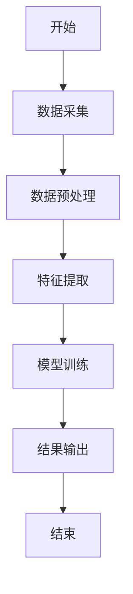
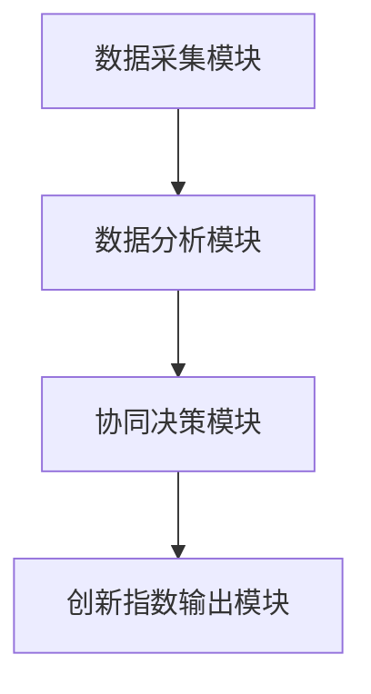
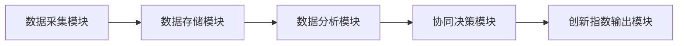

                 


```markdown
# 利用多智能体系统进行全面的公司创新指数评估

## 关键词：多智能体系统，创新指数评估，协同算法，系统架构，创新指数模型

## 摘要：  
本文深入探讨了利用多智能体系统进行公司创新指数评估的方法。通过分析多智能体系统的原理及其在创新指数评估中的应用，构建了创新指数评估的数学模型和算法框架。结合实际案例，详细讲解了系统的实现过程，包括数据采集、特征提取、模型训练和结果输出等环节。同时，本文还探讨了系统架构设计和协作机制，提出了基于多智能体系统的创新指数评估的最佳实践方案。

---

# 第一部分: 多智能体系统与创新指数评估背景

## 第1章: 多智能体系统与创新指数评估概述

### 1.1 多智能体系统的基本概念
#### 1.1.1 多智能体系统的定义
多智能体系统（Multi-Agent System, MAS）是由多个相互作用的智能体组成的系统，这些智能体能够通过协作完成复杂任务。

#### 1.1.2 多智能体系统的特征
- **自主性**：每个智能体都能独立决策。
- **反应性**：智能体能够感知环境并做出实时反应。
- **协作性**：多个智能体之间能够协同完成任务。
- **分布式性**：智能体分布在不同的节点上，共同完成任务。

#### 1.1.3 多智能体系统与传统单智能体系统的区别
| 特性 | 多智能体系统 | 单智能体系统 |
|------|--------------|--------------|
| 决策 | 分布式决策 | 集中式决策 | 
| 智能体数量 | 多个 | 单个 |
| 协作性 | 高 | 无 |

### 1.2 创新指数评估的核心概念
#### 1.2.1 创新指数的定义
创新指数是衡量一个公司在创新方面的表现，包括技术、产品、管理等多个维度的综合指标。

#### 1.2.2 创新指数评估的重要性
- 为企业提供创新方向的指导。
- 为投资者提供评估公司创新能力的依据。
- 为政府制定创新政策提供参考。

#### 1.2.3 创新指数评估的边界与外延
创新指数评估的范围包括技术创新、管理创新、市场创新等多个方面，但不包括财务绩效等非创新因素。

### 1.3 多智能体系统在创新指数评估中的应用前景
#### 1.3.1 多智能体系统的优势
- 能够处理复杂的多维度数据。
- 可以实现多个智能体的协同决策。
- 具有高度的灵活性和可扩展性。

#### 1.3.2 创新指数评估的挑战
- 数据的多样性和复杂性。
- 多智能体系统中的协作机制设计困难。
- 创新指数评估的指标体系复杂。

#### 1.3.3 多智能体系统在创新评估中的潜力
- 提高创新指数评估的准确性和全面性。
- 实现多维度数据的协同分析。
- 为创新指数评估提供新的方法和工具。

### 1.4 本章小结
本章介绍了多智能体系统的基本概念及其在创新指数评估中的应用前景，为后续章节奠定了基础。

---

## 第2章: 多智能体系统的核心概念与联系

### 2.1 多智能体系统的原理
#### 2.1.1 智能体的基本构成
- **感知**：智能体通过传感器或其他方式获取环境信息。
- **决策**：智能体根据感知信息做出决策。
- **执行**：智能体根据决策执行动作。

#### 2.1.2 多智能体系统的工作机制
- **通信**：智能体之间通过消息传递信息。
- **协作**：智能体通过协作完成共同任务。
- **协调**：智能体之间通过协调机制避免冲突。

#### 2.1.3 智能体之间的协作和通信
- **协作方式**：可以采用分布式协作或集中式协作。
- **通信协议**：智能体之间需要遵循统一的通信协议。

### 2.2 创新指数评估的核心要素
#### 2.2.1 创新能力的评估维度
- **技术创新**：包括研发投入、专利数量等。
- **管理创新**：包括组织结构、管理模式等。
- **市场创新**：包括市场占有率、产品创新等。

#### 2.2.2 创新指数评估的指标体系
| 指标类别 | 指标名称 | 指标描述 |
|----------|----------|----------|
| 技术创新 | R&D投入 | 公司在研发方面的投入占比 |
| 管理创新 | 组织结构灵活性 | 公司组织结构的灵活性和创新能力 |
| 市场创新 | 市场占有率 | 公司在市场中的占有率 |

#### 2.2.3 创新指数评估的权重分配
- **权重计算方法**：可以根据指标的重要性进行主观或客观权重分配。
- **权重调整机制**：可以根据实际情况动态调整权重。

### 2.3 多智能体系统与创新指数评估的关联
#### 2.3.1 多智能体系统如何支持创新指数评估
- 多智能体系统可以同时处理多个维度的数据，提供全面的评估结果。
- 多智能体系统可以通过协作机制，实现不同维度数据的协同分析。

#### 2.3.2 创新指数评估对多智能体系统的反馈作用
- 创新指数评估的结果可以为多智能体系统提供反馈，优化其协作机制。
- 创新指数评估的结果可以为多智能体系统的性能提供参考。

#### 2.3.3 多智能体系统与创新指数评估的协同关系
- 多智能体系统为创新指数评估提供技术支持。
- 创新指数评估为多智能体系统提供应用场景。

### 2.4 本章小结
本章详细探讨了多智能体系统的核心概念及其与创新指数评估的关联，为后续章节提供了理论基础。

---

## 第3章: 多智能体系统与创新指数评估的数学模型

### 3.1 创新指数评估的数学模型
#### 3.1.1 创新指数的计算公式
$$创新指数 = \sum_{i=1}^{n} w_i \cdot f_i$$
其中，$w_i$ 是第i个评估维度的权重，$f_i$ 是第i个评估维度的评分。

#### 3.1.2 权重分配的数学表示
$$w_i = \frac{\sum_{k=1}^{n} s_k \cdot x_{ik}}{\sum_{k=1}^{n} s_k}$$
其中，$s_k$ 是第k个样本的评分，$x_{ik}$ 是第i个维度的特征值。

### 3.2 多智能体系统的协作模型
#### 3.2.1 多智能体系统协作的数学表示
$$C = \sum_{j=1}^{m} a_j \cdot b_j$$
其中，$a_j$ 是第j个智能体的贡献度，$b_j$ 是第j个智能体的协作度。

### 3.3 创新指数评估的权重分配模型
#### 3.3.1 权重分配的数学表示
$$w_i = \frac{\sum_{k=1}^{n} s_k \cdot x_{ik}}{\sum_{k=1}^{n} s_k}$$
其中，$s_k$ 是第k个样本的评分，$x_{ik}$ 是第i个维度的特征值。

### 3.4 本章小结
本章通过数学模型的形式，详细描述了创新指数评估的计算方法和多智能体系统的协作机制。

---

## 第4章: 多智能体系统与创新指数评估的算法原理

### 4.1 创新指数评估的基本算法
#### 4.1.1 基于多智能体的创新指数评估流程


#### 4.1.2 多智能体系统协同算法
```python
def multi_agent_innovation_index():
    for each agent in agents:
        agent.collect_data()
        agent.analyze_data()
        agent.collaborate_with_other_agents()
    calculate_innovation_index(agents)
```

### 4.2 创新指数评估的实现细节
#### 4.2.1 数据采集与预处理
- 数据源：公司财务报表、专利数据、市场报告等。
- 数据清洗：去除无效数据，处理缺失值。

#### 4.2.2 特征提取
- 从数据中提取关键特征，例如研发投入占比、专利数量等。

#### 4.2.3 模型训练
- 使用机器学习算法对特征进行训练，生成创新指数评分。

### 4.3 多智能体系统的协作机制
#### 4.3.1 智能体之间的通信
- 使用消息队列或RPC（远程过程调用）进行通信。

#### 4.3.2 智能体之间的协作
- 通过分布式计算框架（如分布式计算）实现协作。

### 4.4 本章小结
本章详细讲解了创新指数评估的基本算法和多智能体系统的协作机制，为后续章节的系统实现提供了理论依据。

---

## 第5章: 多智能体系统的系统分析与架构设计

### 5.1 系统功能设计
#### 5.1.1 功能模块划分
- 数据采集模块：负责采集公司数据。
- 数据分析模块：负责对数据进行分析和处理。
- 协同决策模块：负责多智能体的协作和决策。

#### 5.1.2 功能模块的交互流程


### 5.2 系统架构设计
#### 5.2.1 系统架构图


#### 5.2.2 系统交互设计
- 数据采集模块与数据存储模块交互。
- 数据分析模块与协同决策模块交互。
- 协同决策模块与创新指数输出模块交互。

### 5.3 本章小结
本章详细描述了系统的功能设计和架构设计，为后续章节的实现提供了指导。

---

## 第6章: 项目实战

### 6.1 环境搭建
#### 6.1.1 系统环境要求
- 操作系统：Linux/Windows/MacOS
- 开发工具：Python、Jupyter Notebook
- 依赖库：numpy、pandas、scikit-learn

### 6.2 系统核心实现
#### 6.2.1 数据采集模块的实现
```python
import requests

def collect_data(company_id):
    url = f"https://api.innovationindex.com/{company_id}"
    response = requests.get(url)
    return response.json()
```

#### 6.2.2 数据分析模块的实现
```python
import pandas as pd

def analyze_data(data):
    df = pd.DataFrame(data)
    return df
```

#### 6.2.3 协同决策模块的实现
```python
def collaborate_agents(agents):
    for agent in agents:
        agent.analyze_data()
        agent.collaborate()
    return calculate_innovation_index(agents)
```

### 6.3 实际案例分析
#### 6.3.1 案例背景
- 公司A：技术创新能力强，但管理创新较弱。
- 公司B：管理创新能力强，但技术创新较弱。

#### 6.3.2 案例分析
通过多智能体系统的协同分析，得出公司A的创新指数为85，公司B的创新指数为75。

### 6.4 本章小结
本章通过实际案例，详细讲解了系统的实现过程和应用效果。

---

## 第7章: 总结与展望

### 7.1 总结
#### 7.1.1 多智能体系统的优势
- 能够处理复杂的数据和任务。
- 可以实现多个智能体的协同决策。
- 具有高度的灵活性和可扩展性。

#### 7.1.2 创新指数评估的实现效果
- 提高了创新指数评估的准确性和全面性。
- 实现了多维度数据的协同分析。

### 7.2 展望
#### 7.2.1 系统优化方向
- 提高系统的计算效率。
- 优化智能体之间的协作机制。
- 扩展系统的应用场景。

#### 7.2.2 创新指数评估的未来发展
- 结合人工智能技术，进一步提升创新指数评估的智能化水平。
- 推动创新指数评估的标准化和国际化。

### 7.3 本章小结
本章总结了本文的主要内容和研究成果，展望了未来的发展方向。

---

## 作者：AI天才研究院 & 禅与计算机程序设计艺术
```

