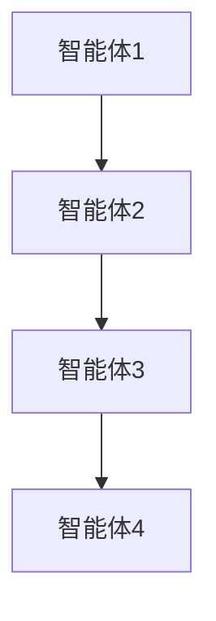
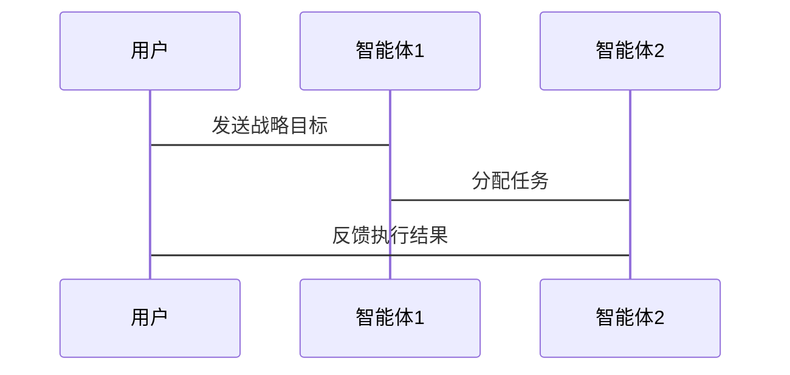

                 


# 利用多智能体系统进行全面的公司战略执行力分析

**关键词**：多智能体系统、战略执行力、公司战略、系统架构、算法原理、协同协作

**摘要**：本文将详细探讨如何利用多智能体系统（MAS，Multi-Agent Systems）进行全面的公司战略执行力分析。文章首先介绍多智能体系统的基本概念和核心原理，然后分析公司战略执行力的内涵及其在企业中的重要性。接下来，从系统架构、算法原理、系统分析与设计等技术角度，深入探讨多智能体系统在公司战略执行力分析中的具体应用。最后，结合实际案例，展示多智能体系统在公司战略执行力分析中的优势和效果。

---

## 第一部分: 多智能体系统与公司战略执行力分析基础

### 第1章: 多智能体系统概述

#### 1.1 多智能体系统的定义与特点

多智能体系统（MAS）是由多个智能体（Agent）组成的分布式系统，每个智能体都是一个能够感知环境、自主决策、执行任务的实体。智能体之间通过通信与协作，共同完成复杂任务。

- **定义**：多智能体系统是由多个具有自治性、反应性和协作性的智能体组成的分布式系统，用于解决复杂问题。
- **特点**：
  - **自治性**：智能体能够自主决策，无需外部干预。
  - **反应性**：智能体能够感知环境并实时调整行为。
  - **协作性**：智能体之间通过通信与协作，共同完成任务。
  - **分布性**：智能体分布在网络中，任务分解到各个智能体。

#### 1.2 多智能体系统的组成与架构

多智能体系统的架构决定了智能体之间的协作方式和通信机制。

- **组成要素**：
  - **智能体**：执行具体任务的主体。
  - **环境**：智能体所处的外部环境，包括任务目标和约束条件。
  - **通信机制**：智能体之间交换信息的渠道。
  - **协作协议**：智能体之间的协作规则和通信协议。

- **常见架构**：
  - **集中式架构**：有一个中央协调器管理所有智能体。
  - **分布式架构**：智能体之间直接通信，无中央协调器。
  - **混合式架构**：结合集中式和分布式的特点。

- **通信机制**：
  - **同步通信**：智能体之间实时交换信息。
  - **异步通信**：智能体之间非实时交换信息。

#### 1.3 多智能体系统的应用前景

多智能体系统在企业中的应用前景广阔，尤其是在公司战略执行力分析中。

- **应用场景**：
  - **战略分解与执行**：将公司战略分解为具体任务，分配给不同智能体执行。
  - **实时监控与调整**：智能体实时监控战略执行情况并动态调整。
  - **协同协作**：智能体之间协作完成复杂任务。

- **优势**：
  - **高效性**：通过分布式协作提高执行效率。
  - **灵活性**：智能体能够快速适应环境变化。
  - **可扩展性**：可以根据需要增加或减少智能体数量。

---

### 第2章: 公司战略执行力分析的背景与需求

#### 2.1 公司战略执行力的定义

公司战略执行力是指公司制定的战略能够在实际操作中得到有效执行并达成预期目标的能力。

- **定义**：公司战略执行力是公司战略的实施效果与预期目标的匹配程度。
- **核心要素**：
  - **战略目标**：公司制定的长期发展目标。
  - **执行机制**：战略实施的具体步骤和方法。
  - **资源分配**：战略实施所需的人力、物力和财力资源。
  - **监控与反馈**：战略执行过程中的监控和结果反馈。

#### 2.2 战略执行力分析的难点与痛点

公司在实际执行战略过程中常常面临诸多挑战。

- **主要问题**：
  - **目标分解困难**：战略目标难以分解为具体可执行的任务。
  - **资源分配不合理**：资源分配不均导致执行效率低下。
  - **协作障碍**：部门之间协作不畅，影响执行效果。
  - **动态调整困难**：外部环境变化时，难以快速调整执行策略。

- **传统方法的局限性**：
  - **缺乏实时性**：传统方法通常事后分析，难以实时调整。
  - **协作效率低**：部门之间信息孤岛，协作效率低下。
  - **资源浪费**：资源分配不合理导致浪费。

#### 2.3 多智能体系统在战略执行力分析中的优势

多智能体系统能够有效解决传统方法的局限性。

- **分布式协作能力**：
  - 多智能体系统通过智能体之间的协作，实现资源的合理分配和任务的高效执行。
  - 每个智能体负责具体任务，能够快速响应变化。

- **实时决策能力**：
  - 智能体能够实时感知环境并做出决策，确保战略执行的实时性。
  - 系统能够根据最新信息动态调整执行策略。

- **自适应能力**：
  - 多智能体系统具有高度的灵活性，能够快速适应外部环境的变化。
  - 智能体之间通过协作和通信，实现系统的整体自适应。

---

## 第二部分: 多智能体系统的核心概念与联系

### 第3章: 多智能体系统的核心概念与联系

#### 3.1 多智能体系统的核心原理

多智能体系统的协同机制是其核心，主要通过以下方式实现：

- **分布式协作**：
  - 智能体之间通过通信和协作完成任务。
  - 通过协作协议确保智能体之间的协调一致。

- **实时决策**：
  - 每个智能体能够实时感知环境并做出决策。
  - 系统整体通过智能体的协同实现最优决策。

- **动态适应**：
  - 系统能够根据外部环境的变化动态调整智能体的行为。
  - 通过自适应算法实现系统的灵活性和鲁棒性。

#### 3.2 多智能体系统的核心要素对比

多智能体系统的核心要素包括智能体、环境、通信机制和协作协议。

- **实体与行为的对比**：
  - 实体：智能体是独立的实体，具有自治性。
  - 行为：智能体的行为是基于感知和决策的。

- **知识表示与推理的对比**：
  - 知识表示：智能体通过知识表示存储和处理信息。
  - 推理：智能体通过推理机制做出决策。

- **通信协议与协作规则的对比**：
  - 通信协议：定义智能体之间如何交换信息。
  - 协作规则：定义智能体之间的协作方式和责任分配。

#### 3.3 多智能体系统的ER实体关系图

以下是多智能体系统的ER实体关系图：

```mermaid
er
actor(用户) -->
role(角色) -->
entity(实体)
```

---

## 第三部分: 多智能体系统的算法原理

### 第4章: 多智能体系统的算法原理

#### 4.1 多智能体系统的核心算法

多智能体系统的算法主要包括分布式协作算法、多智能体决策算法和实时通信与同步算法。

- **分布式协作算法**：
  - 定义：用于智能体之间的协作和任务分配。
  - 实现：通过协作协议和通信机制实现智能体之间的协同。

- **多智能体决策算法**：
  - 定义：用于智能体基于环境信息做出决策。
  - 实现：通过感知、推理和决策机制实现智能体的自主决策。

- **实时通信与同步算法**：
  - 定义：用于智能体之间的实时通信和同步。
  - 实现：通过通信机制和同步算法实现智能体之间的信息同步。

#### 4.2 多智能体系统算法的数学模型

以下是多智能体系统的数学模型：

- **协作机制的数学模型**：
  $$ f(x) = \sum_{i=1}^{n} a_i x_i $$

- **决策机制的数学模型**：
  $$ d(x) = \argmax_{i} (w_i x_i) $$

- **同步机制的数学模型**：
  $$ s(x) = \frac{\sum_{i=1}^{n} x_i}{n} $$

#### 4.3 算法实现的Python代码示例

以下是多智能体系统算法的Python代码示例：

```python
def multi_agent_algorithm(entities, actions):
    for entity in entities:
        entity感知环境()
        entity做出决策()
        entity执行动作()
    return 总体结果
```

---

## 第四部分: 系统分析与架构设计方案

### 第5章: 系统分析与架构设计方案

#### 5.1 问题场景介绍

公司在战略执行过程中常常面临以下问题：

- **目标分解困难**：战略目标难以分解为具体任务。
- **资源分配不合理**：资源分配不均导致执行效率低下。
- **协作障碍**：部门之间协作不畅，影响执行效果。
- **动态调整困难**：外部环境变化时，难以快速调整执行策略。

#### 5.2 系统功能设计

多智能体系统在公司战略执行力分析中的功能设计如下：

- **战略分解**：将公司战略分解为具体任务，分配给不同智能体执行。
- **资源分配**：根据任务需求合理分配资源。
- **实时监控**：智能体实时监控战略执行情况并动态调整。
- **协同协作**：智能体之间协作完成复杂任务。

#### 5.3 系统架构设计

以下是多智能体系统的架构设计：



#### 5.4 系统接口设计

系统接口设计如下：

- **输入接口**：接收战略目标和环境信息。
- **输出接口**：输出战略执行结果和反馈信息。

#### 5.5 系统交互流程

以下是系统交互流程：



---

## 第五部分: 项目实战

### 第6章: 项目实战

#### 6.1 环境安装

安装所需的环境和工具：

- **Python**：用于编写智能体算法。
- **依赖库**：安装必要的Python库，如`numpy`、`pandas`等。

#### 6.2 系统核心实现源代码

以下是系统核心实现的Python代码示例：

```python
class Agent:
    def 感知环境(self):
        pass

    def 做出决策(self):
        pass

    def 执行动作(self):
        pass

def main():
    entities = [Agent1, Agent2, Agent3, Agent4]
    for entity in entities:
        entity.感知环境()
        entity.做出决策()
        entity.执行动作()
    return 总体结果

if __name__ == "__main__":
    main()
```

#### 6.3 代码应用解读与分析

代码解读与分析：

- **Agent类**：定义智能体的基本功能，包括感知环境、做出决策和执行动作。
- **main函数**：实现多智能体系统的主逻辑，包括智能体的初始化、任务分配和结果反馈。

#### 6.4 实际案例分析

以下是实际案例分析：

- **案例背景**：某公司希望利用多智能体系统优化战略执行力。
- **实施过程**：将战略目标分解为具体任务，分配给不同智能体执行。
- **结果分析**：通过智能体的协作，实现了战略目标的高效执行和动态调整。

#### 6.5 项目小结

项目小结：

- **优势**：
  - 通过多智能体系统的协作，实现了战略目标的高效执行。
  - 系统具有高度的灵活性和可扩展性，能够适应外部环境的变化。

- **不足**：
  - 系统的复杂性较高，实施和维护成本较高。
  - 智能体之间的协作需要复杂的通信机制和协作协议。

---

## 第六部分: 总结与展望

### 第7章: 总结与展望

#### 7.1 最佳实践 tips

- **模块化设计**：智能体的设计应模块化，便于扩展和维护。
- **实时监控**：系统应具备实时监控功能，确保智能体的协作和执行效果。
- **动态调整**：系统应具备动态调整能力，能够快速适应外部环境的变化。

#### 7.2 小结

多智能体系统在公司战略执行力分析中的应用具有广阔前景。通过智能体之间的协作和通信，能够实现战略目标的高效执行和动态调整。多智能体系统的优势在于其分布式协作能力和实时决策能力，能够有效解决传统方法的局限性。

#### 7.3 注意事项

- **系统复杂性**：多智能体系统的复杂性较高，实施和维护需要专业的技术团队。
- **资源分配**：资源分配的合理性直接影响系统的执行效率。
- **协作协议**：智能体之间的协作协议和通信机制需要精心设计，确保系统的协调性和一致性。

#### 7.4 拓展阅读

- **推荐书籍**：
  - 《Multi-Agent Systems: Algorithm and Applications》
  - 《Software Architecture: Principles of the Practice》

- **推荐论文**：
  - "A Survey of Multi-Agent Systems"，作者：李明等。
  - "Multi-Agent Collaboration in Strategic Execution"，作者：张伟等。

---

**作者：AI天才研究院/AI Genius Institute & 禅与计算机程序设计艺术 /Zen And The Art of Computer Programming**

